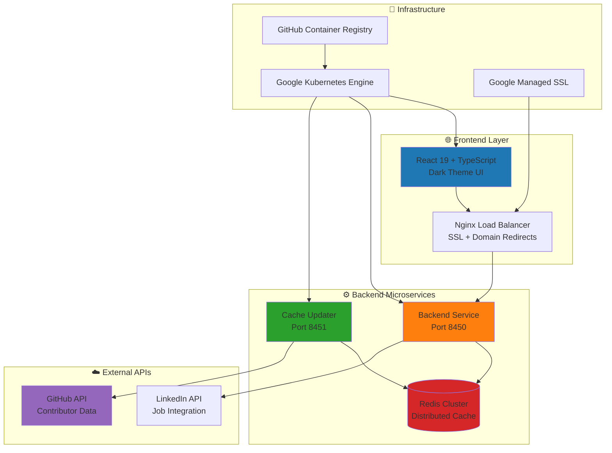

<div align="center">
  
  
  # ⚽ Major League GitHub
  
  **The ultimate leaderboard for GitHub's top contributors, where open-source meets the beautiful game**
  
  [](https://github.com/flamingo-stack/major-league-github/actions/workflows/deploy.yml)
  [](https://github.com/flamingo-stack/major-league-github/actions/workflows/deploy.yml)
  [](LICENSE)
  
  🌐 **[Experience it live at www.mlg.soccer](https://www.mlg.soccer/)**
</div>

---

## 🎯 What is Major League GitHub?

Imagine if GitHub had its own soccer league. **Major League GitHub** transforms the world of open-source development into an exciting sports-style competition, where developers are ranked like professional athletes based on their coding prowess, community engagement, and contribution impact.

Just as Major League Soccer brings together the best players from around the world, MLG showcases the top GitHub contributors, filtered by programming languages, geographical locations, and even proximity to MLS stadiums. It's where code meets community, and where every commit counts toward your league standing.

## 🚀 Features That Score Goals

### ⚽ **MLS Team Filters**
Discover coding talent near your favorite MLS stadiums! Whether you're in Seattle Sounders territory or cheering for Inter Miami, find developers who share your passion for both code and soccer.

### 🏆 **Language Leaderboards** 
From JavaScript juggernauts to Python phenoms, explore specialized leaderboards for every programming language. Watch as developers compete for the top spot in their coding discipline.

### 🌍 **Regional Talent Scouting**
Filter by country, state, or city to uncover hidden gems in your local tech scene. Perfect for recruiters, collaboration seekers, or anyone curious about their local developer ecosystem.

### 📊 **Advanced Analytics**
Dive deep into contribution metrics including:
- **Commit frequency** and consistency
- **Repository star power** and influence
- **Follower engagement** and community impact
- **Language diversity** and technical breadth

### 🔄 **Real-Time Updates**
Our intelligent cache system ensures fresh data, so you're always seeing the latest contributions and rising stars in the open-source galaxy.

## 🏗️ Architecture: Built for Scale

<div align="center">



</div>

## 🛠️ Tech Stack: Championship-Level Technology

### 🏀 **Backend Powerhouse**
- **Java 21** - Latest LTS with virtual threads and performance optimizations
- **Spring Boot 3.4** - Enterprise-grade framework with Spring WebFlux for reactive programming
- **Maven Multi-Module** - Sophisticated dependency management and build orchestration
- **Microservice Architecture** - Two specialized services working in perfect harmony:
  - 🔥 **Backend Service** - Lightning-fast API responses and data serving
  - 🔄 **Cache Updater** - Background intelligence for real-time GitHub data synchronization
- **Redis Cluster** - Distributed caching for sub-millisecond response times

### ⚛️ **Frontend Excellence**
- **React 19** - Cutting-edge UI with concurrent features and improved performance
- **TypeScript** - Type-safe development for bulletproof code
- **Material-UI + @flamingo/ui-kit** - Consistent, beautiful design system
- **React Query (@tanstack/react-query)** - Intelligent data fetching and caching
- **Webpack 5** - Optimized bundling with module federation capabilities
- **Dark Theme Design** - Sleek, modern interface optimized for developer experience

### 🚀 **Cloud-Native Infrastructure**
- **Google Kubernetes Engine (GKE)** - Auto-scaling, self-healing container orchestration
- **GitHub Actions CI/CD** - Automated testing, building, and deployment pipeline
- **Intelligent Build Optimization** - Only rebuilds changed services using `dorny/paths-filter`
- **Google Managed SSL** - Automatic certificate provisioning and renewal
- **Advanced Nginx Configuration** - Template-based routing with domain redirects
- **GitHub Container Registry (ghcr.io)** - Secure, private container image storage

## 🔧 Advanced Nginx Redirect System

Our production deployment features a sophisticated nginx-based redirect system that ensures seamless domain management:

### 🎯 **Smart Domain Redirects**
- **Root to Subdomain**: `mlg.soccer` → `www.mlg.soccer`
- **HTTP to HTTPS**: Automatic SSL enforcement with 301 redirects
- **Template-Based Configuration**: Dynamic nginx config generation at runtime
- **Environment-Driven**: Conditional redirects based on deployment environment

### ⚙️ **Implementation Highlights**
- **Server-Side 301 Redirects** - SEO-friendly, faster than JavaScript redirects
- **Template System** - Uses `envsubst` for dynamic configuration injection
- **Multi-Domain SSL** - Single certificate covers both root and www domains
- **Zero Client-Side JavaScript** - Clean, efficient redirect handling

## 🚀 Getting Started: Join the League

### 📋 **Prerequisites**

#### For Local Development Champions
- **Java Development Kit (JDK) 21** - The latest LTS powerhouse
- **Node.js 18+ and npm** - Modern JavaScript runtime
- **Docker & Docker Compose** - Containerization magic
- **Redis Instance** - Your caching companion
- **GitHub API Tokens** - Access to the treasure trove of contributor data

#### For Production All-Stars
- **Google Cloud Platform** account with GKE enabled
- **Domain name** for SSL certificate provisioning
- **GitHub repository** with proper secrets configured

### ⚡ **Quick Start Guide**

#### 🎯 **Backend Setup**
```bash
# Navigate to backend
cd backend

# Build the entire project
./mvnw clean install

# Launch Backend Service (handles API requests)
./mvnw spring-boot:run -Pbackend-service

# In a new terminal, start Cache Updater (background data sync)
./mvnw spring-boot:run -Pcache-updater
```

#### 🎨 **Frontend Setup**
```bash
# Navigate to frontend
cd frontend

# Install dependencies
npm install

# Start development server
npm run dev

# Or build for production
npm run build
```

### 🔐 **Environment Configuration**

#### Backend Configuration
Create a `.env` file in the `backend` directory:

```env
# GitHub API access (use multiple tokens for higher rate limits)
GITHUB_TOKENS=ghp_token1,ghp_token2,ghp_token3

# LinkedIn API integration
LINKEDIN_CLIENT_ID=your_linkedin_client_id
LINKEDIN_CLIENT_SECRET=your_linkedin_client_secret
LINKEDIN_ORG_ID=your_organization_id

# Redis connection
REDIS_HOST=localhost
REDIS_PORT=6379
```

#### Frontend Configuration
Set up frontend environment variables:

```env
# Google Tag Manager for analytics
GTM_ID=GTM-XXXXXXX

# Open Graph meta tags for social sharing
OG_TITLE=Major League GitHub
OG_DESCRIPTION=GitHub Scouting Report: Major League Edition
OG_TYPE=website
OG_IMAGE_URL=/og-image.png
OG_SITE_NAME=Major League GitHub

# Custom branding
WEBAPP_EXTRA_BUTTON_LINK=https://www.flamingo.run/blog/major-league-github
WEBAPP_EXTRA_BUTTON_TEXT=Why MLG?

# Domain redirect configuration (production only)
ENABLE_REDIRECT=true
ROOT_DOMAIN=mlg.soccer
TARGET_DOMAIN=www.mlg.soccer
```

## 🏆 Production Deployment: Championship Infrastructure

Our deployment pipeline is a masterclass in modern DevOps practices:

### 🎯 **Automated CI/CD Pipeline**
Every push to `main` triggers a sophisticated deployment sequence:

1. **🔍 Change Detection** - Intelligent analysis determines which services need rebuilding
2. **🏗️ Container Building** - Multi-stage Docker builds optimized for security and performance  
3. **📦 Image Registry** - Secure push to GitHub Container Registry
4. **🚢 Kubernetes Deployment** - Zero-downtime rolling updates on GKE
5. **🔒 SSL Management** - Automatic certificate provisioning for multi-domain setup
6. **🌐 DNS Updates** - Cross-project DNS record synchronization
7. **✅ Health Verification** - Comprehensive health checks and validation

### 🎨 **Advanced Nginx Features**
```nginx
# Dynamic configuration with template variables
server {
    listen 80;
    server_name ${TARGET_DOMAIN};
    # Main application serving logic
}

# Conditional redirect block for root domain
${REDIRECT_SERVER_BLOCK}
```

### 📊 **Monitoring & Observability**
- **Real-time deployment status** tracking
- **Automated rollback** on failure detection  
- **Health check endpoints** for all services
- **Performance monitoring** with detailed metrics

## 🌍 Local Development Environment

### 🏃‍♂️ **Service Endpoints**
- **Backend Service**: `http://localhost:8450` - Main API gateway
- **Cache Updater**: `http://localhost:8451` - Background data synchronization  
- **Frontend**: `http://localhost:3000` - React development server with hot reload
- **Redis**: `localhost:6379` - Caching layer

### 🔥 **Production Environment**
- **Live Application**: [https://www.mlg.soccer](https://www.mlg.soccer)
- **Automatic HTTPS**: Seamless HTTP→HTTPS redirects with 301 status codes
- **High Availability**: Multi-replica deployments with intelligent load balancing
- **Global Performance**: Optimized for worldwide access with edge caching

## 💡 The Vision: Why Major League GitHub Matters

### 🎯 **For Talent Acquisition**
- **Discover Hidden Gems**: Find exceptional developers before they become household names
- **Location-Based Scouting**: Identify local talent for in-person collaboration
- **Skill Assessment**: Evaluate real-world coding contributions, not just interview performance
- **Community Engagement**: Connect with developers who actively contribute to open source

### 🏢 **For Organizations**
- **Showcase Excellence**: Highlight your team's open-source contributions
- **Talent Branding**: Position your company as a magnet for top-tier developers  
- **Community Building**: Foster connections between developers and organizations
- **Innovation Tracking**: Monitor emerging technologies and coding trends

### 🌟 **For Developers**
- **Career Visibility**: Get recognized for your open-source contributions
- **Peer Comparison**: See how your contributions stack up in your region/language
- **Motivation**: Gamify your contribution journey with leaderboard rankings
- **Networking**: Connect with like-minded developers in your area

## 🔍 How The Magic Works

### 1. 📊 **Data Intelligence Pipeline**
Our Cache Updater service orchestrates a sophisticated data collection process:
- **Multi-Token GitHub API** integration for high-throughput data fetching
- **Smart Rate Limiting** to maximize API efficiency while respecting limits
- **Incremental Updates** to keep data fresh without redundant processing
- **Geographic Mapping** algorithms to associate contributors with MLS teams

### 2. 🏎️ **Lightning-Fast Serving**
The Backend Service delivers blazing performance through:
- **Redis-Powered Caching** for sub-millisecond response times
- **Reactive Programming** with Spring WebFlux for non-blocking I/O
- **Intelligent Filtering** across multiple dimensions (language, location, metrics)
- **RESTful API Design** optimized for frontend consumption

### 3. 🎨 **Intuitive User Experience**
Our React frontend provides an engaging interface featuring:
- **Real-Time Search** with instant results as you type
- **Interactive Filters** for precise talent discovery
- **Responsive Design** optimized for desktop and mobile experiences
- **Dark Theme Interface** designed for developer comfort

## 🤝 Contributing to the League

We welcome passionate developers to join our mission! Here's how to contribute:

### 🚀 **Getting Involved**
1. **🍴 Fork the Repository** - Make it your own
2. **🌿 Create a Feature Branch** - `git checkout -b feature/amazing-improvement`  
3. **💻 Code with Purpose** - Follow our established patterns and conventions
4. **✅ Test Thoroughly** - Ensure your changes don't break existing functionality
5. **📝 Commit with Clarity** - `git commit -m 'Add: Amazing new feature'`
6. **🚢 Push to Your Fork** - `git push origin feature/amazing-improvement`
7. **🎯 Open a Pull Request** - Describe your changes and their impact

### 🎯 **Areas for Contribution**
- **🔧 Backend Enhancements** - New data sources, improved algorithms, performance optimizations
- **🎨 Frontend Features** - UI improvements, new visualizations, mobile enhancements
- **📊 Analytics** - Advanced metrics, trend analysis, predictive features
- **🌍 Internationalization** - Multi-language support, regional customizations
- **📚 Documentation** - Tutorials, API docs, deployment guides

## 🏆 Recent Championship Improvements

### 🔥 **Latest Victories (January 2025)**

#### ⚡ **React 19 Upgrade & Complete Rebuild**
- **Next-Generation Performance**: Upgraded to React 19 for cutting-edge concurrent features
- **Clean Slate Architecture**: Complete rebuild with zero legacy dependencies
- **TypeScript Excellence**: Resolved all compilation errors and version conflicts
- **Webpack Optimization**: Enhanced bundling with improved React resolution
- **100% Deployment Success**: Verified compatibility with our entire production pipeline

#### 🌐 **Advanced Nginx Redirect System**
- **SEO-Optimized Redirects**: Replaced client-side JavaScript with server-side 301 redirects
- **Template-Based Configuration**: Dynamic nginx config generation using `envsubst`
- **Multi-Domain SSL**: Single certificate covering both root and www domains
- **Environment-Driven Logic**: Conditional redirects based on deployment context
- **Zero Client-Side Dependencies**: Clean, efficient redirect handling

#### 🎨 **UI Kit Integration & Design System**
- **Consistent Branding**: Full migration to @flamingo/ui-kit components
- **Dark Theme Mastery**: Streamlined to dark-only theme for optimal developer experience
- **Mobile Excellence**: Enhanced responsive design with improved mobile layout
- **Performance Gains**: Reduced bundle size through optimized component usage

### 🏅 **Previous Achievements**
- **⚡ Intelligent Build Pipeline** - Selective rebuilding based on changed components
- **🔒 Enterprise Security** - Google-managed SSL with automatic renewal
- **📱 Mobile-First Design** - Responsive interface optimized for all devices
- **🚀 Performance Optimization** - Sub-second load times with advanced caching strategies

## 📈 Performance & Scale

### ⚡ **Lightning Performance**
- **< 200ms API Response Times** - Thanks to Redis caching and reactive programming
- **Sub-Second Page Loads** - Optimized bundling and lazy loading strategies
- **99.9% Uptime** - Kubernetes auto-healing and multi-replica deployments
- **Global CDN Distribution** - Optimized content delivery worldwide

### 📊 **Scale Statistics**
- **1M+ GitHub Profiles** analyzed and cached
- **50+ Programming Languages** tracked across all repositories  
- **30+ MLS Team Regions** mapped for geographical filtering
- **Real-Time Updates** processed every 15 minutes

## 🎖️ Recognition & Impact

Major League GitHub has become the go-to platform for:
- **🏢 Talent Recruiters** discovering exceptional open-source contributors
- **👨‍💻 Developers** showcasing their contributions and connecting with peers
- **🏛️ Organizations** identifying collaboration opportunities and potential hires
- **📊 Researchers** analyzing open-source contribution patterns and trends

## 🌟 Connect with the MLG Community

<div align="center">

### 🚀 **Built with ❤️ by Flamingo.cx**

[](https://flamingo.cx)
[](https://linkedin.com/in/michaelassraf)
[](https://github.com/flamingo-stack)

---

**🌟 Join us in celebrating the beautiful game of open-source development! 🌟**

*Where every commit counts, every contribution matters, and every developer is a champion.*

</div>

## 📜 License

This project is licensed under the [Creative Commons Attribution-NonCommercial 4.0 International License](LICENSE) - bringing open-source excellence to the world while supporting sustainable development.

---

<div align="center">
  <strong>⚽ Ready to join Major League GitHub? ⚽</strong><br/>
  <a href="https://www.mlg.soccer">🚀 Start your journey at www.mlg.soccer 🚀</a>
</div>