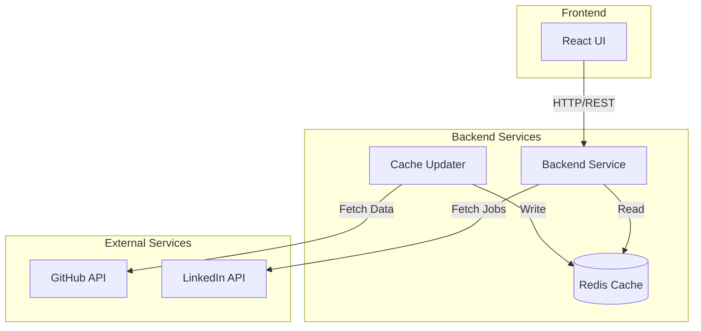

<div align="center">
  
</div>

[](https://github.com/flamingo-stack/major-league-github/actions/workflows/deploy.yml)

**An open-source leaderboard for top GitHub contributors, inspired by Major League Soccer (MLS).**

## Overview
Major League GitHub brings the excitement of soccer to the open-source world by showcasing top GitHub contributors based on programming language, location, and engagement. With soccer-themed filters, this project bridges communities and highlights local open-source talent.

🌐 **Live Demo**: [www.mlg.soccer](https://www.mlg.soccer/)

[](https://github.com/flamingo-stack/major-league-github/actions/workflows/deploy.yml)

## Features 🚀
- **Filter by Soccer Teams**: Discover top contributors near MLS stadiums, connecting coding and soccer fans.
- **Programming Language Leaderboards**: Focus on specific languages (e.g., Java) to find standout developers.
- **Regional Search**: Filter by region, state, or city to discover local open-source talent.
- **Activity and Engagement Metrics**: Explore contributors ranked by their GitHub activity, including commits, stars, and follower engagement.
- **Dynamic Updates**: Stay up to date with real-time GitHub data.

## Tech Stack 🛠️

### Backend
- Java 21
- Spring Boot 3.4
- Spring WebFlux for reactive programming
- Maven for dependency management
- Microservice Architecture:
  - Backend Service: Handles API requests and data serving
  - Cache Updater: Background service for maintaining GitHub data freshness
- Redis for distributed caching

### Frontend
- React 19
- TypeScript
- Material-UI (MUI) with @flamingo/ui-kit components
- React Query for data fetching
- Webpack 5 for bundling
- Dark theme only design

### Infrastructure & Deployment
- **Platform**: Google Kubernetes Engine (GKE)
- **CI/CD**: GitHub Actions with automated deployment
- **SSL**: Google-managed certificates with HTTP→HTTPS redirect
- **Container Registry**: GitHub Container Registry (ghcr.io)
- **Build Optimization**: Intelligent build skipping using dorny/paths-filter
- **Monitoring**: Real-time deployment status and health checks

## Architecture


## Prerequisites

### For Local Development
- Java Development Kit (JDK) 21
- Node.js 18+ and npm
- React 19 (automatically installed via package.json)
- Docker and Docker Compose
- GitHub API tokens
- Redis instance

### For Production Deployment
- Google Cloud Platform account with GKE enabled
- GitHub repository with proper secrets configured
- Domain name for SSL certificate provisioning

## Getting Started

### Backend Setup
```bash
cd backend
./mvnw clean install

# Run Backend Service
./mvnw spring-boot:run -Pbackend-service

# Run Cache Updater (in a separate terminal)
./mvnw spring-boot:run -Pcache-updater
```

### Frontend Setup
```bash
cd frontend
npm install
npm run dev    # For development
npm run build  # For production build
```

### Environment Configuration
1. Create a `.env` file in the backend directory:
```env
GITHUB_TOKENS=token_1,token_2
LINKEDIN_CLIENT_ID=your_linkedin_client_id
LINKEDIN_CLIENT_SECRET=your_linkedin_client_secret
LINKEDIN_ORG_ID=your_organization_id
REDIS_HOST=localhost
REDIS_PORT=6379
```

2. For the frontend, set up the following environment variables:
```env
# Google Tag Manager (Container ID)
GTM_ID=GTM-XXXXXXX  # Your GTM container ID (without the 'G-' prefix)

# Open Graph Meta Tags
OG_TITLE=Major League GitHub
OG_DESCRIPTION=GitHub Scouting Report: Major League Edition
OG_TYPE=website
OG_IMAGE_URL=/og-image.png
OG_SITE_NAME=Major League GitHub

# Optional: Custom blog link and text
WEBAPP_EXTRA_BUTTON_LINK=https://www.flamingo.run/blog/major-league-github-the-open-source-talent-leaderboard
WEBAPP_EXTRA_BUTTON_TEXT=Why MLG?
```

### Docker Build
```bash
# Build backend services
cd backend
docker build -t major-league-github-backend-service --build-arg PROFILE=backend-service .
docker build -t major-league-github-cache-updater --build-arg PROFILE=cache-updater .

# Build frontend
cd frontend
docker build -t major-league-github-frontend .
```

### Production Deployment

The application is automatically deployed to Google Kubernetes Engine via GitHub Actions. Every push to the `main` branch triggers:

1. **Intelligent Build Process**: Only rebuilds services that have changed
2. **Container Image Push**: Images pushed to GitHub Container Registry
3. **Kubernetes Deployment**: Automated deployment to GKE with zero-downtime updates
4. **SSL Certificate Management**: Automatic provisioning and renewal of Google-managed certificates
5. **DNS Updates**: Cross-project DNS record management
6. **Health Checks**: Verification that all services are running correctly

#### Manual Deployment (if needed)
```bash
cd kubernetes/base
kubectl apply -k .
```

## Development

### Local Development
- Backend Service runs on `http://localhost:8450`
- Backend Cache Updater runs on `http://localhost:8451`
- Frontend development server runs on `http://localhost:3000`
- Redis should be running on `localhost:6379`

### Production Environment
- **Live Application**: https://www.mlg.soccer
- **Automatic HTTPS**: All HTTP traffic redirected to HTTPS
- **High Availability**: Multi-replica deployment with load balancing
- **Monitoring**: Real-time health checks and deployment status

## Why Major League GitHub?
1. **Attract Talent**: Showcase top open-source contributors and connect with experienced engineers.
2. **Highlight Flamingo.cx**: Establish Flamingo.cx as a leader in open-source development based in Miami Beach.
3. **Celebrate Open Source**: Engage with developers passionate about collaboration and innovation.

## How It Works 🛠️
1. **Data Collection**: The Cache Updater service continuously fetches and updates contributor data from GitHub API
2. **Data Storage**: Redis serves as a distributed cache for storing contributor data and API responses
3. **Backend Service**: Handles API requests, data filtering, and serving content to the frontend
4. **Mapping with Teams**: Contributors are matched to nearby MLS teams based on location
5. **Interactive UI**: A sleek interface allows filtering by language, region, city, and team

## Contributing 🤝
We welcome contributions from the community! To contribute:
1. Fork the repository.
2. Create a feature branch: `git checkout -b feature-name`.
3. Commit your changes: `git commit -m 'Add feature-name'`.
4. Push to your fork: `git push origin feature-name`.
5. Open a pull request.

## License
This project is licensed under the [Creative Commons Attribution-NonCommercial 4.0 International Public License](LICENSE).

## Recent Improvements 🚀

### Latest Updates (January 2025)
- **React 19 Upgrade**: Upgraded from React 18 to React 19 for improved performance and future compatibility
- **Complete Rebuild**: Full rebuild from scratch with clean dependency installation
  - Eliminated all legacy dependencies and version conflicts
  - Fresh installation ensuring optimal compatibility across all packages
  - Resolved TypeScript compilation errors and babel/traverse issues
- **Enhanced Stability**: 
  - Improved webpack configuration for consistent React version resolution
  - Fixed TypeScript configuration for reliable compilation
  - Verified deployment workflow compatibility with latest React version
  - All systems fully operational with React 19

### Previous Improvements
- **UI Kit Integration**: Migrated to @flamingo/ui-kit for consistent design system
- **Build Optimization**: Intelligent build skipping for faster deployments
- **Dark Theme**: Streamlined to dark theme only for better user experience
- **Mobile Responsiveness**: Enhanced mobile layout and responsive design

## Connect with Us 🌍
- Website: [flamingo.cx](https://flamingo.cx)
- LinkedIn: [Michael Assraf](https://linkedin.com/in/michaelassraf)

Let's bring the open-source community closer with Major League GitHub! 🌟
