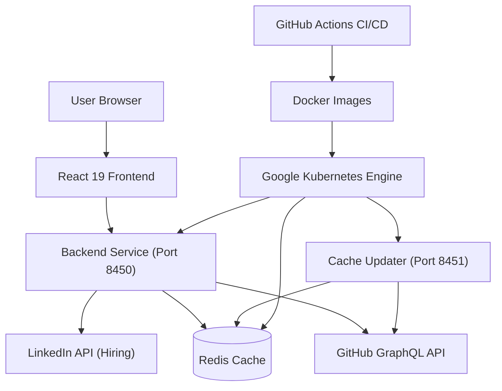
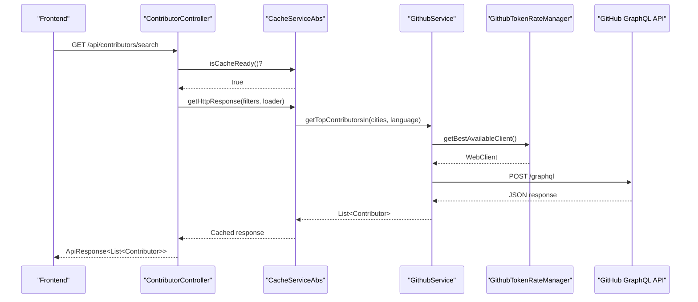

<div align="center">
  <picture>
    <source media="(prefers-color-scheme: dark)" srcset="https://raw.githubusercontent.com/flamingo-stack/major-league-github/main/frontend/public/og-image-transparent.png">
    <source media="(prefers-color-scheme: light)" srcset="https://raw.githubusercontent.com/flamingo-stack/major-league-github/main/frontend/public/og-image.png">
    
  </picture>
</div>

<p align="center">
  <a href="https://www.mlg.soccer"></a>
  <a href="https://github.com/flamingo-stack/major-league-github/blob/main/LICENSE.md"></a>
  <a href="https://github.com/flamingo-stack/major-league-github/issues"></a>
</p>

# Major League GitHub

**[Major League GitHub](https://www.mlg.soccer)** is an open-source, sports-themed leaderboard that ranks GitHub contributors like professional soccer players. It maps open-source developers across the United States by programming language, geographic location, and proximity to MLS stadiums — combining GitHub GraphQL analytics with geospatial modeling to create a gamified developer leaderboard.

> **Live:** [https://www.mlg.soccer](https://www.mlg.soccer) · **Repository:** [https://github.com/flamingo-stack/major-league-github](https://github.com/flamingo-stack/major-league-github)

---

## Features

- **Language Filtering** — Filter contributors by any programming language (Java, Python, TypeScript, Go, and more)
- **Geographic Filtering** — Narrow results by city, state, or geographic region
- **MLS Stadium Proximity** — Rank contributors by distance to the nearest MLS stadium using Haversine distance
- **Contributor Scoring** — Transparent scoring formula: `commits × max(starsReceived, 1) × recencyMultiplier`
- **Real-Time Leaderboard** — GitHub GraphQL data refreshed on a schedule via the Cache Updater microservice
- **Shareable URLs** — Every filter combination is encoded in the URL — bookmark or share any leaderboard view
- **CSV Export** — Download any filtered leaderboard as a CSV file for hiring, analytics, or research
- **Hiring Section** — Highlights top contributors alongside associated job openings
- **Responsive UI** — Works across desktop and mobile with Material-UI components
- **Cache-First Architecture** — Redis-backed distributed cache with async background refresh to minimize API latency
- **Multi-Token GitHub Rate Management** — Distributes requests across multiple GitHub PATs for resilient throughput
- **SEO Build Optimization** — Custom Webpack plugins auto-generate `sitemap.xml`, `robots.txt`, and `favicon.ico`

---

## Architecture

Major League GitHub is a distributed full-stack application split into two backend microservices and a React frontend:


```mermaid
flowchart TD
    User["User Browser"] --> Frontend["React 19 Frontend"]
    Frontend --> Backend["Backend Service (Port 8450)"]
    Backend --> Redis[("Redis Cache")]
    Backend --> GitHub["GitHub GraphQL API"]
    Backend --> LinkedIn["LinkedIn API (Hiring)"]
    CacheUpdater["Cache Updater (Port 8451)"] --> Redis
    CacheUpdater --> GitHub
    GitHubActions["GitHub Actions CI/CD"] --> Docker["Docker Images"]
    Docker --> GKE["Google Kubernetes Engine"]
    GKE --> Backend
    GKE --> CacheUpdater
    GKE --> Redis
```

### Backend Request Flow


```mermaid
sequenceDiagram
    participant Client as "Frontend"
    participant Controller as "ContributorController"
    participant Cache as "CacheServiceAbs"
    participant Service as "GithubService"
    participant Rate as "GithubTokenRateManager"
    participant GitHub as "GitHub GraphQL API"

    Client->>Controller: GET /api/contributors/search
    Controller->>Cache: isCacheReady()?
    Cache-->>Controller: true
    Controller->>Cache: getHttpResponse(filters, loader)
    Cache->>Service: getTopContributorsIn(cities, language)
    Service->>Rate: getBestAvailableClient()
    Rate-->>Service: WebClient
    Service->>GitHub: POST /graphql
    GitHub-->>Service: JSON response
    Service-->>Cache: List<Contributor>
    Cache-->>Controller: Cached response
    Controller-->>Client: ApiResponse<List<Contributor>>
```

---

## Tech Stack

| Layer | Technology |
|-------|-----------|
| Backend | Java 21 + Spring Boot 3.4 |
| Frontend | React 19 + TypeScript + Material-UI |
| State Management | URL-driven state via `useUrlState` hook |
| API Integration | Axios + React Query |
| Caching | Redis 7 (distributed) |
| External Data | GitHub GraphQL API |
| Hiring Data | LinkedIn API (optional) |
| Build | Webpack + custom SEO + favicon plugins |
| Deployment | Docker + Kubernetes (GKE) |
| CI/CD | GitHub Actions |

---

## Quick Start

Get the full stack running locally in about 5 minutes.

### Prerequisites

- Java 21+, Maven 3.9+
- Node.js 18+, npm 9+
- Docker (for Redis)
- A [GitHub Personal Access Token](https://github.com/settings/tokens) with `read:user` scope

### Run It

```bash
# 1. Clone the repository
git clone https://github.com/flamingo-stack/major-league-github.git
cd major-league-github

# 2. Start Redis
docker run -d -p 6379:6379 --name mlg-redis redis:7

# 3. Start the Backend Service (port 8450)
cd backend
GITHUB_TOKENS=your_github_pat \
SPRING_REDIS_HOST=localhost \
SPRING_REDIS_PORT=6379 \
mvn spring-boot:run -Pbackend-service

# 4. (New terminal) Start the Cache Updater (port 8451)
cd backend
GITHUB_TOKENS=your_github_pat \
SPRING_REDIS_HOST=localhost \
SPRING_REDIS_PORT=6379 \
mvn spring-boot:run -Pcache-updater

# 5. (New terminal) Start the Frontend Dev Server
cd frontend
npm install
BACKEND_API_URL=http://localhost:8450 npx webpack serve
```

Open [http://localhost:8450](http://localhost:8450) in your browser. The leaderboard will appear once the `PreCacheService` finishes its first warm-up pass (typically 30–90 seconds).

### API Quick Test

```bash
curl http://localhost:8450/api/contributors/search?languageId=java&maxResults=5
```

```json
{
  "status": "success",
  "message": "Found 5 contributors matching the criteria",
  "data": [...]
}
```

---

## Project Structure

```text
major-league-github/
├── backend/                  # Java 21 + Spring Boot 3.4
│   └── src/main/java/cx/flamingo/analysis/
│       ├── controller/       # REST API controllers (port 8450)
│       ├── service/          # Business logic + GitHub integration
│       ├── cache/            # Cache abstraction + Redis/disk implementations
│       ├── config/           # Spring configuration (CORS, Redis, scheduling)
│       ├── graphql/          # GitHub GraphQL query builder
│       ├── model/            # Domain models (Contributor, City, Region, etc.)
│       └── rate/             # GitHub token rate management
├── frontend/                 # React 19 + TypeScript (Webpack)
│   └── src/
│       ├── components/       # UI components (ContributorsTable, FiltersPanel)
│       ├── hooks/            # useUrlState, useNearestRegion
│       ├── services/         # Axios API service layer
│       └── types/            # TypeScript API type definitions
└── docs/                     # Full documentation
```

---

## Contributor Scoring

The scoring formula is transparent and intentional:

```text
Score = commits × max(starsReceived, 1) × recencyMultiplier
```

| Component | Source | Effect |
|-----------|--------|--------|
| `commits` | GitHub contributions calendar | Rewards high activity volume |
| `starsReceived` | Stars on language-specific repos | Rewards community impact |
| `recencyMultiplier` | Activity freshness (1.0–2.0) | Rewards recent contributions |

---

## REST API

| Endpoint | Description |
|----------|-------------|
| `GET /api/contributors/search` | Search and rank contributors by filters |
| `GET /api/contributors/export` | Download leaderboard as CSV |
| `GET /api/autocomplete/cities` | City autocomplete suggestions |
| `GET /api/autocomplete/languages` | Language autocomplete suggestions |
| `GET /api/autocomplete/regions` | Region autocomplete suggestions |
| `GET /api/autocomplete/states` | State autocomplete suggestions |
| `GET /api/autocomplete/teams` | MLS team autocomplete suggestions |
| `GET /api/entities/teams/{id}` | Look up an MLS team by ID |
| `GET /api/entities/regions/{id}` | Look up a region by ID |
| `GET /api/hiring/manager` | Hiring manager profile |
| `GET /api/hiring/jobs` | Active job openings |
| `GET /actuator/health` | Backend health check |

---

## Documentation

📚 See the [Documentation](./docs/README.md) for comprehensive guides including getting started tutorials, local development setup, architecture deep-dives, and security guidelines.

- [Introduction](./docs/getting-started/introduction.md) — What is Major League GitHub?
- [Prerequisites](./docs/getting-started/prerequisites.md) — Required tools and accounts
- [Quick Start](./docs/getting-started/quick-start.md) — Run the full stack in 5 minutes
- [First Steps](./docs/getting-started/first-steps.md) — Explore features after startup
- [Local Development](./docs/development/setup/local-development.md) — Full development workflow
- [Architecture Overview](./docs/development/architecture/README.md) — System design and module map

---

## Contributing

Contributions are welcome! Please read [CONTRIBUTING.md](./CONTRIBUTING.md) to understand the development workflow, code style, branching conventions, and PR process.

- 🐛 [Report a bug](https://github.com/flamingo-stack/major-league-github/issues)
- 💡 [Request a feature](https://github.com/flamingo-stack/major-league-github/issues)
- 🔒 [Report a security vulnerability](https://github.com/flamingo-stack/major-league-github/security/advisories)

---

<div align="center">
  Built with 💛 by the <a href="https://www.flamingo.run/about"><b>Flamingo</b></a> team
</div>
