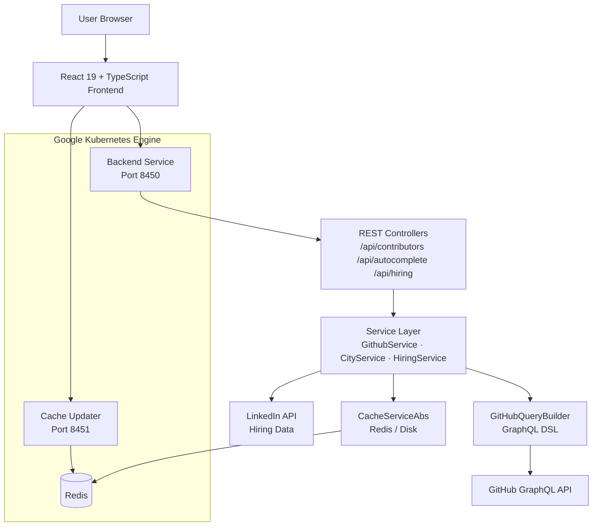

<div align="center">
  <picture>
    <source media="(prefers-color-scheme: dark)" srcset="https://raw.githubusercontent.com/flamingo-stack/major-league-github/main/frontend/public/og-image-transparent.png">
    <source media="(prefers-color-scheme: light)" srcset="https://raw.githubusercontent.com/flamingo-stack/major-league-github/main/frontend/public/og-image.png">
    
  </picture>
</div>

<p align="center">
  <a href="LICENSE.md"></a>
</p>

# Major League GitHub

**[mlg.soccer](https://www.mlg.soccer)** — an open-source, sports-styled leaderboard that ranks GitHub contributors like professional soccer players. Contributors are filtered and ranked by programming language, geographic location, and proximity to MLS stadiums.

> **This is a standalone, independent open-source project.**

---

## Features

- **Language Filtering** — Filter the leaderboard by programming language (Java, TypeScript, Python, and more)
- **Geographic Filtering** — Narrow results by U.S. city, state, or geographic region
- **MLS Stadium Proximity** — Rank contributors near professional soccer stadiums using Haversine distance
- **Weighted Scoring** — `Score = commits × max(stars, 1) × recencyMultiplier` rewards volume, impact, and freshness
- **Shareable URLs** — All filter state is encoded in the URL for easy deep linking and sharing
- **Auto-detected Region** — Browser geolocation auto-selects the nearest soccer region on first load
- **Hiring Section** — Surfaces hiring manager profiles and job openings alongside the leaderboard
- **CSV Export** — Download the full contributor list as a spreadsheet
- **Cache-first Architecture** — Redis-backed distributed caching with async background refresh

---

## Technology Stack

| Layer | Technology |
|-------|-----------|
| **Backend** | Java 21 + Spring Boot 3.4 |
| **HTTP Client** | Spring WebFlux (WebClient) |
| **Caching** | Redis (production) / Disk (local dev) |
| **Frontend** | React 19 + TypeScript |
| **UI Library** | Material-UI (MUI) |
| **Data Fetching** | React Query (@tanstack/react-query) |
| **Routing** | React Router |
| **Build Tool** | Webpack (with custom SEO + favicon plugins) |
| **Deployment** | Docker + Google Kubernetes Engine (GKE) |
| **CI/CD** | GitHub Actions |
| **External Data** | GitHub GraphQL API + LinkedIn API |

---

## Architecture

Major League GitHub is composed of two Spring Boot microservices, a React frontend, and a Redis cache — all deployed to Kubernetes via GitHub Actions.


```mermaid
flowchart TD
    User["User Browser"] --> Frontend["React 19 + TypeScript Frontend"]
    Frontend --> Backend["Backend Service\nPort 8450"]
    Frontend --> CacheUpdater["Cache Updater\nPort 8451"]

    Backend --> Controllers["REST Controllers\n/api/contributors /api/autocomplete /api/hiring"]
    Controllers --> Services["Service Layer\nGithubService · CityService · HiringService"]
    Services --> Cache["CacheServiceAbs\nRedis / Disk"]
    Services --> GraphQL["GitHubQueryBuilder\nGraphQL DSL"]
    GraphQL --> GitHub["GitHub GraphQL API"]
    Services --> LinkedIn["LinkedIn API\nHiring Data"]

    Cache --> Redis[("Redis")]
    CacheUpdater --> Redis

    subgraph GKE["Google Kubernetes Engine"]
        Backend
        CacheUpdater
        Redis
    end
```

### Contributor Scoring Formula

```text
Score = commits × max(starsReceived, 1) × recencyMultiplier

Where:
  commits           = total GitHub contributions
  starsReceived     = stars on repositories in the selected language
  recencyMultiplier = [1.0, 2.0] scaled by recency of last activity
```

This rewards developers who make frequent, high-impact commits and have stayed active recently.

---

## Quick Start

### Prerequisites

- Java 21, Apache Maven 3.9+ (or use the included `./mvnw` wrapper)
- Node.js 18+, npm 9+
- Redis 6+ (or Docker)
- A [GitHub Personal Access Token](https://github.com/settings/tokens) with `read:user` and `public_repo` scopes

### Run Locally

```bash
# 1. Clone the repository
git clone https://github.com/flamingo-stack/major-league-github.git
cd major-league-github

# 2. Start Redis
docker run -d -p 6379:6379 --name mlg-redis redis:7

# 3. Start the Backend Service (port 8450)
cd backend
export GITHUB_TOKEN_1=ghp_your_token_here
./mvnw spring-boot:run -Dspring-boot.run.profiles=backend-service

# 4. In a new terminal — start the Cache Updater (port 8451)
cd backend
export GITHUB_TOKEN_1=ghp_your_token_here
./mvnw spring-boot:run \
  -Dspring-boot.run.profiles=cache-updater \
  -Dspring-boot.run.arguments=--server.port=8451

# 5. In a new terminal — start the Frontend
cd frontend
npm install
BACKEND_API_URL=http://localhost:8450 npm start

# 6. Open the app
open http://localhost:8450
```

### Verify the Backend

```bash
# Health check
curl http://localhost:8450/actuator/health

# Fetch top contributors
curl "http://localhost:8450/api/contributors/search" | head -c 500
```

### Build for Production

```bash
# Backend — build executable JAR
cd backend
./mvnw clean package -DskipTests

# Frontend — build minified static assets
cd frontend
NODE_ENV=production npm run build
```

---

## Key Environment Variables

### Backend

| Variable | Description |
|----------|-------------|
| `GITHUB_TOKEN_1` | Primary GitHub Personal Access Token (required) |
| `GITHUB_TOKEN_2` | Optional second token for rate-limit rotation |
| `SPRING_REDIS_HOST` | Redis hostname (default: `localhost`) |
| `SPRING_REDIS_PORT` | Redis port (default: `6379`) |
| `CACHE_IMPLEMENTATION` | `redis` (production) or `disk` (local dev) |
| `CACHE_MODE` | `read-write`, `read-only`, or `force-update` |

### Frontend

| Variable | Description |
|----------|-------------|
| `BACKEND_API_URL` | URL where the backend is reachable |
| `NODE_ENV` | Build mode (`development` or `production`) |

---

## REST API Overview

```text
GET /api/contributors/search    — Search and rank contributors (filtered leaderboard)
GET /api/contributors/export    — Download contributors as CSV
GET /api/autocomplete/cities    — City autocomplete
GET /api/autocomplete/states    — State autocomplete
GET /api/autocomplete/regions   — Region autocomplete
GET /api/autocomplete/languages — Language autocomplete
GET /api/autocomplete/teams     — MLS team autocomplete
GET /api/hiring/...             — Hiring manager + job openings
GET /actuator/health            — Health check
```

All responses use a standardized envelope:

```json
{
  "status": "success",
  "message": "OK",
  "data": []
}
```

---

## Repository Structure

```text
major-league-github/
├── backend/                    Spring Boot backend (both microservices)
│   └── src/main/java/cx/flamingo/analysis/
│       ├── cache/              Cache abstraction + Redis/Disk implementations
│       ├── config/             Spring configuration (Redis, async, CORS, profiles)
│       ├── controller/         REST controllers (/api/*)
│       ├── graphql/            GitHub GraphQL query builder
│       ├── model/              Domain models (Contributor, City, Language, etc.)
│       ├── rate/               GitHub token rate-limit management
│       └── service/            Business logic services
├── frontend/                   React + TypeScript frontend
│   ├── src/
│   │   ├── components/         React UI components
│   │   ├── hooks/              Custom hooks (useUrlState, useNearestRegion)
│   │   ├── services/           API service layer (Axios)
│   │   └── types/              TypeScript type definitions
│   └── webpack-plugins/        Custom Webpack plugins (SEO, favicon generation)
└── docs/                       Documentation
```

---

## Documentation

📚 See the [Documentation](./docs/README.md) for comprehensive guides including architecture reference, local development setup, and contribution guidelines.

- [Introduction](./docs/getting-started/introduction.md) — What is Major League GitHub?
- [Prerequisites](./docs/getting-started/prerequisites.md) — Required tools and accounts
- [Quick Start](./docs/getting-started/quick-start.md) — Get up and running in minutes
- [Architecture Overview](./docs/development/architecture/README.md) — System design and data flow

---

## Contributing

Contributions are welcome! Please read [CONTRIBUTING.md](./CONTRIBUTING.md) before submitting a pull request.

- **Issues:** https://github.com/flamingo-stack/major-league-github/issues
- **Pull Requests:** https://github.com/flamingo-stack/major-league-github/pulls
- **Releases:** https://github.com/flamingo-stack/major-league-github/releases
- **Live Site:** https://www.mlg.soccer

---

<div align="center">
  Built with 💛 by the <a href="https://www.flamingo.run/about"><b>Flamingo</b></a> team
</div>
