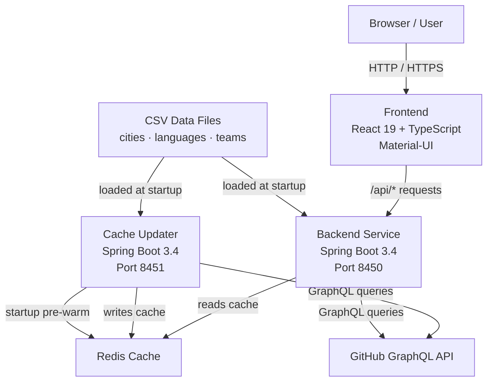

<div align="center">
  <picture>
    <source media="(prefers-color-scheme: dark)" srcset="https://raw.githubusercontent.com/flamingo-stack/major-league-github/main/frontend/public/og-image-transparent.png">
    <source media="(prefers-color-scheme: light)" srcset="https://raw.githubusercontent.com/flamingo-stack/major-league-github/main/frontend/public/og-image.png">
    
  </picture>
</div>

<p align="center">
  <a href="LICENSE.md"></a>
</p>

# Major League GitHub

**[Major League GitHub](https://www.mlg.soccer)** is a standalone, open-source leaderboard that ranks GitHub contributors like professional soccer players. It fuses the data-driven world of open-source development with the passion and aesthetics of Major League Soccer (MLS), surfacing top contributors filtered by programming language, geographic location, and proximity to MLS stadiums.

> 🌐 **Live at:** [mlg.soccer](https://www.mlg.soccer)

---

## Features

- **Language Filtering** — Filter contributors by any supported programming language (Java, TypeScript, Python, Rust, and more)
- **Geographic Filtering** — Narrow results by city, US state, or MLS-defined region
- **MLS Team Proximity** — Find developers located near any MLS stadium, ranked by closeness
- **Geolocation Detection** — Auto-detects your nearest region via the browser's Geolocation API
- **CSV Export** — Download the current leaderboard as a CSV file for offline analysis
- **Deep Linking** — All filter state lives in the URL — share any ranked view with a single link
- **Responsive UI** — Mobile card layout and desktop table layout, automatically selected by screen size
- **Distributed Cache** — Redis-backed caching keeps GitHub data fresh without hitting API rate limits on every request
- **Hiring Section** — Collapsible footer panel displaying a hiring manager's profile and open roles

---

## Technology Stack

```text
Backend:   Java 21 · Spring Boot 3.4 · Spring WebFlux · Gson · Redis (Lettuce) · Lombok
Frontend:  React 19 · TypeScript · Material-UI · React Query · Axios · Vite / Webpack
Infra:     Redis · Docker · Kubernetes (GKE) · GitHub Actions CI/CD
```

---

## Architecture

The project is split into two Java microservices and a React frontend, all coordinated through a shared Redis cache.


```mermaid
graph TD
    User["Browser / User"]
    FE["Frontend\nReact 19 + TypeScript\nMaterial-UI"]
    BE["Backend Service\nSpring Boot 3.4\nPort 8450"]
    CU["Cache Updater\nSpring Boot 3.4\nPort 8451"]
    Redis["Redis Cache"]
    GH["GitHub GraphQL API"]
    CSV["CSV Data Files\ncities · languages · teams"]

    User -->|"HTTP / HTTPS"| FE
    FE -->|"/api/* requests"| BE
    BE -->|"reads cache"| Redis
    CU -->|"writes cache"| Redis
    CU -->|"GraphQL queries"| GH
    BE -->|"GraphQL queries"| GH
    CU -->|"startup pre-warm"| Redis
    CSV -->|"loaded at startup"| BE
    CSV -->|"loaded at startup"| CU
```

| Component | Technology | Role |
|---|---|---|
| **Frontend** | React 19, TypeScript, Material-UI, Vite | Leaderboard UI with filter controls |
| **Backend Service** | Java 21, Spring Boot 3.4 (port `8450`) | Serves the REST API to the frontend |
| **Cache Updater** | Java 21, Spring Boot 3.4 (port `8451`) | Pre-warms and refreshes the Redis cache |
| **Redis** | Redis 6+ | Distributed cache shared between both services |
| **GitHub GraphQL API** | External | Source of contributor and repository data |

### How It Works

1. **Cache Updater** starts up and iterates all supported programming languages, querying the GitHub GraphQL API for contributors in each city/language combination and storing results in Redis.
2. **Backend Service** receives API requests from the frontend, reads from the Redis cache, and returns ranked contributor data as JSON.
3. **Frontend** reads filter state from URL query parameters, calls the Backend Service, and renders a responsive leaderboard table or card list.
4. Filters (language, city, region, state, MLS team) are all encoded in the URL, enabling full deep-link support.

---

## Quick Start

### Prerequisites

- **Java 21+** — Backend microservices runtime
- **Maven 3.9+** (or use the included `mvnw` wrapper)
- **Node.js 18+** and **npm 9+** — Frontend build tooling
- **Redis 6+** — Distributed cache
- **GitHub Personal Access Token** (PAT) with `read:user` scope

### Run Locally

```bash
# 1. Clone the repository
git clone https://github.com/flamingo-stack/major-league-github.git
cd major-league-github

# 2. Start Redis
redis-server

# 3. Start the Backend Service (port 8450)
cd backend
./mvnw spring-boot:run \
  -Dspring-boot.run.profiles=backend-service \
  -Dspring-boot.run.jvmArguments="\
    -Dgithub.tokens=YOUR_GITHUB_PAT \
    -Dgithub.api.url=https://api.github.com \
    -Dgithub.api.url.rate_limit=https://api.github.com/rate_limit"

# 4. In a new terminal — Start the Cache Updater (port 8451)
cd backend
./mvnw spring-boot:run \
  -Dspring-boot.run.profiles=cache-updater \
  -Dspring-boot.run.jvmArguments="\
    -Dgithub.tokens=YOUR_GITHUB_PAT \
    -Dgithub.api.url=https://api.github.com \
    -Dgithub.api.url.rate_limit=https://api.github.com/rate_limit"

# 5. In a new terminal — Start the Frontend
cd frontend
npm install
BACKEND_API_URL=http://localhost:8450 npm run dev
```

Once all three services are running and the cache has warmed up, open your browser to `http://localhost:8450`.

> **Note:** The initial cache warm-up can take several minutes. The Backend Service will return a "cache is still being populated" response until warm-up completes — this is expected behaviour.

### Verify the API

```bash
# Search for top Java contributors
curl "http://localhost:8450/api/contributors/search?languageId=java&maxResults=5"

# Autocomplete cities
curl "http://localhost:8450/api/autocomplete/cities?query=San&maxResults=5"

# List supported languages
curl "http://localhost:8450/api/autocomplete/languages?maxResults=20"
```

---

## Documentation

📚 See the [Documentation](./docs/README.md) for comprehensive guides covering setup, architecture, development, and more.

| Guide | Description |
|---|---|
| [Introduction](./docs/getting-started/introduction.md) | What Major League GitHub is and how it works |
| [Prerequisites](./docs/getting-started/prerequisites.md) | Required tools, accounts, and environment variables |
| [Quick Start](./docs/getting-started/quick-start.md) | Step-by-step guide to running the project locally |
| [First Steps](./docs/getting-started/first-steps.md) | Using filters, exporting data, and exploring the leaderboard |

---

## Contributing

Contributions are welcome! Please read the [Contributing Guidelines](./CONTRIBUTING.md) before submitting a pull request.

- **Issues:** [github.com/flamingo-stack/major-league-github/issues](https://github.com/flamingo-stack/major-league-github/issues)
- **Pull Requests:** [github.com/flamingo-stack/major-league-github/pulls](https://github.com/flamingo-stack/major-league-github/pulls)
- **Releases:** [github.com/flamingo-stack/major-league-github/releases](https://github.com/flamingo-stack/major-league-github/releases)

---

<div align="center">
  Built with 💛 by the <a href="https://www.flamingo.run/about"><b>Flamingo</b></a> team
</div>
