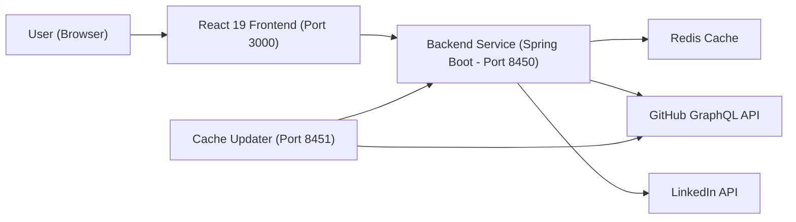
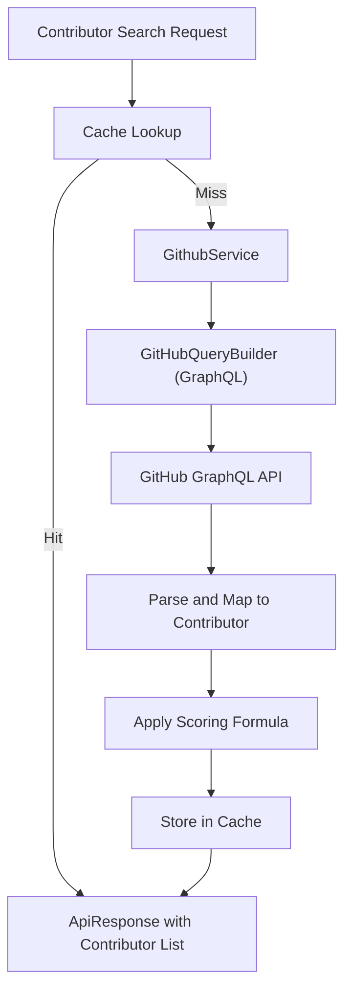
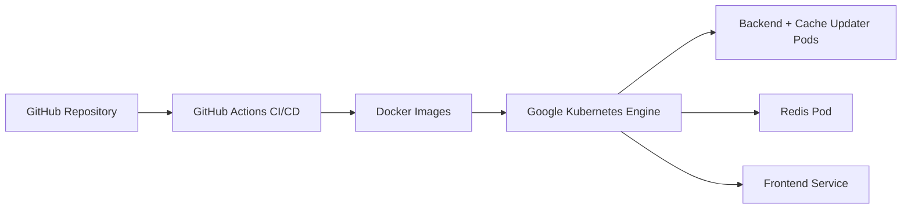

<div align="center">
  <picture>
    <source media="(prefers-color-scheme: dark)" srcset="https://raw.githubusercontent.com/flamingo-stack/major-league-github/main/frontend/public/og-image-transparent.png">
    <source media="(prefers-color-scheme: light)" srcset="https://raw.githubusercontent.com/flamingo-stack/major-league-github/main/frontend/public/og-image.png">
    
  </picture>
</div>

<p align="center">
  <a href="LICENSE.md"></a>
</p>

# Major League GitHub

**[mlg.soccer](https://www.mlg.soccer)** — An independent, open-source side project that ranks GitHub contributors like professional soccer players. Inspired by Major League Soccer (MLS), it filters contributors by programming language, geographic location, and proximity to real MLS stadiums — turning open-source contribution data into a competitive, engaging leaderboard experience.

> Who are the top Java developers within 50 miles of a Chicago MLS stadium? Major League GitHub answers exactly that.

---

## Features

- **Language Filtering** — Filter contributors by any programming language (Java, TypeScript, Python, and more)
- **Geographic Filtering** — Filter by city, state, or multi-state MLS region
- **MLS Team Proximity** — Find contributors near any Major League Soccer stadium using Haversine distance
- **Contributor Scoring** — Rank by a formula: `commits × max(stars, 1) × recencyMultiplier`
- **CSV Export** — Download ranked results as a CSV with social profile links
- **Hiring Mode** — Hiring managers can publish open roles and appear in contributor profiles
- **Distributed Cache** — Redis-backed caching protects GitHub API rate limits and serves fast results
- **URL-Driven State** — Every filter persists in the URL — results are shareable and bookmarkable

---

## Architecture

Major League GitHub is a full-stack, microservice-based system:


```mermaid
flowchart LR
    User["User (Browser)"] --> Frontend["React 19 Frontend (Port 3000)"]
    Frontend --> Backend["Backend Service (Spring Boot - Port 8450)"]
    Backend --> Redis["Redis Cache"]
    Backend --> GitHub["GitHub GraphQL API"]
    Backend --> LinkedIn["LinkedIn API"]
    CacheUpdater["Cache Updater (Port 8451)"] --> Backend
    CacheUpdater --> GitHub
```

### Microservices

| Service | Port | Responsibility |
|---------|------|----------------|
| Backend Service | 8450 | REST API, contributor ranking engine |
| Cache Updater | 8451 | Scheduled cache pre-warming |

### Contributor Ranking Engine


```mermaid
flowchart TD
    Request["Contributor Search Request"] --> CacheCheck["Cache Lookup"]
    CacheCheck -->|"Hit"| Response["ApiResponse with Contributor List"]
    CacheCheck -->|"Miss"| GithubFetch["GithubService"]
    GithubFetch --> QueryBuilder["GitHubQueryBuilder (GraphQL)"]
    QueryBuilder --> GitHubAPI["GitHub GraphQL API"]
    GitHubAPI --> Parse["Parse and Map to Contributor"]
    Parse --> Score["Apply Scoring Formula"]
    Score --> Store["Store in Cache"]
    Store --> Response
```

The scoring formula:

```text
score = commits × max(starsReceived, 1) × recencyMultiplier
```

- **recencyMultiplier** ranges from `1.0` to `2.0`, rewarding contributors active in the past year

### Deployment


```mermaid
flowchart LR
    GitHubRepo["GitHub Repository"] --> CI["GitHub Actions CI/CD"]
    CI --> Docker["Docker Images"]
    Docker --> GKE["Google Kubernetes Engine"]
    GKE --> BackendPods["Backend + Cache Updater Pods"]
    GKE --> RedisPod["Redis Pod"]
    GKE --> FrontendService["Frontend Service"]
```

---

## Technology Stack

| Layer | Technology |
|-------|-----------|
| **Backend** | Java 21, Spring Boot 3.4, Maven |
| **Frontend** | React 19, TypeScript, Material UI, TanStack React Query |
| **API Integration** | GitHub GraphQL API (multi-token rate management) |
| **Caching** | Redis (distributed), Disk (local dev fallback) |
| **Build** | Webpack 5 (production), Vite (dev server) |
| **Deployment** | Docker, Kubernetes (GKE), GitHub Actions CI/CD |

---

## Quick Start

Get the app running locally in about 5 minutes.

### Prerequisites

- Java 21+
- Apache Maven 3.9+
- Node.js 18+, npm 9+
- Redis 6+
- A [GitHub Personal Access Token](https://github.com/settings/tokens) (scopes: `read:user`, `public_repo`)

### Run It

```bash
# 1. Clone the repository
git clone https://github.com/flamingo-stack/major-league-github.git
cd major-league-github

# 2. Start Redis
redis-server

# 3. Start the backend (new terminal)
cd backend
GITHUB_TOKENS=ghp_your_token_here mvn spring-boot:run

# 4. Start the frontend (new terminal)
cd frontend
npm install
BACKEND_API_URL=http://localhost:8450 npm run dev
```

Open **[http://localhost:3000](http://localhost:3000)** in your browser.

> **No Redis?** Use the disk cache instead — no Redis required:
> ```bash
> GITHUB_TOKENS=ghp_your_token_here CACHE_IMPLEMENTATION=disk mvn spring-boot:run
> ```

> **Multiple tokens?** Provide them comma-separated for higher API throughput:
> ```bash
> GITHUB_TOKENS=ghp_token1,ghp_token2,ghp_token3 mvn spring-boot:run
> ```

### Verify the Backend

```bash
curl http://localhost:8450/actuator/health
# {"status":"UP"}

curl "http://localhost:8450/api/contributors/search?languageId=java&maxResults=5"
```

---

## REST API

The backend exposes a REST API on port 8450:

| Endpoint | Description |
|----------|-------------|
| `GET /api/contributors/search` | Ranked contributors (filterable by language, city, state, region, team) |
| `GET /api/contributors/export` | Download results as CSV |
| `GET /api/autocomplete/cities` | City autocomplete |
| `GET /api/autocomplete/languages` | Language autocomplete |
| `GET /api/autocomplete/regions` | Region autocomplete |
| `GET /api/autocomplete/states` | State autocomplete |
| `GET /api/autocomplete/teams` | MLS team autocomplete |
| `GET /api/entities/cities/{id}` | Look up a city by ID |
| `GET /api/entities/languages/{id}` | Look up a language by ID |
| `GET /api/hiring/manager` | Hiring manager profile |
| `GET /api/hiring/jobs` | Active job openings |

All endpoints return a consistent JSON envelope:

```json
{
  "status": "success",
  "message": null,
  "data": [...]
}
```

---

## Repository Structure

```text
major-league-github/
├── backend/                  # Java 21 + Spring Boot 3.4 (both microservices)
│   └── src/main/java/cx/flamingo/analysis/
│       ├── MajorLeagueGithubApplication.java
│       ├── cache/            # Cache abstraction (Redis, Disk, ReadOnly)
│       ├── config/           # Spring configuration (CORS, async, Redis)
│       ├── controller/       # REST controllers
│       ├── graphql/          # GitHub GraphQL query builder
│       ├── model/            # Domain models (Contributor, City, Region…)
│       ├── rate/             # Multi-token GitHub rate management
│       └── service/          # Business logic
└── frontend/                 # React 19 + TypeScript frontend
    └── src/
        ├── components/       # UI components (table, filters, autocomplete)
        ├── hooks/            # useNearestRegion, useUrlState
        ├── services/         # Axios-based API layer
        └── types/            # TypeScript contracts mirroring backend models
```

---

## Documentation

📚 See the [Documentation](./docs/README.md) for full guides covering setup, architecture, and development workflows.

---

## Contributing

Contributions are welcome! Please read [CONTRIBUTING.md](./CONTRIBUTING.md) before opening a pull request.

- [Open an Issue](https://github.com/flamingo-stack/major-league-github/issues)
- [Open a Pull Request](https://github.com/flamingo-stack/major-league-github/pulls)

---

## Links

- **Live Site:** [https://www.mlg.soccer](https://www.mlg.soccer)
- **Repository:** [https://github.com/flamingo-stack/major-league-github](https://github.com/flamingo-stack/major-league-github)
- **Issues:** [https://github.com/flamingo-stack/major-league-github/issues](https://github.com/flamingo-stack/major-league-github/issues)

---

<div align="center">
  Built with 💛 by the <a href="https://www.flamingo.run/about"><b>Flamingo</b></a> team
</div>
