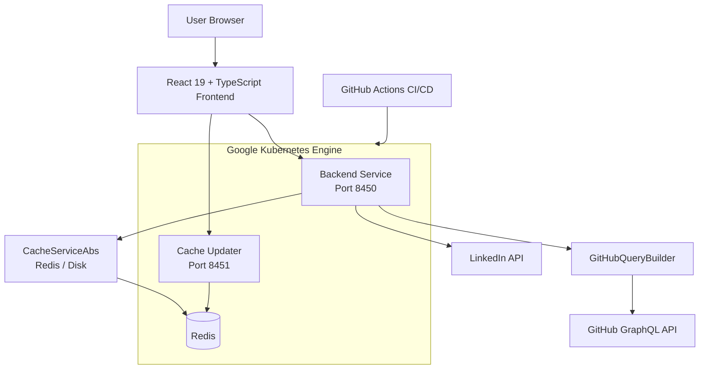

# Major League GitHub — Documentation

Welcome to the documentation for **Major League GitHub** ([mlg.soccer](https://www.mlg.soccer)), an open-source sports-styled leaderboard that ranks GitHub contributors like professional soccer players — filtered by programming language, geographic location, and proximity to MLS stadiums.

---

## 📚 Table of Contents

- [Getting Started](#-getting-started)
- [Development](#-development)
- [Reference Architecture](#-reference-architecture)
- [Architecture Diagrams](#-architecture-diagrams)
- [Quick Links](#-quick-links)

---

## 🚀 Getting Started

New to Major League GitHub? Start here.

| Guide | Description |
|-------|-------------|
| [Introduction](./getting-started/introduction.md) | What is Major League GitHub and how does it work? |
| [Prerequisites](./getting-started/prerequisites.md) | Required tools, accounts, and environment variables |
| [Quick Start](./getting-started/quick-start.md) | Get the full stack running locally in ~10 minutes |
| [First Steps](./getting-started/first-steps.md) | Tour the key features and REST API after setup |

### At a Glance — Minimum Steps

```bash
# Clone
git clone https://github.com/flamingo-stack/major-league-github.git
cd major-league-github

# Start Redis
docker run -d -p 6379:6379 --name mlg-redis redis:7

# Start Backend (port 8450)
cd backend && export GITHUB_TOKEN_1=ghp_your_token && ./mvnw spring-boot:run -Dspring-boot.run.profiles=backend-service

# Start Frontend
cd frontend && npm install && BACKEND_API_URL=http://localhost:8450 npm start
```

---

## 🛠 Development

Guides for contributors and developers extending the project.

| Guide | Description |
|-------|-------------|
| [Development Overview](./development/README.md) | High-level development documentation index |
| [Environment Setup](./development/setup/environment.md) | IDE configuration, extensions, and dev tooling |
| [Local Development](./development/setup/local-development.md) | Clone, run, debug, and iterate locally |
| [Architecture Overview](./development/architecture/README.md) | System design, data flow, and key design decisions |

### Quick Command Reference

**Backend:**

```bash
cd backend

# Run Backend Service (port 8450)
./mvnw spring-boot:run -Dspring-boot.run.profiles=backend-service

# Run Cache Updater (port 8451)
./mvnw spring-boot:run \
  -Dspring-boot.run.profiles=cache-updater \
  -Dspring-boot.run.arguments=--server.port=8451

# Build JAR
./mvnw clean package -DskipTests
```

**Frontend:**

```bash
cd frontend

npm install
BACKEND_API_URL=http://localhost:8450 npm start
NODE_ENV=production npm run build
```

**Redis:**

```bash
docker run -d -p 6379:6379 --name mlg-redis redis:7
redis-cli ping   # Expected: PONG
```

---

## 📖 Reference Architecture

In-depth documentation for each of the 18 logical modules across the backend and frontend.

### System Overview

- [Repository Overview](./reference/architecture/README.md) — Full architecture summary across all modules

### Backend Modules

| Module | Description |
|--------|-------------|
| [Module 1](./reference/architecture/module_1/module_1.md) | Application bootstrap + cache abstraction (DiskCache, ReadOnlyCache) |
| [Module 2](./reference/architecture/module_2/module_2.md) | Redis implementation, async config, cache configuration |
| [Module 2 — Configuration Layer](./reference/architecture/module_2/configuration_layer.md) | Spring configuration layer detail |
| [Module 2 — Cache Layer](./reference/architecture/module_2/cache_layer.md) | Redis cache layer implementation |
| [Module 3](./reference/architecture/module_3/module_3.md) | Infrastructure config (Redis, CORS, scheduling) |
| [Module 4](./reference/architecture/module_4/module_4.md) | REST controllers (`/api/contributors`, `/api/autocomplete`, `/api/hiring`) |
| [Module 5](./reference/architecture/module_5/module_5.md) | GitHub GraphQL query builder and serializer |
| [Module 6](./reference/architecture/module_6/module_6.md) | Domain models — Contributor, City, Language |
| [Module 7](./reference/architecture/module_7/module_7.md) | Domain models — Region, SoccerTeam, State |
| [Module 8](./reference/architecture/module_8/module_8.md) | GithubService, GithubTokenRateManager, scoring, CityService |
| [Module 9](./reference/architecture/module_9/module_9.md) | HiringService, LinkedInService, LanguageService, PreCacheService |
| [Module 10](./reference/architecture/module_10/module_10.md) | RegionService, StateService, SoccerTeamService |

### Frontend Modules

| Module | Description |
|--------|-------------|
| [Module 11](./reference/architecture/module_11/module_11.md) | ContributorsTable component and UI layout |
| [Module 12](./reference/architecture/module_12/module_12.md) | Autocomplete components, pagination |
| [Module 13](./reference/architecture/module_13/module_13.md) | URL state and geolocation hooks |
| [Module 13 — useUrlState](./reference/architecture/module_13/use_url_state.md) | URL-driven filter state hook |
| [Module 13 — useNearestRegion](./reference/architecture/module_13/use_nearest_region.md) | Browser geolocation + Haversine proximity hook |
| [Module 14](./reference/architecture/module_14/module_14.md) | API integration layer (Axios, React Query) |
| [Module 15](./reference/architecture/module_15/module_15.md) | Core TypeScript type definitions |
| [Module 16](./reference/architecture/module_16/module_16.md) | Enhanced models (EnhancedCity, EnhancedContributor) |
| [Module 17](./reference/architecture/module_17/module_17.md) | Hiring types and job opening models |
| [Module 18](./reference/architecture/module_18/module_18.md) | Webpack plugins — SEO file generator, favicon generator |

---

## 🗺 Architecture Diagrams

Visual Mermaid diagrams for each module are available in:

```text
docs/diagrams/architecture/
```

Key diagrams include:

- `module_1.mmd` — Cache abstraction and bootstrap flow
- `module_2.mmd` — Redis configuration and async thread pool
- `module_4.mmd` — REST controller request/response flow
- `module_5.mmd` — GraphQL query builder DSL
- `module_8.mmd` — GitHub service + rate limiting + scoring
- `module_10.mmd` — Region, state, and soccer team services
- `module_13.mmd` — URL state management and geolocation hooks
- `module_14.mmd` — Frontend API layer (Axios + React Query)
- `use_url_state.mmd` — URL state encoding/decoding flow
- `use_nearest_region.mmd` — Haversine geolocation proximity flow

---

## 🔗 Quick Links

| Resource | Link |
|----------|------|
| **Project README** | [../README.md](../README.md) |
| **Contributing Guide** | [../CONTRIBUTING.md](../CONTRIBUTING.md) |
| **Live Site** | https://www.mlg.soccer |
| **GitHub Repository** | https://github.com/flamingo-stack/major-league-github |
| **Issues** | https://github.com/flamingo-stack/major-league-github/issues |
| **Pull Requests** | https://github.com/flamingo-stack/major-league-github/pulls |
| **Releases** | https://github.com/flamingo-stack/major-league-github/releases |

---

## Architecture at a Glance



---

*Documentation generated by [🦩 Flamingo AI Technical Writer](https://flamingo.run)*
