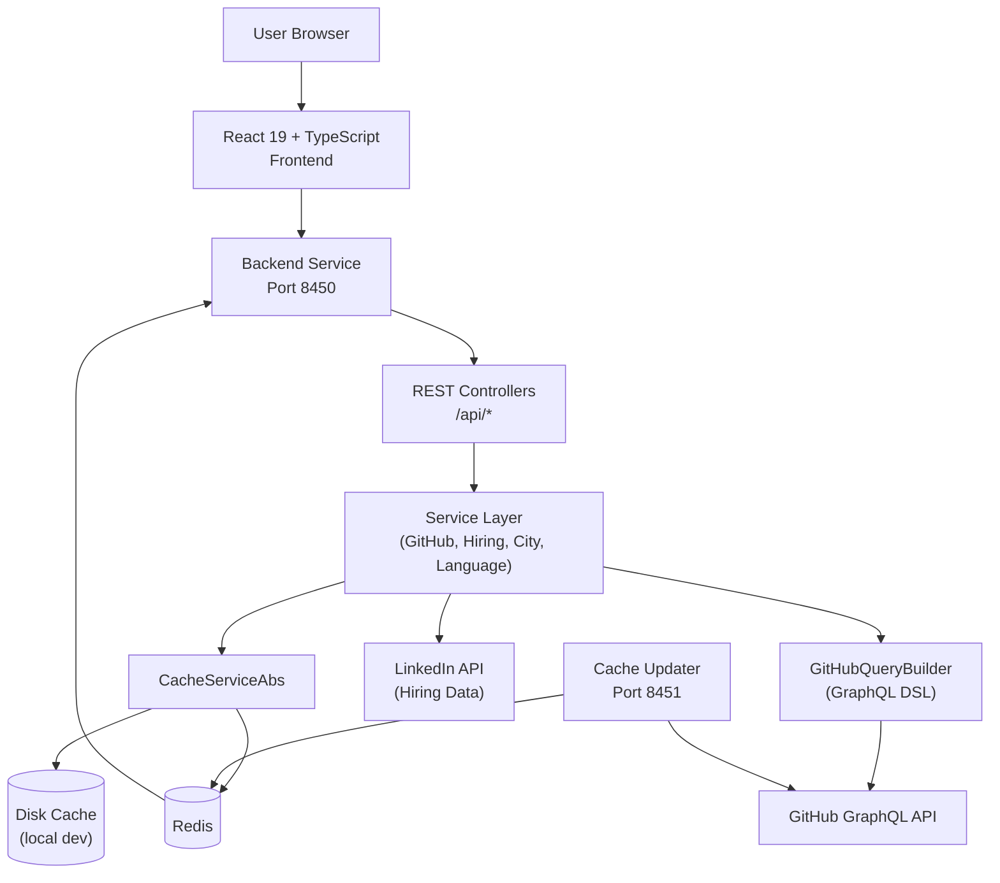
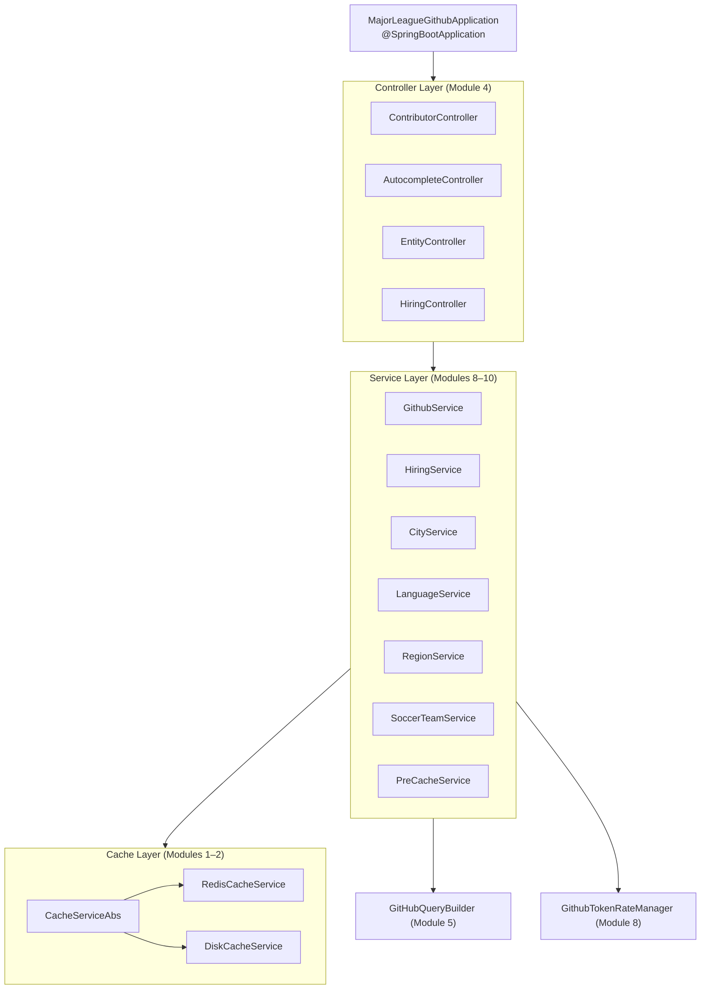
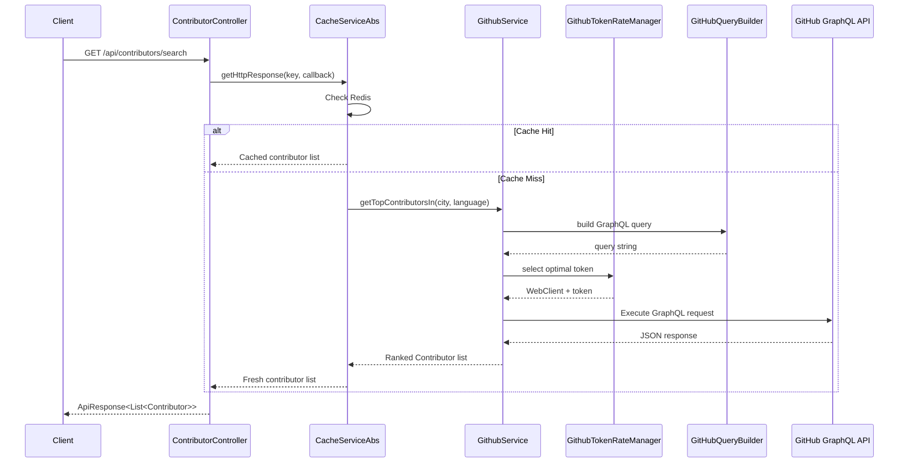
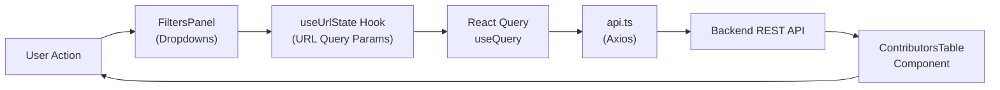
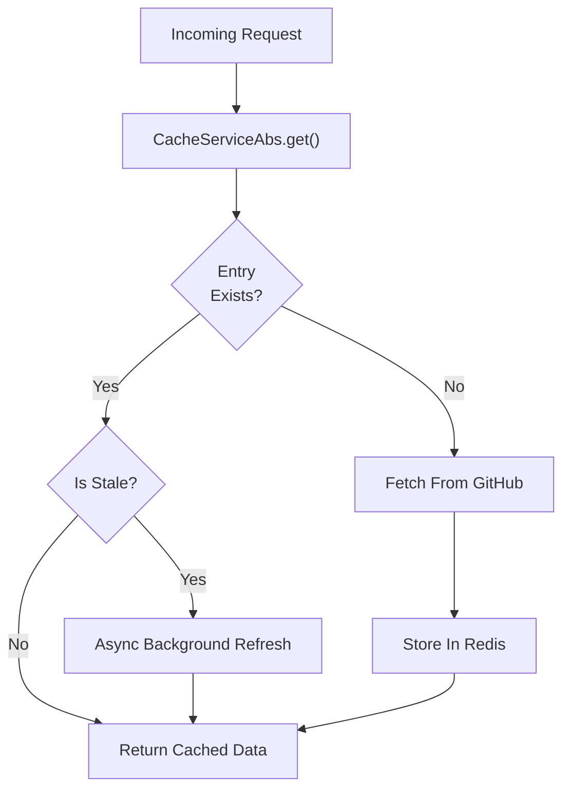
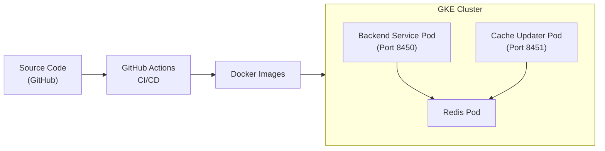

# Architecture Overview

Major League GitHub is a distributed full-stack application organized into 18 logical modules across two Spring Boot microservices and a React TypeScript frontend.

---

## High-Level System Architecture



---

## Core Components

| Module | Layer | Key Classes | Responsibility |
|--------|-------|------------|---------------|
| Module 1 | Backend Core | `MajorLeagueGithubApplication`, `CacheServiceAbs` | App bootstrap, cache abstraction |
| Module 2 | Backend Infra | `RedisCacheService`, `AsyncConfig`, `CacheConfig` | Redis implementation, thread pools |
| Module 3 | Backend Config | `RedisConfig`, `WebConfig`, `CacheUpdaterConfig` | CORS, Redis connection, scheduling |
| Module 4 | API Layer | `ContributorController`, `AutocompleteController`, `HiringController` | REST endpoints |
| Module 5 | GraphQL | `GitHubQueryBuilder`, `QuerySerializer`, `Field` | GitHub GraphQL query construction |
| Module 6–7 | Domain Models | `Contributor`, `City`, `Language`, `Region`, `SoccerTeam` | Backend data contracts |
| Module 8 | Services | `GithubService`, `GithubTokenRateManager`, `CityService` | GitHub API + rate limiting + scoring |
| Module 9 | Services | `HiringService`, `LinkedInService`, `LanguageService`, `PreCacheService` | Hiring, languages, pre-warming |
| Module 10 | Services | `RegionService`, `StateService`, `SoccerTeamService` | Geographic + team lookups |
| Module 11–12 | Frontend UI | `ContributorsTable`, `LanguageAutocomplete`, `Pagination` | Leaderboard display components |
| Module 13 | Frontend Hooks | `useUrlState`, `useNearestRegion` | URL state + geolocation |
| Module 14 | Frontend API | `api.ts`, `GetContributorsParams` | Axios-based HTTP layer |
| Module 15–16 | Frontend Types | `Contributor`, `Language`, `Region`, `EnhancedCity` | TypeScript type contracts |
| Module 17–18 | Build Tools | `SeoFilesPlugin`, `FaviconGeneratorPlugin` | Webpack build-time plugins |

---

## Backend Architecture Detail

The backend follows a strict layered architecture:



---

## GitHub Data Retrieval Flow



---

## Frontend Architecture

The frontend is a single-page React application built with Webpack. All application state that affects the leaderboard view is stored in the URL query string:



### URL State Parameters

| Query Parameter | Filter |
|----------------|--------|
| `languageId` | Programming language |
| `regionId` | MLS geographic region |
| `stateId` | U.S. state |
| `cityId` | City |
| `teamId` | MLS team |

---

## Caching Architecture

The system uses a **cache-first, async-refresh** pattern:



Three cache implementations are available:

| Implementation | Config Value | Use Case |
|---------------|-------------|----------|
| `RedisCacheService` | `redis` | Production — distributed, scalable |
| `DiskCacheService` | `disk` | Local development — no Redis needed |
| `ReadOnlyCacheService` | `read-only` mode | Read-only replica deployments |

---

## Contributor Scoring Formula

```text
Score = commits × max(starsReceived, 1) × recencyMultiplier

Where:
  commits           = total GitHub contributions in the selected period
  starsReceived     = stars on repositories in the selected language
  recencyMultiplier = [1.0, 2.0] linearly scaled by recency of last activity
```

This formula simultaneously rewards:

- **Volume** — developers who contribute frequently
- **Impact** — developers whose repositories attract stars
- **Freshness** — developers who are actively contributing now

---

## Deployment Architecture



- The **Backend Service** and **Cache Updater** run as separate Kubernetes Deployments
- Both services share the same Redis instance
- GitHub Actions builds Docker images and deploys to GKE on every push to `main`

---

## Key Design Decisions

| Decision | Rationale |
|----------|-----------|
| Two microservices instead of one | Separates read (API) from write (cache refresh) workloads independently |
| Redis as primary cache | Enables horizontal scaling and shared cache across multiple backend replicas |
| Multiple GitHub tokens | Allows higher API throughput by rotating across rate-limit windows |
| Haversine distance for geolocation | Accurate great-circle distance to nearest MLS stadium without external API |
| URL-driven filter state | Enables bookmarking, sharing, and browser back/forward navigation |
| Custom Webpack plugins | Generates SEO files (sitemap.xml, robots.txt) and favicons at build time |

---

## Reference Documentation

In-depth per-module documentation is available in `docs/reference/architecture/`. Each module document includes component diagrams, sequence diagrams, and implementation details.
