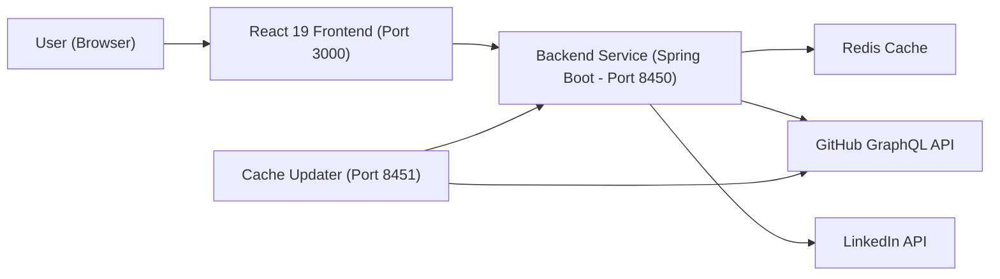
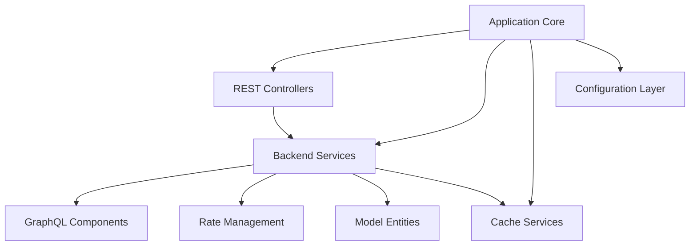
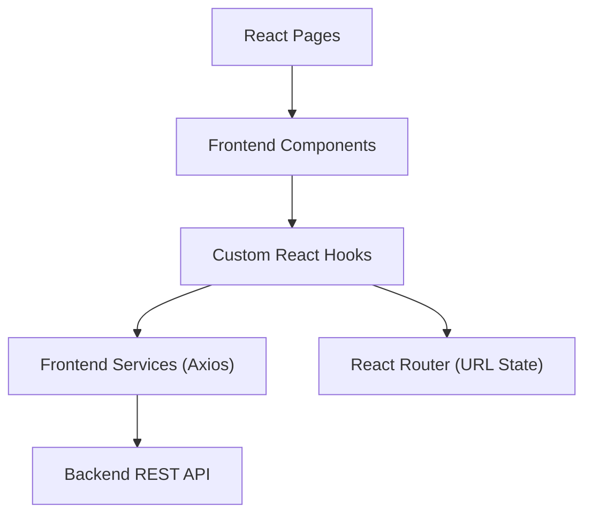
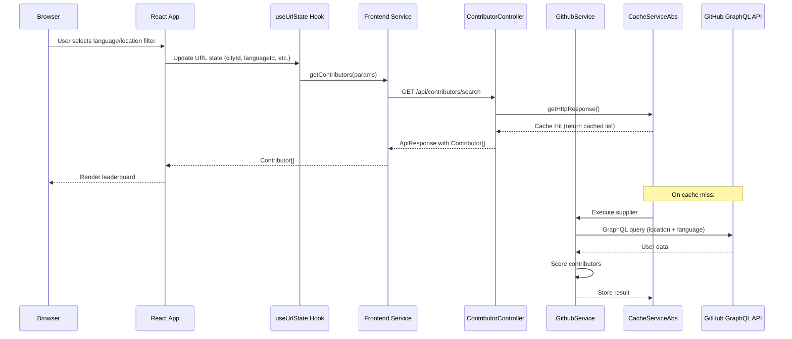
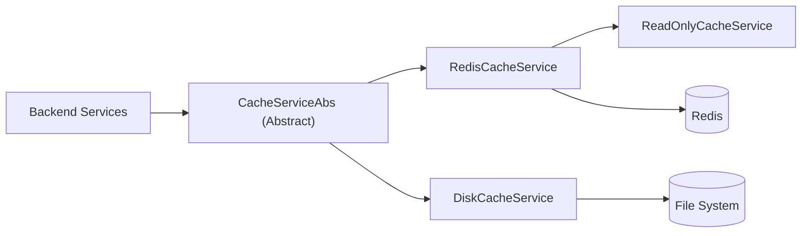
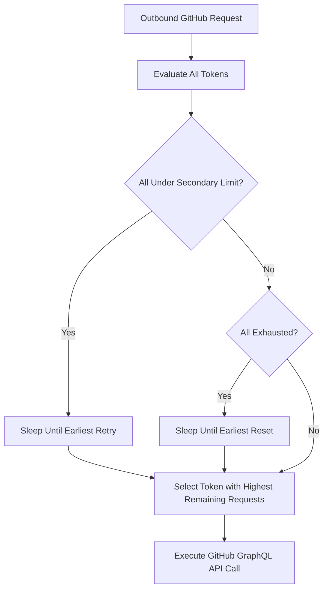
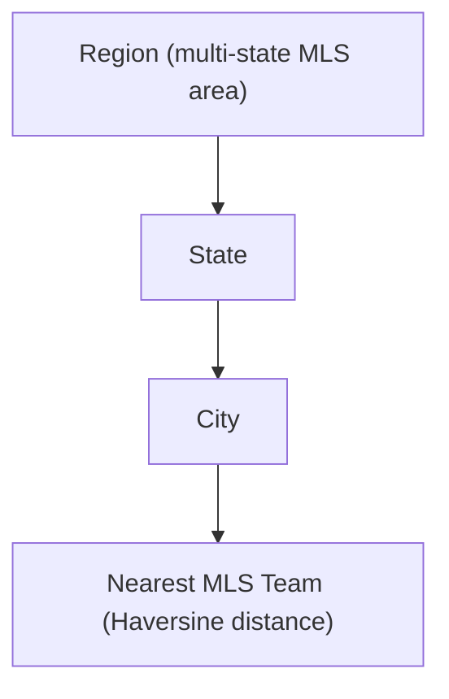
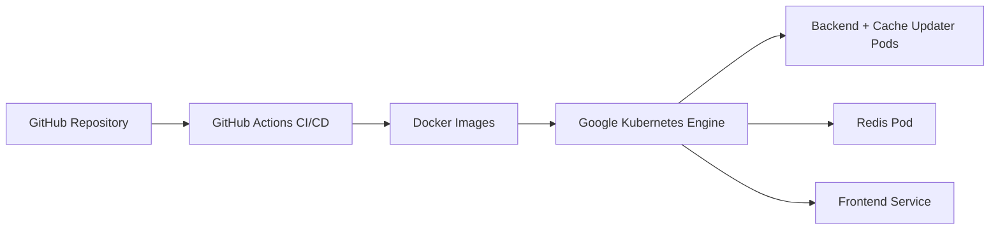

# Architecture Overview

Major League GitHub is a full-stack, microservice-based system that transforms GitHub contribution data into a sports-themed leaderboard. This document provides the high-level architecture, component breakdown, data flow, and key design decisions.

For detailed per-module documentation, see the [reference architecture](../../reference/architecture/README.md).

---

## High-Level Architecture



The system has three main runtime components:

| Component | Port | Technology | Role |
|-----------|------|-----------|------|
| Frontend | 3000 | React 19 + TypeScript | Leaderboard UI |
| Backend Service | 8450 | Java 21 + Spring Boot 3.4 | REST API + ranking engine |
| Cache Updater | 8451 | Java 21 + Spring Boot 3.4 | Scheduled cache warming |

Redis serves as the shared distributed cache between both backend services.

---

## Backend Architecture

The backend is a single Maven project that runs as two microservices via Spring profiles.



### Backend Module Breakdown

| Module | Path | Responsibility |
|--------|------|----------------|
| Application Core | `cx.flamingo.analysis` | Bootstrap, `@EnableCaching`, `@EnableAsync` |
| Controllers | `cx.flamingo.analysis.controller` | REST endpoints (`/api/contributors`, `/api/autocomplete`, etc.) |
| Backend Services | `cx.flamingo.analysis.service` | Business logic, GitHub data, scoring, hiring |
| Cache Services | `cx.flamingo.analysis.cache` | Pluggable cache (Redis, Disk, ReadOnly) |
| GraphQL Components | `cx.flamingo.analysis.graphql` | Fluent GitHub GraphQL query builder |
| Rate Management | `cx.flamingo.analysis.rate` | Multi-token GitHub rate limit orchestration |
| Model Entities | `cx.flamingo.analysis.model` | Domain models: `Contributor`, `City`, `Region`, etc. |
| Configurations | `cx.flamingo.analysis.config` | Spring beans, profiles, Redis, CORS, async pools |

---

## Frontend Architecture

The frontend is a React 19 + TypeScript SPA using Webpack 5 for production builds and Vite for development.



### Frontend Module Breakdown

| Module | Path | Responsibility |
|--------|------|----------------|
| Components | `src/components/` | UI: filters, leaderboard table, autocomplete, tooltips |
| Hooks | `src/hooks/` | URL state management, nearest region geolocation |
| Services | `src/services/` | Axios-based API calls with typed responses |
| Types | `src/types/` | TypeScript contracts mirroring backend domain models |
| Styles | `src/styles/` | Theme configuration, color mappings |
| Webpack Plugins | `webpack-plugins/` | SEO files generator, favicon generator |

---

## Core Data Flow

### Contributor Search Request



---

## Contributor Scoring Formula

The ranking engine scores each contributor as:

```text
score = commits × max(starsReceived, 1) × recencyMultiplier
```

- **commits** — total commits across repositories
- **starsReceived** — total stars received (floored at 1 to prevent zero score)
- **recencyMultiplier** — `1.0` to `2.0`, based on activity in the past year

---

## Cache Architecture

The cache layer uses a pluggable abstraction supporting three implementations:



| Mode | Description |
|------|-------------|
| `read-write` | Normal operation — read from cache, write on miss |
| `read-only` | Safe mode — read from Redis, never write |
| `force-update` | Always bypass cache and fetch fresh |

The active implementation is selected at startup via `cache.implementation` and `cache.mode` properties.

---

## Rate Management

GitHub API rate limits are managed via `GithubTokenRateManager`:



Multiple tokens can be configured via `github.tokens`. The manager tracks:
- **Primary rate limits** (per-hour quota)
- **Secondary rate limits** (burst/abuse protection via `Retry-After` headers)

---

## Geographic Modeling

Contributors are filtered using a multi-level geographic model:



Data is loaded from static CSV files at startup (`cities.csv`, `states.csv`, `regions.csv`, `teams.csv`). No database is required.

The Haversine formula (Earth radius = 6371 km) is used to compute the nearest MLS stadium for each city.

---

## Deployment Model



- **Containerized:** All services run as Docker containers
- **Orchestrated:** Kubernetes (GKE) manages scaling and health
- **CI/CD:** GitHub Actions builds, tests, and deploys on push

---

## Key Design Decisions

| Decision | Rationale |
|----------|-----------|
| Two microservices from one codebase | Shared code, separated concerns; profile switching via Maven |
| Redis as distributed cache | Prevents redundant GitHub API calls across pods |
| Multi-token rate management | Maximizes GitHub API throughput without hitting limits |
| URL-driven frontend state | Filter state is shareable and bookmarkable without backend session |
| CSV data files (no database) | Eliminates database dependency for geographic reference data |
| Pluggable cache abstraction | Swap Redis ↔ Disk without changing business logic |
| Haversine proximity for teams | Accurate great-circle distance for stadium assignment |
