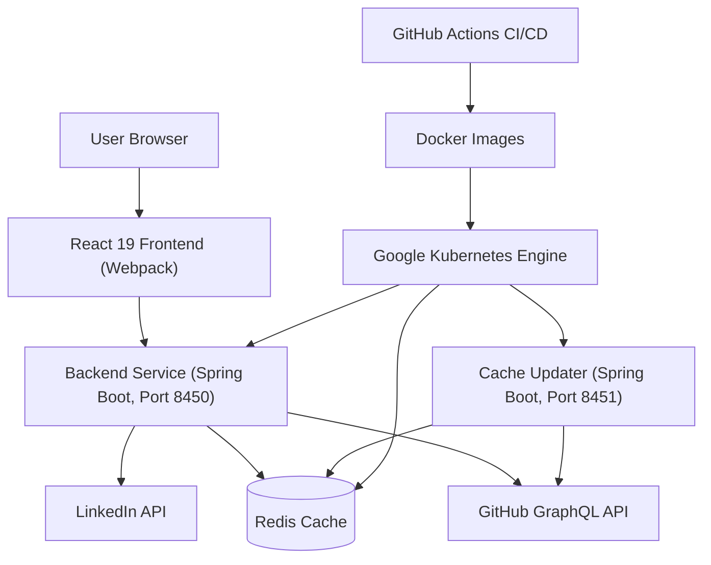
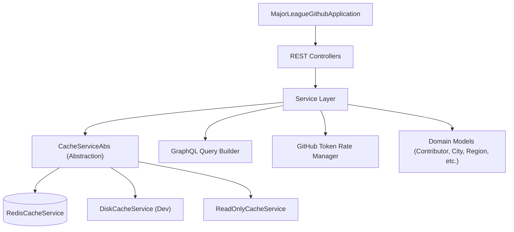
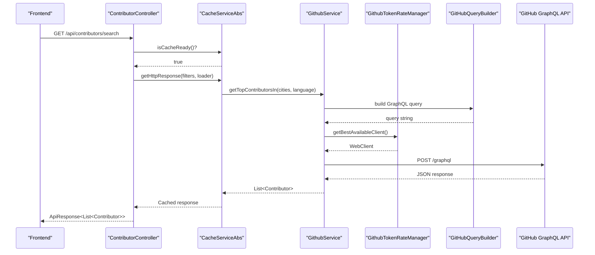
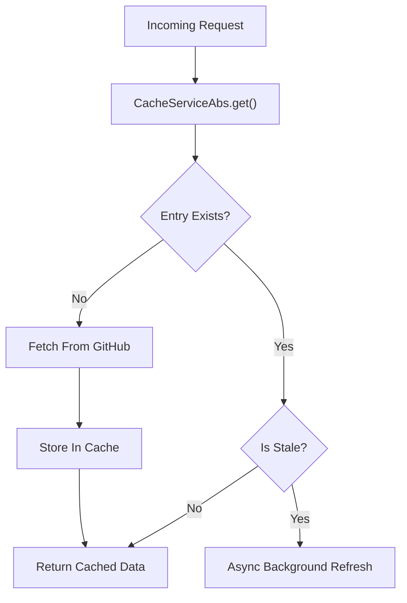
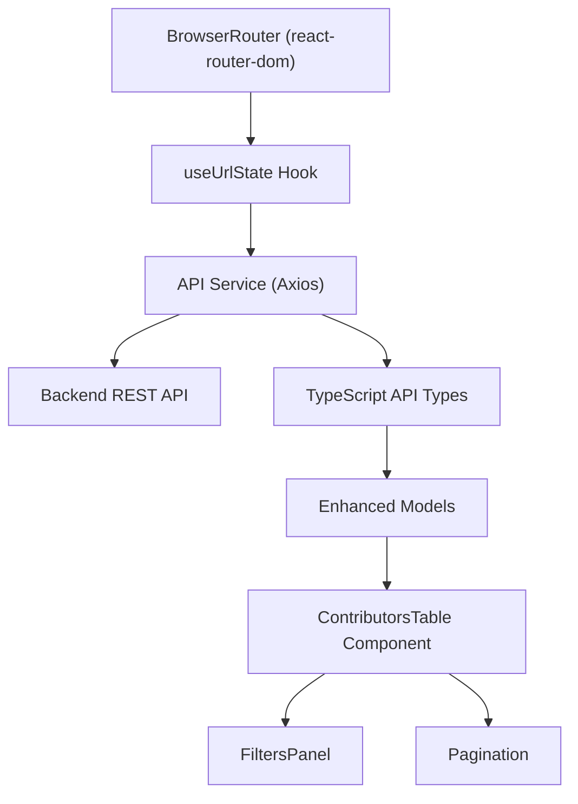
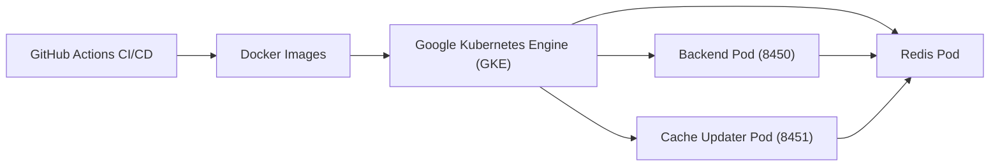

# Architecture Overview

Major League GitHub is a full-stack, distributed application organized into layered backend modules and a component-driven React frontend. This document provides a high-level map of how all the pieces fit together.

> For deep-dives into individual modules, see the reference documentation in `docs/reference/architecture/`.

---

## System Architecture



---

## Core Components

| Component | Technology | Role |
|-----------|-----------|------|
| **Backend Service** | Java 21 + Spring Boot 3.4 | Serves REST API on port 8450 |
| **Cache Updater** | Java 21 + Spring Boot 3.4 | Scheduled GitHub data refresh on port 8451 |
| **Redis** | Redis 7 | Distributed cache shared by both services |
| **React Frontend** | React 19 + TypeScript + Material-UI | Leaderboard UI |
| **GitHub GraphQL API** | External | Source of contributor data |
| **LinkedIn API** | External (optional) | Source of job postings |

---

## Backend Layer Architecture

The backend is organized into logical modules, each with a clearly defined responsibility:



### Backend Module Map

| Module | Contents |
|--------|---------|
| Module 1 | Application bootstrap + cache abstraction (`CacheServiceAbs`) |
| Module 2 | Redis implementation + async thread pool configuration |
| Module 3 | Infrastructure config: Redis, CORS, scheduling, JSON adapters |
| Module 4 | REST controllers (`/api/contributors`, `/api/autocomplete`, `/api/entities`, `/api/hiring`) |
| Module 5 | GitHub GraphQL query builder (fluent DSL) |
| Module 6–7 | Domain models: `Contributor`, `City`, `Region`, `State`, `SoccerTeam`, `Language` |
| Module 8 | `GithubService` (scoring engine) + `GithubTokenRateManager` + `CityService` |
| Module 9 | `HiringService`, `LanguageService`, `PreCacheService`, `LinkedInService` |
| Module 10 | `RegionService`, `StateService`, `SoccerTeamService`, `ReferencePopulationService` |

---

## GitHub Data Retrieval Flow



---

## Contributor Scoring Formula

The scoring engine in `GithubService` ranks developers using:

```text
Score = commits × max(starsReceived, 1) × recencyMultiplier
```

| Component | Source | Effect |
|-----------|--------|--------|
| `commits` | GitHub contributions calendar | Rewards high activity volume |
| `starsReceived` | Stars on language-specific repos | Rewards community impact |
| `recencyMultiplier` | Activity freshness (1.0–2.0) | Rewards recent contributions |

---

## Caching Strategy

Major League GitHub uses a **cache-first** architecture to minimize GitHub API rate pressure and reduce response latency:



| Cache Mode | Use Case |
|-----------|---------|
| `read-write` (default) | Normal production operation |
| `read-only` | Prevent writes during maintenance |
| Disk cache | Local development without Redis |

Cache keys encode: city, language, and page number. Empty results are also cached to prevent repeated expensive API calls.

---

## Frontend Architecture



The frontend is driven by **URL state**. All filter parameters (language, city, state, region, team) are stored as URL query parameters via the `useUrlState` hook. This makes every leaderboard view fully shareable and bookmarkable.

### Key Frontend Modules

| Module | Contents |
|--------|---------|
| Module 11–12 | Contributors table, pagination, mobile/desktop views |
| Module 13 | `useUrlState` — URL ↔ filter state synchronization |
| Module 14 | API service layer (Axios) + `useUrlState` basic hook |
| Module 15 | Core API TypeScript types (`Contributor`, `City`, `ApiResponse<T>`) |
| Module 16–17 | Enhanced types, hiring types (`HiringManagerProfile`, `JobOpening`) |
| Module 18 | SEO Webpack plugin (`SeoFilesPlugin` → `sitemap.xml`, `robots.txt`) |

---

## Deployment Architecture



Both backend services are built from the same JAR but run in separate Kubernetes pods with different Spring profiles. CI/CD is managed through GitHub Actions, which builds Docker images and deploys to Google Kubernetes Engine (GKE).

---

## Key Design Decisions

| Decision | Rationale |
|----------|-----------|
| **Two Spring profiles, one JAR** | Simplifies build and deployment while enabling distinct runtime behaviors |
| **Cache-first with async refresh** | Prevents latency spikes from synchronous GitHub API calls |
| **Multi-token rate management** | Resilient throughput under GitHub's strict per-token rate limits |
| **CSV-based reference data** | Cities, states, regions, and teams load from CSVs at startup — no database required |
| **URL-driven frontend state** | Every filter combination is bookmarkable and shareable |
| **Haversine distance for MLS proximity** | Accurately calculates geographic distance to nearest stadium |
| **Custom Webpack plugins** | SEO and favicon assets generated at build time — zero runtime overhead |
