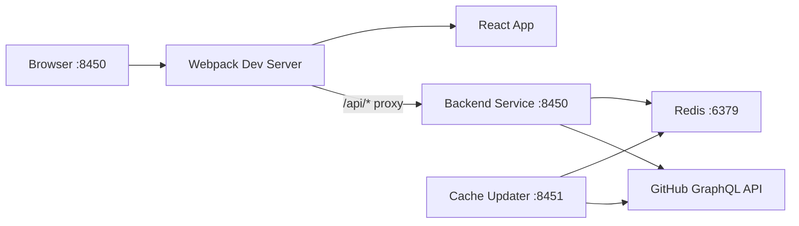

# Local Development Guide

This guide explains how to run the full Major League GitHub stack locally, including hot reload, debugging, and working with the two backend profiles.

---

## 1. Clone and Set Up

```bash
git clone https://github.com/flamingo-stack/major-league-github.git
cd major-league-github
```

The project structure contains two main directories:

```text
major-league-github/
├── backend/     # Java 21 + Spring Boot 3.4
└── frontend/    # React 19 + TypeScript (Webpack)
```

---

## 2. Start Redis

Both backend services require Redis. Start it with Docker:

```bash
docker run -d \
  --name mlg-redis \
  -p 6379:6379 \
  redis:7
```

Verify it is accepting connections:

```bash
redis-cli -h localhost -p 6379 ping
# Expected: PONG
```

---

## 3. Running the Backend Service

The Backend Service exposes the REST API on port 8450. It is activated by the `backend-service` Maven profile (which is the default profile in the `pom.xml`).

```bash
cd backend
mvn spring-boot:run \
  -Pbackend-service \
  -Dspring-boot.run.jvmArguments="\
    -DGITHUB_TOKENS=ghp_yourTokenHere \
    -DSPRING_REDIS_HOST=localhost \
    -DSPRING_REDIS_PORT=6379"
```

Or with exported environment variables:

```bash
export GITHUB_TOKENS="ghp_yourTokenHere"
export SPRING_REDIS_HOST="localhost"
export SPRING_REDIS_PORT="6379"

cd backend
mvn spring-boot:run -Pbackend-service
```

**Startup indicator:**

```text
Started MajorLeagueGithubApplication in X.XXX seconds (JVM running for Y.YYY)
```

**Health check:**

```bash
curl http://localhost:8450/actuator/health
# Expected: {"status":"UP"}
```

---

## 4. Running the Cache Updater

The Cache Updater runs scheduled jobs that pre-warm Redis with GitHub contributor data. It is activated by the `cache-updater` Maven profile.

```bash
# In a new terminal
cd backend
GITHUB_TOKENS="ghp_yourTokenHere" \
SPRING_REDIS_HOST="localhost" \
SPRING_REDIS_PORT="6379" \
mvn spring-boot:run -Pcache-updater
```

> **Note:** The Cache Updater runs the `PreCacheService` on startup, which iterates all configured languages and triggers GitHub API calls to fill the cache. The Backend Service will return cached data once this completes (typically 30–90 seconds on first run, depending on rate limit availability).

---

## 5. Running the Frontend Dev Server

The Webpack dev server proxies `/api` requests to the backend:

```bash
cd frontend
npm install

# Start dev server with backend proxy
BACKEND_API_URL=http://localhost:8450 npx webpack serve
```

**Default dev server URL:** [http://localhost:8450](http://localhost:8450)

The dev server enables:
- Source maps for debugging
- Automatic chunk splitting
- Hot module replacement (HMR) for fast iteration
- Proxy of `/api/*` requests to the backend service

> **Port note:** The Webpack dev server runs on port `8450` by default (matching the backend port so the browser points at one address). You can change the `PORT` environment variable if needed.

---

## 6. Building for Production

### Backend

```bash
cd backend
mvn clean package -DskipTests
# Output: backend/target/major-league-github-0.0.1-SNAPSHOT.jar
```

Run the packaged JAR:

```bash
java -jar backend/target/major-league-github-0.0.1-SNAPSHOT.jar \
  --spring.profiles.active=backend-service
```

### Frontend

```bash
cd frontend
NODE_ENV=production \
BACKEND_API_URL=https://www.mlg.soccer \
OG_URL=https://www.mlg.soccer \
BASE_URL=https://www.mlg.soccer \
npx webpack --mode production
# Output: frontend/dist/
```

The production build runs two custom Webpack plugins automatically:
- **FaviconGeneratorPlugin** — converts `public/favicon.svg` to `favicon.ico`
- **SeoFilesPlugin** — generates `sitemap.xml` and `robots.txt` with the configured base URL

---

## 7. Hot Reload

### Frontend

The Webpack dev server provides hot module replacement. Any change to `.tsx` or `.ts` files is reflected immediately in the browser without a full page reload.

### Backend

Spring Boot DevTools is not explicitly listed as a dependency. For backend changes during development, restart the Spring Boot process manually with:

```bash
mvn spring-boot:run -Pbackend-service
```

IntelliJ IDEA supports **Build → Recompile** (`Cmd+Shift+F9` on macOS) when the Spring Boot run configuration is active, which triggers a faster incremental rebuild.

---

## 8. Debug Configuration

### Backend (IntelliJ IDEA)

Create a Run Configuration in IntelliJ:

- **Type:** Spring Boot
- **Main class:** `cx.flamingo.analysis.MajorLeagueGithubApplication`
- **Active profiles:** `backend-service`
- **Environment variables:** `GITHUB_TOKENS=...;SPRING_REDIS_HOST=localhost;SPRING_REDIS_PORT=6379`

Set breakpoints anywhere in the Spring Boot code and use **Debug** mode to step through requests.

### Backend (Remote Debug via Maven)

```bash
cd backend
mvnDebug spring-boot:run -Pbackend-service
# Listens on port 8000 for a remote debugger
```

Then attach from IntelliJ at `localhost:8000`.

### Frontend (Browser DevTools)

Source maps are enabled in development mode. Open Chrome DevTools → **Sources** → navigate to `webpack://./src/` to set breakpoints in TypeScript.

---

## 9. Redis Inspection

Inspect cached data in Redis:

```bash
# Connect to Redis CLI
redis-cli -h localhost -p 6379

# List all cache keys
KEYS *

# Get a specific cached entry
GET "contributors:java:los-angeles:page-0"

# Check if cache is populated
DBSIZE
```

---

## 10. Multi-Service Local Architecture



All four processes run concurrently during full-stack local development.
