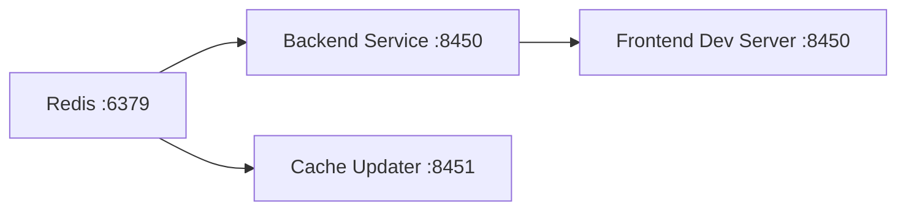

# Local Development Guide

This guide covers how to clone the repository, run the application locally, use watch/hot-reload mode, and configure debugging.

---

## Clone and Initial Setup

```bash
# Clone the repository
git clone https://github.com/flamingo-stack/major-league-github.git
cd major-league-github

# Install frontend dependencies
cd frontend
npm install
cd ..
```

No additional build steps are required for the backend — the Maven wrapper (`./mvnw`) handles dependency resolution on first run.

---

## Starting All Services

The full local stack consists of three processes (plus Redis):



### 1. Start Redis

```bash
# With Docker (recommended)
docker run -d -p 6379:6379 --name mlg-redis redis:7

# Or use a local installation
redis-server

# Verify it is reachable
redis-cli ping   # Expected: PONG
```

### 2. Start the Backend Service

The Backend Service runs with the `backend-service` Spring profile, which activates REST controllers and the API layer on port 8450.

```bash
cd backend

# Export your GitHub token (required)
export GITHUB_TOKEN_1=ghp_your_token_here

# Start the backend
./mvnw spring-boot:run -Dspring-boot.run.profiles=backend-service
```

The backend will be accessible at http://localhost:8450.

**Health check:**

```bash
curl http://localhost:8450/actuator/health
# Expected: {"status":"UP"}
```

### 3. Start the Cache Updater (Optional)

The Cache Updater periodically refreshes the Redis cache with fresh GitHub data in the background. Without it, the first request for each filter combination will fetch data directly from GitHub (which is slower).

```bash
cd backend

# In a new terminal
export GITHUB_TOKEN_1=ghp_your_token_here

./mvnw spring-boot:run \
  -Dspring-boot.run.profiles=cache-updater \
  -Dspring-boot.run.arguments=--server.port=8451
```

### 4. Start the Frontend

```bash
cd frontend

# Start with the dev server pointing at the local backend
BACKEND_API_URL=http://localhost:8450 npm start
```

The Webpack dev server starts on a port configured by the `PORT` environment variable (default behavior from webpack config). The app proxies API requests to the backend.

Open http://localhost:8450 (or the port shown in the terminal) in your browser.

---

## Hot Reload / Watch Mode

### Frontend Hot Reload

The frontend uses **Webpack's watch mode** with HMR (Hot Module Replacement). While `npm start` is running, changes to any `.tsx`, `.ts`, `.css`, or asset file are automatically recompiled and the browser refreshes without a full page reload.

```bash
cd frontend
BACKEND_API_URL=http://localhost:8450 npm start
# Changes in src/ take effect immediately in the browser
```

### Backend Restart on Change

Spring Boot does not automatically restart on code changes in the default Maven run. For rapid backend iteration, you have two options:

**Option A — Spring Boot DevTools (if added as a dependency):**

If `spring-boot-devtools` is on the classpath, the server restarts automatically when class files change. You would need to trigger a rebuild in your IDE (e.g., `Build → Build Project` in IntelliJ) while `./mvnw spring-boot:run` is running.

**Option B — Manual restart:**

Stop the backend process (`Ctrl+C`) and re-run `./mvnw spring-boot:run` after making changes.

**Option C — IDE run configuration:**

Run the `MajorLeagueGithubApplication` main class directly from IntelliJ with the `backend-service` profile. IntelliJ supports incremental compilation and hot-swap of method bodies without a full restart.

---

## Running in Disk-Cache Mode (No Redis)

For faster local development without Redis, switch to the disk-based cache. This stores cached GitHub responses as JSON files on disk.

```bash
cd backend
export CACHE_IMPLEMENTATION=disk
./mvnw spring-boot:run -Dspring-boot.run.profiles=backend-service
```

> **Note:** Disk cache is not recommended for production. It is single-node and does not scale horizontally.

---

## Debug Configuration

### Debugging the Backend (IntelliJ)

1. In IntelliJ, open the `backend/` directory as a Maven project
2. Navigate to `MajorLeagueGithubApplication.java`
3. Click the green bug icon next to the `main` method, or create a **Run Configuration**:
   - Type: Spring Boot
   - Main class: `cx.flamingo.analysis.MajorLeagueGithubApplication`
   - Active profiles: `backend-service`
   - Environment variables: Add `GITHUB_TOKEN_1`, `SPRING_REDIS_HOST`, etc.
4. Set breakpoints anywhere in the code — execution will pause as expected

### Debugging the Backend via Maven (Remote Debug)

```bash
cd backend
./mvnw spring-boot:run \
  -Dspring-boot.run.profiles=backend-service \
  -Dspring-boot.run.jvmArguments="-Xdebug -Xrunjdwp:transport=dt_socket,server=y,suspend=n,address=5005"
```

Then attach a remote debugger in IntelliJ at `localhost:5005`.

### Debugging the Frontend (Browser DevTools)

The Webpack dev server generates **source maps** automatically in development mode. In Chrome or Firefox DevTools:

1. Open the **Sources** tab
2. Navigate to `webpack://./src/` to see the original TypeScript source files
3. Set breakpoints directly in `.tsx` files

### Inspecting React Query Cache

Install the React Query DevTools for a GUI view of query states and cache contents:

```typescript
// This is already included in development builds if @tanstack/react-query-devtools
// is installed. The DevTools floating button appears in the bottom-right corner.
```

---

## Useful API Testing

Test the backend API using `curl` or any REST client:

```bash
# List all cached keys in Redis
redis-cli keys "*"

# Search contributors by language and state
curl "http://localhost:8450/api/contributors/search?languageId=java&stateId=CA"

# Autocomplete cities matching "San"
curl "http://localhost:8450/api/autocomplete/cities?query=San"

# Get regions
curl "http://localhost:8450/api/autocomplete/regions?query="

# Download contributors as CSV
curl "http://localhost:8450/api/contributors/export?languageId=java" -o contributors.csv
```

---

## Common Issues

| Problem | Cause | Fix |
|---------|-------|-----|
| Backend fails to start | Redis not running | Start Redis: `docker run -d -p 6379:6379 redis:7` |
| `GITHUB_TOKEN_1` not found | Token not exported | `export GITHUB_TOKEN_1=ghp_...` |
| Frontend shows blank page | Backend not running | Start backend service first |
| Slow first response | Cache miss on first request | Start the Cache Updater to pre-warm Redis |
| Lombok annotations not resolving in IDE | Annotation processing disabled | Enable in IDE settings (see environment guide) |
| Port already in use | Another process on 8450 | `lsof -i :8450` then `kill -9 <PID>` |
