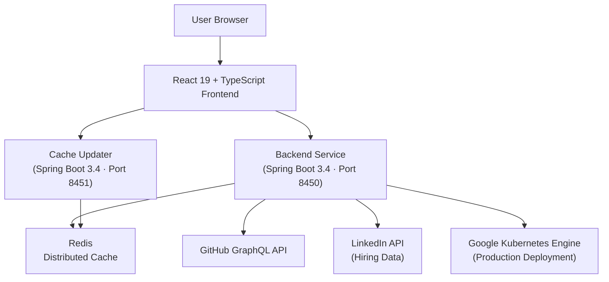
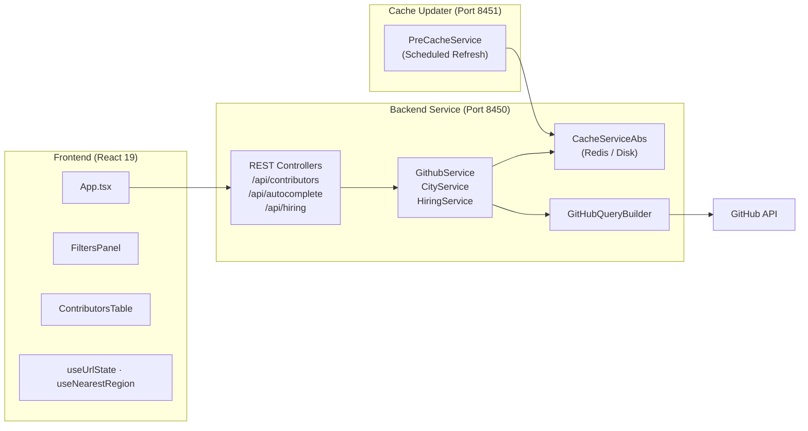

# Introduction to Major League GitHub

**Major League GitHub** (https://www.mlg.soccer) is an open-source, sports-styled leaderboard that ranks GitHub contributors like professional soccer players. Rather than simply listing developers by commit count, MLG gamifies open-source contribution by filtering and ranking developers based on programming language, geographic location, and proximity to MLS stadiums.

> **This is a standalone, independent open-source project.** It is not affiliated with any commercial platform.

---

## What Is Major League GitHub?

Imagine a sports leaderboard — but instead of athletes, it features software developers. Contributions are analyzed via the GitHub GraphQL API, scored using a weighted formula that rewards both volume and recency, and then mapped to soccer regions corresponding to real MLS teams. The result is a searchable, filterable, shareable developer leaderboard with a regional sports-team theme.

The live site is at **https://www.mlg.soccer**.

---

## Key Features

| Feature | Description |
|---------|-------------|
| **Language Filtering** | Filter the leaderboard by programming language (Java, TypeScript, Python, etc.) |
| **Geographic Filtering** | Narrow results by U.S. city, state, or geographic region |
| **MLS Stadium Proximity** | Rank contributors near professional soccer stadiums |
| **Weighted Scoring** | `Score = commits × max(stars, 1) × recencyMultiplier` rewards active, impactful contributors |
| **Shareable URLs** | All filter state is encoded in the URL for easy sharing and deep linking |
| **Hiring Section** | Surfaces hiring manager profiles and job openings alongside the leaderboard |
| **CSV Export** | Download the full contributor list as a spreadsheet |
| **Auto-detected Region** | Browser geolocation auto-selects the nearest soccer region on first load |

---

## Target Audience

- **Developers** who want to discover top open-source contributors in their city or region
- **Engineering managers and recruiters** looking to identify and hire talented developers
- **Open-source enthusiasts** curious about contribution rankings and trends by geography or language
- **Contributors** to this project who want to understand the architecture

---

## System Overview



The system has two Java microservices backed by Redis, served through a React frontend, and deployed on Kubernetes via GitHub Actions CI/CD.

---

## Architecture at a Glance



---

## Technology Stack

| Layer | Technology |
|-------|-----------|
| **Backend** | Java 21 + Spring Boot 3.4 |
| **HTTP Client** | Spring WebFlux (WebClient) |
| **Caching** | Redis (production) / Disk (local) |
| **Frontend** | React 19 + TypeScript |
| **UI Library** | Material-UI (MUI) |
| **Data Fetching** | React Query (@tanstack/react-query) |
| **Routing** | React Router |
| **Build Tool** | Webpack (with custom plugins) |
| **Deployment** | Docker + Google Kubernetes Engine |
| **CI/CD** | GitHub Actions |

---

## Contributor Scoring Formula

```text
Score = commits × max(starsReceived, 1) × recencyMultiplier

Where:
  commits          = total GitHub contributions
  starsReceived    = stars on repositories in the selected language
  recencyMultiplier ∈ [1.0, 2.0] based on how recent the activity is
```

This formula rewards developers who make frequent, high-impact commits and have stayed active recently.

---

## Repository

The project is hosted at:

https://github.com/flamingo-stack/major-league-github

- **Issues:** https://github.com/flamingo-stack/major-league-github/issues
- **Releases:** https://github.com/flamingo-stack/major-league-github/releases
- **Pull Requests:** https://github.com/flamingo-stack/major-league-github/pulls

---

## Getting Started

To set up and run Major League GitHub locally, continue with the following guides:

- [Prerequisites](prerequisites.md) — Required tools and accounts
- [Quick Start](quick-start.md) — Get up and running in minutes
- [First Steps](first-steps.md) — Explore the application after setup
