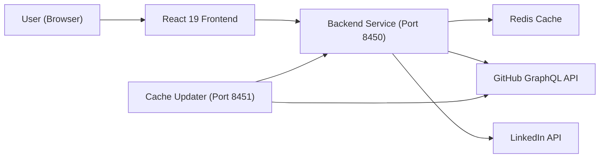

# Introduction to Major League GitHub

**Major League GitHub** ([mlg.soccer](https://www.mlg.soccer)) is an open-source, sports-themed leaderboard that ranks GitHub contributors like professional soccer players. Inspired by Major League Soccer (MLS), it filters contributors by programming language, geographic location, and proximity to real MLS stadiums — turning open-source contribution data into a competitive, engaging leaderboard experience.

> **This is an independent open-source side project.** It is not affiliated with any commercial platform.

---

## Elevator Pitch

GitHub has millions of contributors. Major League GitHub answers the question:

> *"Who are the top Java developers within 50 miles of a Chicago MLS stadium?"*

It pulls real-time data from GitHub's GraphQL API, applies a scoring formula based on commits and repository stars, and presents results in a clean, filterable leaderboard — all filtered by language, city, state, region, and nearest MLS team.

---

## Key Features

| Feature | Description |
|---------|-------------|
| **Language Filtering** | Filter contributors by any programming language (Java, TypeScript, Python, etc.) |
| **Geographic Filtering** | Filter by city, state, or multi-state region |
| **MLS Team Proximity** | Find contributors near any Major League Soccer stadium |
| **Contributor Scoring** | Rank by a formula: `commits × max(stars, 1) × recency multiplier` |
| **CSV Export** | Download ranked results as a CSV with social links |
| **Hiring Mode** | Hiring managers can publish open roles and appear in contributor profiles |
| **Distributed Cache** | Redis-backed caching protects GitHub API rate limits |
| **URL-Driven State** | Filters persist in the URL — shareable and bookmarkable |

---

## Who Is This For?

- **Developers** curious about where the best contributors in their city or language are
- **Hiring managers** looking to find top open-source contributors near their offices
- **Open-source enthusiasts** who want to explore contribution patterns by geography
- **Contributors** who want to see how they rank among their peers

---

## System Overview

Major League GitHub is a full-stack, microservice-based system:



### Technology Stack

**Backend** — Java 21 + Spring Boot 3.4
- Two microservices: Backend Service (port 8450) and Cache Updater (port 8451)
- GitHub GraphQL API integration with multi-token rate management
- Redis for distributed caching
- Apache Commons CSV for export
- Lombok for clean model definitions

**Frontend** — React 19 + TypeScript
- Material UI (MUI) component library
- TanStack React Query for server-state management
- React Router for URL-driven filter state
- Axios for HTTP communication
- Webpack 5 build system with custom SEO and favicon plugins

**Infrastructure** — Docker + Kubernetes (GKE)
- Google Kubernetes Engine deployment
- GitHub Actions CI/CD pipeline

---

## Contributor Ranking Algorithm

The scoring formula at the heart of the leaderboard is:

```text
score = commits × max(starsReceived, 1) × recencyMultiplier
```

- **Commits** — total commit count across repositories
- **starsReceived** — total stars across repositories (minimum of 1 to avoid zero scores)
- **recencyMultiplier** — ranges from 1.0 to 2.0, rewarding contributors active in the past year

---

## Repository

The source code is available at:

**[https://github.com/flamingo-stack/major-league-github](https://github.com/flamingo-stack/major-league-github)**

---

## Project Structure

```text
major-league-github/
├── backend/          # Java 21 + Spring Boot 3.4 backend
│   └── src/main/java/cx/flamingo/analysis/
│       ├── controller/   # REST API endpoints
│       ├── service/      # Business logic
│       ├── cache/        # Redis/Disk caching
│       ├── graphql/      # GitHub GraphQL query builder
│       ├── model/        # Domain models
│       ├── rate/         # GitHub token rate management
│       └── config/       # Spring Boot configuration
└── frontend/         # React 19 + TypeScript frontend
    └── src/
        ├── components/   # UI components
        ├── hooks/        # React hooks
        ├── services/     # API service layer
        └── types/        # TypeScript type contracts
```

---

## Live Site

The application runs live at **[https://www.mlg.soccer](https://www.mlg.soccer)**.
