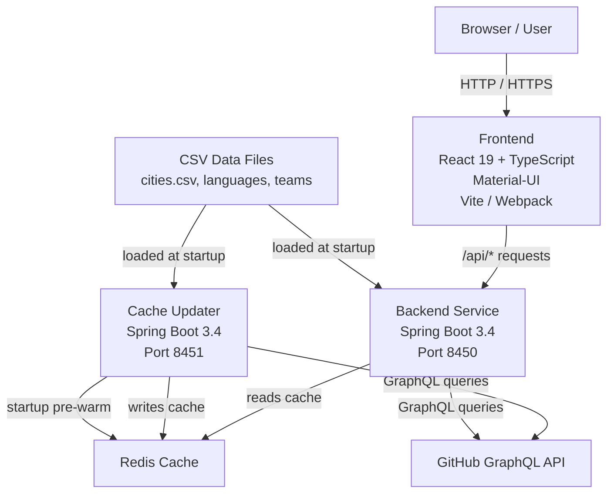

# Introduction to Major League GitHub

**Major League GitHub** ([mlg.soccer](https://www.mlg.soccer)) is a standalone, open-source leaderboard that ranks GitHub contributors like professional soccer players. It fuses the data-driven world of open-source development with the passion and aesthetics of Major League Soccer (MLS), surfacing top contributors filtered by programming language, geographic location, and proximity to MLS stadiums.

> **GitHub Repository:** [flamingo-stack/major-league-github](https://github.com/flamingo-stack/major-league-github)

---

## What Is Major League GitHub?

Imagine a sports leaderboard — but instead of goals and assists, you're ranking developers by commits, stars, and GitHub activity. Major League GitHub lets you answer questions like:

- *Who are the most active TypeScript developers near an MLS stadium?*
- *Which Java contributors are based in the Pacific region?*
- *What Python developers live closest to Atlanta United's home ground?*

Contributors are scored and ranked, their profiles enriched with GitHub statistics, and the whole experience is presented in a sports-styled interface.

---

## Key Features

| Feature | Description |
|---|---|
| **Language Filtering** | Filter contributors by any supported programming language (Java, TypeScript, Python, Rust, and more) |
| **Geographic Filtering** | Narrow results by city, US state, or MLS-defined region |
| **MLS Team Proximity** | Find developers located near any MLS stadium — ranked by closeness |
| **Geolocation Detection** | Auto-detects your nearest region via the browser's Geolocation API |
| **CSV Export** | Download the current leaderboard as a CSV file for offline analysis |
| **Hiring Section** | Collapsible footer panel displaying a hiring manager's profile and open roles |
| **Deep Linking** | All filter state lives in the URL — share any ranked view with a single link |
| **Responsive UI** | Mobile card layout and desktop table layout, automatically selected by screen size |
| **Distributed Cache** | Redis-backed caching keeps GitHub data fresh without hitting API rate limits on every request |

---

## Target Audience

Major League GitHub is built for:

- **Developers** curious to see how they rank among peers in their city or region
- **Hiring managers** who want to discover active contributors in specific languages and locations
- **Open-source enthusiasts** who enjoy sports-styled competitive leaderboards
- **Contributors** who want to self-host and extend the project for new regions or leagues

---

## Architecture Overview

The project is split into two Java microservices and a React frontend, all coordinated through a shared Redis cache.



### Core Components

| Component | Technology | Role |
|---|---|---|
| **Frontend** | React 19, TypeScript, Material-UI, Vite | Leaderboard UI with filter controls |
| **Backend Service** | Java 21, Spring Boot 3.4 (port `8450`) | Serves the REST API to the frontend |
| **Cache Updater** | Java 21, Spring Boot 3.4 (port `8451`) | Pre-warms and refreshes the Redis cache |
| **Redis** | Redis | Distributed cache shared between both services |
| **GitHub GraphQL API** | External | Source of contributor and repository data |

---

## How It Works

1. **Cache Updater** starts up and iterates all supported programming languages, querying the GitHub GraphQL API for contributors in each city/language combination and storing results in Redis.
2. **Backend Service** receives API requests from the frontend, reads from the Redis cache, and returns ranked contributor data as JSON.
3. **Frontend** reads filter state from URL query parameters, calls the Backend Service, and renders a responsive leaderboard table or card list.
4. Filters (language, city, region, state, MLS team) are all encoded in the URL, enabling full deep-link support.

---

## Technology Stack

```text
Backend:   Java 21 · Spring Boot 3.4 · Spring WebFlux · Gson · Redis (Lettuce) · Lombok
Frontend:  React 19 · TypeScript · Material-UI · React Query · Axios · Vite
Infra:     Redis · Docker · Kubernetes (GKE) · GitHub Actions CI/CD
```

---

## Getting Started

- Review **[Prerequisites](prerequisites.md)** to set up your environment
- Follow the **[Quick Start Guide](quick-start.md)** to run the project in minutes
- Explore **[First Steps](first-steps.md)** to understand how the leaderboard works
