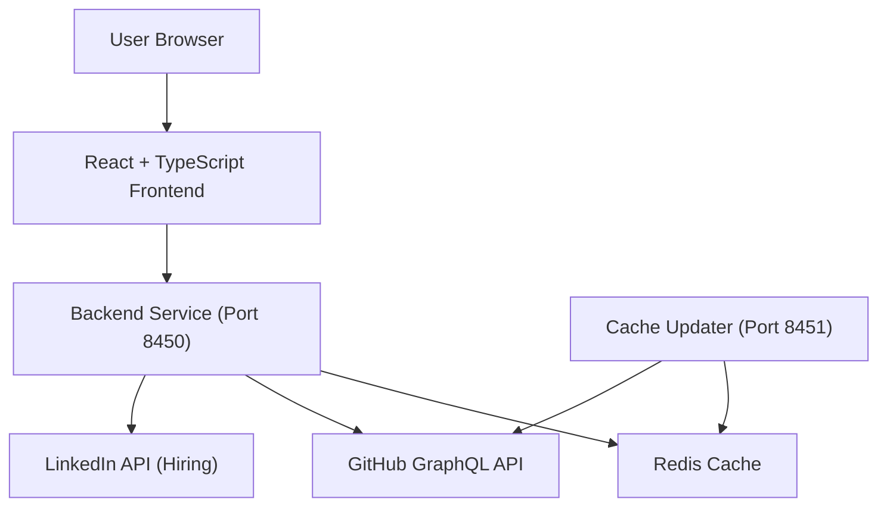

# Introduction to Major League GitHub

**Major League GitHub** ([mlg.soccer](https://www.mlg.soccer)) is an open-source, sports-themed leaderboard that ranks GitHub contributors like professional soccer players. It maps open-source developers across the United States using programming language preferences, geographic location, and proximity to MLS stadiums — combining GitHub analytics with geospatial modeling to create a uniquely gamified developer leaderboard.

> **Repository:** [https://github.com/flamingo-stack/major-league-github](https://github.com/flamingo-stack/major-league-github)

---

## What Is It?

Major League GitHub turns GitHub contributor statistics into a leaderboard experience inspired by Major League Soccer (MLS). Just as soccer rankings reward goals, assists, and appearances, MLG ranks developers using:

- **Commits** — total contributions made
- **Stars received** — community impact of their repositories
- **Recency multiplier** — how recently they have been active

The formula is intentionally transparent:

```text
Score = commits × max(starsReceived, 1) × recencyMultiplier
```

Where `recencyMultiplier` ranges from 1.0 to 2.0 based on activity within the past year.

---

## Key Features

| Feature | Description |
|---------|-------------|
| **Language Filtering** | Filter contributors by any programming language (Java, Python, TypeScript, etc.) |
| **Geographic Filtering** | Narrow results by city, state, or region |
| **MLS Stadium Proximity** | Rank contributors by their distance to the nearest MLS stadium |
| **Real-Time Leaderboard** | GitHub GraphQL data refreshed on a schedule via the Cache Updater service |
| **Shareable URLs** | All filters are reflected in the URL — bookmark or share any leaderboard view |
| **CSV Export** | Download any filtered leaderboard result as a CSV file |
| **Hiring Section** | Highlights top developers and associated job openings |
| **Responsive UI** | Works across desktop and mobile with Material-UI components |

---

## Target Audience

Major League GitHub is designed for:

- **Developers** who want to see how they rank among regional peers for a given language
- **Hiring managers** looking to discover talented open-source contributors near their offices
- **Open-source enthusiasts** who enjoy gamified community analytics
- **Engineers** interested in how to build a full-stack, production-grade application with Spring Boot, React, Redis, and Kubernetes

---

## System Overview



The system is split into two backend microservices:

- **Backend Service (port 8450)** — serves the public REST API consumed by the React frontend
- **Cache Updater (port 8451)** — runs scheduled jobs that keep GitHub contributor data fresh in Redis

Both services are built from the same Spring Boot codebase, activated via Maven profiles.

---

## Tech Stack at a Glance

| Layer | Technology |
|-------|-----------|
| Backend | Java 21 + Spring Boot 3.4 |
| Frontend | React 19 + TypeScript + Material-UI |
| Caching | Redis (distributed) |
| External Data | GitHub GraphQL API |
| Build | Webpack (custom plugins for SEO + favicon) |
| Deployment | Docker + Kubernetes (GKE) |
| CI/CD | GitHub Actions |

---

## How to Get Started

- **Install prerequisites** — see the [Prerequisites](prerequisites.md) guide
- **Run it in 5 minutes** — see the [Quick Start](quick-start.md) guide
- **First things to do** — see the [First Steps](first-steps.md) guide
