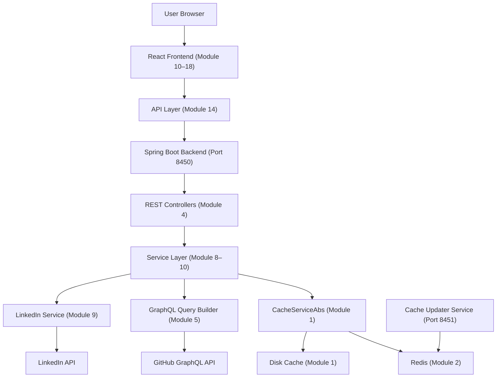
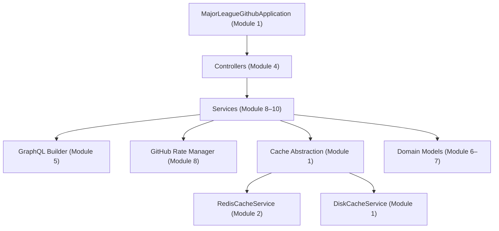
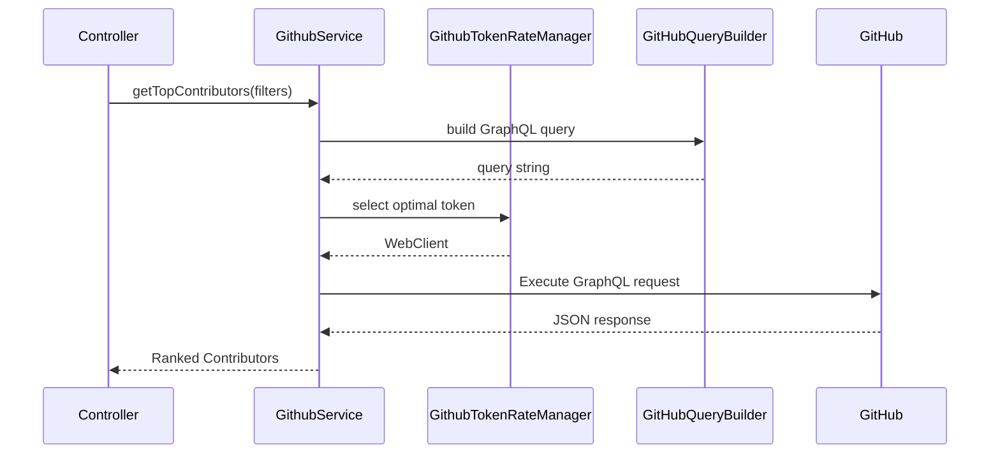
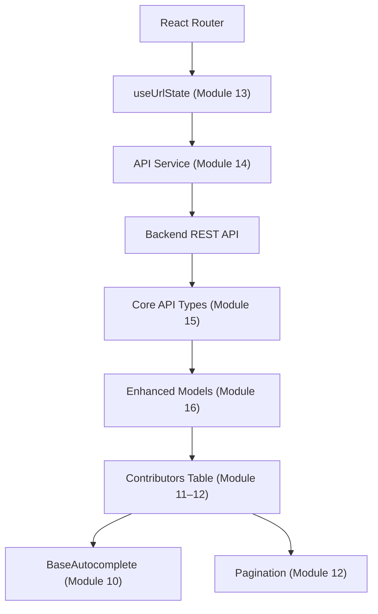
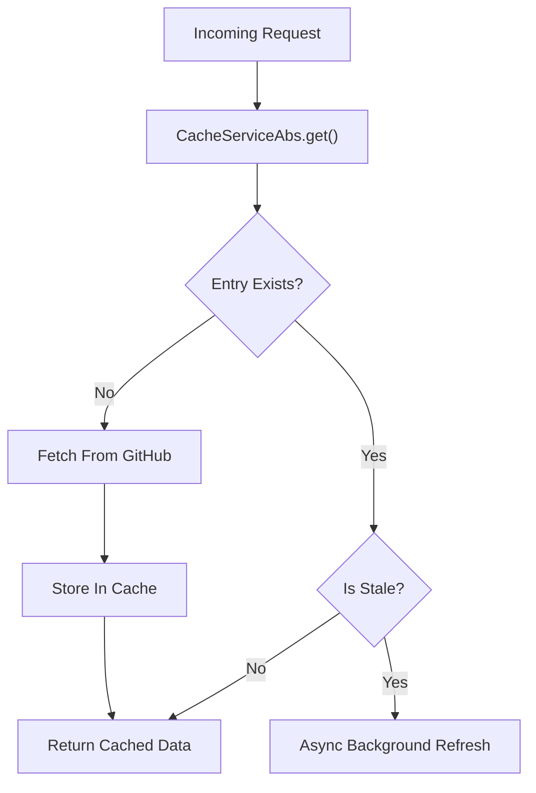
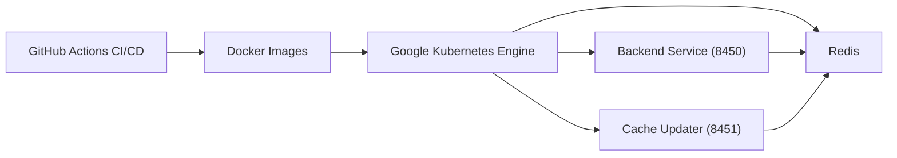

# Major League GitHub

**Repository:** https://github.com/flamingo-stack/major-league-github  

Major League GitHub (https://www.mlg.soccer) is an open-source, standalone sports-themed leaderboard that ranks GitHub contributors like professional soccer players. Contributors are filtered and ranked by:

- Programming language  
- Geographic location (city, state, region)  
- Proximity to MLS stadiums  

The system combines GitHub GraphQL analytics, geospatial modeling, Redis-backed caching, and a React frontend to create a real-time, location-aware developer leaderboard.

---

# Purpose of the Repository

The goal of `major-league-github` is to:

1. **Analyze GitHub contributors** via the GitHub GraphQL API.
2. **Rank contributors** using a weighted scoring formula (commits × stars × recency multiplier).
3. **Map contributors geographically** to cities, states, regions, and MLS teams.
4. **Gamify open-source activity** by treating contributors like athletes on a sports leaderboard.
5. **Expose hiring workflows** that highlight top developers and associated job openings.
6. **Deliver a full-stack, production-ready architecture** using Spring Boot, Redis, React, and Kubernetes.

---

# High-Level Architecture

Major League GitHub is a distributed full-stack application consisting of:

- **Backend Service (Port 8450)** – Public REST API  
- **Cache Updater Service (Port 8451)** – Scheduled refresh jobs  
- **Redis** – Distributed cache  
- **React + TypeScript Frontend** – UI layer  
- **GitHub GraphQL API** – External data source  
- **LinkedIn API** – Hiring/job data  
- **Docker + Kubernetes (GKE)** – Deployment  
- **GitHub Actions** – CI/CD  

---

## End-to-End System Architecture



---

# Backend Architecture

The backend is built using **Java 21 + Spring Boot 3.4** and organized into layered modules.

## Backend Layered Architecture



---

## GitHub Data Retrieval Flow



---

## Contributor Scoring Formula

```text
Score = commits × max(starsReceived, 1) × recencyMultiplier
```

Where:

- `commits` = total contributions
- `starsReceived` = stars on repositories in selected language
- `recencyMultiplier` ∈ [1.0, 2.0] based on activity freshness

This rewards:

- High commit volume  
- High-impact repositories  
- Recent contribution activity  

---

# Frontend Architecture

The frontend is built using:

- **React 19**
- **TypeScript**
- **Material-UI**
- **React Query**
- **Custom Webpack Plugins**

## Frontend Architecture Overview



---

# Caching & Performance Model

Major League GitHub aggressively caches data to:

- Minimize GitHub API rate pressure
- Reduce latency
- Enable scalable horizontal deployments

## Cache Flow



Supports:

- Disk cache (local/dev)
- Redis distributed cache (production)
- Read-only Redis mode
- Scheduled pre-warming (Module 9)

---

# Repository Structure Overview

The project is modularized into 18 logical modules:

## Backend Core

- **Module 1** – Application bootstrap + cache abstraction  
- **Module 2** – Redis + async configuration  
- **Module 3** – Infrastructure config (Redis, CORS, scheduling)  
- **Module 4** – REST controllers  
- **Module 5** – GitHub GraphQL builder  
- **Module 6–7** – Domain models  
- **Module 8** – GitHub service + rate limiting + scoring  
- **Module 9** – Hiring, language, pre-cache services  
- **Module 10** – Region, state, soccer team services  

## Frontend Core

- **Module 11–12** – Contributors table + UI contracts  
- **Module 13** – URL state + geolocation hooks  
- **Module 14** – API integration layer  
- **Module 15** – Core frontend types  
- **Module 16–17** – Enhanced + hiring types  
- **Module 18** – SEO Webpack plugin  

---

# Deployment Architecture



---

# Core Design Principles

- **Separation of concerns** – Controllers, services, caching, and models are isolated.
- **Strong typing end-to-end** – Java DTOs ↔ TypeScript interfaces.
- **Cache-first architecture** – Async refresh prevents latency spikes.
- **Multi-token GitHub rate management** – Resilient API usage.
- **Geospatial gamification** – Haversine distance for stadium proximity.
- **URL-driven state** – Fully shareable leaderboard filters.
- **Build-time optimization** – SEO and favicon plugins via Webpack.

---

# Summary

`major-league-github` is a full-stack, production-grade analytics platform that transforms GitHub contributor data into a sports-style leaderboard experience.

It combines:

- Advanced GitHub GraphQL query generation  
- Distributed caching and rate-limit management  
- Geospatial modeling and MLS-themed gamification  
- Strongly typed frontend architecture  
- Automated SEO and asset generation  
- Kubernetes-native deployment  

The result is a scalable, performant, and highly modular system that ranks open-source developers like professional athletes — filtered by language, geography, and stadium proximity.