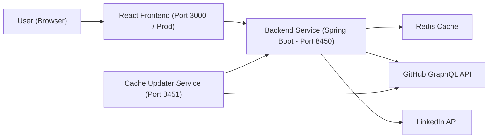
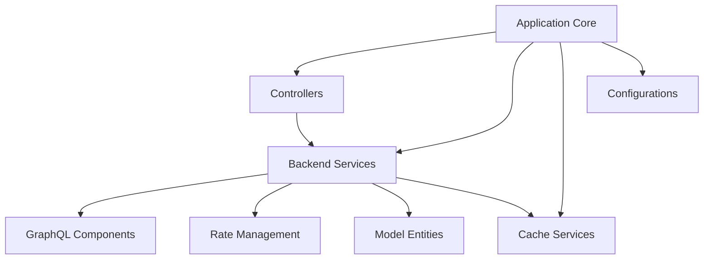
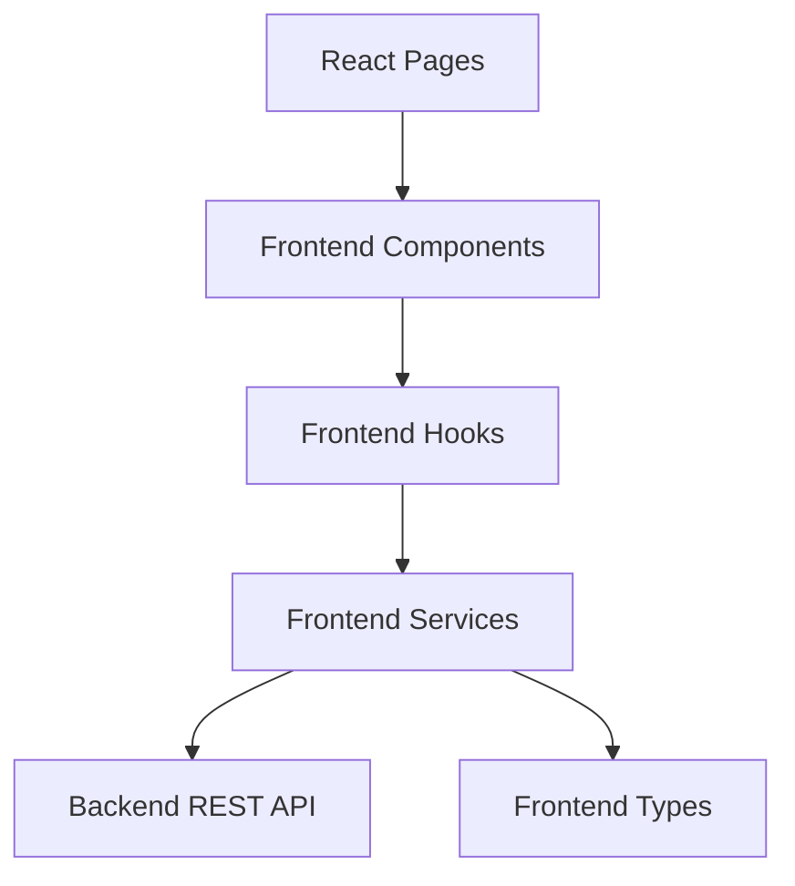
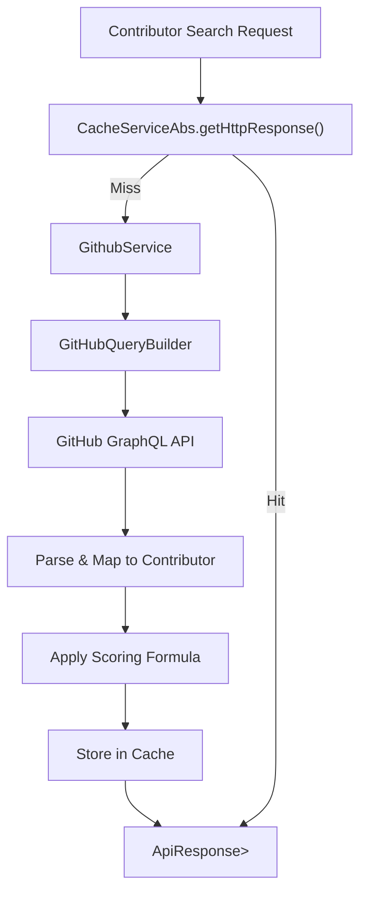
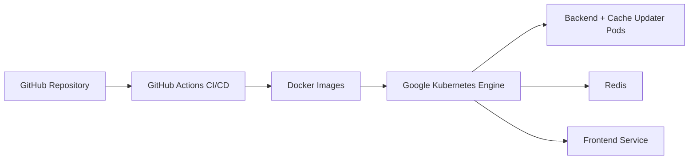

# Major League GitHub

**Repository:** https://github.com/flamingo-stack/major-league-github  
**Live Site:** https://www.mlg.soccer  

Major League GitHub is an independent, open-source side project that ranks GitHub contributors like professional soccer players. It combines GitHub GraphQL data, geographic modeling, and MLS stadium proximity to create a sports-style leaderboard filtered by:

- Programming language  
- City, state, and region  
- Nearest MLS team  
- Hiring status  

The platform consists of:

- A **Java 21 + Spring Boot 3.4 backend** (two microservices)
- A **React 19 + TypeScript frontend**
- **Redis** for distributed caching
- **Docker + Kubernetes (GKE)** for deployment
- **GitHub Actions CI/CD**

---

# 1. End-to-End Architecture

Major League GitHub is designed as a layered, modular, microservice-based system.



### High-Level Flow

1. User selects filters (language, city, region, team).
2. Frontend calls backend REST endpoints.
3. Backend:
   - Checks cache (Redis or disk).
   - Uses GitHub GraphQL API to fetch contributor data.
   - Applies scoring algorithm.
   - Returns ranked contributors.
4. Cache Updater service pre-warms and refreshes cache asynchronously.

---

# 2. Backend Architecture (Spring Boot)

The backend is modular and cleanly layered.



### Backend Microservices

| Service | Port | Responsibility |
|----------|------|----------------|
| Backend Service | 8450 | REST API, ranking logic |
| Cache Updater | 8451 | Scheduled cache warming |

---

# 3. Frontend Architecture (React + TypeScript)

The frontend is fully typed and layered.



### Frontend Stack

- React 19
- TypeScript
- Material UI
- React Query
- Custom Webpack plugins (SEO + favicon)

---

# 4. Repository Structure

## Backend Modules

### 1. Application Core
**Path:** `backend/src/main/java/cx/flamingo/analysis`

Bootstraps Spring Boot, enables caching and async execution.

Documentation:
- `application-core/application-core.md`

---

### 2. Cache Services
**Path:** `backend/src/main/java/cx/flamingo/analysis/cache`

Pluggable caching abstraction with:

- `RedisCacheService`
- `DiskCacheService`
- `ReadOnlyCacheService`
- `CacheServiceAbs`

Documentation:
- `cache-services/cache-services.md`

---

### 3. Configurations
**Path:** `backend/src/main/java/cx/flamingo/analysis/config`

Centralizes:

- Async thread pools
- Cache selection strategy
- Redis configuration
- CORS setup
- Profile switching (backend-service vs cache-updater)

Documentation:
- `configurations/configurations.md`

---

### 4. Controllers
**Path:** `backend/src/main/java/cx/flamingo/analysis/controller`

REST endpoints:

- `/api/contributors`
- `/api/autocomplete`
- `/api/entities`
- `/api/hiring`

Documentation:
- `controllers/controllers.md`

---

### 5. Backend Services
**Path:** `backend/src/main/java/cx/flamingo/analysis/service`

Core business logic:

- `GithubService` (ranking + scoring)
- `CityService`
- `RegionService`
- `StateService`
- `SoccerTeamService`
- `LanguageService`
- `HiringService`
- `PreCacheService`

Documentation:
- `backend-services/backend-services.md`

---

### 6. GraphQL Components
**Path:** `backend/src/main/java/cx/flamingo/analysis/graphql`

Fluent GitHub query builder:

- `GitHubQueryBuilder`
- `Field`
- `QuerySerializer`

Documentation:
- `graphql-components/graphql-components.md`

---

### 7. Model Entities
**Path:** `backend/src/main/java/cx/flamingo/analysis/model`

Domain models:

- `Contributor`
- `City`
- `Region`
- `State`
- `SoccerTeam`
- `Language`
- `ApiResponse`
- Hiring models

Documentation:
- `model-entities/model-entities.md`

---

### 8. Rate Management
**Path:** `backend/src/main/java/cx/flamingo/analysis/rate`

GitHub token orchestration:

- Multi-token pooling
- Primary + secondary rate limit handling
- Intelligent wait and retry logic

Documentation:
- `rate-management/rate-management.md`

---

## Frontend Modules

### 1. Frontend Components
**Path:** `frontend/src/components`

- `BaseAutocomplete`
- `LanguageAutocomplete`
- `ContributorsTable`
- `Pagination`

Documentation:
- `frontend-components/frontend-components.md`

---

### 2. Frontend Hooks
**Path:** `frontend/src/hooks`

- `useNearestRegion` (Haversine proximity)
- `useUrlState` (validated URL-driven filtering)

Documentation:
- `frontend-hooks/frontend-hooks.md`

---

### 3. Frontend Services
**Path:** `frontend/src/services`

Centralized Axios-based API layer.

Documentation:
- `frontend-services/frontend-services.md`

---

### 4. Frontend Types
**Path:** `frontend/src/types`

Type contracts mirroring backend domain models.

Documentation:
- `frontend-types/frontend-types.md`

---

### 5. Webpack Plugins
**Path:** `frontend/webpack-plugins`

Custom build-time plugins:

- `FaviconGeneratorPlugin`
- `SeoFilesPlugin`

Documentation:
- `webpack-plugins/webpack-plugins.md`

---

# 5. Core Contributor Ranking Flow

The heart of the system is the GitHub ranking engine.



### Scoring Formula

```text
score = commits × max(starsReceived, 1) × recencyMultiplier
```

Recency multiplier rewards contributors active within the past year.

---

# 6. Deployment Model



- Containerized services
- Horizontally scalable API nodes
- Independent scaling of cache updater
- Redis as shared distributed cache

---

# 7. Design Principles

- **Modular Backend Architecture**
- **Strong Type Contracts (Backend + Frontend)**
- **Distributed Cache Abstraction**
- **Multi-Token GitHub Rate Management**
- **URL-Driven Frontend State**
- **Geographic + MLS-Based Segmentation**
- **Build-Time SEO Automation**

---

# Summary

Major League GitHub is a full-stack, microservice-based platform that transforms GitHub contribution data into a sports-themed leaderboard experience.

It combines:

- GitHub GraphQL data
- Intelligent rate-limit orchestration
- Distributed caching
- Geographic modeling
- MLS stadium proximity logic
- React-driven interactive filtering

The repository is structured into clearly separated backend and frontend modules, each documented independently, making it scalable, testable, and production-ready.