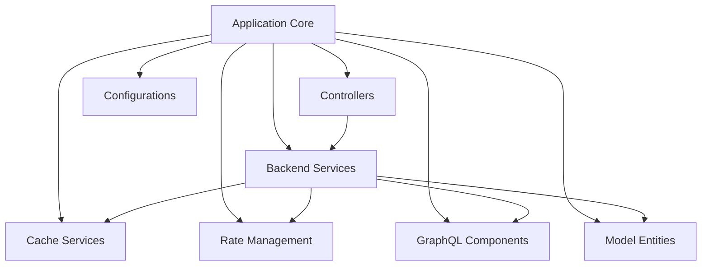
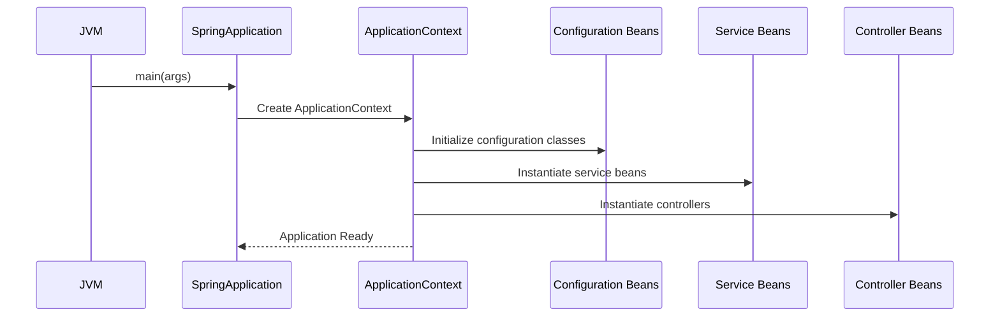
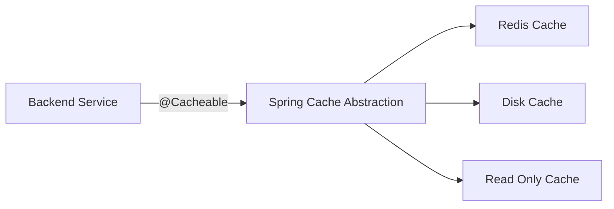
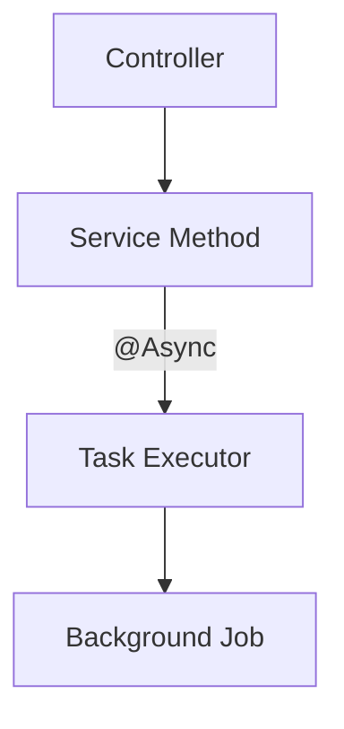
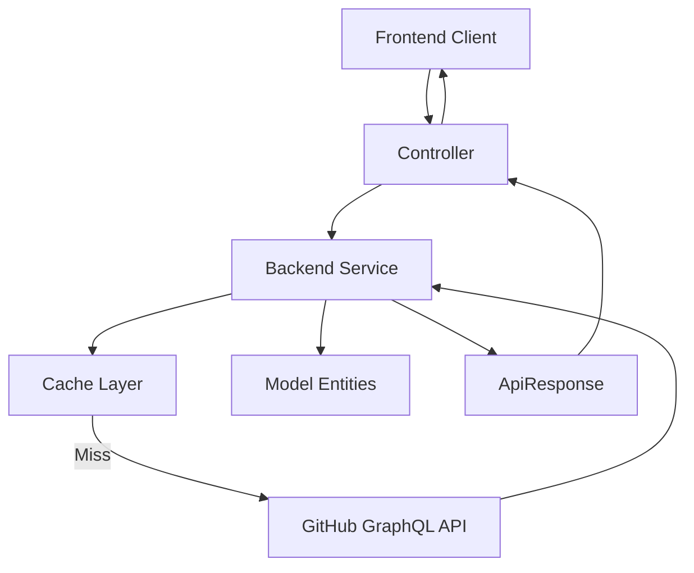
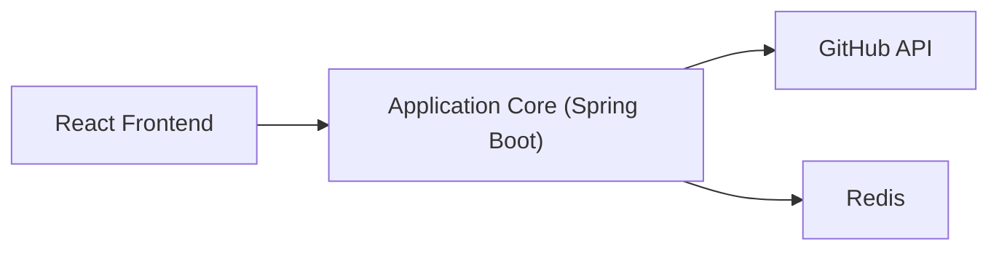

# Application Core

The **Application Core** module is the entry point and central bootstrap layer of the Major League GitHub backend system. It initializes the Spring Boot runtime, activates cross-cutting infrastructure features such as caching and asynchronous execution, and wires together all backend submodules including controllers, services, caching, rate management, and configuration components.

At the heart of this module is the `MajorLeagueGithubApplication` class, which defines the application boundary and enables foundational Spring capabilities used across the platform.

---

## 1. Purpose and Responsibilities

The Application Core module is responsible for:

- Bootstrapping the Spring Boot application context
- Enabling distributed caching across backend services
- Enabling asynchronous task execution
- Registering and scanning all submodules
- Acting as the composition root for the backend microservice

It does **not** contain business logic. Instead, it orchestrates and activates the functional modules listed below.

---

## 2. Core Component

### MajorLeagueGithubApplication

Located at:

```text
backend/src/main/java/cx/flamingo/analysis/MajorLeagueGithubApplication.java
```

Key annotations:

```java
@SpringBootApplication
@EnableCaching
@EnableAsync
public class MajorLeagueGithubApplication {
    public static void main(String[] args) {
        SpringApplication.run(MajorLeagueGithubApplication.class, args);
    }
}
```

### Annotation Breakdown

- `@SpringBootApplication`
  - Enables component scanning
  - Activates auto-configuration
  - Registers configuration classes

- `@EnableCaching`
  - Activates Spring’s cache abstraction
  - Integrates with implementations from the [Cache Services](cache-services/cache-services.md) module

- `@EnableAsync`
  - Enables `@Async` execution
  - Works with thread pool definitions in [Configurations](configurations/configurations.md)

---

## 3. High-Level Architecture

The Application Core sits at the center of the backend service and wires together all major modules.



---

## 4. Module Integration Map

The Application Core composes the following backend modules:

- [Cache Services](cache-services/cache-services.md)
- [Configurations](configurations/configurations.md)
- [Controllers](controllers/controllers.md)
- [GraphQL Components](graphql-components/graphql-components.md)
- [Model Entities](model-entities/model-entities.md)
- [Rate Management](rate-management/rate-management.md)
- [Backend Services](backend-services/backend-services.md)

It also interacts indirectly with frontend modules via REST APIs exposed by the Controllers layer:

- [Frontend Components](frontend-components/frontend-components.md)
- [Frontend Hooks](frontend-hooks/frontend-hooks.md)
- [Frontend Services](frontend-services/frontend-services.md)
- [Frontend Types](frontend-types/frontend-types.md)

---

## 5. Application Startup Flow

The startup lifecycle is managed by Spring Boot and follows this sequence:



---

## 6. Caching Enablement

Because `@EnableCaching` is declared at the Application Core level, all beans across the system can leverage Spring’s caching abstraction.



Concrete implementations are defined in the [Cache Services](cache-services/cache-services.md) module.

---

## 7. Asynchronous Execution Model

With `@EnableAsync`, services can execute long-running tasks without blocking request threads.



Thread pool configuration is provided by the [Configurations](configurations/configurations.md) module.

---

## 8. Backend Request Flow

A typical REST request flows through the system as follows:



Modules involved:

- Controller logic: [Controllers](controllers/controllers.md)
- Business logic: [Backend Services](backend-services/backend-services.md)
- Data modeling: [Model Entities](model-entities/model-entities.md)
- GitHub integration: [GraphQL Components](graphql-components/graphql-components.md)
- Rate limiting: [Rate Management](rate-management/rate-management.md)

---

## 9. Relationship to Cache Updater Service

The repository also includes a cache updater microservice. While deployed separately, both services share configuration and caching concepts defined under:

- [Cache Services](cache-services/cache-services.md)
- [Configurations](configurations/configurations.md)

The Application Core described here represents the **Backend Service runtime (port 8450)**.

---

## 10. Architectural Role in the System

In the broader Major League GitHub architecture:

- The Application Core initializes the backend microservice.
- Controllers expose REST endpoints.
- Services orchestrate GitHub data retrieval and enrichment.
- Caching and rate management protect API quotas.
- Frontend modules consume the exposed APIs.



---

## 11. Key Design Principles

- **Composition Root Pattern** – All infrastructure wiring begins here.
- **Separation of Concerns** – No business logic inside the bootstrap class.
- **Annotation-Driven Infrastructure** – Caching and async behavior are declarative.
- **Modular Backend Architecture** – Functional modules remain isolated and testable.

---

## Summary

The **Application Core** module is the foundational bootstrap layer of the Major League GitHub backend. While small in code footprint, it activates the entire application ecosystem:

- Spring Boot auto-configuration
- Distributed caching
- Asynchronous execution
- Dependency injection and module composition

All backend functionality ultimately depends on the initialization performed by this module.