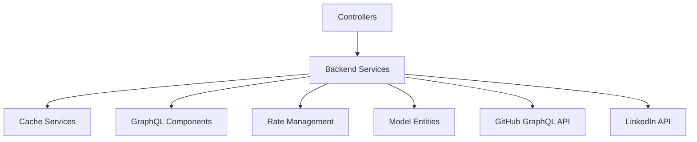
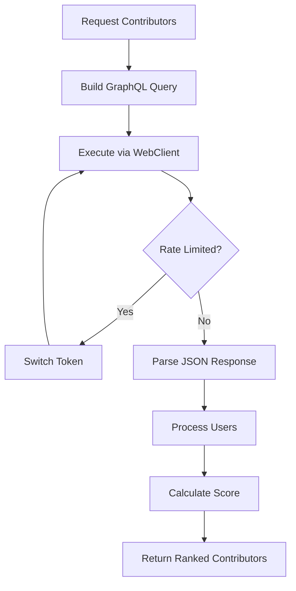
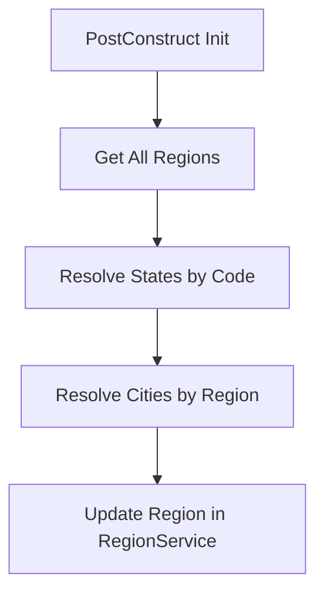
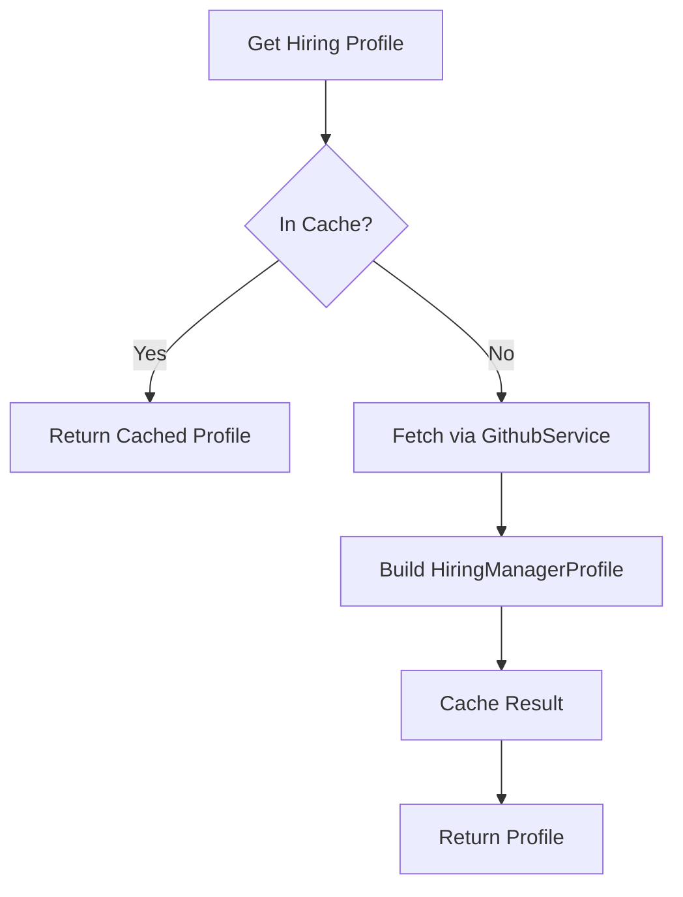
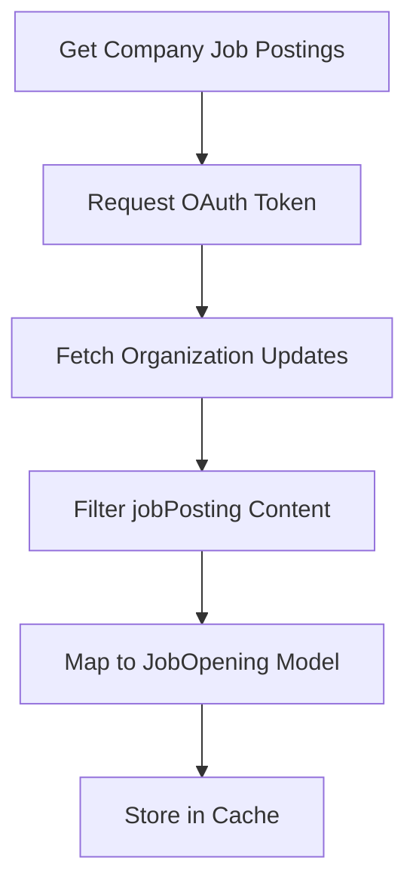
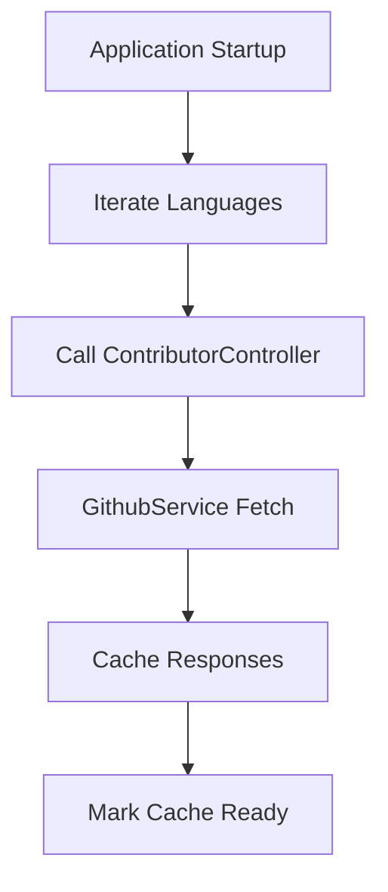
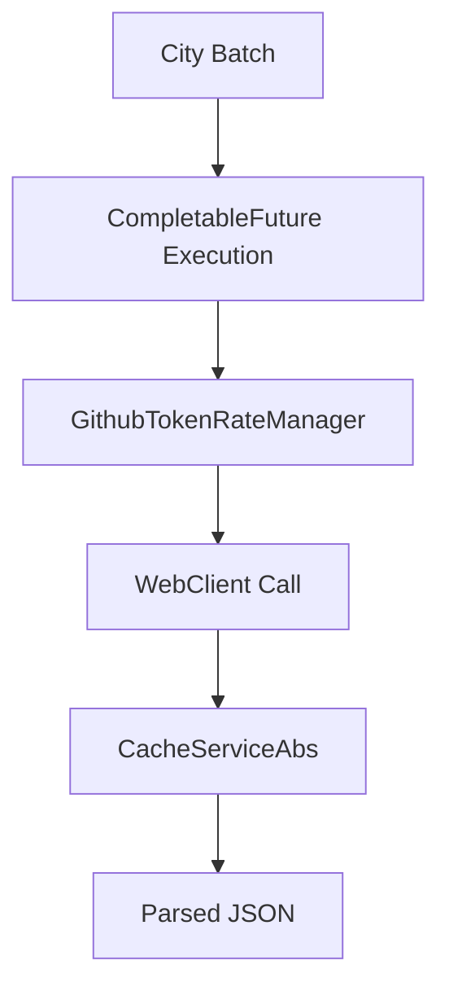
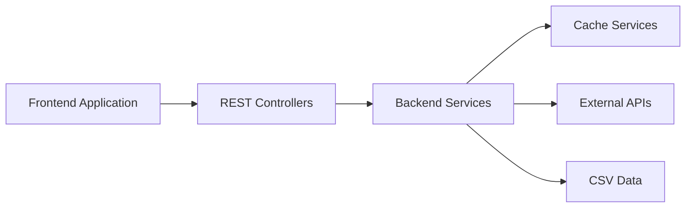

# Backend Services

## Overview

The **Backend Services** module contains the core business logic of Major League GitHub. It orchestrates data loading, GitHub and LinkedIn API integrations, caching, geographic modeling, scoring algorithms, and pre-computation workflows.

This module sits between the Controllers layer and foundational infrastructure such as:

- Cache Services
- GraphQL Components
- Rate Management
- Model Entities

It is responsible for transforming raw external API data and static datasets into structured domain models such as `Contributor`, `City`, `Region`, `State`, `SoccerTeam`, and `JobOpening`.

---

## Architectural Role

The Backend Services module acts as the domain orchestration layer.



### Responsibilities

- Domain aggregation (City, Region, State relationships)
- GitHub GraphQL query orchestration
- Rate limit handling and token switching
- Contributor scoring logic
- Hiring manager profile composition
- LinkedIn job integration
- Cache warm-up and pre-computation

---

# Service Components

## 1. GithubService

**Primary responsibility:** Retrieve, score, and aggregate GitHub contributor data.

### Key Capabilities

- Builds GraphQL queries using `GitHubQueryBuilder`
- Executes requests using `WebClient`
- Manages concurrency via separate executors
- Handles:
  - Rate limits
  - Timeouts
  - Token rotation
  - Retry strategies
- Deduplicates contributors across cities
- Calculates ranking score

### Scoring Formula

```text
score = commits × max(starsReceived, 1) × recencyMultiplier
```

Recency multiplier ranges from 1.0 to 2.0 depending on activity within the past year.

### Contributor Retrieval Flow



---

## 2. CityService

**Responsibility:** Load and manage city metadata.

- Loads `cities.csv` on startup
- Associates cities with:
  - States
  - Regions
  - Nearest Soccer Team
- Provides filtering by:
  - State
  - Region
  - Team

Cities are sorted by population when autocompleting.

---

## 3. StateService

**Responsibility:** Manage U.S. state metadata.

- Loads `states.csv`
- Calculates total population dynamically from cities
- Supports filtering by region and city

Uses lazy injection to avoid circular dependency with `CityService`.

---

## 4. RegionService

**Responsibility:** Geographic region modeling.

- Loads `regions.csv`
- Associates:
  - State IDs
  - Cities (resolved later)
- Sorts by total regional population

Works closely with `ReferencePopulationService`.

---

## 5. ReferencePopulationService

**Responsibility:** Populate bidirectional entity references after initialization.

This service ensures:

- Regions contain fully populated `State` objects
- Regions contain full `City` objects
- States reference regions

### Population Flow



---

## 6. SoccerTeamService

**Responsibility:** MLS team modeling and proximity calculations.

- Loads `teams.csv`
- Computes nearest team using Haversine distance
- Enables geographic-based filtering

Distance formula uses Earth radius = 6371 km.

---

## 7. LanguageService

**Responsibility:** Programming language metadata.

- Loads `languages.csv`
- Provides autocomplete
- Defines default language (Java)

Used heavily by `GithubService` and controllers.

---

## 8. HiringService

**Responsibility:** Hiring manager profile aggregation and job listings.

### Profile Flow



### Job Openings

- Retrieves jobs via `LinkedInService`
- Falls back to predefined remote roles if API fails
- Cached with configurable refresh interval

---

## 9. LinkedInService

**Responsibility:** LinkedIn job posting integration.

### Flow



Features:

- OAuth client credentials flow
- 10-second timeout protection
- Caching layer abstraction

---

## 10. PreCacheService

**Responsibility:** Warm up cache on application startup.

- Runs scheduled task immediately on startup
- Iterates through all languages
- Triggers contributor retrieval
- Marks cache as ready when finished

### Cache Warm-Up Flow



---

# Concurrency & Rate Management

`GithubService` uses:

- Configurable concurrency (`github.api.concurrency`)
- Two executors:
  - High priority
  - Low priority
- `GithubTokenRateManager` for token rotation



---

# Data Initialization Strategy

Most services load static CSV data during `@PostConstruct`:

- Cities
- States
- Regions
- Soccer Teams
- Languages

This ensures:

- No database dependency
- Predictable in-memory dataset
- Fast lookups

---

# How Backend Services Fit the System



Backend Services provide:

- Ranking engine
- Geographic intelligence
- Hiring integration
- Caching orchestration
- Rate-limit resilience

They form the computational heart of the application.

---

# Summary

The **Backend Services** module:

- Aggregates geographic and contributor data
- Communicates with GitHub and LinkedIn APIs
- Applies ranking and scoring algorithms
- Maintains cache consistency
- Warms data on startup
- Resolves complex entity relationships

It is the central domain engine powering contributor rankings and hiring visibility in Major League GitHub.