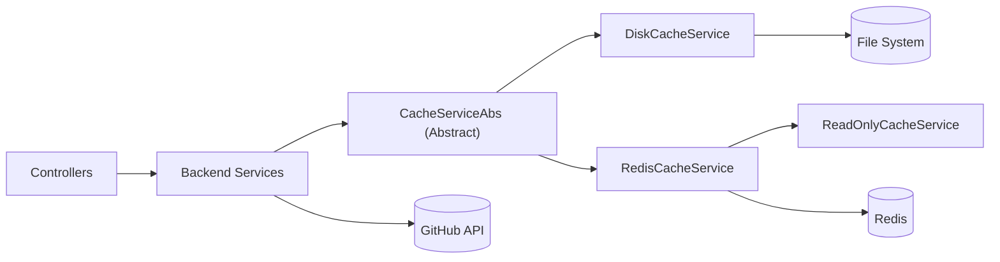
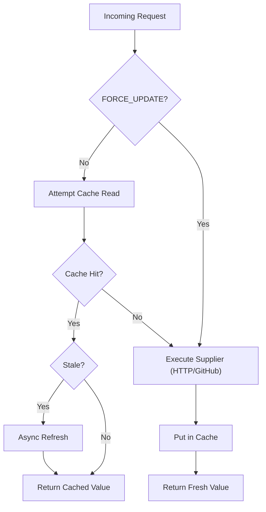
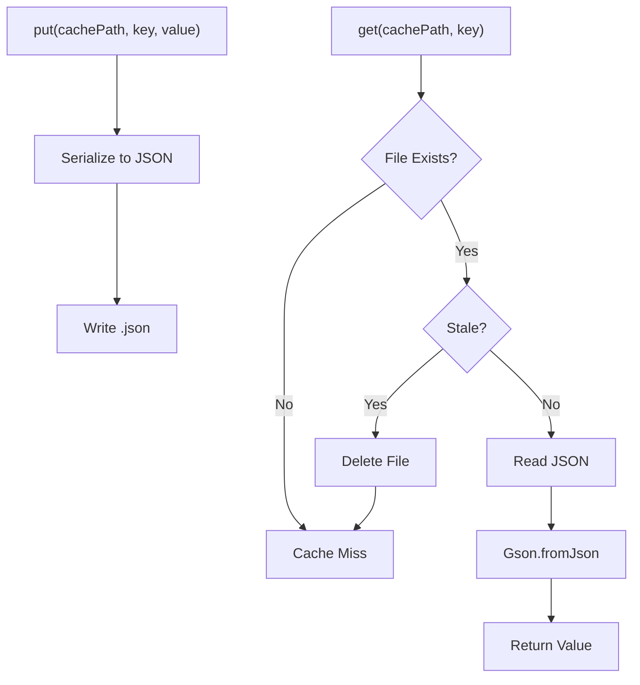
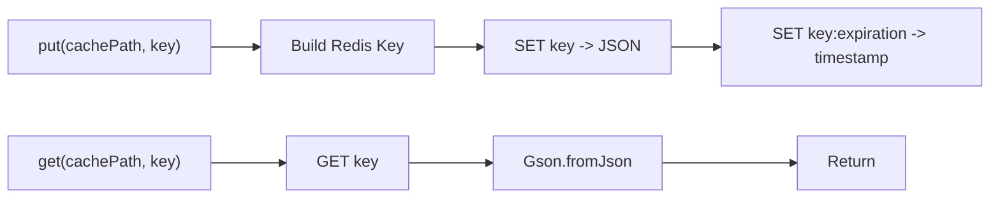
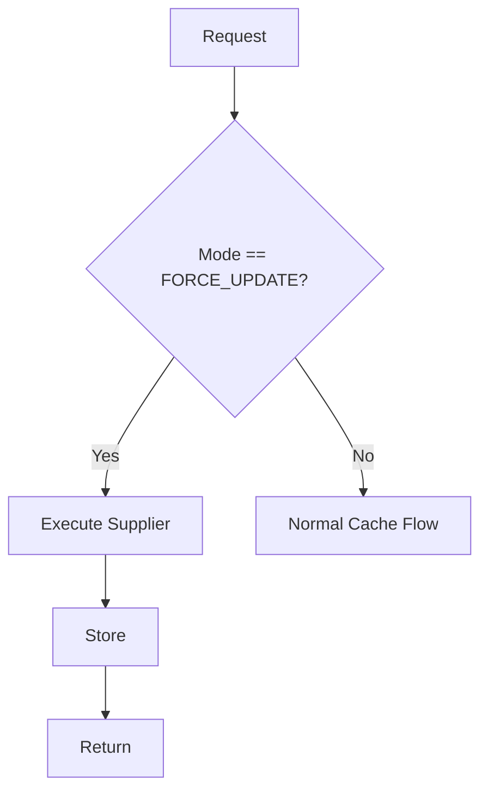

# Cache Services

The **Cache Services** module provides a pluggable, environment-aware caching abstraction for the Major League GitHub backend. It is responsible for:

- Reducing load on the GitHub GraphQL API
- Minimizing repeated HTTP computations for contributor queries
- Supporting multiple cache backends (Disk and Redis)
- Enabling read-only and force-update operational modes
- Managing cache freshness and asynchronous refresh

This module sits between the **Backend Services** layer and external systems (GitHub API, Redis, filesystem), acting as a performance and resilience layer.

---

## 1. Architectural Overview

At a high level, Cache Services defines a common abstraction (`CacheServiceAbs`) and multiple concrete implementations:

- `DiskCacheService` – File-based caching
- `RedisCacheService` – Distributed Redis-based caching
- `ReadOnlyCacheService` – Redis-backed, read-only variant



### Key Responsibilities

| Layer | Responsibility |
|-------|----------------|
| CacheServiceAbs | Core caching workflow, key generation, staleness logic |
| DiskCacheService | Persistent JSON file-based storage |
| RedisCacheService | Distributed cache using Redis |
| ReadOnlyCacheService | Safe read-only cache access (e.g., web profile) |

---

## 2. Core Abstraction: CacheServiceAbs

**Core Component:**  
`major-league-github.backend.src.main.java.cx.flamingo.analysis.cache.CacheServiceAbs.CacheServiceAbs`

This abstract class defines:

- Cache key generation
- Staleness detection
- Async refresh workflow
- GitHub API–specific caching
- HTTP response caching for contributor queries
- Cache readiness checks
- Cache mode switching (READ_WRITE vs FORCE_UPDATE)

### 2.1 Caching Workflow



### 2.2 Key Concepts

#### 1. Supplier-Based Execution
Cache retrieval methods accept a `Supplier<T>`:

- If cache hit → return cached value
- If cache miss → execute supplier
- Store result in cache
- Return fresh data

This pattern ensures backend services remain cache-agnostic.

#### 2. Staleness Detection
Each entry stores an insertion timestamp (backend-dependent).  
Staleness is determined by comparing:

- `System.currentTimeMillis()`
- Insert timestamp
- Configured refresh interval

If stale:
- Return current cached value
- Trigger asynchronous refresh

This enables **non-blocking refresh** behavior.

#### 3. Specialized Cache Methods

Two primary entry points:

- `getGitHubApiResponse(...)`
- `getHttpResponse(...)`

They differ in:

| Method | Cached Data | Key Composition |
|--------|------------|----------------|
| GitHub API | Raw `JsonObject` | City + Language + Page |
| HTTP Response | `List<Contributor>` | City + Region + State + Team + Language + MaxResults |

---

## 3. DiskCacheService

**Core Component:**  
`major-league-github.backend.src.main.java.cx.flamingo.analysis.cache.impl.DiskCacheService.DiskCacheService`

Provides filesystem-based caching using JSON files.

### 3.1 Storage Model

- Each cache entry → `<cachePath>/<key>.json`
- Insert time derived from file last-modified timestamp
- Directories auto-created at startup



### 3.2 Characteristics

✅ Simple and transparent  
✅ Good for local development  
✅ Persistent across restarts  
❌ Not distributed  
❌ Slower than Redis under load  

---

## 4. RedisCacheService

**Core Component:**  
`major-league-github.backend.src.main.java.cx.flamingo.analysis.cache.impl.RedisCacheService.RedisCacheService`

Provides distributed caching using Redis.

### 4.1 Key Structure

Keys are structured as:

```
<cachePath>:<key>
```

An additional expiration key is stored:

```
<cachePath>:<key>:expiration
```

The expiration key stores a serialized `Expiration` object containing:

- `timestamp`

### 4.2 Storage Workflow



### 4.3 Characteristics

✅ Distributed and scalable  
✅ Fast read/write  
✅ Suitable for production  
❌ Requires external Redis instance  

---

## 5. ReadOnlyCacheService

**Core Component:**  
`major-league-github.backend.src.main.java.cx.flamingo.analysis.cache.impl.ReadOnlyCacheService.ReadOnlyCacheService`

Extends `RedisCacheService` but disables all write operations.

### 5.1 Behavior Changes

| Operation | Behavior |
|-----------|----------|
| `put()` | Ignored |
| `invalidate()` | Ignored |
| `get()` | Returns value regardless of refresh interval |

### 5.2 Use Case

Designed for:

- Web profile deployments
- Read-only production replicas
- Environments where cache mutation is restricted

This ensures:

- No accidental writes
- No cache invalidation
- Safe consumption of pre-populated cache

---

## 6. Cache Modes

Cache mode is defined via `CacheConfig.CacheMode`.

Supported modes:

- `READ_WRITE` (default)
- `FORCE_UPDATE`

### FORCE_UPDATE Mode

If enabled:

- Cache is bypassed
- Supplier always executes
- Cache entry is replaced



This is useful for:

- Manual cache refresh
- Batch pre-caching jobs
- Operational recovery

---

## 7. Cache Readiness Flag

Cache Services supports a readiness mechanism:

- Path: `cache_is_ready`
- Key: `cache_is_ready`

If `cache.should.be.ready=true`:

- Application checks readiness before serving traffic
- Useful for pre-warmed production environments

---

## 8. Interaction with Other Modules

### Backend Services

Backend Services use Cache Services indirectly via supplier-based calls:

- `GithubService` → uses GitHub API cache
- Contributor queries → use HTTP response cache

Cache Services ensures that business logic remains clean and does not directly depend on Redis or filesystem logic.

### Configurations

Configuration values influence behavior:

- `github.cache.refresh.interval`
- `http.cache.refresh.interval`
- `cache.expiration.ms`
- `github.cache.path`
- `http.cache.path`

These are injected via Spring `@Value` properties.

---

## 9. Design Principles

### 1. Backend-Agnostic Abstraction
All cache consumers depend only on `CacheServiceAbs`.

### 2. Non-Blocking Refresh
Stale entries are refreshed asynchronously while serving existing data.

### 3. Environment Flexibility

| Environment | Implementation |
|------------|---------------|
| Local Development | DiskCacheService |
| Production | RedisCacheService |
| Web Profile (Read-Only) | ReadOnlyCacheService |

### 4. Graceful Degradation

If:
- Deserialization fails
- File is corrupted
- Redis entry malformed

The system:
- Invalidates entry
- Falls back to supplier

---

## 10. Summary

The **Cache Services** module is a foundational performance layer in the backend architecture. It:

- Abstracts cache storage behind a unified interface
- Supports both local and distributed backends
- Enables asynchronous refresh for stale entries
- Provides operational modes for force update and read-only execution
- Maintains clean separation between business logic and infrastructure concerns

It plays a critical role in ensuring the scalability and responsiveness of Major League GitHub, especially under heavy GitHub API usage and complex contributor filtering queries.
