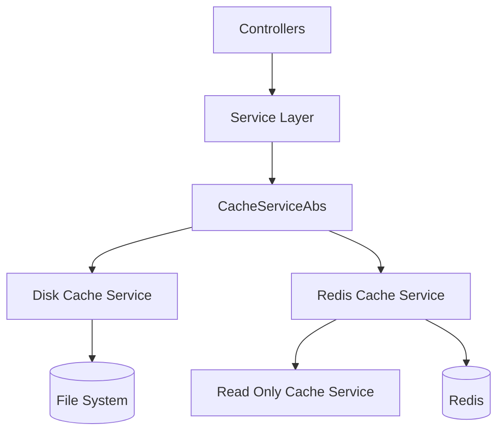
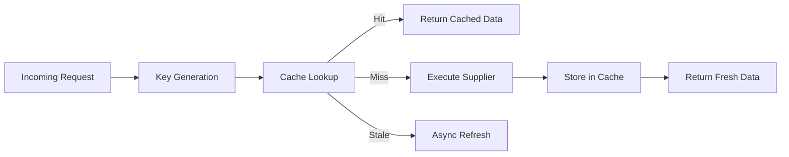
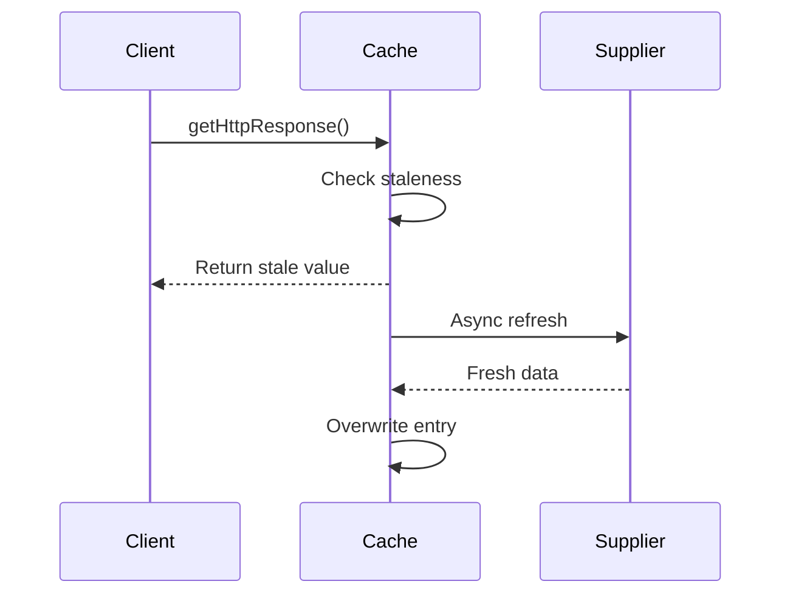

# Cache Services

The **Cache Services** module provides a unified, extensible caching abstraction for the Major League GitHub backend. It centralizes cache key generation, staleness detection, refresh strategies, and storage implementations (Disk, Redis, and Read-Only Redis).

This module plays a critical role in:

- Reducing GitHub API calls
- Improving HTTP response times
- Supporting pre-warmed production caches
- Enabling environment-specific cache modes (read-write, force update, read-only)

Cache Services is primarily consumed by the Service Layer (e.g., `GithubService`, `PreCacheService`) and indirectly supports Controllers and frontend requests.

---

## Architectural Overview



### Design Principles

1. **Abstraction First** – `CacheServiceAbs` defines the contract and refresh semantics.
2. **Storage Agnostic** – Implementations can store data in disk or Redis.
3. **Asynchronous Refresh** – Stale entries are refreshed in the background.
4. **Environment-Aware** – Read-only mode prevents accidental cache mutation.
5. **Key Normalization** – Deterministic composite keys ensure consistent cache hits.

---

## Core Abstraction: CacheServiceAbs

The backbone of the module is:

- `CacheServiceAbs`
- `CachedResponse`

This abstract class defines:

- Cache read/write contract
- Staleness detection
- Cache key generation
- GitHub-specific caching strategy
- HTTP query result caching
- Async refresh handling
- Cache readiness state
- Cache mode (READ_WRITE, FORCE_UPDATE)

### High-Level Responsibilities



### Key Features

#### 1. Deterministic Cache Key Generation

Composite keys are built from filtering dimensions:

- City
- Region
- State
- Team
- Language
- Page number or max results

Each implementation defines its own delimiter:

- Disk: `/`
- Redis: `:`

#### 2. Staleness Detection

Cache entries are evaluated against configurable intervals:

- `github.cache.refresh.interval`
- `http.cache.refresh.interval`
- `cache.expiration.ms`

If stale:

- Cached value is returned immediately
- Refresh is executed asynchronously
- New value replaces old entry only after successful retrieval

This ensures zero-downtime cache refresh.

#### 3. Async Refresh



#### 4. Cache Readiness Flag

The cache readiness mechanism allows environments to:

- Delay traffic until cache warm-up completes
- Ensure pre-cached Redis data is available

A special key path is used internally to track readiness.

#### 5. Cache Modes

- **READ_WRITE** – Default behavior
- **FORCE_UPDATE** – Always bypass cache

Mode is controlled via `CacheConfig.CacheMode`.

---

## Storage Implementations

The module includes three concrete implementations:

### 1. Disk Cache Service

Documentation: [Disk Cache Service](cache-services/disk_cache_service/disk_cache_service.md)

- Stores cache entries as JSON files
- Uses file modification timestamp for staleness
- Deletes corrupted or stale files
- Ideal for local development

### 2. Redis Cache Service

Documentation: [Redis Cache Service](cache-services/redis_cache_service/redis_cache_service.md)

- Stores serialized JSON values in Redis
- Uses a separate expiration metadata key
- Suitable for distributed deployments
- Enables Kubernetes scaling

### 3. Read Only Cache Service

Documentation: [Read Only Cache Service](cache-services/read_only_cache_service/read_only_cache_service.md)

- Extends Redis Cache Service
- Disables writes and invalidation
- Always returns cached values if present
- Used for production web profile with pre-warmed cache

---

## Integration with Other Modules

### Service Layer

Cache Services is primarily consumed by:

- `GithubService`
- `PreCacheService`
- `LanguageService`
- `RegionService`

These services pass supplier functions that:

- Call GitHub GraphQL
- Aggregate contributor results
- Transform API responses

### Rate Management

Caching significantly reduces pressure on:

- `GithubTokenRateManager`

This ensures:

- Lower GitHub rate consumption
- Fewer token rotations
- More predictable API behavior

### Controllers

Controllers indirectly benefit via:

- `ContributorController`
- `AutocompleteController`

Since they rely on cached service results.

---

## Cache Key Strategy

### HTTP Query Cache Key Structure

```text
cityId/regionId/stateId/teamId/languageId/maxResults
```

### GitHub API Cache Key Structure

```text
/delimiter/cityId/language/page_X
```

The delimiter differs by implementation.

This design guarantees:

- Stable key generation
- Environment portability
- Cross-instance consistency

---

## Environment Profiles

| Environment | Implementation | Purpose |
|-------------|---------------|----------|
| Local Dev   | Disk Cache    | Easy inspection |
| Kubernetes  | Redis Cache   | Distributed caching |
| Web Profile | Read Only Redis | Pre-warmed production cache |

---

## Failure Handling Strategy

Cache Services is defensive by design:

- Corrupted entries are deleted
- Deserialization failures invalidate entries
- Missing insert times default to stale
- Supplier exceptions do not crash request flow

If cache lookup fails, the system gracefully falls back to supplier execution.

---

## Extension Points

To add a new cache implementation:

1. Extend `CacheServiceAbs`
2. Implement:
   - `get()`
   - `put()`
   - `invalidate()`
   - `getInsertTime()`
   - `getHttpCachePath()`
   - `getGithubCachePath()`
3. Register as a Spring `@Service`

This enables alternative storage backends such as:

- In-memory caches
- Cloud storage buckets
- Hybrid layered caches

---

## Summary

The **Cache Services** module is a foundational backend component that:

- Shields the system from excessive GitHub API calls
- Provides consistent cache semantics across storage types
- Supports async refresh and stale-while-revalidate patterns
- Enables production-grade distributed caching with Redis
- Allows read-only deployment models

It acts as a performance accelerator, rate-limit shield, and reliability enhancer for the entire Major League GitHub platform.
