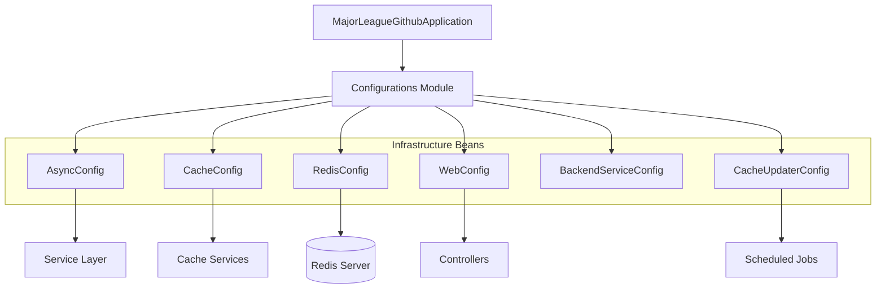
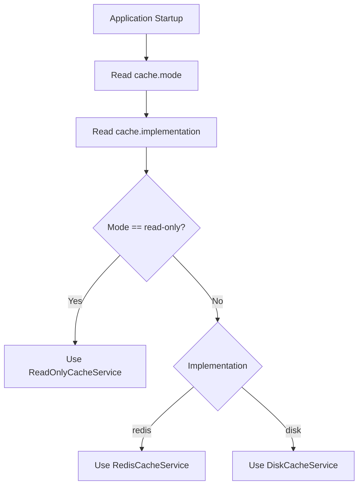
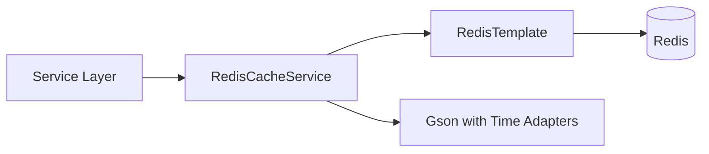
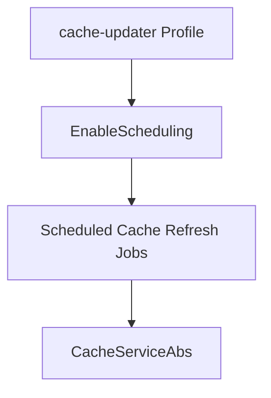

# Configurations

The **Configurations** module centralizes all Spring Boot configuration for the Major League GitHub backend. It defines infrastructure beans, environment profiles, caching strategy selection, Redis connectivity, JSON serialization behavior, asynchronous execution, scheduling, and CORS rules.

This module acts as the foundational wiring layer between:

- The Core Application bootstrap
- The Service Layer
- The Cache Services
- The Controllers
- The Cache Updater microservice

Rather than containing business logic, the Configurations module defines how components are instantiated, connected, and tuned for different runtime environments.

---

## Architectural Overview

The Configurations module provides Spring beans that are consumed across the backend microservices.



### Responsibilities

The module is responsible for:

- Selecting and configuring cache implementations
- Managing Redis connectivity and serialization
- Defining asynchronous thread pools for GitHub API concurrency
- Enabling profile-specific configuration for backend and cache-updater services
- Configuring CORS rules for frontend integration
- Providing JSON adapters for time-based objects

---

## Configuration Classes

The Configurations module consists of the following components:

| Class | Responsibility |
|--------|----------------|
| AsyncConfig | Thread pools for concurrent GitHub API calls |
| CacheConfig | Cache mode and implementation selection |
| CacheUpdaterConfig | Scheduling and profile config for cache updater service |
| BackendServiceConfig | Backend-specific profile configuration |
| RedisConfig | Redis connection, template, and Gson configuration |
| WebConfig | CORS and web layer configuration |
| LocalDateTimeAdapter | Gson adapter for LocalDateTime |
| InstantTypeAdapter | Gson adapter for Instant |

---

# Async Configuration

## AsyncConfig

The AsyncConfig class defines two thread pools used for GitHub contributor data processing.

### Thread Pools

Two executors are defined:

- contributorsAsyncExecutorLow
- contributorsAsyncExecutorHigh

Both are instances of ThreadPoolTaskExecutor and are exposed as ThreadPoolExecutor beans.

### Key Properties

| Property | Value Source |
|-----------|-------------|
| Core pool size | github.api.concurrency property (default 10) |
| Max pool size | 100 |
| Queue capacity | 1000 |
| Await termination | 60 seconds |

The concurrency level is externally configurable using the property:

```text
github.api.concurrency=10
```

### Graceful Shutdown

The class implements a @PreDestroy lifecycle hook to:

- Shut down executors gracefully
- Wait up to 10 seconds for termination
- Force shutdown if necessary
- Preserve interruption status

This ensures safe shutdown during Kubernetes pod termination or service restarts.

---

# Cache Configuration

## CacheConfig

The CacheConfig class dynamically selects the active cache implementation and cache mode at runtime.

### Cache Modes

```text
read-only
read-write
force-update
```

| Mode | Behavior |
|------|----------|
| read-only | No writes allowed; serves existing cache only |
| read-write | Normal cache behavior |
| force-update | Forces refresh behavior (used by updater) |

### Cache Implementations

```text
redis
disk
```

### Runtime Selection Logic



The selected implementation is exposed as the primary CacheServiceAbs bean and injected throughout the Service Layer.

This design allows:

- Local development with disk cache
- Production deployment with Redis
- Safe read-only mode during maintenance
- Forced refresh behavior for cache-updater jobs

---

# Redis Configuration

## RedisConfig

The RedisConfig class defines Redis connectivity and JSON serialization.

### Connection Factory

Uses:

- RedisStandaloneConfiguration
- LettuceConnectionFactory

Configured via properties:

```text
spring.redis.host=localhost
spring.redis.port=6379
```

### RedisTemplate

Configured with:

- StringRedisSerializer for keys
- StringRedisSerializer for values
- Transaction support enabled

The template is used by RedisCacheService for storing serialized JSON objects.

### Gson Configuration

A custom Gson bean is defined with:

- LocalDateTimeAdapter
- InstantTypeAdapter

This ensures consistent serialization of time-based values stored in Redis.



---

# JSON Time Adapters

## LocalDateTimeAdapter

Implements:

- JsonSerializer<LocalDateTime>
- JsonDeserializer<LocalDateTime>

Uses ISO_LOCAL_DATE_TIME format.

Ensures LocalDateTime values are consistently serialized and parsed.

## InstantTypeAdapter

Custom Gson TypeAdapter for Instant.

- Writes Instant as ISO-8601 string
- Parses string back into Instant
- Handles null values safely

These adapters prevent timezone inconsistencies and serialization failures when caching or returning API responses.

---

# Web Configuration

## WebConfig

Implements WebMvcConfigurer to configure CORS rules.

### Allowed Origins

Development:

- http://localhost:8450
- http://localhost:3000

Production:

- https://www.mlg.soccer
- http://www.mlg.soccer

### Allowed Methods

- GET
- POST
- PUT
- DELETE
- OPTIONS

### Additional Settings

- Allow credentials: true
- Exposed headers: Access-Control-Allow-Origin
- Max age: 3600 seconds

This configuration allows the React frontend to safely interact with the backend API in both development and production environments.

---

# Profile-Based Configuration

## BackendServiceConfig

Activated under the profile:

```text
backend-service
```

Enables:

- Spring MVC
- Backend-specific configuration extensions

This profile is used when running the main API service.

---

## CacheUpdaterConfig

Activated under the profile:

```text
cache-updater
```

Enables:

- Scheduling support via @EnableScheduling

This configuration powers the cache updater microservice, which periodically refreshes GitHub data.



---

# Integration with Other Modules

The Configurations module integrates closely with:

- Core Application for application bootstrap
- Cache Services for implementation selection
- Service Layer for async execution and caching
- Controllers for CORS and web configuration
- Rate Management for concurrency tuning

It ensures both backend-service and cache-updater microservices can share infrastructure while enabling profile-specific behavior.

---

# Deployment Considerations

## Environment Variables and Properties

Key configurable properties include:

```text
github.api.concurrency=10
cache.implementation=redis
cache.mode=read-write
spring.redis.host=localhost
spring.redis.port=6379
spring.profiles.active=backend-service
```

Proper tuning of these values is critical for:

- Managing GitHub API rate limits
- Optimizing Redis performance
- Preventing thread exhaustion
- Supporting horizontal scaling in Kubernetes

---

# Design Principles

The Configurations module follows these principles:

1. Separation of infrastructure from business logic
2. Environment-driven behavior via profiles
3. Externalized configuration via properties
4. Pluggable cache implementations
5. Safe concurrency and graceful shutdown

By centralizing infrastructure configuration, the backend remains modular, flexible, and production-ready for both API serving and background cache update workloads.
