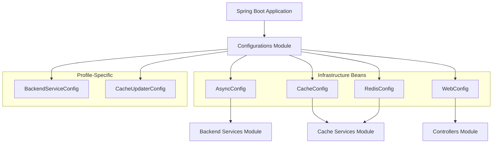
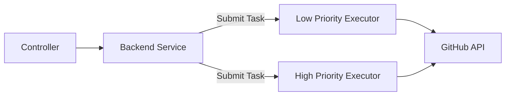
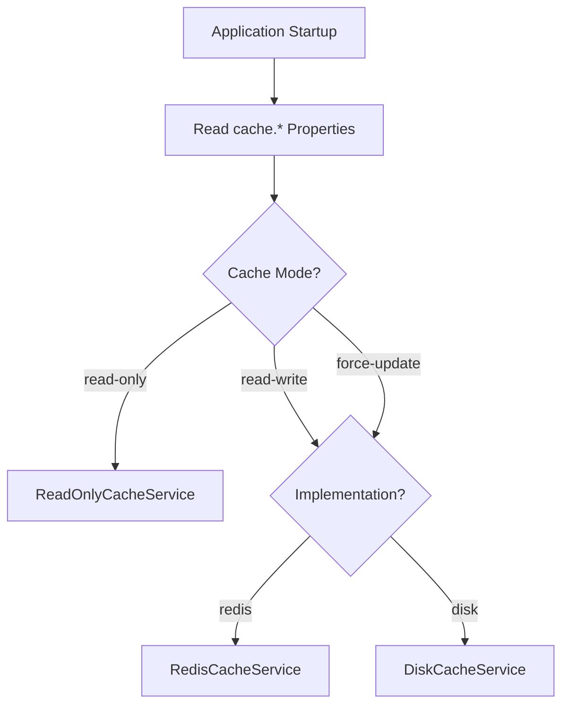
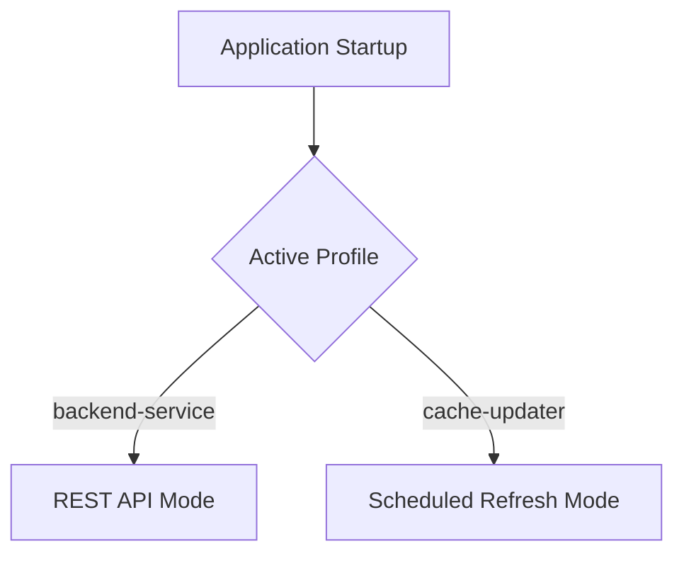

# Configurations

The **Configurations** module centralizes all Spring Boot configuration for the Major League GitHub backend. It defines infrastructure beans, environment profiles, cache selection strategies, asynchronous execution pools, Redis integration, JSON serialization behavior, and web-level cross-origin policies.

This module acts as the wiring layer between:

- [Application Core](../application-core/application-core.md)
- [Cache Services](../cache-services/cache-services.md)
- [Backend Services](../backend-services/backend-services.md)
- [Controllers](../controllers/controllers.md)
- [Rate Management](../rate-management/rate-management.md)

Rather than implementing business logic, the Configurations module ensures that all other modules are correctly initialized, connected, and parameterized based on environment and runtime properties.

---

## Architectural Overview

The Configurations module:

- Defines bean lifecycles
- Selects cache implementation dynamically
- Provides thread pools for concurrent GitHub API calls
- Enables scheduling for the cache updater service
- Configures Redis connectivity and JSON serialization
- Establishes global CORS policy

---

# Core Configuration Areas

## 1. Asynchronous Execution

**Component:** `AsyncConfig`

The system performs heavy GitHub API queries and contributor aggregation. To prevent blocking HTTP request threads, the Configurations module provides two dedicated thread pools:

- `contributorsAsyncExecutorLow`
- `contributorsAsyncExecutorHigh`

### Thread Pool Characteristics

- Core pool size configurable via property `github.api.concurrency`
- Maximum pool size: 100
- Queue capacity: 1000
- Graceful shutdown with timeout handling
- Custom thread name prefixes

### Execution Model

The executors ensure:

- Parallel contributor fetching
- Controlled GitHub API concurrency
- Graceful shutdown during service termination

Shutdown logic is handled using `@PreDestroy`, guaranteeing proper cleanup of threads.

---

## 2. Cache Strategy Configuration

**Component:** `CacheConfig`

This configuration determines which cache implementation is used at runtime and in what mode.

### Supported Cache Modes

- `read-only`
- `read-write`
- `force-update`

### Supported Implementations

- `redis`
- `disk`

These map directly to the implementations in the [Cache Services](../cache-services/cache-services.md) module:

- `RedisCacheService`
- `DiskCacheService`
- `ReadOnlyCacheService`

### Selection Flow

### Primary Bean

The `cacheService()` method is marked `@Primary`, ensuring:

- Only one active `CacheServiceAbs` implementation is injected
- Backend services do not need to know which cache backend is active
- Switching between Redis and Disk requires only property changes

This design isolates infrastructure concerns from business logic.

---

## 3. Redis Integration & Serialization

**Component:** `RedisConfig`

Provides:

- `RedisConnectionFactory`
- `RedisTemplate<String, Object>`
- Customized `Gson` bean

### Redis Connection

Configuration is property-driven:

- `spring.redis.host`
- `spring.redis.port`

Uses:

- `RedisStandaloneConfiguration`
- `LettuceConnectionFactory`

### RedisTemplate Setup

- String serializers for keys and values
- Transaction support enabled

### JSON Time Handling

To ensure consistent serialization of temporal values stored in cache:

- `LocalDateTimeAdapter`
- `InstantTypeAdapter`

These adapters:

- Serialize to ISO-8601 strings
- Ensure lossless deserialization
- Avoid timestamp timezone inconsistencies

The `Gson` bean becomes the shared serializer across cache and services.

---

## 4. Web & CORS Configuration

**Component:** `WebConfig`

Implements `WebMvcConfigurer` to define global CORS policy.

### Allowed Origins

- `http://localhost:8450`
- `http://localhost:3000`
- `https://www.mlg.soccer`
- `http://www.mlg.soccer`

### Enabled For

- All endpoints (`/**`)
- All standard HTTP methods
- Credentials allowed
- 1-hour preflight cache

This configuration allows:

- Local development (React frontend on port 3000)
- Production deployment behind ingress
- Cross-origin API calls with cookies/credentials

---

## 5. Profile-Based Bootstrapping

The backend runs in two distinct service modes:

### Backend Service Profile

**Component:** `BackendServiceConfig`

- Activated via profile `backend-service`
- Enables Spring MVC (`@EnableWebMvc`)
- Hosts REST controllers and API endpoints

### Cache Updater Profile

**Component:** `CacheUpdaterConfig`

- Activated via profile `cache-updater`
- Enables scheduling (`@EnableScheduling`)
- Extends Web MVC auto configuration
- Drives background refresh and pre-cache jobs

This separation allows:

- Horizontal scaling of API nodes
- Independent scaling of background cache updater
- Cleaner infrastructure boundaries in Kubernetes

---

# Cross-Module Relationships

The Configurations module connects directly to:

- [Cache Services](../cache-services/cache-services.md) – selects and configures cache backend
- [Backend Services](../backend-services/backend-services.md) – provides executors and cache beans
- [Controllers](../controllers/controllers.md) – enables web layer & CORS
- [Rate Management](../rate-management/rate-management.md) – indirectly influences GitHub API concurrency
- [Application Core](../application-core/application-core.md) – loaded at application startup

It does **not** contain business rules. Instead, it defines the runtime environment that allows the rest of the system to function predictably across development, staging, and production.

---

# Design Principles

## Environment-Driven Behavior

All major behavior changes are controlled via properties:

- Cache implementation
- Cache mode
- GitHub API concurrency
- Redis host/port
- Active profile

This enables deployment flexibility without code modification.

## Infrastructure Isolation

- Business services depend only on abstractions (`CacheServiceAbs`)
- Cache implementation is selected centrally
- Async execution is abstracted behind named executors

## Safe Shutdown

- Thread pools are explicitly shut down
- Executors wait for task completion
- Forced termination fallback exists

This prevents:

- Orphaned threads
- Partial writes
- Corrupted cache states

---

# Summary

The **Configurations** module is the infrastructure backbone of the Major League GitHub backend.

It provides:

- Dynamic cache selection
- Redis connectivity
- Controlled asynchronous execution
- JSON time serialization
- CORS configuration
- Profile-driven runtime behavior

By separating infrastructure configuration from business logic, the system remains modular, environment-aware, and production-ready.