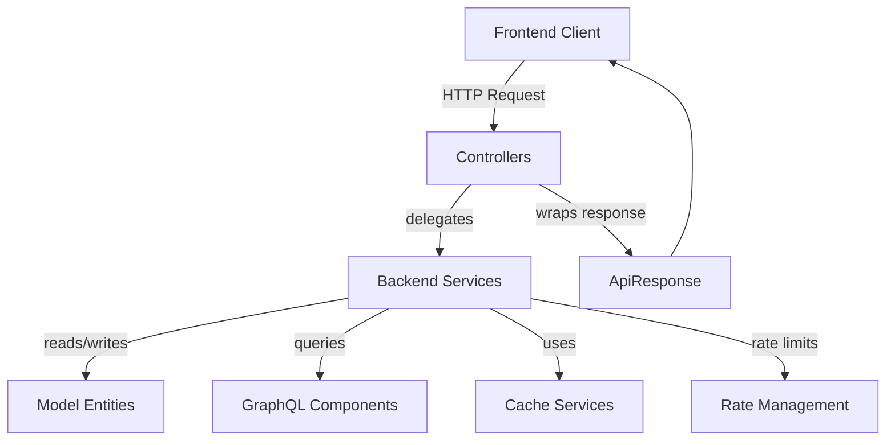
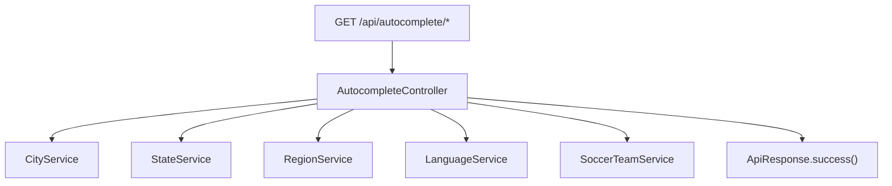
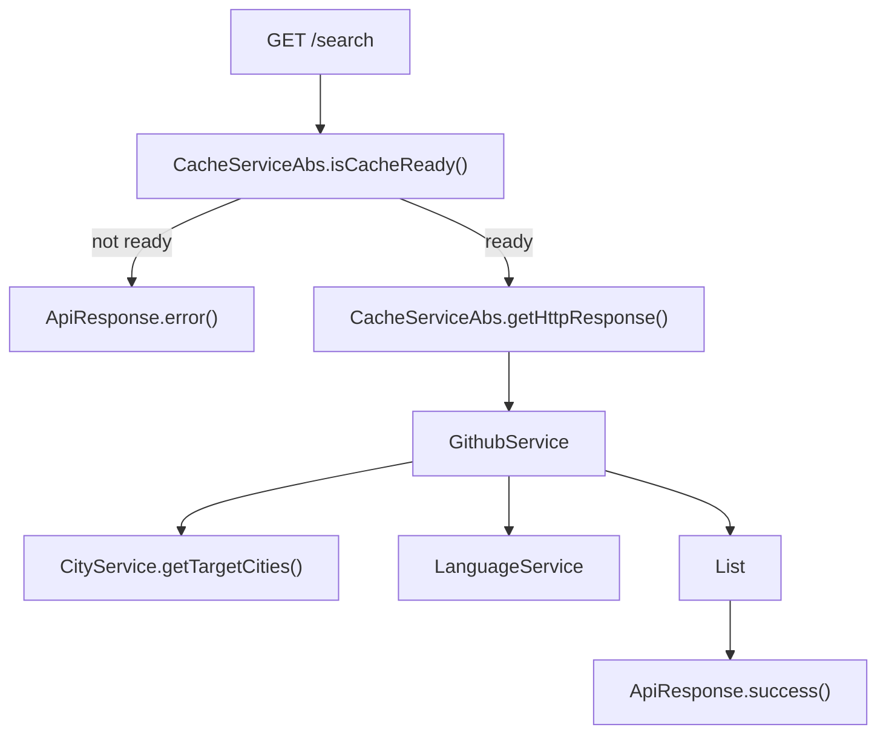
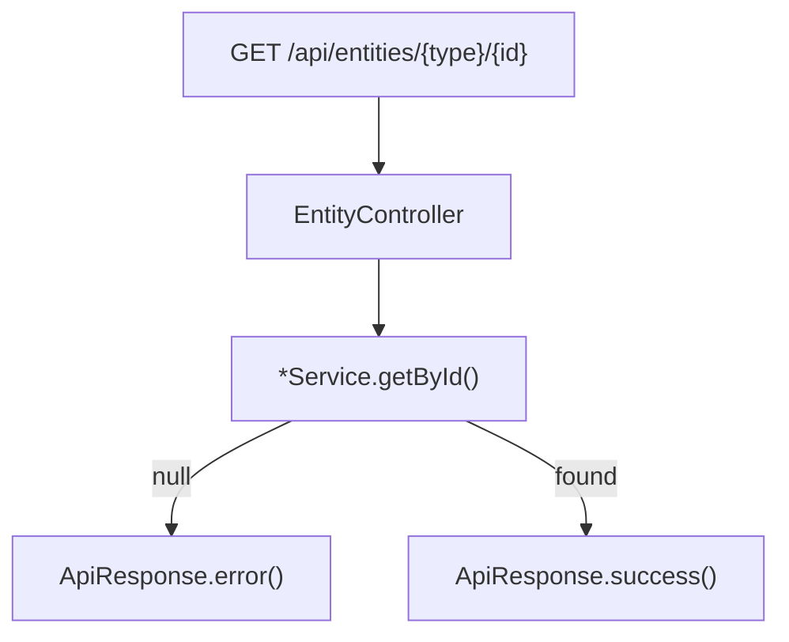
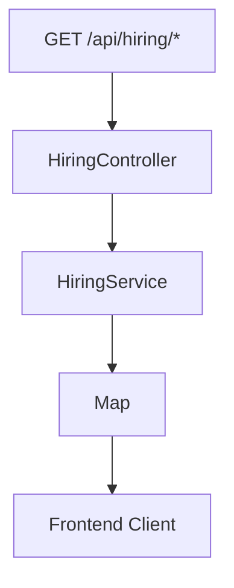

# Controllers

The **Controllers** module exposes the public REST API for the Major League GitHub backend service. It acts as the entry point for all HTTP requests coming from the React frontend and external clients.

Controllers are responsible for:

- Mapping HTTP routes to application use cases
- Validating and parsing request parameters
- Delegating business logic to services
- Formatting responses using `ApiResponse` or HTTP entities
- Handling basic error and cache readiness scenarios

This module sits at the boundary between the web layer (Spring MVC) and the business logic layer implemented in the [Backend Services](../backend-services/backend-services.md) module.

---

## Architectural Overview

At a high level, the Controllers module follows a classic Spring Boot layered architecture:



### Key Relationships

- **Controllers → Backend Services**: All business logic is delegated to services.
- **Controllers → Cache Services**: Contributor-related endpoints use caching abstractions.
- **Controllers → Model Entities**: Domain models (City, Region, Contributor, etc.) are serialized into JSON.
- **Controllers → ApiResponse**: Most endpoints return a standardized response wrapper.

---

## REST Endpoint Structure

The module defines four main REST controllers:

1. **AutocompleteController** – Autocomplete endpoints for filters.
2. **ContributorController** – Contributor search and export functionality.
3. **EntityController** – Direct entity lookup by ID.
4. **HiringController** – Hiring manager and job openings endpoints.

All routes are prefixed with `/api` and organized by domain responsibility.

---

# Controller Components

## 1. AutocompleteController

**Base Path:** `/api/autocomplete`

Provides autocomplete suggestions for filterable entities such as cities, regions, states, languages, and soccer teams.

### Supported Endpoints

- `GET /cities`
- `GET /regions`
- `GET /states`
- `GET /languages`
- `GET /teams`

### Request Flow



### Characteristics

- All parameters are optional except where default values are provided.
- Supports contextual filtering (e.g., cities by region or state).
- Default `maxResults` is 50.
- Returns a standardized `ApiResponse<List<T>>`.

### Dependencies

- [Backend Services](../backend-services/backend-services.md)
- [Model Entities](../model-entities/model-entities.md)

---

## 2. ContributorController

**Base Path:** `/api/contributors`

This controller drives the core leaderboard functionality of the platform.

### Endpoints

- `GET /search` – Retrieve ranked contributors.
- `GET /export` – Export contributor results as CSV.

---

### 2.1 Search Endpoint

**Route:** `GET /api/contributors/search`

#### Responsibilities

- Validate cache readiness
- Resolve geographic filters
- Determine selected programming language
- Delegate contributor ranking to `GithubService`
- Use `CacheServiceAbs` for caching and HTTP response reuse

#### Flow Diagram



#### Key Features

- Multi-dimensional filtering (city, region, state, team, language)
- Default result limit: 15
- Configurable GitHub API priority
- Cache-backed response generation

#### Cross-Module Dependencies

- [Backend Services](../backend-services/backend-services.md)
- [Cache Services](../cache-services/cache-services.md)
- [Rate Management](../rate-management/rate-management.md)
- [GraphQL Components](../graphql-components/graphql-components.md)

---

### 2.2 Export Endpoint

**Route:** `GET /api/contributors/export`

Generates a CSV export of contributor results.

#### Additional Responsibilities

- Builds CSV via Apache Commons CSV
- Extracts contributor social links
- Dynamically constructs filename
- Returns `ResponseEntity<String>` with `text/csv` content type

#### CSV Columns

```text
Rank, First Name, Last Name, City, State, MLG URL, GitHub URL, Email, Twitter, LinkedIn
```

#### Notable Behaviors

- Automatically falls back to default language if invalid ID provided.
- Generates MLG deep-link URLs using base domain.
- Dynamically builds filename:

```text
mlg-contributors-{language}-{location}-{date}.csv
```

This endpoint combines service orchestration, caching, transformation, and response streaming logic.

---

## 3. EntityController

**Base Path:** `/api/entities`

Provides direct lookup of individual domain entities by ID.

### Endpoints

- `GET /cities/{id}`
- `GET /regions/{id}`
- `GET /states/{id}`
- `GET /languages/{id}`
- `GET /teams/{id}`

### Flow



### Characteristics

- Thin pass-through endpoints.
- Standardized error logging.
- Uniform success/error response formatting.

This controller acts as a lightweight read-only gateway to core domain entities.

---

## 4. HiringController

**Base Path:** `/api/hiring`

Supports hiring-related features for the platform.

### Endpoints

- `GET /manager` – Hiring manager profile.
- `GET /jobs` – Active job openings.

### Flow



### Characteristics

- Delegates to `HiringService`.
- Returns raw map-based JSON rather than `ApiResponse`.
- Designed for lightweight content retrieval.

### Dependency

- [Backend Services](../backend-services/backend-services.md)

---

# Error Handling and Response Strategy

Most controllers rely on the `ApiResponse` wrapper defined in the Model Entities module. This provides:

- `success(data, message)`
- `error(message)`

Benefits:

- Consistent JSON structure
- Predictable frontend parsing
- Clear success/error semantics

Contributor export is an exception, returning `ResponseEntity<String>` for file download semantics.

---

# Design Principles

The Controllers module adheres to the following principles:

1. **Thin Controllers** – Business logic is delegated to services.
2. **Separation of Concerns** – Controllers only orchestrate.
3. **Standardized Responses** – Uniform API contract.
4. **Cache Awareness** – Contributor endpoints respect cache readiness.
5. **Frontend-Oriented API Design** – Endpoints structured around UI filters and leaderboard needs.

---

# Position Within the System

Within the backend architecture:

- The application entry point is defined in the Application Core module.
- Controllers define the HTTP boundary.
- Services implement domain logic.
- Cache and Rate Management protect GitHub API usage.
- GraphQL Components build GitHub queries.
- Model Entities define serializable domain objects.

Together, the Controllers module exposes the public API that powers the Major League GitHub leaderboard and hiring features.