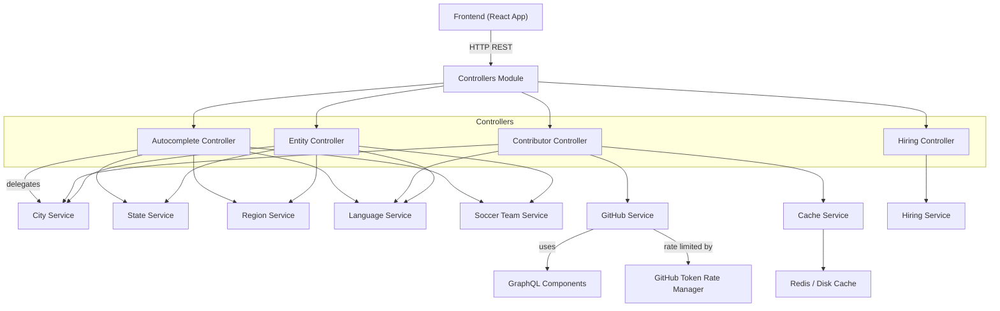
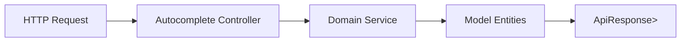
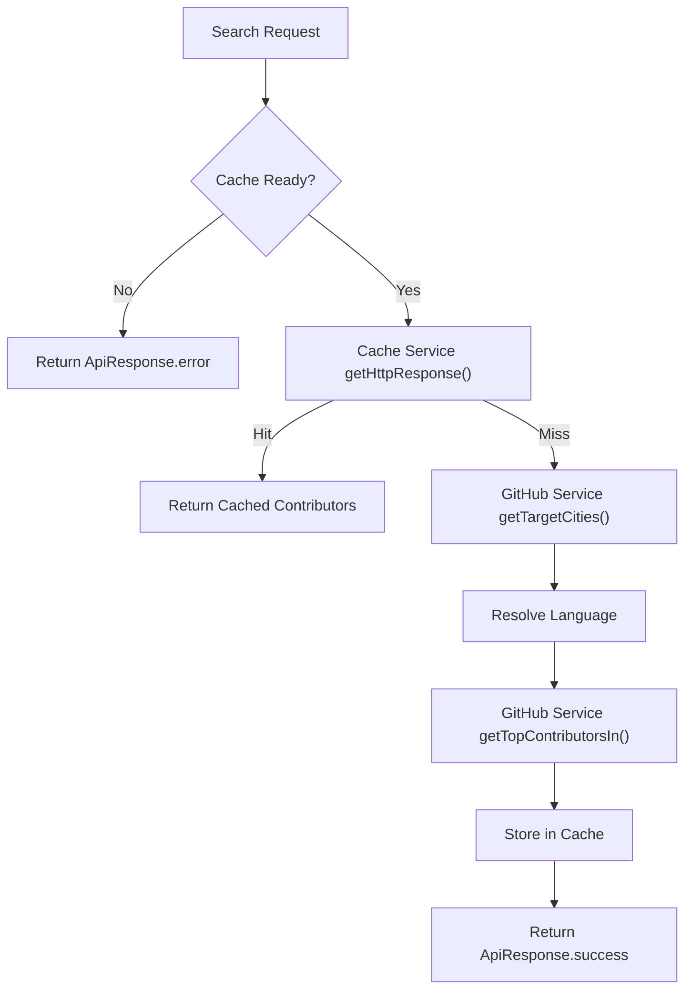
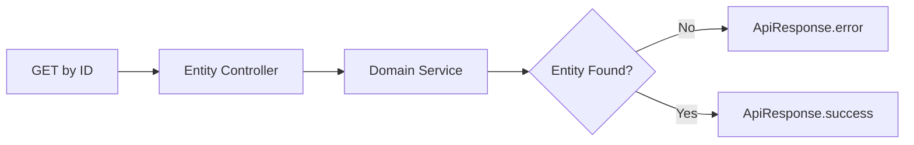

# Controllers

The **Controllers** module is the HTTP entry point of the Major League GitHub backend service. It exposes RESTful APIs that power the React frontend, handling contributor search, autocomplete filters, entity lookups, and hiring-related endpoints.

Built on Spring Boot 3.4, the Controllers module follows a clean layered architecture:

- Controllers handle HTTP requests and responses
- Services encapsulate business logic
- Models represent domain entities
- Cache and rate management layers optimize GitHub API usage

This module sits at the boundary between the frontend and the backend service layer.

---

## Architectural Overview

The Controllers module orchestrates requests across the Service Layer, Cache Services, and Model Entities.



### Key Responsibilities

1. **Request validation and parameter parsing**
2. **Delegation to appropriate services**
3. **Response wrapping using `ApiResponse`**
4. **Cache-aware contributor search**
5. **CSV export generation for leaderboard data**

---

## Controller Breakdown

The Controllers module consists of four primary REST controllers:

- **Autocomplete Controller** – Filter suggestions for UI dropdowns
- **Contributor Controller** – Contributor search and CSV export
- **Entity Controller** – Lookup of single domain entities by ID
- **Hiring Controller** – Hiring manager profile and job openings

Each controller is described below.

---

# Autocomplete Controller

**Base Path:** `/api/autocomplete`

Provides fast lookup endpoints used by frontend autocomplete components.

### Endpoints

| Endpoint | Description |
|-----------|-------------|
| `GET /cities` | Autocomplete cities with optional region/state filters |
| `GET /regions` | Autocomplete regions |
| `GET /states` | Autocomplete states |
| `GET /languages` | Autocomplete programming languages |
| `GET /teams` | Autocomplete soccer teams |

### Behavior

- All endpoints:
  - Accept optional `query` parameter
  - Accept filtering IDs where relevant
  - Support configurable `maxResults` (default: 50)
  - Return `ApiResponse<List<Entity>>`
- Logging captures all query combinations for observability.

### Data Flow



### Dependencies

- City Service
- State Service
- Region Service
- Language Service
- Soccer Team Service

These services operate on domain models such as `City`, `State`, `Region`, `Language`, and `SoccerTeam`.

---

# Contributor Controller

**Base Path:** `/api/contributors`

This controller powers the core leaderboard functionality of Major League GitHub.

## 1. Search Endpoint

**Endpoint:** `GET /search`

### Parameters

- `cityId`
- `regionId`
- `stateId`
- `teamId`
- `languageId`
- `maxResults` (default: 15)
- `priority` (GitHub API priority level)

### Execution Flow



### Key Concepts

- **Cache Guard:** If the cache is still populating, search is blocked.
- **Priority-based GitHub Calls:** Uses `GithubApiPriority` to manage API rate usage.
- **Language Fallback:** Defaults to configured language if invalid ID provided.
- **Optional-Based Flow:** Uses `Optional` from cache service to handle failures gracefully.

## 2. CSV Export Endpoint

**Endpoint:** `GET /export`

Generates a downloadable CSV leaderboard file.

### Features

- Builds CSV via Apache Commons CSV
- Dynamically constructs filename:

```text
mlg-contributors-{language}-{location}-{yyyy-MM-dd}.csv
```

- Extracts:
  - First and last name
  - City and state
  - MLG URL
  - GitHub, email, Twitter, LinkedIn

### Response Type

- `ResponseEntity<String>`
- `Content-Disposition: attachment`
- `Content-Type: text/csv`

This endpoint enables data portability for hiring managers, recruiters, or analytics.

---

# Entity Controller

**Base Path:** `/api/entities`

Provides lookup-by-ID endpoints for domain entities.

### Endpoints

| Endpoint | Returns |
|-----------|----------|
| `/cities/{id}` | City |
| `/regions/{id}` | Region |
| `/states/{id}` | State |
| `/languages/{id}` | Language |
| `/teams/{id}` | SoccerTeam |

### Pattern



### Characteristics

- Returns standardized `ApiResponse<T>`
- Logs warnings for missing IDs
- Ensures consistent frontend error handling

---

# Hiring Controller

**Base Path:** `/api/hiring`

Exposes hiring-related data used in the platform’s hiring feature.

### Endpoints

| Endpoint | Description |
|-----------|-------------|
| `/manager` | Hiring manager profile |
| `/jobs` | Active job openings |

### Design Notes

- Delegates to Hiring Service
- Returns lightweight `Map<String, Object>` responses
- `jobs` endpoint wraps results in:
  - `status`
  - `message`
  - `data`


---

## Response Standardization

Most endpoints return:

```text
ApiResponse<T>
  - status
  - message
  - data
```

This ensures consistent frontend parsing and type alignment with TypeScript definitions in the frontend.

---

## Cross-Module Interaction Summary

The Controllers module depends heavily on:

- Service Layer (business logic)
- Cache Services (performance optimization)
- GraphQL Components (GitHub query construction)
- Rate Management (token throttling)
- Model Entities (domain objects)

It does **not** contain business logic — it acts strictly as a routing and orchestration layer.

---

## Design Principles

- ✅ Thin controllers
- ✅ Constructor injection (except legacy Entity Controller)
- ✅ Clear separation of concerns
- ✅ Cache-first contributor search
- ✅ Graceful error handling
- ✅ CSV export support
- ✅ Structured logging

---

## Summary

The **Controllers** module is the API façade of the Major League GitHub backend. It:

- Powers leaderboard search
- Provides dynamic filtering
- Exposes structured domain entities
- Enables hiring visibility
- Optimizes performance via caching

By cleanly delegating to the Service Layer and Cache Services, the Controllers module ensures scalability, maintainability, and frontend compatibility while preserving separation of concerns within the system architecture.
