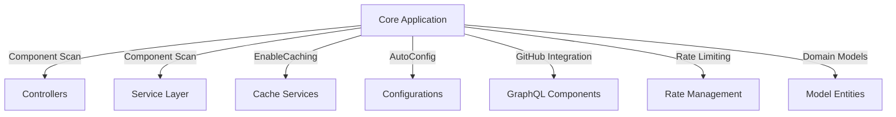
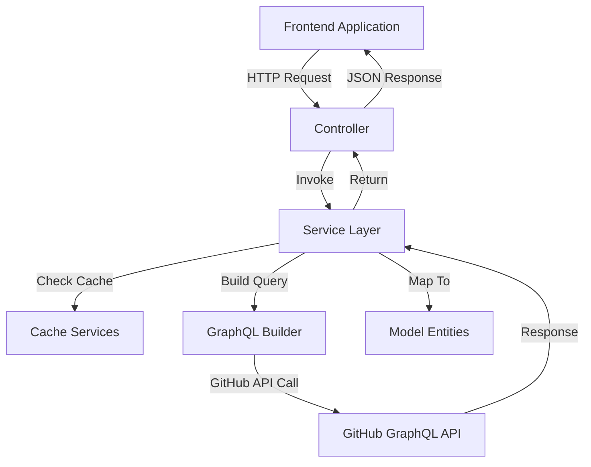
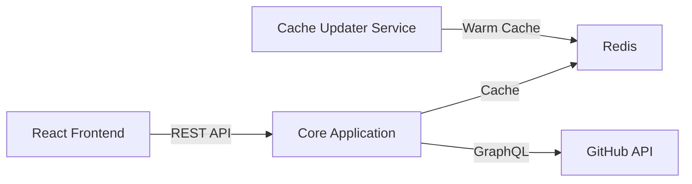
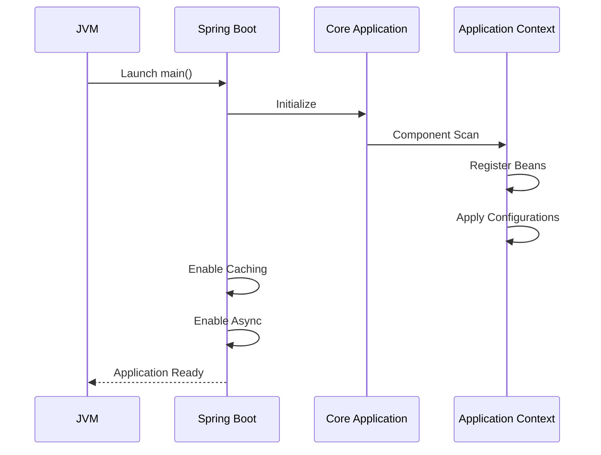

# Core Application

The **Core Application** module is the bootstrap and runtime entry point of the Major League GitHub backend service. It initializes the Spring Boot environment, enables cross-cutting infrastructure capabilities such as caching and asynchronous execution, and wires together all backend modules including controllers, services, caching layers, GraphQL integrations, and rate management.

At its center is the `MajorLeagueGithubApplication` class, which starts the Spring container and activates key framework features required by the rest of the system.

---

## 1. Purpose and Responsibilities

The Core Application module is responsible for:

- Bootstrapping the Spring Boot runtime
- Enabling distributed caching across services
- Enabling asynchronous task execution
- Activating component scanning and auto-configuration
- Serving as the root wiring layer for all backend modules

It does **not** contain business logic. Instead, it orchestrates and activates the modules that implement the domain logic of Major League GitHub.

---

## 2. Core Component

### MajorLeagueGithubApplication

Located in:

```text
backend/src/main/java/cx/flamingo/analysis/MajorLeagueGithubApplication.java
```

### Annotations Overview

```java
@SpringBootApplication
@EnableCaching
@EnableAsync
public class MajorLeagueGithubApplication {
    public static void main(String[] args) {
        SpringApplication.run(MajorLeagueGithubApplication.class, args);
    }
}
```

### Annotation Responsibilities

| Annotation | Responsibility |
|------------|---------------|
| `@SpringBootApplication` | Enables auto-configuration, component scanning, and configuration support |
| `@EnableCaching` | Activates Spring caching abstraction used by cache services |
| `@EnableAsync` | Enables asynchronous method execution via `@Async` |

These annotations are foundational for modules such as:

- [Cache Services](../cache-services/cache-services.md)
- [Service Layer](../service-layer/service-layer.md)
- [Configurations](../configurations/configurations.md)

---

## 3. High-Level System Architecture

The Core Application sits at the center of the backend microservice and activates all domain modules.



### Key Relationships

- **Controllers** expose REST endpoints.
- **Service Layer** implements business logic.
- **Cache Services** optimize GitHub API access.
- **GraphQL Components** build and serialize GitHub queries.
- **Rate Management** protects against GitHub API limits.
- **Model Entities** define backend domain objects.

---

## 4. Backend Request Lifecycle

The Core Application enables the full request-processing pipeline.



The Core Application ensures:

- All components are discovered via component scanning.
- Caching interceptors are active.
- Async execution is available where configured.
- Configuration classes are applied at startup.

---

## 5. Caching Enablement

The `@EnableCaching` annotation activates the Spring caching abstraction used by implementations such as:

- Redis-based caching
- Disk-based caching
- Read-only cache layers

See: [Cache Services](../cache-services/cache-services.md)

Without this annotation:

- Cache annotations in services would be ignored
- Rate-limited GitHub calls would increase
- Performance would degrade significantly

---

## 6. Asynchronous Execution

The `@EnableAsync` annotation allows services to execute non-blocking operations using `@Async`.

Typical async use cases include:

- Background pre-caching
- Token rotation handling
- External service enrichment (e.g., LinkedIn)

See: [Service Layer](../service-layer/service-layer.md) and [Configurations](../configurations/configurations.md)

---

## 7. Integration With Other Backend Modules

The Core Application wires together the backend microservice modules:

| Module | Role in System |
|--------|----------------|
| [Controllers](../controllers/controllers.md) | REST API layer |
| [Service Layer](../service-layer/service-layer.md) | Business logic and orchestration |
| [Cache Services](../cache-services/cache-services.md) | Performance and data reuse |
| [GraphQL Components](../graphql-components/graphql-components.md) | GitHub query construction |
| [Rate Management](../rate-management/rate-management.md) | GitHub API token rotation and rate limiting |
| [Model Entities](../model-entities/model-entities.md) | Domain representation |
| [Configurations](../configurations/configurations.md) | Infrastructure setup |

The Core Application is the entry boundary that binds them into a cohesive runtime.

---

## 8. Position Within Overall System

Major League GitHub consists of:

- A Backend Service (this Spring Boot application)
- A Cache Updater microservice
- A React frontend
- Redis for distributed caching

Within that architecture, the Core Application:

- Boots the backend service (default port configured externally)
- Exposes REST APIs consumed by the frontend
- Coordinates GitHub data retrieval
- Manages caching and rate control



---

## 9. Startup Flow

When the application starts:



Key phases:

1. JVM starts the `main` method.
2. Spring Boot initializes auto-configuration.
3. Component scanning discovers controllers, services, and configs.
4. Caching and async capabilities are activated.
5. The application becomes ready to serve HTTP requests.

---

## 10. Design Characteristics

### Lightweight Entry Point
The Core Application contains minimal logic. This ensures:

- Clear separation of concerns
- Easy testing of individual modules
- Simplified maintainability

### Annotation-Driven Infrastructure
Infrastructure behavior is declarative:

- Caching via `@EnableCaching`
- Async via `@EnableAsync`
- Bean discovery via `@SpringBootApplication`

### Microservice-Oriented
Although simple in code, this module forms the root of a microservice that:

- Integrates external APIs (GitHub)
- Uses distributed caching (Redis)
- Supports CI/CD and containerized deployment

---

## 11. Summary

The **Core Application** module is the runtime foundation of the Major League GitHub backend. It:

- Boots the Spring ecosystem
- Activates caching and asynchronous execution
- Connects controllers, services, caching, GraphQL builders, and rate managers
- Enables the full contributor leaderboard and filtering experience

While small in code size, it is structurally critical — without it, none of the backend modules would be instantiated or operational.

For deeper understanding of domain logic, continue with:

- [Service Layer](../service-layer/service-layer.md)
- [Controllers](../controllers/controllers.md)
- [Cache Services](../cache-services/cache-services.md)
