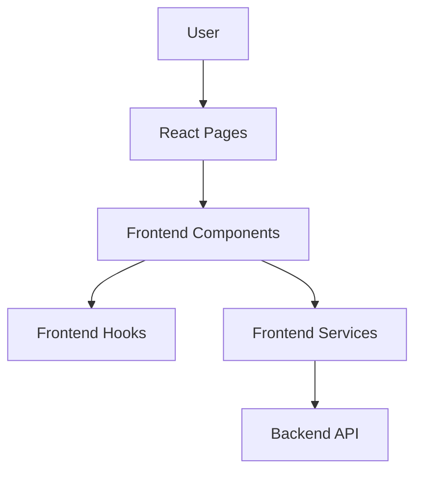
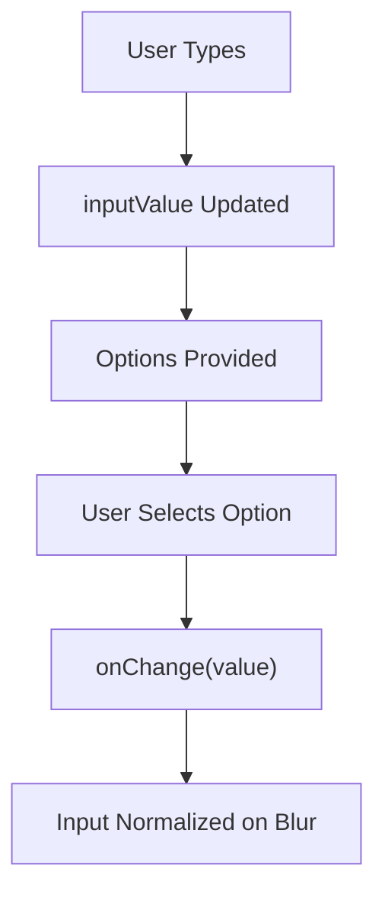
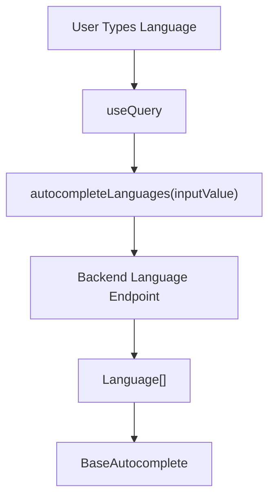
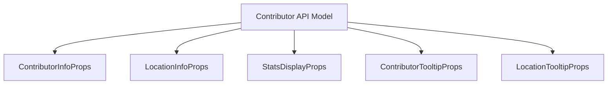
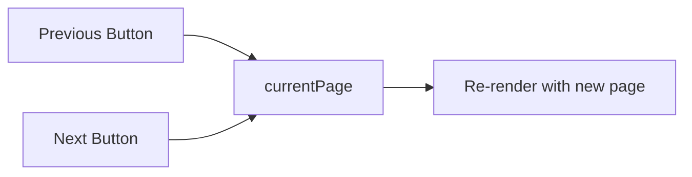
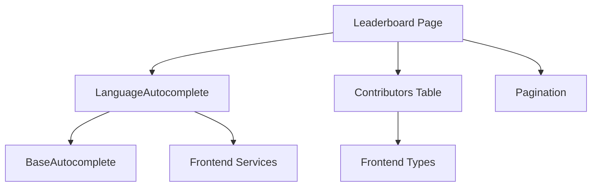

# Frontend Components

The **Frontend Components** module contains the reusable UI building blocks used by the Major League GitHub React application. It provides typed, composable, and API-integrated components that power search, filtering, leaderboard display, and navigation interactions in the frontend.

This module is focused purely on presentation and user interaction. It relies on:

- Frontend Services for API communication
- Frontend Types for shared domain models
- React Query for server state management
- Material UI for design system components

Together, these components render contributor rankings, language filters, and lightweight pagination behavior across the application.

---

## Architectural Overview

The Frontend Components module sits between the UI layer and the frontend service layer.



### Responsibilities

- Provide reusable, generic UI primitives
- Encapsulate Material UI configuration
- Integrate with React Query for data-driven components
- Define component-level TypeScript contracts
- Render domain models (Contributor, Language, State, SoccerTeam)

The module is intentionally thin in business logic. All data processing and aggregation are delegated to backend services and frontend hooks.

---

# Core Components

## 1. BaseAutocomplete

**Core Types:**
- `BaseEntity`
- `BaseAutocompleteProps<T>`

The `BaseAutocomplete` component is a generic, reusable wrapper around Material UI's `Autocomplete` component. It standardizes:

- Controlled input behavior
- Icon rendering
- Free-text support (`freeSolo` mode)
- Option rendering
- Blur normalization

### Generic Entity Model

```text
BaseEntity
 ├── id
 ├── name?
 ├── displayName?
 ├── iconUrl?
 └── logoUrl?
```

Any domain object used in autocomplete (Language, City, State, etc.) must satisfy the `BaseEntity` contract.

### Behavior Flow



### Key Design Decisions

- **Free Solo Mode**: Allows raw typing even if no option is selected
- **Icon Rendering Strategy**: Automatically displays `iconUrl` or `logoUrl`
- **Extensible Rendering**: Optional `renderOptionContent` for custom row rendering
- **Strict Generics**: Ensures type safety across autocomplete usages

This component acts as the foundation for all search dropdowns in the application.

---

## 2. LanguageAutocomplete

**Core Type:**
- `LanguageAutocompleteProps`

`LanguageAutocomplete` is a specialization of `BaseAutocomplete` for GitHub programming languages.

It integrates directly with:

- React Query (`useQuery`)
- `autocompleteLanguages` API function
- Shared `Language` type from frontend types

### Data Fetching Flow



### Important Characteristics

- Query key is derived from `inputValue`
- No stale caching (`staleTime: 0`)
- Fully controlled input state
- Uses `displayName` as the option label

This pattern ensures responsive, server-driven autocomplete behavior while preserving type safety.

---

## 3. Contributors Table Types

**Core Types:**
- `ContributorsTableProps`
- `ContributorInfoProps`
- `LocationInfoProps`
- `StatsDisplayProps`
- `LocationTooltipProps`
- `ContributorTooltipProps`
- `SoccerTeam`
- `State`

This file defines all UI-level type contracts used by the contributors leaderboard table.

### Domain Alignment

The table relies on the shared `Contributor` API type but extends UI-specific display requirements such as:

- Tooltip metadata
- Location formatting
- Team display information
- State and regional grouping

### Table Data Model



### SoccerTeam and State Models

These interfaces represent enriched geographic and league information used to:

- Display MLS team branding
- Show state and regional affiliation
- Associate contributors with nearest stadiums

They are UI-level representations and may include display-specific properties such as `iconUrl` and `logoUrl`.

---

## 4. Pagination

**Core Type:**
- `PaginationProps`

The `Pagination` component is intentionally minimal. Major League GitHub does not require complex cursor-based or infinite scrolling patterns.

### Behavior



### Design Characteristics

- Stateless aside from props
- Optional `onPageChange`
- Disabled boundaries at first and last page
- Tailwind-based lightweight styling

It exists primarily to satisfy persistent pagination imports while keeping UI logic simple.

---

# Component Interaction Model

The following diagram shows how the primary frontend components collaborate:



---

# Design Principles

## 1. Strong Typing Everywhere

All components are built around explicit TypeScript interfaces. Domain objects from the API are reused and extended rather than duplicated.

## 2. Clear Separation of Concerns

- Components handle rendering and interaction
- Hooks manage derived state and URL synchronization
- Services handle network communication
- Backend handles business logic

## 3. Reusability via Generics

`BaseAutocomplete` demonstrates the module's pattern: define a generic abstraction once, specialize it per domain.

## 4. Minimal UI Logic

The module avoids embedding business logic. All ranking, geographic filtering, and rate-limited GitHub querying are handled outside this layer.

---

# How Frontend Components Fit into the System

In the overall system architecture:

- The backend provides contributor rankings, geographic data, and language metadata.
- Frontend services call backend endpoints.
- Frontend hooks synchronize URL state and derived logic.
- Frontend Components render structured, interactive UI elements.

This module represents the visual and interactive layer of Major League GitHub, transforming structured API data into a sports-inspired leaderboard experience.