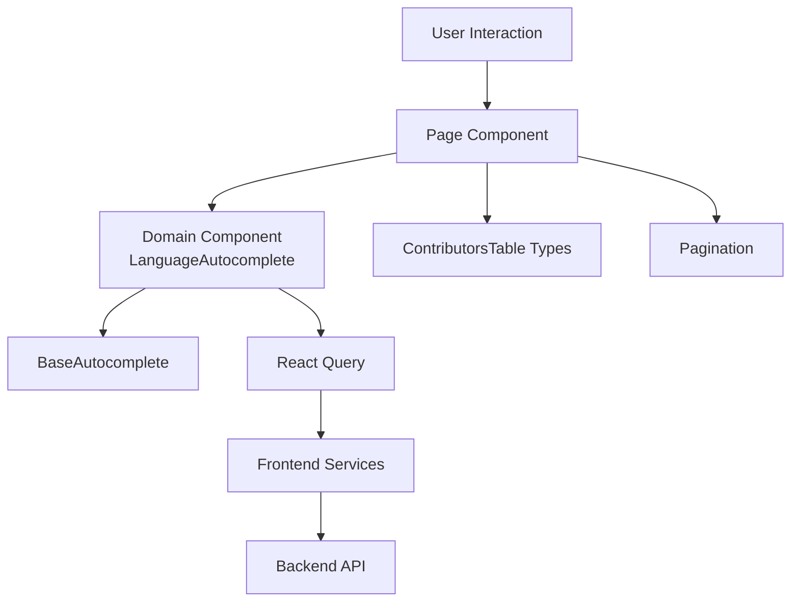
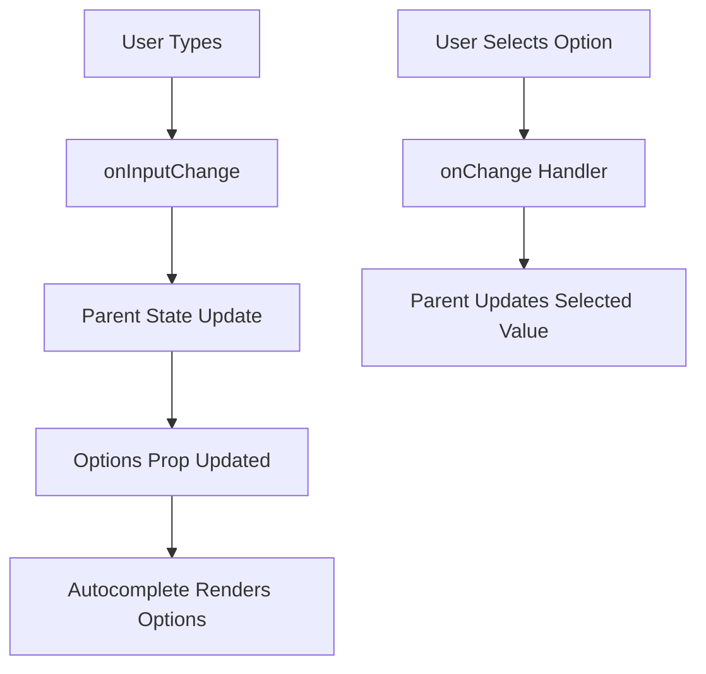
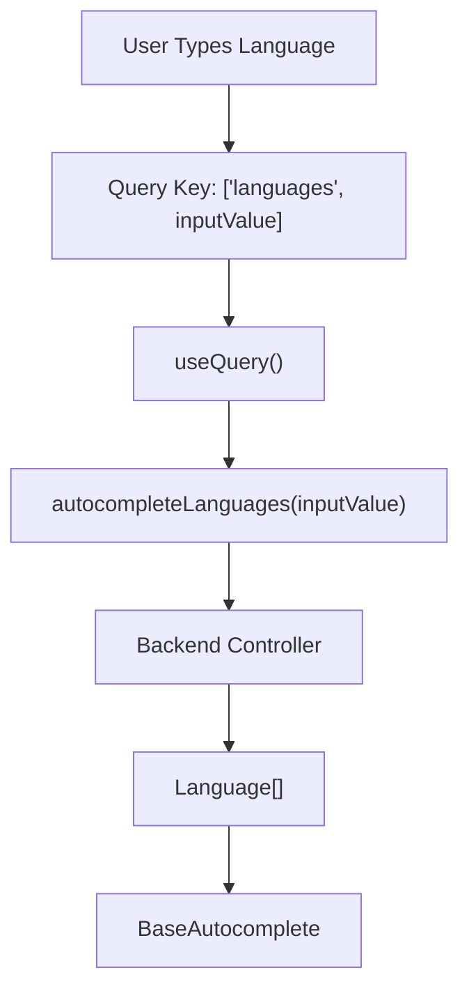
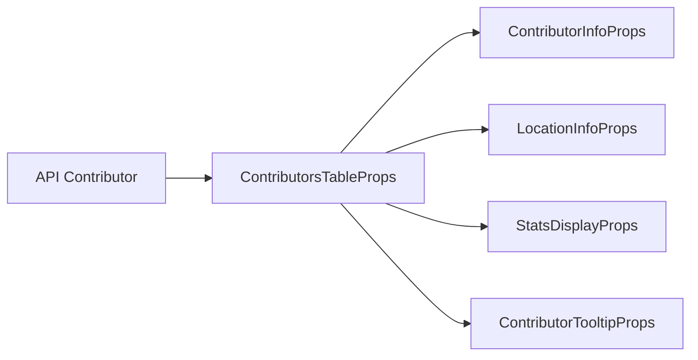
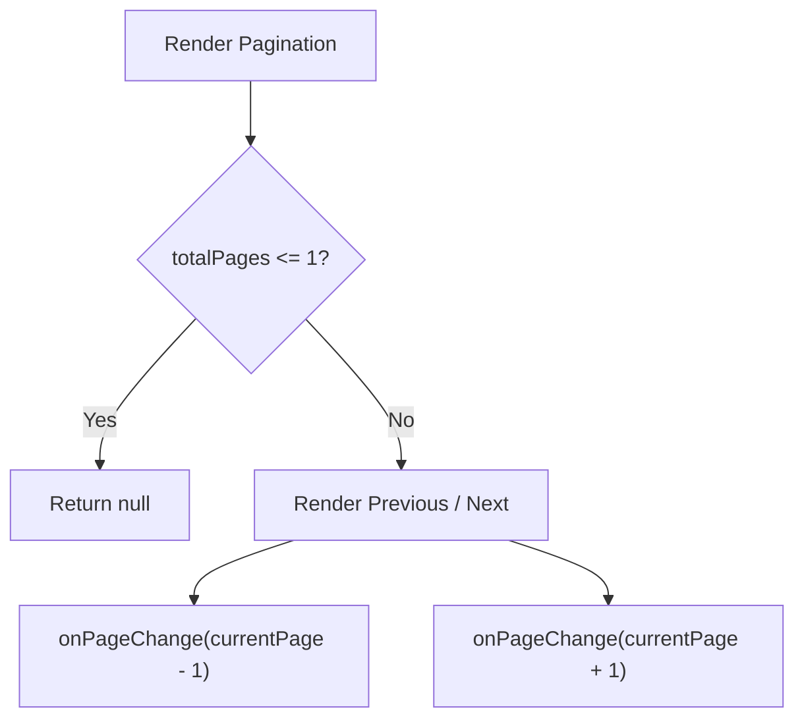
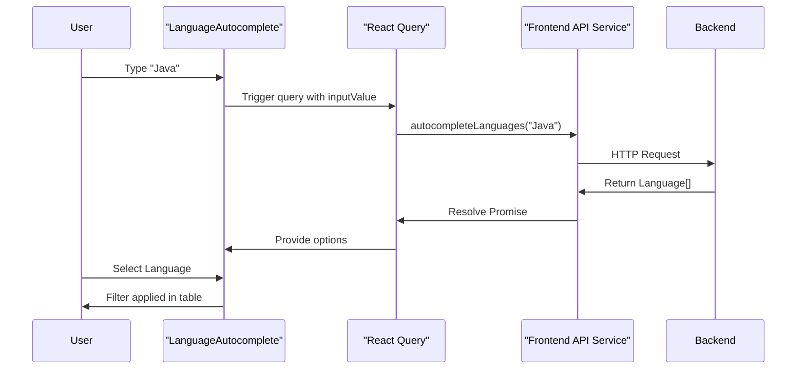

# Frontend Components

The **Frontend Components** module contains the reusable UI building blocks for the Major League GitHub React application. These components are responsible for rendering interactive controls, contributor data visualizations, autocomplete inputs, and lightweight pagination.

Built with **React 19**, **TypeScript**, and **Material-UI (MUI)**, this module emphasizes:

- Type-safe component contracts
- Reusable generic UI primitives
- Clear separation between presentation and data fetching
- Compatibility with React Query for asynchronous data

This module sits at the presentation layer of the frontend architecture and interacts primarily with:

- Frontend Hooks (state + URL synchronization)
- Frontend Services (API communication)
- Frontend Types (shared domain contracts)

---

## Architectural Overview

The Frontend Components module follows a layered UI composition pattern:

- **Generic UI primitives** (e.g., BaseAutocomplete)
- **Domain-specific components** (e.g., LanguageAutocomplete)
- **Typed table contracts** (ContributorsTable types)
- **Lightweight utility UI elements** (Pagination)



The diagram shows how reusable base components support domain-specific components, which then integrate with data services and the backend.

---

# Core Components

## 1. BaseAutocomplete

**File:** `frontend/src/components/BaseAutocomplete.tsx`

### Purpose

`BaseAutocomplete` is a fully generic, reusable wrapper around MUI's `Autocomplete` component. It abstracts common behaviors such as:

- Free text entry (`freeSolo` mode)
- Controlled input and selected value
- Icon rendering for selected items
- Custom option rendering
- Clear/reset handling

It enables strong typing through the `BaseEntity` interface and generic constraints.

---

### BaseEntity Interface

```typescript
export interface BaseEntity {
  id: string;
  name?: string;
  displayName?: string;
  iconUrl?: string;
  logoUrl?: string;
}
```

This ensures every selectable entity:

- Has a stable `id`
- May include display labels
- May optionally include an icon or logo

This abstraction allows the component to support:

- Languages
- Regions
- States
- Soccer teams
- Any future entity with minimal additional configuration

---

### BaseAutocompleteProps

The component is fully controlled:

- `value`: Selected entity
- `onChange`: Selection handler
- `inputValue`: Current input string
- `onInputChange`: Input change handler
- `options`: Available suggestions
- `getOptionLabel`: Label resolver
- `renderIcon`: Optional icon extractor
- `renderOptionContent`: Custom row rendering override

This design prevents hidden state and keeps business logic outside the component.

---

### Rendering Flow



Key behaviors:

- Clearing input resets both `inputValue` and `value`
- Blur restores the selected label
- Icon is rendered using `iconUrl` or `logoUrl`

This makes `BaseAutocomplete` the foundation for all autocomplete-style inputs.

---

## 2. LanguageAutocomplete

**File:** `frontend/src/components/LanguageAutocomplete.tsx`

### Purpose

`LanguageAutocomplete` is a domain-specific wrapper around `BaseAutocomplete` configured for programming languages.

It connects UI interaction with remote API calls using React Query.

---

### Responsibilities

- Fetch language suggestions dynamically
- Debounce via query key behavior
- Bind API results into `BaseAutocomplete`
- Provide correct label resolution (`displayName`)

---

### Data Flow



Important details:

- `staleTime: 0` ensures fresh suggestions
- `signal` enables request cancellation
- Strong typing via `Language` interface from shared API types

This component demonstrates the architectural pattern:

> Generic UI primitive + Domain binding + Data fetching hook

---

## 3. ContributorsTable Types

**File:** `frontend/src/components/ContributorsTable/types.ts`

### Purpose

This file defines the TypeScript contracts for contributor table rendering.

It separates:

- Visual structure
- Tooltip data contracts
- Location display logic
- Statistics display

---

### Domain Models Included

- `SoccerTeam`
- `State`

These extend backend data models with UI-focused fields such as:

- `logoUrl`
- `displayName`
- Geographic metadata

---

### Table Props

```typescript
export interface ContributorsTableProps {
  contributors: Contributor[];
  isLoading: boolean;
  error: Error | null;
}
```

This ensures the table component:

- Supports loading states
- Displays error states
- Is fully controlled by parent container

---

### Type Relationships



This layered typing approach enables:

- Clear separation of responsibilities
- Strong typing for subcomponents
- Safer refactoring

---

## 4. Pagination

**File:** `frontend/src/components/pagination.tsx`

### Purpose

`Pagination` is a minimal stub implementation designed specifically for Major League GitHub.

Unlike complex enterprise pagination systems, this implementation:

- Only supports simple previous/next navigation
- Hides itself when `totalPages <= 1`
- Delegates state control to parent

---

### Props Contract

```typescript
interface PaginationProps {
  currentPage: number;
  totalPages: number;
  onPageChange?: (page: number) => void;
}
```

---

### Behavioral Logic



Design considerations:

- No internal state
- Fully controlled component
- Minimal UI complexity

This aligns with the lightweight UX needs of the project.

---

# Design Principles of Frontend Components

## 1. Strong Typing Everywhere

All components rely heavily on:

- Generic constraints
- Shared API type contracts
- Explicit prop interfaces

This prevents UI/data mismatches and improves maintainability.

---

## 2. Controlled Components Only

Every major component follows controlled patterns:

- Value passed from parent
- Changes emitted via callback
- No hidden state

This simplifies debugging and URL synchronization.

---

## 3. Separation of Concerns

- UI logic in components
- Data fetching in hooks or React Query
- API calls in services
- Domain contracts in shared types

This results in clean boundaries and high testability.

---

# End-to-End UI Interaction Example

Below is a simplified interaction sequence for filtering contributors by language.



---

# How This Module Fits into the System

The Frontend Components module represents the **presentation layer** of the frontend architecture.

It:

- Consumes typed API data
- Renders domain-specific UI
- Delegates state and data to higher layers
- Remains framework-consistent with MUI

By combining generic UI primitives with strongly typed domain wrappers, this module enables Major League GitHub to maintain a clean, scalable, and maintainable React codebase.

---

# Summary

The **Frontend Components** module provides:

- A generic and reusable Autocomplete abstraction
- Domain-specific language filtering UI
- Strongly typed contributor table contracts
- Lightweight pagination controls

Together, these components deliver the interactive experience that powers the Major League GitHub leaderboard interface while preserving architectural clarity and type safety.