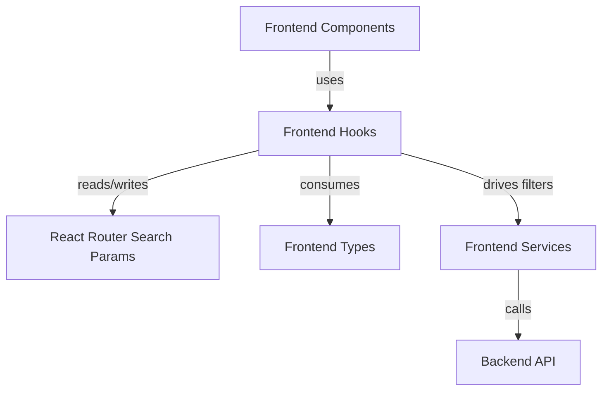
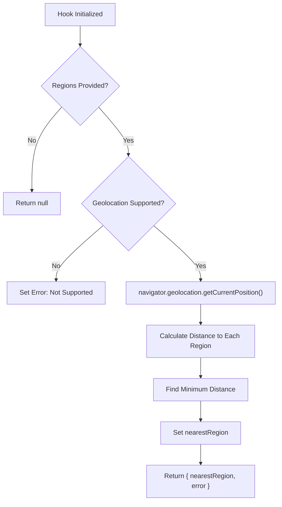
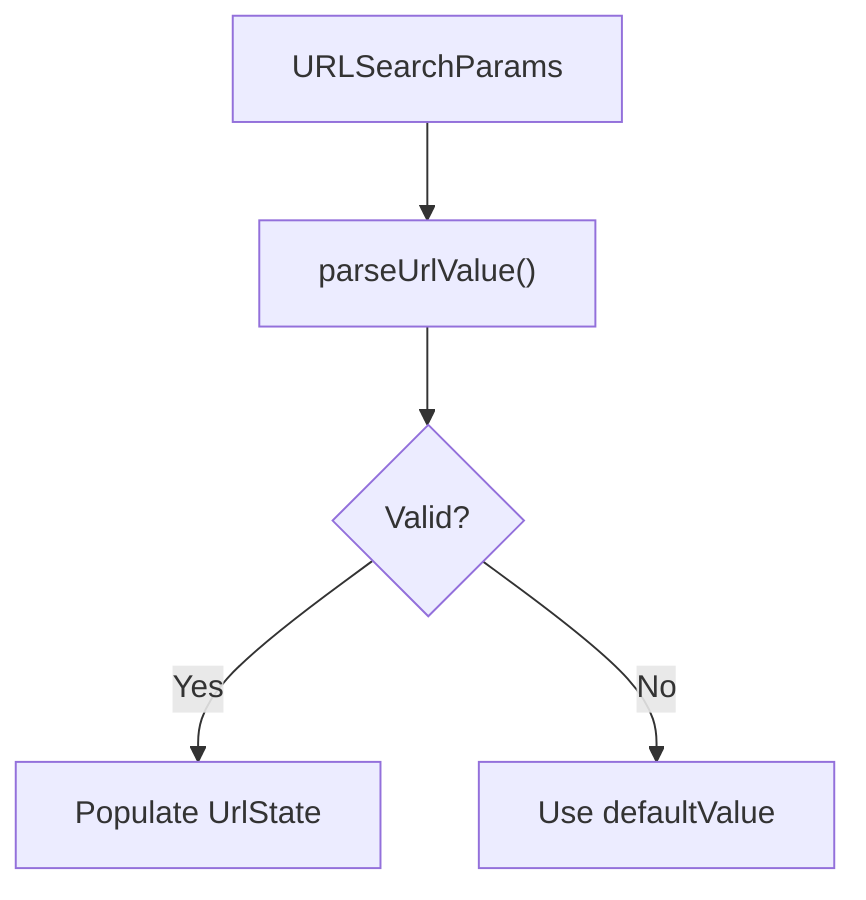
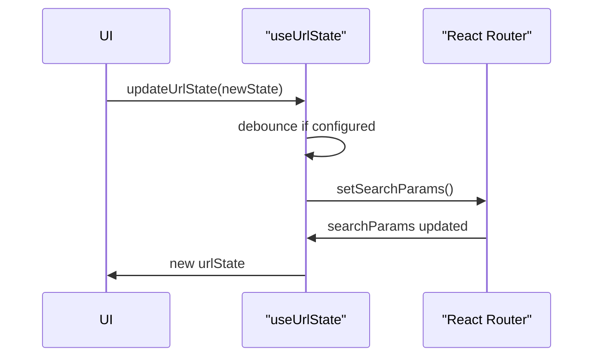
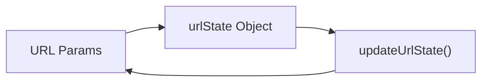
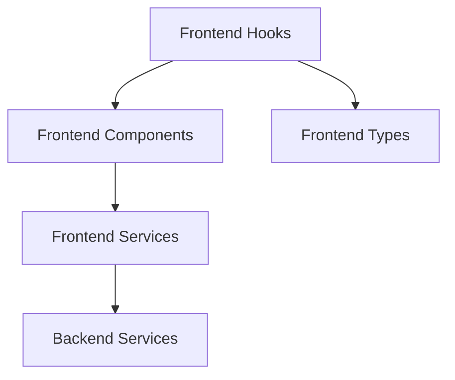

# Frontend Hooks

The **Frontend Hooks** module encapsulates reusable React hooks that manage client-side state derived from the browser environment and URL. These hooks provide:

- Geolocation-based region detection
- URL-driven filter state management
- Validation and synchronization between UI state and query parameters

This module acts as a bridge between:

- **Frontend Components** (UI layer)
- **Frontend Services** (API requests)
- **Frontend Types** (shared TypeScript models)

By centralizing cross-cutting concerns (URL parsing, validation, geolocation), the Frontend Hooks module keeps components clean, declarative, and predictable.

---

## Architectural Overview



### Responsibilities

| Hook | Responsibility |
|------|---------------|
| `useNearestRegion` | Determines the closest MLS region based on browser geolocation |
| `useUrlState` | Synchronizes filter state with URL query parameters |

---

# 1. useNearestRegion

**Source:** `frontend/src/hooks/useNearestRegion.ts`  
**Core Component:** `Coordinates`

## Purpose

`useNearestRegion` determines the closest region to the user using the browser's Geolocation API and the Haversine formula. It enhances UX by automatically suggesting or pre-selecting the geographically nearest MLS region.

## Key Concepts

### Coordinates Interface

```typescript
interface Coordinates {
    latitude: number;
    longitude: number;
}
```

Represents a geographic point in decimal degrees.

### Haversine Distance Formula

The hook uses the Haversine formula to compute great-circle distance between two geographic coordinates:

```text
Distance = 2R * arcsin(
  sqrt(
    sin²((Δlat)/2) +
    cos(lat1) * cos(lat2) * sin²((Δlon)/2)
  )
)
```

Where:
- `R` = Earth radius (6371 km)
- `Δlat`, `Δlon` = differences in radians

---

## Execution Flow



---

## Return Value

```typescript
{
  nearestRegion: Region | null,
  error: string | null
}
```

## Integration Points

- Consumes `Region` from **Frontend Types**
- Typically used inside location-aware pages
- Can prefill region filters managed by `useUrlState`

---

# 2. useUrlState (Validated & Debounced Version)

**Source:** `frontend/src/hooks/useUrlState.ts`

## Purpose

`useUrlState` provides a structured and validated interface for synchronizing UI filter state with URL query parameters.

It ensures:

- Strong validation of URL parameters
- Controlled debounced updates
- Graceful fallback to defaults
- Change detection

---

## URL State Model

```typescript
export interface UrlState {
    selectedCityId: string | null;
    selectedRegionId: string | null;
    stateId: string | null;
    languageId: string | null;
    teamId: string | null;
}
```

Each property maps to a URL parameter:

| State Key | URL Param |
|-----------|-----------|
| selectedCityId | cityId |
| selectedRegionId | regionId |
| stateId | stateId |
| languageId | languageId |
| teamId | teamId |

---

## Validation & Parsing Pipeline



### Validation Rules

- Regex validation: `^[a-zA-Z0-9-]+$`
- Optional transform step
- Default fallback on failure
- Custom error hook support via `onError`

---

## Debounced Updates

To prevent excessive URL updates (e.g., typing filters):

- Immediate updates for input clearing
- Optional `debounceMs` for delayed synchronization
- Automatic cleanup on unmount



---

## Returned API

```typescript
{
  urlState,
  updateUrlState,
  resetUrlState,
  hasStateChanged,
  isStateEmpty
}
```

### Key Features

- `updateUrlState(partialState)` — partial updates
- `resetUrlState()` — clears all filters
- `hasStateChanged` — shallow comparison with previous state
- `isStateEmpty` — convenience flag

---

# 3. useUrlState (Lightweight Index Version)

**Source:** `frontend/src/hooks/useUrlState/index.ts`

This version provides a simplified URL synchronization mechanism without:

- Validation
- Debouncing
- Change tracking

## Characteristics

- Direct mapping between URL params and state
- Immediate updates
- Minimal abstraction



This lightweight version may be used for:

- Simpler pages
- Legacy compatibility
- Controlled environments

---

# Cross-Module Integration



### Relationships

- **Frontend Components** depend on these hooks for filter and location state
- **Frontend Services** consume values from `urlState` to build API requests
- **Frontend Types** provide shared models (`Region`, `Contributor`, etc.)

---

# Design Principles

## 1. Separation of Concerns

Components focus on rendering.
Hooks manage state logic and browser APIs.

## 2. Deterministic URL State

The URL is the single source of truth for filter state.
This enables:

- Shareable links
- Deep linking
- Back/forward navigation compatibility

## 3. Progressive Enhancement

- Geolocation is optional
- Validation failures degrade gracefully
- Browser support is checked explicitly

---

# Summary

The **Frontend Hooks** module provides the foundational state logic that powers the interactive behavior of Major League GitHub's frontend.

It enables:

- Location-aware experiences
- Clean URL-driven filtering
- Predictable navigation state
- Improved user experience through validation and debouncing

By abstracting browser APIs and URL synchronization into dedicated hooks, the module ensures maintainability, composability, and scalability across the frontend application.
