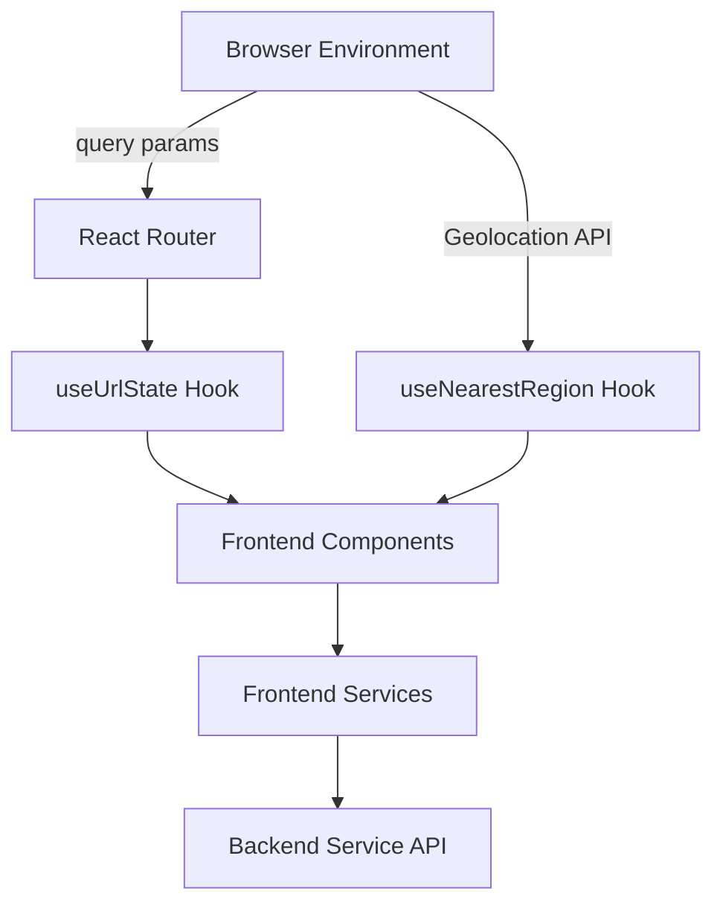
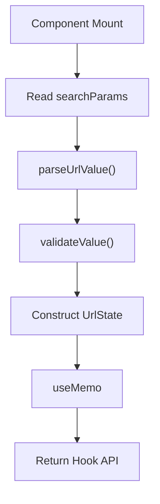
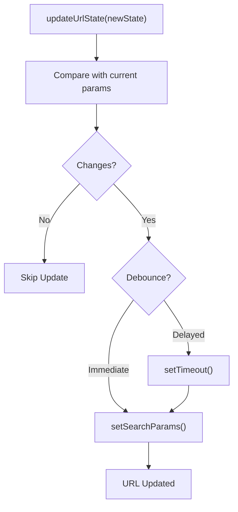
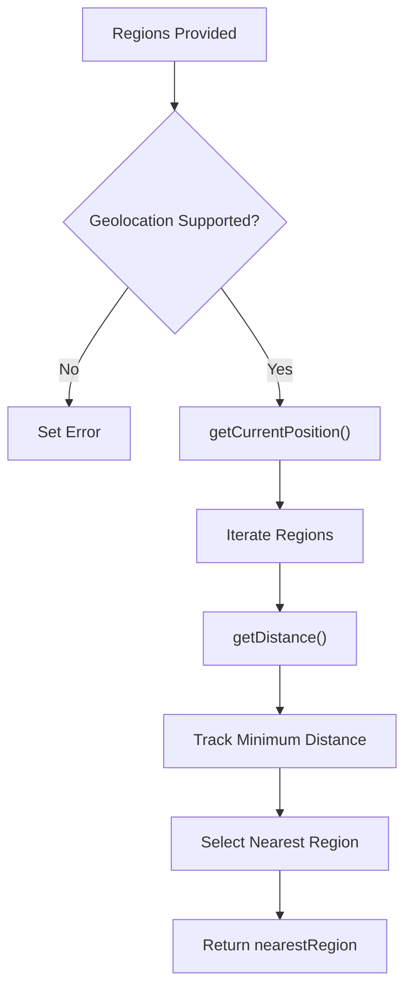
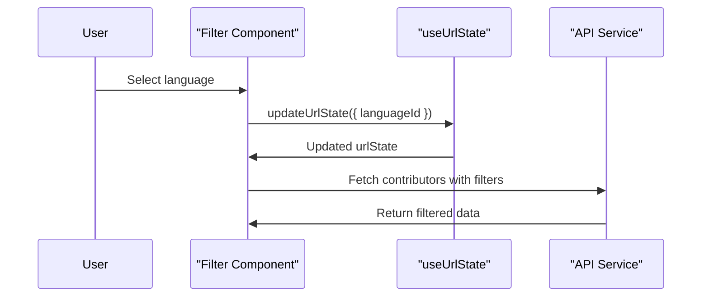

# Frontend Hooks

The **Frontend Hooks** module encapsulates reusable React hooks that manage browser-driven state and location-aware behavior in the Major League GitHub frontend. These hooks act as the bridge between:

- The browser environment (URL, geolocation API)
- React Router state
- UI components in the Frontend Components module
- API-driven filtering logic in the Frontend Services module

By centralizing URL synchronization and geolocation logic, this module ensures consistent filtering, shareable URLs, and location-based personalization across the application.

---

## Module Responsibilities

The Frontend Hooks module provides:

1. **URL State Management** – Synchronizes filter state (city, region, language, team, state) with query parameters.
2. **Validation & Debouncing** – Ensures URL parameters are valid and updates are optimized.
3. **Geolocation-Based Region Detection** – Determines the nearest region using the Haversine formula.
4. **Derived State Utilities** – Exposes helper signals such as `hasStateChanged` and `isStateEmpty`.

---

## High-Level Architecture



### Explanation

- **React Router** provides access to query parameters.
- **useUrlState** parses, validates, and updates URL parameters.
- **useNearestRegion** interacts with the browser geolocation API.
- **Frontend Components** consume derived state to render filters and tables.
- **Frontend Services** use the URL-derived state to fetch filtered contributor data.

---

## Core Hooks Overview

### 1. useUrlState (Advanced Implementation)

**File:** `frontend/src/hooks/useUrlState.ts`

This is the primary URL state management hook. It provides:

- Strongly typed `UrlState`
- Centralized parameter configuration (`URL_PARAMS`)
- Validation via regex rules
- Transformation support
- Debounced updates
- Error handling via `UrlStateError`
- Change detection (`hasStateChanged`)
- Reset capability

#### URL State Model

```text
UrlState
├── selectedCityId
├── selectedRegionId
├── stateId
├── languageId
└── teamId
```

Each property maps to a query parameter:

| State Field         | Query Param |
|--------------------|------------|
| selectedCityId     | cityId     |
| selectedRegionId   | regionId   |
| stateId            | stateId    |
| languageId         | languageId |
| teamId             | teamId     |

#### Internal Processing Flow



#### Update Flow with Debouncing



#### Key Design Decisions

- **Central Param Registry:** All query parameter behavior is defined in `URL_PARAMS`.
- **Regex Validation:** Prevents malformed IDs from entering application state.
- **Safe Parsing:** Invalid values fall back to defaults.
- **Replace Mode Updates:** Avoids polluting browser history.
- **Derived Flags:** `hasStateChanged` enables optimized re-fetching.

---

### 2. useUrlState (Lightweight Variant)

**File:** `frontend/src/hooks/useUrlState/index.ts`

This simplified version:

- Directly maps query params to state
- Provides basic update capability
- Does not include validation or debouncing

It is suitable for simpler routing scenarios but lacks the advanced protections of the main implementation.

---

### 3. useNearestRegion

**File:** `frontend/src/hooks/useNearestRegion.ts`

This hook determines the nearest `Region` based on user geolocation.

#### Responsibilities

- Access browser geolocation API
- Compute distances using the Haversine formula
- Select the nearest region with valid coordinates
- Return `{ nearestRegion, error }`

#### Distance Calculation

The hook uses the Haversine formula to compute spherical distance between two latitude/longitude pairs.



#### Coordinates Interface

```text
Coordinates
├── latitude: number
└── longitude: number
```

#### Edge Case Handling

- Geolocation unsupported
- Permission denied
- No regions with valid coordinates
- Empty region list

---

## Interaction with Other Modules

The Frontend Hooks module does not operate in isolation. It integrates with the following modules:

- **Frontend Components** – Components such as tables, filters, and autocompletes consume `urlState` and `nearestRegion`.
- **Frontend Services** – Query parameters derived from `urlState` are passed to API request builders.
- **Frontend Types** – Uses strongly typed models such as `Region` and API response types.

Typical interaction flow:



---

## Error Handling Strategy

### URL Validation Errors

- Invalid values trigger `UrlStateError`
- Fallback to default values
- Optional `onError` callback allows centralized logging

### Geolocation Errors

- Browser not supported
- Permission denied
- Retrieval failure

All errors are surfaced as string messages, allowing components to render appropriate UI feedback.

---

## Performance Considerations

- **useMemo** prevents unnecessary recomputation of parsed state.
- **useCallback** ensures stable function references.
- **Debouncing** reduces excessive URL updates.
- **Change detection** avoids redundant fetch operations.

---

## Extending the Module

To add a new URL parameter:

1. Extend the `UrlState` interface.
2. Add a new entry in `URL_PARAMS`.
3. Define validation and default behavior.
4. Ensure consuming components use the new state key.

To enhance geolocation logic:

- Add radius thresholds.
- Introduce fallback region logic.
- Cache last-known region in local storage.

---

## Summary

The **Frontend Hooks** module provides the state synchronization and location intelligence that powers the filtering experience of Major League GitHub.

It ensures:

- Shareable and bookmarkable filter states
- Validated and controlled query parameters
- Optimized URL updates
- Location-aware region selection
- Clear separation between UI, routing, and API layers

By isolating browser-specific logic inside reusable hooks, the application remains modular, testable, and scalable.