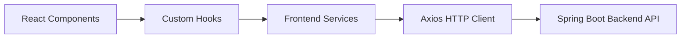
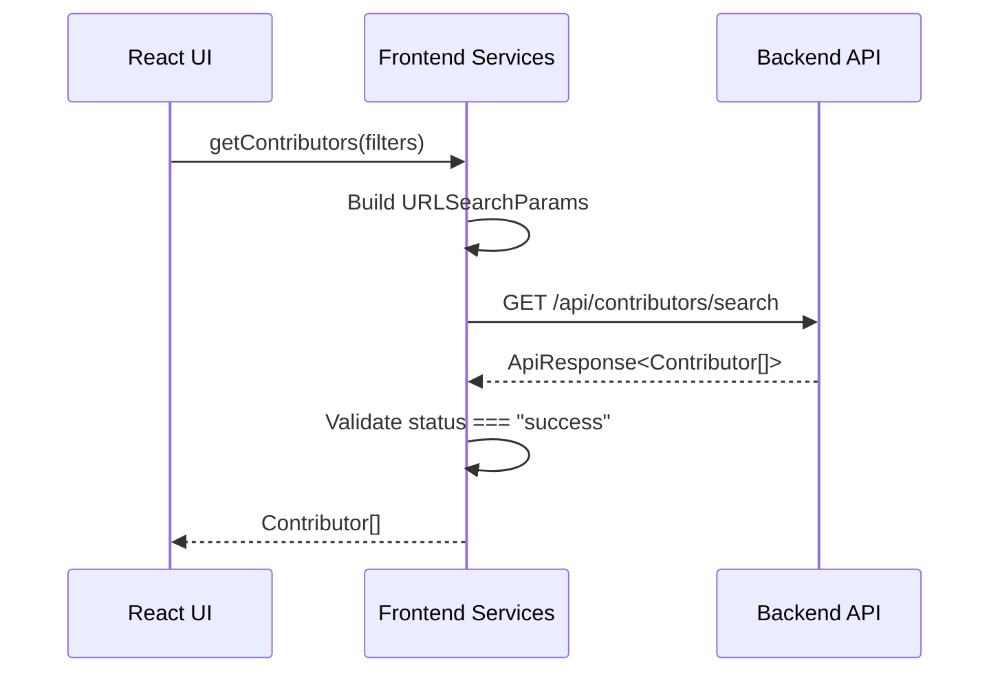
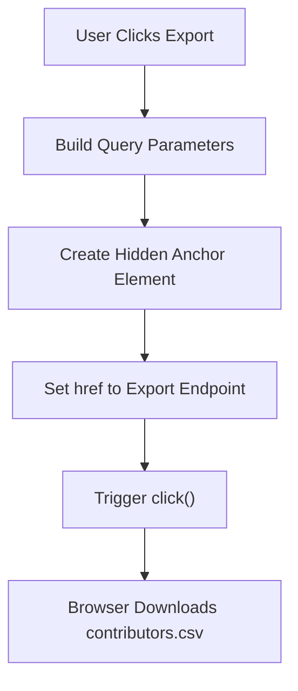
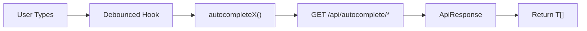
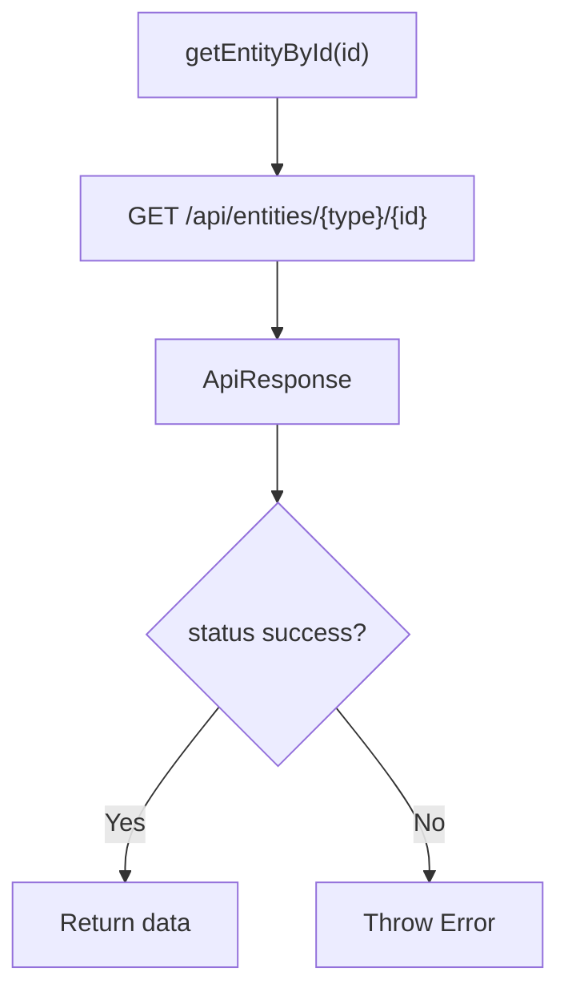
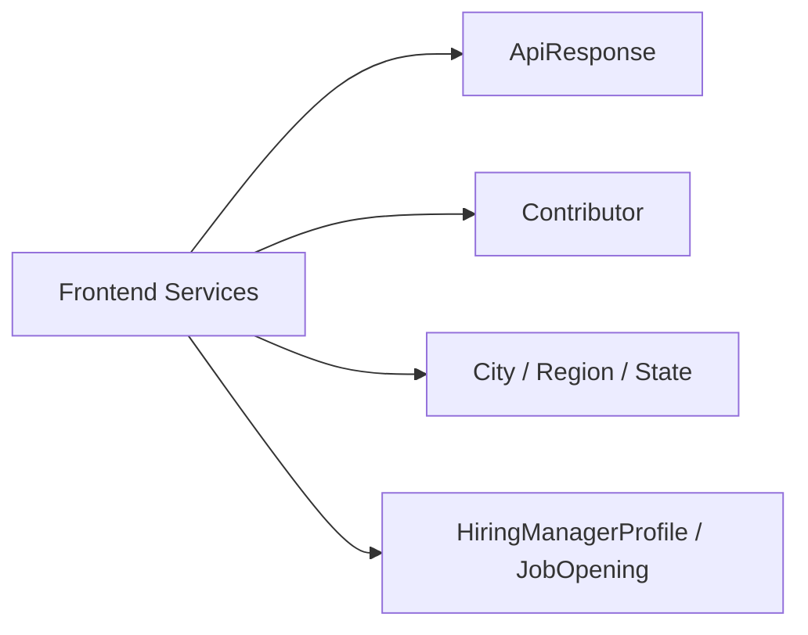

# Frontend Services

The **Frontend Services** module acts as the HTTP communication layer between the React frontend and the Spring Boot backend of Major League GitHub. It centralizes all API calls, enforces consistent response handling, and provides strongly typed interfaces for data exchange.

This module is responsible for:

- Configuring the HTTP client (Axios) and base backend URL
- Fetching and exporting contributor rankings
- Powering autocomplete search across geographic and language filters
- Fetching entity details by ID
- Exposing hiring-related endpoints
- Ensuring consistent `ApiResponse<T>` validation and error handling

By isolating API logic from UI components and hooks, the Frontend Services module keeps presentation concerns separate from networking and data orchestration.

---

## 1. Architectural Role

The Frontend Services module sits between React components/hooks and the backend REST API.



### Responsibilities by Layer

- **React Components**: Render tables, filters, and views.
- **Custom Hooks**: Manage URL state, filtering logic, and lifecycle behavior.
- **Frontend Services**: Perform HTTP requests and validate API responses.
- **Backend API**: Provides REST endpoints for contributors, autocomplete, entities, and hiring data.

The module ensures UI layers never directly construct raw URLs or handle response envelope parsing.

---

## 2. Axios Configuration and Environment Integration

At initialization, Axios is configured with a base URL:

```typescript
const BACKEND_API_URL = process.env.BACKEND_API_URL || '/';
axios.defaults.baseURL = BACKEND_API_URL;
```

### Key Characteristics

- Uses `process.env.BACKEND_API_URL` for environment-based backend routing.
- Defaults to `/` for same-origin deployments.
- Applies globally via `axios.defaults.baseURL`.

This design supports:

- Local development against a remote backend
- Reverse-proxy deployments
- Containerized or Kubernetes-based environments

---

## 3. Core Interface: GetContributorsParams

The `GetContributorsParams` interface defines filter inputs for contributor search.

```typescript
interface GetContributorsParams {
    cityId?: string;
    regionId?: string;
    stateId?: string;
    teamId?: string;
    languageId?: string;
    maxResults?: number;
    signal?: AbortSignal;
}
```

### Design Principles

- All filters are optional to support flexible combinations.
- `maxResults` defaults to 15.
- `signal` enables request cancellation (important for rapid filter changes).

This interface enforces strong typing at compile time and prevents malformed queries.

---

## 4. Contributor Retrieval Flow

The `getContributors` function builds query parameters dynamically and validates the backend response envelope.



### Important Behaviors

1. Dynamically constructs `URLSearchParams`.
2. Sends `GET /api/contributors/search`.
3. Expects `ApiResponse<Contributor[]>`.
4. Throws an error if `status !== "success"`.
5. Returns only the `data` field to the caller.

This prevents UI components from needing to understand the response wrapper format.

---

## 5. CSV Export Flow

The `downloadContributors` function triggers a CSV export.



### Characteristics

- Uses `/api/contributors/export`.
- Constructs a hidden `<a>` element.
- Avoids using Axios for file streaming.
- Delegates download handling to the browser.

This approach simplifies file handling and avoids Blob management complexity.

---

## 6. Autocomplete Endpoints

Autocomplete endpoints support dynamic filtering across multiple dimensions:

- Regions
- States
- Cities
- Languages
- Soccer Teams

### Autocomplete Request Pattern

All autocomplete functions:

- Call `/api/autocomplete/...`
- Accept a `query` string
- Optionally accept related entity filters
- Support `AbortSignal`
- Validate `ApiResponse<T[]>`



### Special Case: Array Parameter Serialization

For endpoints accepting `cityIds`, Axios is configured with:

```typescript
paramsSerializer: {
  indexes: null
}
```

This prevents `[]` suffixes in query strings and ensures backend compatibility.

---

## 7. Entity Retrieval by ID

The module exposes entity-specific retrieval functions:

- `getRegionById`
- `getStateById`
- `getCityById`
- `getLanguageById`
- `getTeamById`

All follow the same structure:



This uniform pattern improves predictability and simplifies testing.

---

## 8. Hiring Endpoints

The module also integrates hiring-related features:

- `getHiringManagerProfile()` → `/api/hiring/manager`
- `getJobOpenings()` → `/api/hiring/jobs`

Both:

- Expect `ApiResponse<T>`.
- Enforce strict success validation.
- Return typed domain objects.

These endpoints power hiring pages and profile displays in the frontend.

---

## 9. Error Handling Strategy

Every request validates:

```typescript
if (response.data.status !== 'success') {
    throw new Error(response.data.message);
}
```

### Implications

- Centralized validation logic.
- UI receives either typed data or a thrown error.
- No partial or malformed payloads propagate upward.

This enforces a clean contract between frontend and backend.

---

## 10. Data Type Integration

The module relies on strongly typed interfaces:

- `ApiResponse<T>`
- `Contributor`
- `City`
- `Region`
- `State`
- `Language`
- `SoccerTeam`
- `HiringManagerProfile`
- `JobOpening`



This guarantees compile-time safety and consistency with backend contracts.

---

## 11. Design Patterns Used

### 1. Service Layer Abstraction
All HTTP logic is centralized in one module.

### 2. Response Envelope Validation
Backend responses are always unwrapped before returning to the UI.

### 3. Optional Filter Composition
Query parameters are dynamically composed only when provided.

### 4. Request Cancellation Support
`AbortSignal` enables cancellation for:

- Autocomplete queries
- Rapid filter switching
- Component unmount safety

---

## 12. Summary

The Frontend Services module is the networking backbone of the Major League GitHub frontend. It:

- Encapsulates all REST communication
- Normalizes backend responses
- Provides strong typing guarantees
- Enables flexible filtering and search
- Supports CSV exports
- Maintains separation between UI and transport logic

By isolating HTTP concerns in a dedicated service layer, the application remains modular, maintainable, and scalable as new backend endpoints are introduced.