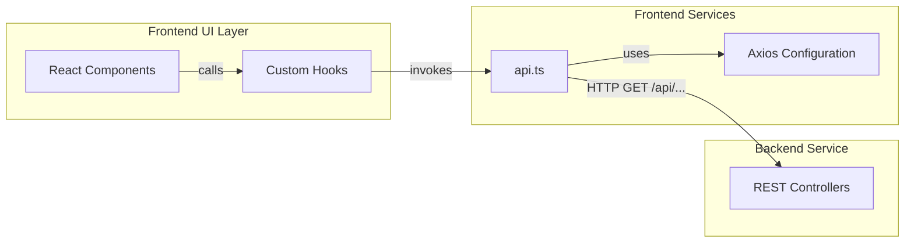
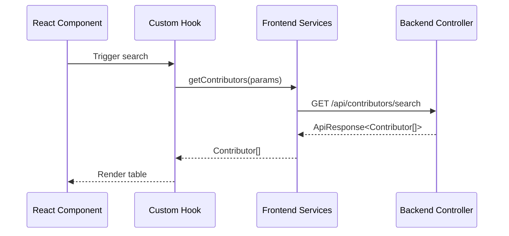
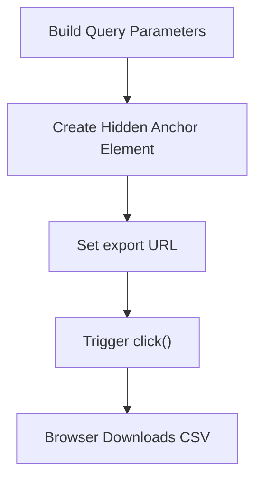
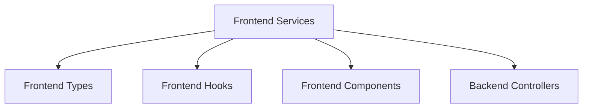

# Frontend Services

The **Frontend Services** module acts as the API integration layer of the React + TypeScript frontend. It provides a typed, centralized abstraction over all HTTP communication with the Backend Service, encapsulating request construction, query parameter handling, response validation, file downloads, and error propagation.

By isolating network logic in one place, the Frontend Services module keeps UI components declarative and focused on presentation while ensuring consistent communication patterns across the application.

---

## 1. Purpose and Responsibilities

The Frontend Services module is responsible for:

- Configuring the Axios HTTP client
- Managing the backend base URL via environment configuration
- Defining strongly typed API parameter contracts (e.g., `GetContributorsParams`)
- Wrapping backend endpoints in reusable service functions
- Validating `ApiResponse<T>` envelopes
- Supporting request cancellation via `AbortSignal`
- Triggering file downloads (CSV export)

It interacts closely with:

- [Frontend Types](../frontend-types/frontend-types.md) for shared API and domain models
- [Frontend Hooks](../frontend-hooks/frontend-hooks.md) for state synchronization and request lifecycle handling
- [Frontend Components](../frontend-components/frontend-components.md) which consume these services
- Backend Controllers exposed by the Backend Service

---

## 2. High-Level Architecture



### Key Observations

- UI never calls `axios` directly.
- All API requests pass through `api.ts`.
- Backend responses are wrapped in a typed `ApiResponse<T>` envelope.
- Errors are normalized by checking `response.data.status`.

---

## 3. Axios Configuration

### Base URL Resolution

The backend URL is resolved from the environment:

```typescript
const BACKEND_API_URL = process.env.BACKEND_API_URL || '/';
axios.defaults.baseURL = BACKEND_API_URL;
```

This enables:

- Local development against `http://localhost:8450`
- Production deployments with environment-specific backend routing
- Reverse-proxy setups where `/api` is forwarded to the backend

### Global Behavior

- All requests inherit the configured `baseURL`
- Requests return typed `ApiResponse<T>`
- Non-success responses throw a JavaScript `Error`

---

## 4. Core Interface: GetContributorsParams

The `GetContributorsParams` interface defines filtering criteria for contributor search:

```typescript
interface GetContributorsParams {
    cityId?: string;
    regionId?: string;
    stateId?: string;
    teamId?: string;
    languageId?: string;
    maxResults?: number;
    signal?: AbortSignal;
}
```

### Design Characteristics

- All filters are optional
- Supports request cancellation (`AbortSignal`)
- Encapsulates search query construction logic

This interface is consumed by both search and export functionality.

---

## 5. Contributor Search Flow

### Service Function

```typescript
getContributors(params: GetContributorsParams): Promise<Contributor[]>
```

### Request Lifecycle



### Important Behaviors

- Query parameters built via `URLSearchParams`
- `maxResults` defaults to 15
- Response envelope validated (`status === 'success'`)
- Throws error if backend reports failure

The returned `Contributor` type originates from [Frontend Types](../frontend-types/frontend-types.md).

---

## 6. CSV Export Flow

### Service Function

```typescript
downloadContributors(params: Omit<GetContributorsParams, 'signal'>)
```

### Behavior

Instead of using Axios for file streaming, this function:

1. Constructs query parameters
2. Creates a temporary anchor element
3. Sets `href` to `/api/contributors/export`
4. Programmatically triggers download



This avoids CORS or blob handling complexity and delegates file handling to the browser.

---

## 7. Autocomplete Services

Autocomplete endpoints support dynamic filtering in UI components such as dropdowns.

### Supported Autocomplete Domains

- Regions
- States
- Cities
- Languages
- Soccer Teams

Each function:

- Accepts a `query` string
- Accepts optional filtering context (e.g., `stateId`, `regionId`)
- Supports `AbortSignal` for debounced cancellation
- Returns typed arrays (`Region[]`, `State[]`, etc.)

### Example Pattern

```typescript
export const autocompleteRegions = async (
  query: string,
  stateId?: string,
  cityIds?: string[],
  signal?: AbortSignal
): Promise<Region[]>
```

### Parameter Serialization

For array parameters such as `cityIds`, Axios is configured with:

```typescript
paramsSerializer: {
  indexes: null
}
```

This ensures:

- `cityIds=1&cityIds=2`
- Not `cityIds[]=1&cityIds[]=2`

---

## 8. Entity Lookup Services

These services retrieve individual entities by ID:

- `getRegionById`
- `getStateById`
- `getCityById`
- `getLanguageById`
- `getTeamById`

### Pattern

```typescript
axios.get<ApiResponse<EntityType>>(`/api/entities/.../${id}`)
```

### Responsibilities

- Enforce consistent response envelope validation
- Return strongly typed domain objects
- Shield UI from endpoint structure changes

---

## 9. Hiring Services

The hiring endpoints expose:

- `getHiringManagerProfile()`
- `getJobOpenings()`

These return:

- `HiringManagerProfile`
- `JobOpening[]`

Types originate from [Frontend Types](../frontend-types/frontend-types.md).

### Hiring Data Flow


---

## 10. Error Handling Strategy

All service methods follow a consistent pattern:

```typescript
if (response.data.status !== 'success') {
    throw new Error(response.data.message);
}
```

### Benefits

- Centralized error normalization
- UI components can rely on promise rejection
- Compatible with React error boundaries
- Clean integration with async hooks

---

## 11. Dependency Relationships



### Module Responsibilities Separation

| Module | Responsibility |
|--------|----------------|
| Frontend Services | API communication layer |
| Frontend Types | Shared domain and API typing |
| Frontend Hooks | URL state + lifecycle coordination |
| Frontend Components | Presentation and user interaction |

---

## 12. Design Principles

### 1. Single Source of Network Truth
All HTTP calls live in one file (`api.ts`).

### 2. Strong Typing
Every request returns a typed domain model.

### 3. Envelope Validation
No component must manually check `status`.

### 4. Separation of Concerns
UI logic is decoupled from backend communication.

### 5. Abortable Requests
Autocomplete and search support cancellation to prevent race conditions.

---

## 13. How This Module Fits Into the System

The Frontend Services module forms the boundary between:

- The React application
- The Spring Boot Backend Service

It translates UI interactions into REST calls and transforms backend envelopes into usable domain models.

Without this module:

- Components would duplicate HTTP logic
- Error handling would be inconsistent
- Type safety would degrade
- Backend endpoint changes would require widespread refactoring

By centralizing network communication, the Frontend Services module ensures scalability, maintainability, and clarity across the Major League GitHub frontend architecture.
