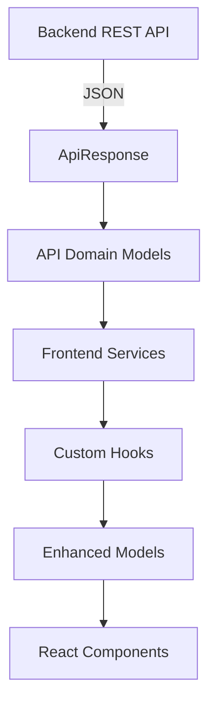
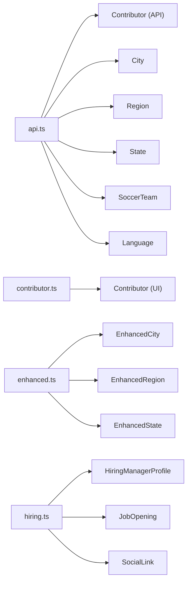
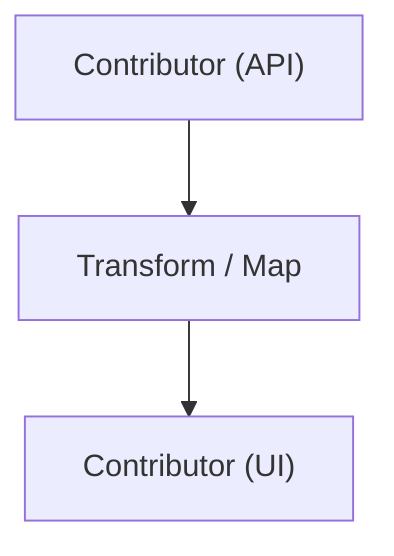
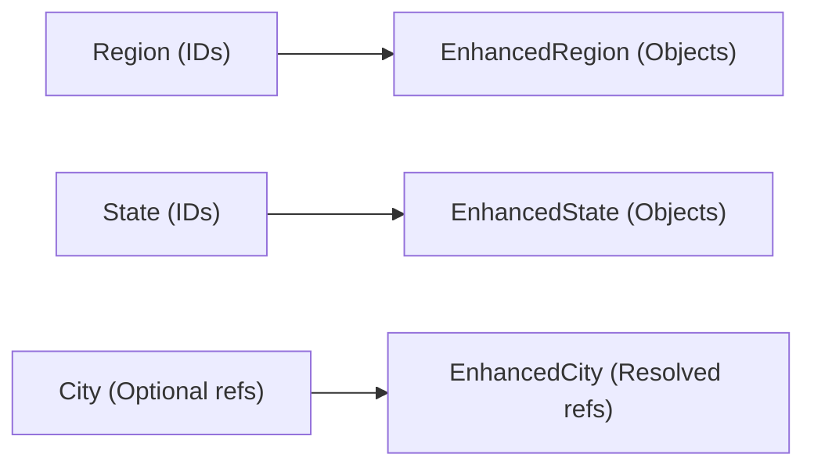
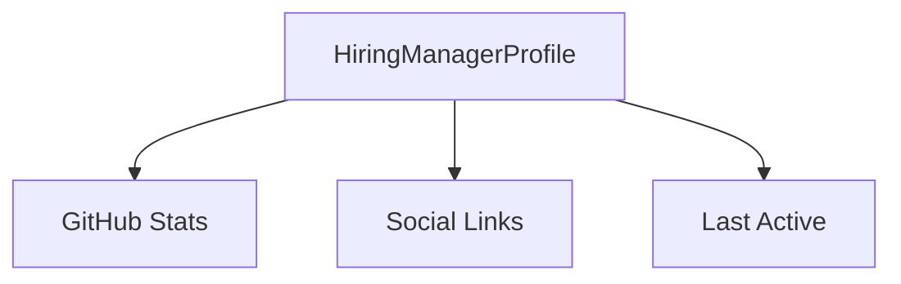
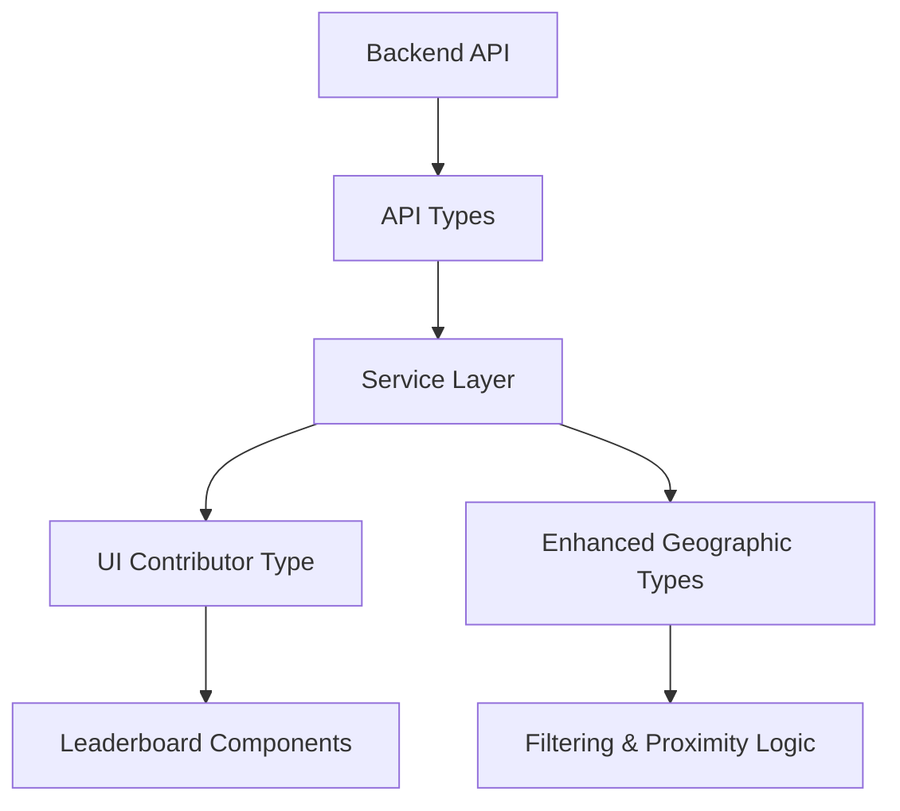

# Frontend Types

The **Frontend Types** module defines the TypeScript interfaces that model API responses, domain entities, enriched view models, and hiring-related data structures used throughout the React frontend.

It acts as the **type contract layer** between:

- The Spring Boot backend APIs
- Frontend services and hooks
- UI components
- Derived or enhanced client-side data models

By centralizing these interfaces, the module ensures strong compile-time guarantees, consistent data handling, and a clear separation between raw API payloads and UI-specific representations.

---

## 1. Architectural Role

The Frontend Types module sits between the API layer and UI components, defining the canonical shape of data flowing through the frontend.



### Key Responsibilities

- Define strongly typed API response wrappers
- Model domain entities such as contributors, cities, regions, and teams
- Provide enriched client-side variants of core entities
- Model hiring-related data for hiring manager views
- Maintain consistent naming and shape alignment with backend models

---

## 2. Module Structure Overview

The Frontend Types module is organized into four primary type groups:



Each group serves a different layer of abstraction in the frontend.

---

# 3. API Domain Models (`api.ts`)

These interfaces represent **raw backend payloads** and mirror backend model entities.

## 3.1 ApiResponse<T>

```typescript
export interface ApiResponse<T> {
    status: string;
    message: string;
    data: T;
}
```

### Purpose

- Generic wrapper for all backend responses
- Standardizes error and success messaging
- Enables strongly typed API service calls

Example usage:

```typescript
const response: ApiResponse<Contributor[]> = await fetchContributors();
```

---

## 3.2 Core Geographic Models

### City

Represents a physical city with optional relational references.

Key characteristics:

- Contains geographic coordinates
- References related `State` and `SoccerTeam`
- May include embedded reference objects

Notable design detail:

```typescript
state?: State;
nearestTeam?: SoccerTeam;
```

These fields allow the backend to optionally embed related entities to reduce round trips.

---

### Region

Represents a broader grouping of states.

```typescript
geo: {
    latitude: number;
    longitude: number;
};
```

Design highlights:

- Uses `stateIds` for lightweight references
- May optionally embed full `State[]` objects

---

### State

Represents a U.S. state or geographic region.

Important properties:

- `code` (e.g., CA, TX)
- `displayName`
- `iconUrl`
- `regionIds` linking to parent regions

---

## 3.3 Language

Represents a programming language used for leaderboard filtering.

Includes:

- Identifier
- Display name
- Icon URL

---

## 3.4 SoccerTeam

Represents an MLS team used for geographic proximity ranking.

Key fields:

- Geographic coordinates
- Stadium information
- League metadata
- Branding URLs

This model is heavily used for:

- Proximity calculations
- Leaderboard grouping
- Visual identity in UI components

---

## 3.5 Contributor (API Model)

The most central domain entity in the application.

```typescript
export interface Contributor {
    id: string;
    login: string;
    name: string | null;
    type: 'CONTRIBUTOR' | 'HIRING_MANAGER';
    city: City;
    nearestTeam: SoccerTeam | null;
    githubStats: {
        score: number;
        totalCommits: number;
        starsGiven: number;
        starsReceived: number;
        forksReceived: number;
        forksGiven: number;
        javaRepos: number;
    };
}
```

### Architectural Characteristics

- Contains both flattened metrics (e.g., `score`) and nested `githubStats`
- Embeds relational objects (`city`, `nearestTeam`)
- Includes hiring-related metadata via `type` and `socialLinks`

This model powers:

- Leaderboards
- Contributor profile views
- Hiring manager displays

---

# 4. UI-Level Contributor Model (`contributor.ts`)

This `Contributor` interface represents a **frontend-optimized version** of contributor data.

Key differences from API model:

- Focused on display-ready metrics
- Uses `latestCommitDate` (string) instead of timestamp
- Includes `location` string
- Removes deeply nested structures



### Purpose

- Simplify table rendering
- Provide display-ready fields
- Reduce UI transformation logic inside components

This separation prevents UI components from depending directly on backend data shape.

---

# 5. Enhanced Models (`enhanced.ts`)

Enhanced models introduce **client-side relational enrichment** using `Set` collections.

## 5.1 EnhancedCity

```typescript
export interface EnhancedCity extends Omit<City, 'state' | 'nearestTeam'> {
  state: State | null;
  nearestTeam: SoccerTeam | null;
}
```

Replaces optional references with explicitly resolved objects.

---

## 5.2 EnhancedRegion

```typescript
states: Set<State>;
cities: Set<City>;
```

Transforms:

- `stateIds` → `Set<State>`
- Adds city relationships

---

## 5.3 EnhancedState

Extends `State` by adding:

- `regions: Set<Region>`
- `cities: Set<City>`



### Design Motivation

- Avoid repeated lookups
- Enable fast graph traversal
- Support proximity and filtering logic

---

# 6. Hiring Models (`hiring.ts`)

The hiring types support the hiring manager feature.

## 6.1 SocialLink

```typescript
platform: 'linkedin' | 'twitter' | 'x' | 'github' | 'facebook' | 'instagram' | 'mastodon' | 'bluesky' | 'email' | 'website';
```

Provides typed platform validation.

---

## 6.2 JobOpening

Represents open roles associated with a hiring manager.

---

## 6.3 HiringManagerProfile

Includes:

- Public profile information
- Social links
- Extended GitHub metrics
- Activity timestamp



---

# 7. Data Flow Summary

The following diagram summarizes how types evolve across the frontend:



---

# 8. Design Principles

## 8.1 Clear Separation of Concerns

- API types mirror backend contracts
- UI types optimize rendering
- Enhanced types optimize relational traversal

## 8.2 Strong Type Safety

- Generic API response wrapping
- Discriminated unions (`CONTRIBUTOR | HIRING_MANAGER`)
- Strict platform enums for social links

## 8.3 Extensibility

- `Omit<>` usage allows safe overrides
- `Set<>` enables efficient graph modeling
- Optional embedding supports backend flexibility

---

# 9. Conclusion

The **Frontend Types** module provides the structural backbone of the frontend application. It:

- Defines the contract with the backend
- Enables safe transformations into UI-ready models
- Supports geographic enrichment logic
- Powers contributor leaderboard and hiring features

Without this module, data transformations would be scattered across components and services. Instead, Frontend Types centralizes domain modeling, improving maintainability, clarity, and long-term scalability of the application.
