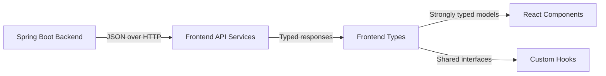
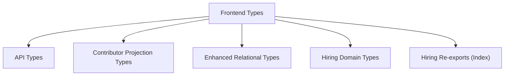
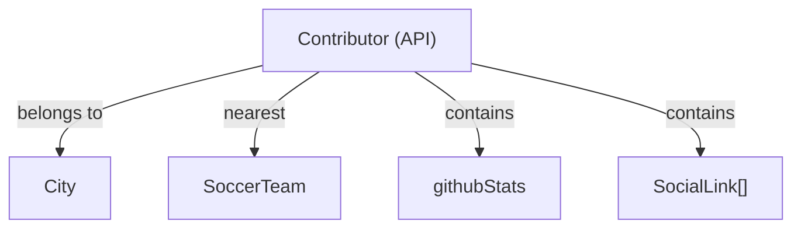
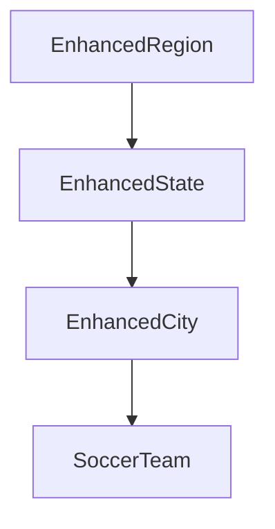
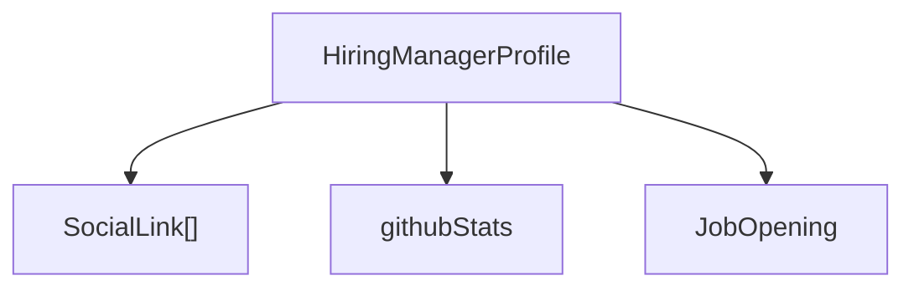
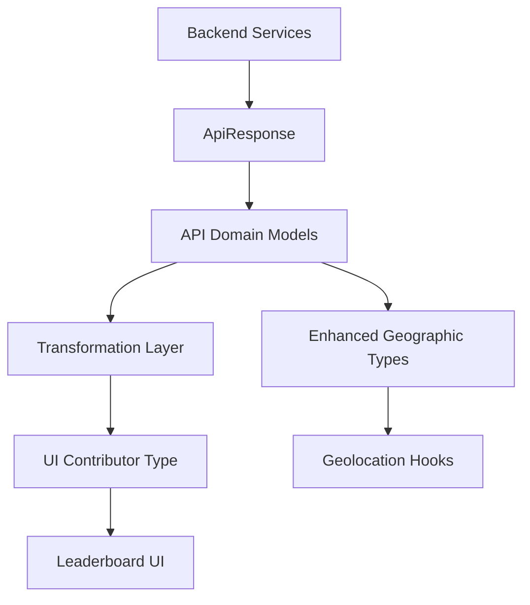

# Frontend Types

The **Frontend Types** module defines the TypeScript domain model for the Major League GitHub React application. It acts as the contract layer between the backend API and the frontend UI, ensuring strong typing, predictable data flow, and alignment with backend entities.

This module provides:

- API response and domain entity types
- UI-focused contributor projections
- Enhanced relational types for graph-like data modeling
- Hiring-related profile and job types
- Shared generic wrappers (e.g., `ApiResponse<T>`)

By centralizing these definitions, the application maintains type safety across components, hooks, and services while reflecting backend models defined in the service layer.

---

## Architectural Role

The Frontend Types module sits between API services and UI components.



### Responsibilities

1. **Define API contracts** matching backend responses
2. **Normalize data structures** for UI consumption
3. **Provide enhanced graph relationships** for location and region modeling
4. **Separate raw API models from UI-optimized projections**
5. **Ensure hiring and contributor domains remain consistent**

---

# Module Structure Overview

The module is organized into five logical type groups:



---

# 1. API Types

**File:** `frontend/src/types/api.ts`

These interfaces represent the canonical backend contract.

## ApiResponse<T>

Generic wrapper used for all backend responses.

```typescript
export interface ApiResponse<T> {
    status: string;
    message: string;
    data: T;
}
```

### Purpose
- Standardizes backend responses
- Enables consistent error and success handling
- Provides strong typing for generic payloads

---

## Geographic Domain Models

These types represent the geographic hierarchy used for leaderboard filtering and proximity calculations.

### City
- Linked to a state
- Contains geographic coordinates
- References nearest soccer team
- May include resolved `state` and `nearestTeam`

### Region
- Aggregates multiple states
- Contains central geo coordinates
- Supports UI grouping by region

### State
- Belongs to one or more regions
- Contains metadata (icon, displayName)

### SoccerTeam
- MLS-style team metadata
- Used for proximity-based ranking
- Includes stadium and coaching information

---

## Language

Represents a programming language filter.

- `id`
- `displayName`
- `iconUrl`

Used in leaderboard filtering and autocomplete components.

---

## Contributor (API Version)

The API-level Contributor is a fully hydrated backend representation.

### Key Characteristics

- Contains relational objects (`city`, `nearestTeam`)
- Includes detailed GitHub metrics
- Contains flattened metric duplicates for convenience
- Distinguishes contributor types:
  - `CONTRIBUTOR`
  - `HIRING_MANAGER`



---

# 2. Contributor Projection Types

**File:** `frontend/src/types/contributor.ts`

This file defines a UI-focused projection of Contributor.

## Contributor (UI Version)

This type:

- Flattens key metrics
- Uses `latestCommitDate` instead of raw timestamp
- Adds UI-specific fields like `location`
- Keeps `city` and `nearestTeam` references

### Why Separate from API Contributor?

The API version reflects backend structure. The UI version:

- Matches table rendering needs
- Avoids redundant nested structures
- Enables transformation without mutating raw API data


This separation improves maintainability and allows independent backend evolution.

---

# 3. Enhanced Relational Types

**File:** `frontend/src/types/enhanced.ts`

These types enrich geographic models with full object references and set-based relationships.

## EnhancedCity

Extends City while:

- Ensuring `state` and `nearestTeam` are resolved
- Replacing optional references with nullable concrete ones

## EnhancedRegion

Extends Region while:

- Using `Set<State>` instead of array
- Adding `cities: Set<City>`

## EnhancedState

Extends State while:

- Adding `regions: Set<Region>`
- Adding `cities: Set<City>`



### Purpose of Enhanced Types

These types are used when:

- Building in-memory geographic graphs
- Computing nearest regions
- Supporting advanced filtering
- Avoiding repeated lookups

Using `Set<T>` ensures uniqueness and improves traversal logic.

---

# 4. Hiring Domain Types

**File:** `frontend/src/types/hiring.ts`

Represents hiring managers and job-related information.

## SocialLink

Supports multiple platforms:

- linkedin
- twitter / x
- github
- facebook
- instagram
- mastodon
- bluesky
- email
- website

## JobOpening

Represents:

- Title
- Location
- External URL

## HiringManagerProfile

Contains:

- Personal metadata
- Social links
- GitHub statistics
- Activity timestamp



This domain integrates contributor ranking with recruiting capabilities.

---

# 5. Hiring Index Types

**File:** `frontend/src/types/hiring/index.ts`

This file provides simplified exports of hiring-related types.

Differences from the full hiring types:

- Restricted social platforms
- Reduced GitHub metrics
- Lighter-weight profile shape

### Purpose

- Support lightweight imports
- Reduce bundle coupling
- Enable controlled exposure of hiring interfaces

---

# Data Flow Summary



---

# Design Principles

## 1. Strong Contract Alignment

Frontend API types closely mirror backend entities to avoid serialization mismatches.

## 2. Separation of Concerns

- API types represent backend truth
- UI types represent presentation needs
- Enhanced types represent relational graph logic

## 3. Immutability Friendly

Interfaces encourage pure transformation functions rather than mutation.

## 4. Domain-Driven Structure

Types reflect real-world concepts:

- Geographic hierarchy
- Soccer team proximity
- Contributor scoring
- Hiring workflows

---

# When to Use Each Type

| Scenario | Recommended Type |
|----------|-----------------|
| Raw API response | `ApiResponse<T>` |
| Leaderboard row | UI `Contributor` |
| Data normalization | API `Contributor` |
| Geographic graph building | `EnhancedRegion`, `EnhancedState`, `EnhancedCity` |
| Hiring profile display | `HiringManagerProfile` |

---

# Conclusion

The **Frontend Types** module is the foundation of type safety across the Major League GitHub frontend.

It:

- Bridges backend contracts and UI rendering
- Models complex geographic and contributor relationships
- Supports hiring workflows
- Enables scalable, maintainable frontend development

By clearly separating API contracts, UI projections, and enhanced relational models, the application maintains both flexibility and structural integrity as features evolve.