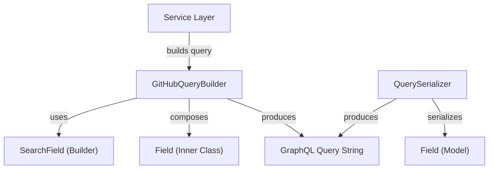
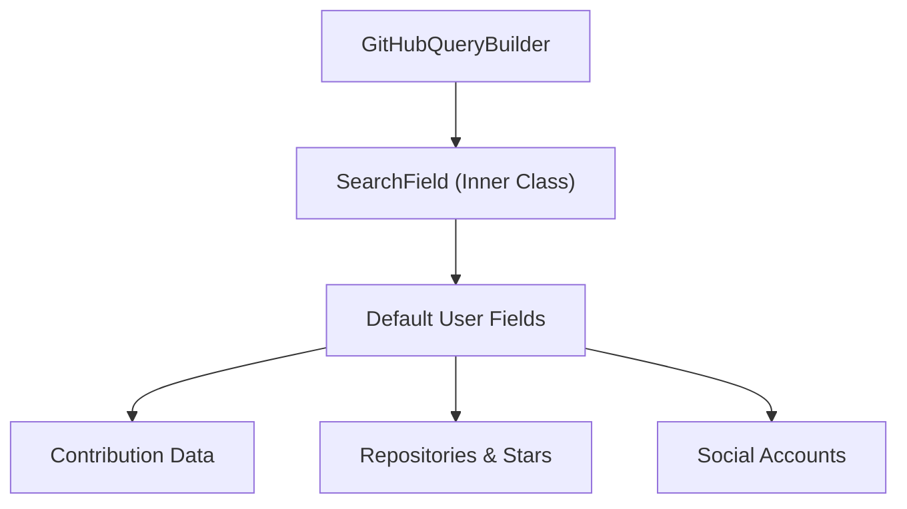
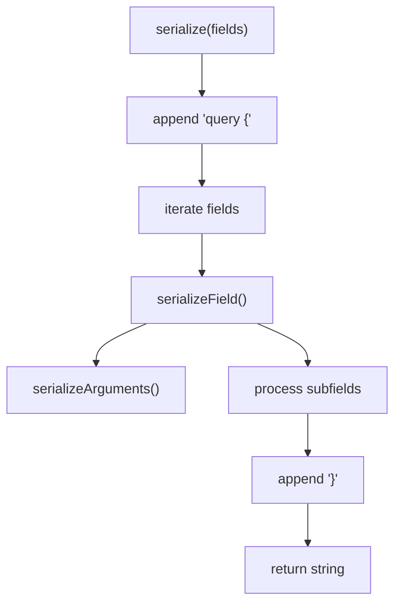
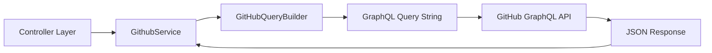

# Graphql Components

## Overview

The **Graphql Components** module is responsible for programmatically constructing and serializing GraphQL queries used to retrieve contributor and repository data from the GitHub GraphQL API.

Instead of relying on static query strings, this module provides a fluent, object-oriented query builder that:

- Dynamically builds complex GraphQL queries
- Supports nested fields and inline fragments
- Adds filters such as location and language
- Applies sorting and pagination (cursor-based)
- Serializes queries into valid GraphQL syntax

This module is primarily consumed by the Service Layer (notably `GithubService`) to fetch contributor data that powers the Major League GitHub leaderboard.

---

## Responsibilities

The Graphql Components module provides three major capabilities:

1. **Structured Field Modeling** – Represent GraphQL fields as hierarchical objects
2. **GitHub-Specific Query Construction** – Build search queries tailored for GitHub users
3. **Query Serialization** – Convert field trees into valid GraphQL query strings

Together, these capabilities allow dynamic and extensible query generation without manual string concatenation.

---

## High-Level Architecture



The module contains two complementary query-building approaches:

- A **string-based fluent builder** optimized for GitHub search queries
- A **tree-based field model** with structured serialization

---

## Core Components

### 1. Field (Tree Model)

**Class:** `cx.flamingo.analysis.graphql.Field`

This class represents a GraphQL field as a node in a hierarchical tree structure.

### Key Features

- Maintains:
  - Field name
  - Arguments (ordered via `LinkedHashMap`)
  - Subfields
  - Parent reference (for fluent traversal)
- Supports fluent nesting and sibling navigation

### Example Usage Pattern

```java
Field root = new Field("search")
    .addArg("type", "USER")
    .addArg("first", 25);

Field nodes = root.addField("nodes");
nodes.addField("login");
nodes.addField("location");
```

### Design Characteristics

- Preserves argument order
- Supports deep nesting
- Enables inline fragment usage (e.g., `... on User`)
- Parent tracking allows returning to upper levels in the tree

This structure is later serialized by `QuerySerializer`.

---

### 2. SearchField (Tree Extension)

**Class:** `cx.flamingo.analysis.graphql.SearchField`

This class extends the tree-based `Field` model and specializes it for GitHub search queries.

### Key Responsibilities

- Appends query fragments (e.g., location, language)
- Maintains a combined `query` argument
- Escapes values properly

### Example

```java
SearchField search = new SearchField("search")
    .addArg("type", "USER")
    .appendQuery("location:\"Texas\"")
    .appendQuery("language:Java");
```

This approach is useful when building structured search filters dynamically.

---

### 3. GitHubQueryBuilder (Fluent Query Builder)

**Class:** `cx.flamingo.analysis.graphql.GitHubQueryBuilder`

This is the primary entry point used by the Service Layer to construct GitHub-specific queries.

Unlike the generic `Field` model, this builder is optimized specifically for GitHub user search.

### Internal Structure



### Default Query Structure

When instantiated, `SearchField` (inner class) automatically configures:

- `userCount`
- `pageInfo { hasNextPage, endCursor }`
- `nodes { ... on User { ... } }`

For each user:

- Identity fields (login, name, avatar, etc.)
- Social accounts
- Contributions collection and calendar
- Starred repositories
- Repository metadata (stars, forks, primary language)

This ensures consistent data retrieval across leaderboard requests.

---

### Fluent API

Example usage:

```java
String query = new GitHubQueryBuilder()
    .searchUsers(25)
    .location("Texas")
    .language("Java")
    .cursor("abc123")
    .build();
```

This produces:

```text
query { search(type: USER, first: 25, query: "location:\"Texas\" language:Java sort:repositories-desc sort:stars-desc sort:followers-desc") { ... } }
```

### Key Builder Methods

- `searchUsers(int size)` – Sets search type and default sorting
- `location(String location)` – Adds location filter
- `language(String language)` – Adds language filter
- `cursor(String cursor)` – Enables pagination
- `build()` – Returns final GraphQL query string

---

### 4. GitHubQueryBuilder.Field (Inner Class)

This inner class provides a lightweight string-based representation of fields.

Features:

- Field aliasing
- Argument concatenation
- Recursive `build()` method
- Efficient string assembly

This version is optimized for performance and compact query generation.

---

### 5. GitHubQueryBuilder.SearchField (Inner Class)

This inner class extends the inner `Field` class and provides:

- GitHub search filter aggregation
- Sort configuration
- Query argument rewriting
- Automatic escaping

It maintains a `queryFilters` string that consolidates:

- Location filters
- Language filters
- Sort directives

Each update reconstructs the `query` argument safely.

---

### 6. QuerySerializer

**Class:** `cx.flamingo.analysis.graphql.QuerySerializer`

This class converts a list of tree-based `Field` objects into a formatted GraphQL query string.

### Responsibilities

- Adds indentation for readability
- Serializes arguments
- Recursively processes subfields
- Handles inline fragments (e.g., `... on User`)

### Serialization Flow



The serializer is useful when a fully structured query tree is built using the standalone `Field` model.

---

## Data Flow Within the System



1. Controller triggers contributor retrieval
2. Service constructs a query via `GitHubQueryBuilder`
3. Query is sent to GitHub GraphQL API
4. Response is mapped into model entities
5. Data flows back to the frontend

---

## Design Decisions

### 1. Programmatic Query Construction

Avoids brittle string templates and enables:

- Dynamic filtering
- Safe nesting
- Reusable logic

### 2. Separation of Concerns

- `Field` → generic tree modeling
- `SearchField` → search-specific logic
- `GitHubQueryBuilder` → GitHub-specific orchestration
- `QuerySerializer` → formatting and output

### 3. GitHub-Optimized Defaults

The builder preconfigures common fields required for leaderboard ranking:

- Contributions
- Stars
- Repository metadata
- Social accounts

This guarantees consistent backend responses.

---

## Extending the Module

To extend functionality:

- Add additional filters in `SearchField`
- Add new nested fields in `setupDefaultFields()`
- Introduce reusable field fragments using the tree-based `Field` model
- Extend sorting logic within `addSort()`

When modifying filters, ensure:

- Proper escaping of quotes
- No duplication of the `query` argument
- Compatibility with GitHub GraphQL schema

---

## Summary

The **Graphql Components** module provides a structured, extensible, and GitHub-optimized way to build GraphQL queries for contributor discovery and ranking.

It acts as the backbone of data retrieval in Major League GitHub by:

- Constructing dynamic search queries
- Supporting pagination and filtering
- Fetching comprehensive contributor statistics
- Ensuring consistent data shape for downstream services

Without this module, the leaderboard’s data pipeline would rely on fragile string concatenation and duplicated query logic. Instead, Graphql Components centralizes and standardizes query construction across the backend.