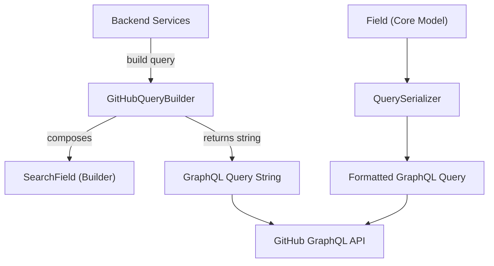
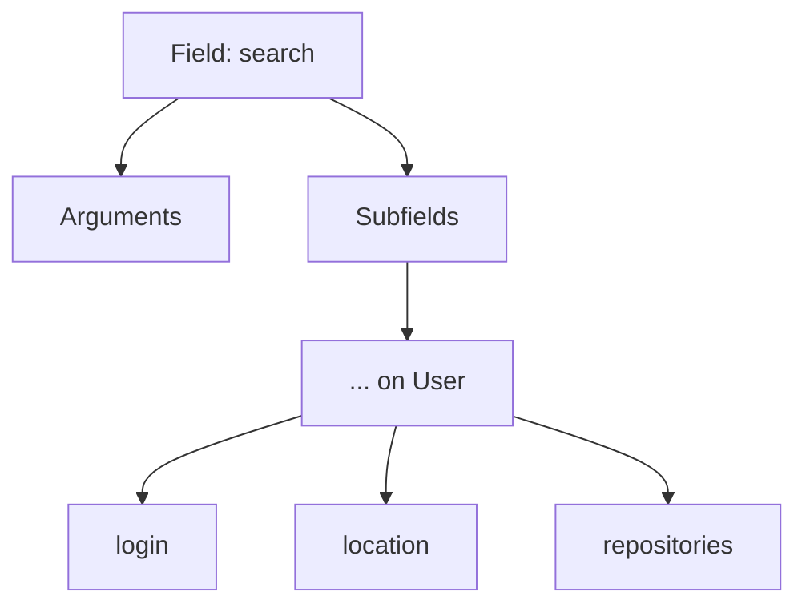
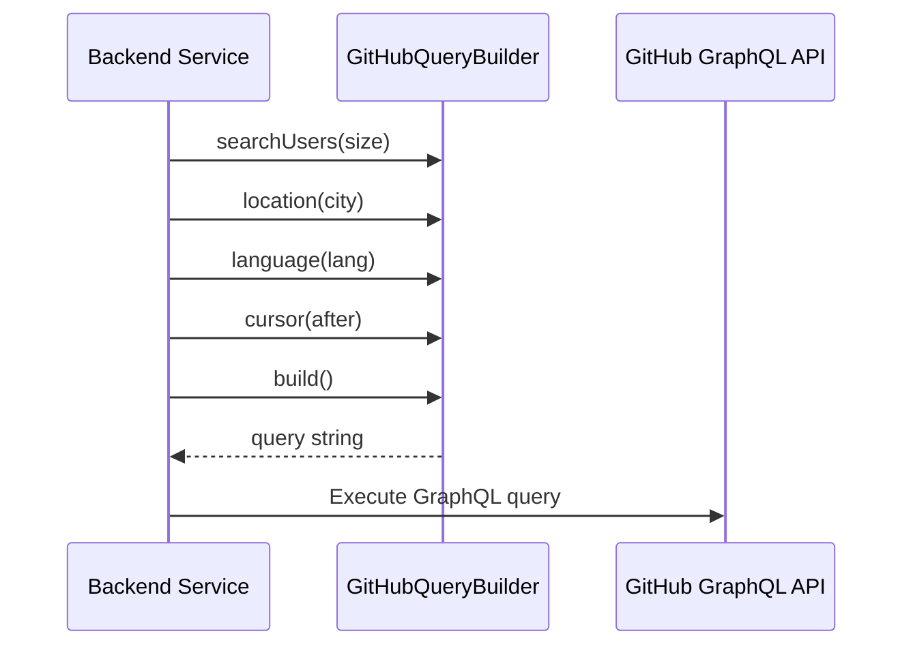
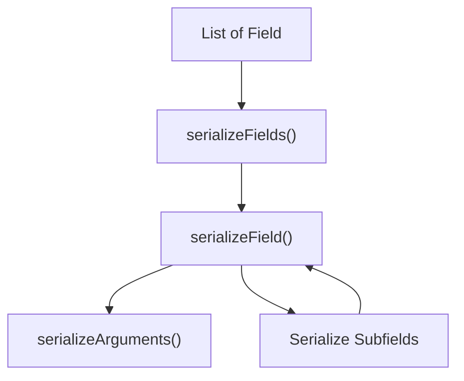
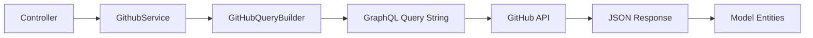

# Graphql Components

## Overview

The **Graphql Components** module is responsible for programmatically constructing and serializing GitHub GraphQL queries used by the backend services. Instead of relying on hard-coded query strings, this module provides a fluent, type-safe builder API that dynamically assembles complex GraphQL queries for searching users, retrieving repository statistics, and collecting contribution metrics.

It acts as the query composition layer between the **Backend Services** (notably `GithubService`) and the external GitHub GraphQL API.

---

## Purpose and Responsibilities

The Graphql Components module provides:

- A fluent query builder for GitHub user search
- Structured GraphQL field composition with nesting support
- Automatic query filter construction (location, language, sorting)
- Pagination support via cursors
- Query serialization into executable GraphQL strings

This abstraction improves:

- Maintainability (no scattered query strings)
- Reusability (common query structure reused across services)
- Extensibility (easy to add new fields or filters)
- Readability (clear tree-based structure of GraphQL fields)

---

## High-Level Architecture



The module contains two parallel mechanisms for building GraphQL queries:

1. **GitHubQueryBuilder + nested Field classes** (primary implementation)
2. **Field + QuerySerializer** (generic GraphQL builder and serializer)

---

## Core Components

### 1. Field (Core Graph Model)

**Class:** `cx.flamingo.analysis.graphql.Field`

This class represents a generic GraphQL field node. It models:

- Field name
- Arguments (`Map<String, Object>`)
- Nested subfields
- Parent-child relationships

### Key Capabilities

- `addArg(key, value)` – attach GraphQL arguments
- `addField(name)` – add nested subfields
- `nest(name)` – descend into nested structure
- `add(name)` – return to parent level

This implementation provides a tree-based representation of GraphQL queries.

#### Structural Representation



---

### 2. GitHubQueryBuilder

**Class:** `cx.flamingo.analysis.graphql.GitHubQueryBuilder`

This is the primary high-level builder used by backend services to construct GitHub-specific queries.

It encapsulates:

- Search configuration
- Sorting logic
- Filtering logic
- Pagination support
- Default field selection

### Typical Usage Flow



### Search Configuration

The builder supports:

- `searchUsers(int size)` – defines search type and sorting
- `location(String location)` – filters by user location
- `language(String language)` – filters by programming language
- `cursor(String cursor)` – pagination support
- `build()` – generates final query string

---

### 3. GitHubQueryBuilder.SearchField (Inner Class)

This is a specialized search node that:

- Defines default query structure
- Adds sorting rules
- Appends dynamic search filters
- Escapes query strings safely

#### Default Query Structure

The builder automatically includes:

- `userCount`
- `pageInfo` (pagination metadata)
- `nodes` with `... on User` fragment
- Social accounts
- Contribution statistics
- Repository metadata
- Primary language information

This ensures consistent response payloads across the system.

---

### 4. QuerySerializer

**Class:** `cx.flamingo.analysis.graphql.QuerySerializer`

This component serializes a list of `Field` objects into a properly formatted GraphQL query string with indentation.

### Responsibilities

- Traverse the field tree recursively
- Serialize arguments
- Maintain indentation levels
- Handle inline fragments (e.g., `... on User`)

#### Serialization Flow



This serializer is independent of GitHub-specific logic and can be reused for other GraphQL queries.

---

### 5. SearchField (Standalone Class)

**Class:** `cx.flamingo.analysis.graphql.SearchField`

This class extends the core `Field` class and provides:

- A query string accumulator
- Fluent `appendQuery()` method
- Automatic updating of the `query` argument

It is a lighter alternative to the inner `SearchField` used in `GitHubQueryBuilder`.

---

## End-to-End Query Lifecycle



1. A controller requests contributor data.
2. The service layer constructs a query using Graphql Components.
3. The query is sent to GitHub's GraphQL API.
4. The response is mapped into model entities.

---

## Design Characteristics

### Fluent API Design

The builder pattern allows readable chained calls such as:

```text
searchUsers(50)
  .location("Austin")
  .language("Java")
  .cursor("abc123")
  .build()
```

### Tree-Based Query Modeling

GraphQL’s hierarchical structure is mirrored directly in Java objects.

### Separation of Concerns

- Query construction logic is isolated from business logic
- Serialization is separated from query composition
- Backend services remain unaware of raw query syntax

### Extensibility

To add new GitHub fields:

1. Modify default structure inside `SearchField`
2. Add new filters or sorting rules
3. Extend `Field` logic if needed

No controller or service changes are required unless new filtering parameters are exposed.

---

## Why This Module Matters

The Graphql Components module is a foundational infrastructure layer that enables:

- Accurate GitHub contributor ranking
- Advanced filtering (language, region, location)
- Rich contributor profiles (repos, stars, contributions)
- Pagination support for leaderboard views

By abstracting away GraphQL complexity, it keeps backend services clean while ensuring powerful and flexible GitHub data retrieval.

---

## Summary

The **Graphql Components** module provides a structured, fluent, and extensible way to construct GitHub GraphQL queries. It centralizes query logic, enforces consistency, and integrates seamlessly with backend services and model entities.

It is the backbone of all GitHub data retrieval in the system.