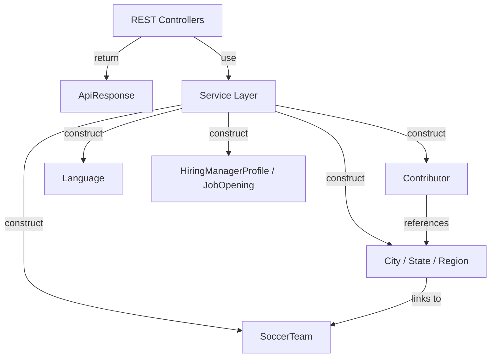
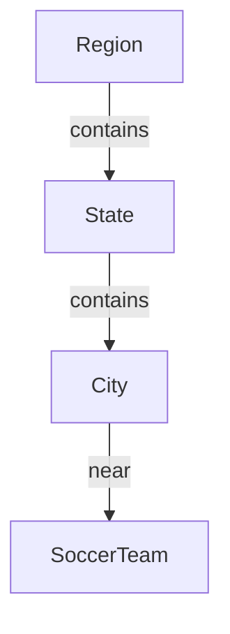
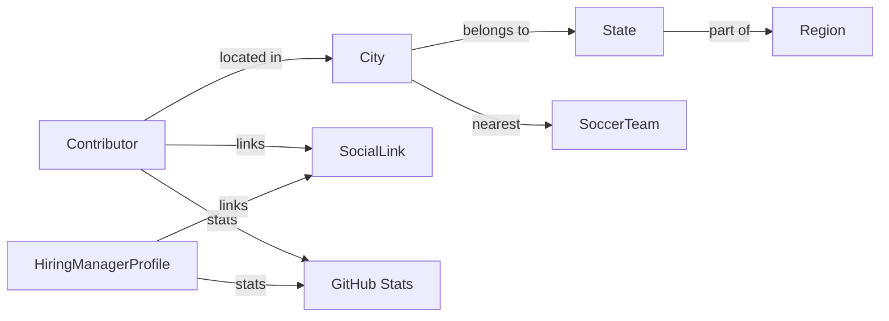

# Model Entities

The **Model Entities** module defines the core domain model for the Major League GitHub backend. It contains the immutable and mutable data structures that represent contributors, hiring managers, geographic hierarchies, soccer teams, programming languages, job openings, and standardized API responses.

This module is the foundation of the backend architecture. All higher-level layers—controllers, services, caching, and GraphQL integrations—operate on these entities to produce API responses consumed by the frontend.

---

## 1. Purpose and Responsibilities

The Model Entities module is responsible for:

- Defining domain objects shared across the backend
- Modeling relationships between geography, contributors, and soccer teams
- Representing GitHub statistics and hiring metadata
- Providing a consistent API response wrapper
- Enabling serialization/deserialization via Jackson
- Supporting builder-style object creation via Lombok

These entities are intentionally lightweight and primarily serve as data carriers (POJOs) with minimal business logic.

---

## 2. High-Level Architecture

The Model Entities module sits at the core of the backend service layer.



### Key Design Characteristics

- **Separation of concerns**: Entities contain no service or persistence logic.
- **Bidirectional enrichment**: Many entities include both ID references and optional embedded reference objects.
- **Serialization control**: `@JsonInclude(JsonInclude.Include.NON_NULL)` prevents unnecessary payload bloat.
- **Builder pattern**: All mutable entities use Lombok `@Builder` for safe and readable construction.

---

## 3. Core Entity Groups

The Model Entities module can be logically divided into the following groups:

1. API Wrapper
2. Contributor & Hiring Domain
3. Geographic Hierarchy
4. Soccer Team Domain
5. Language Domain
6. Social & Job Metadata

Each group is described below.

---

# 4. API Wrapper

## ApiResponse<T>

**Class:** `ApiResponse<T>`  
**Purpose:** Standardized API response envelope used by controllers.

### Structure

```text
ApiResponse<T>
 ├─ status   : "success" | "error"
 ├─ message  : optional message
 └─ data     : generic payload
```

### Static Factory Methods

- `success(T data)`
- `success(T data, String message)`
- `error(String message)`

### Why This Matters

- Ensures consistent JSON response structure
- Simplifies frontend parsing
- Centralizes success/error semantics
- Enables strong typing with generics

---

# 5. Contributor & Hiring Domain

## 5.1 Contributor

**Class:** `Contributor`

This is the most central entity in the system. It models both:

- GitHub contributors
- Hiring managers

### Role Enum

```text
Role
 ├─ CONTRIBUTOR
 └─ HIRING_MANAGER
```

### Core Identity Fields

- `login`
- `name`
- `avatarUrl`
- `url`
- `email`
- `role` (job title)
- `bio`
- `type` (Role enum)

### Location & Team Association

- `cityId`
- `nearestTeamId`
- `city` (optional reference)
- `nearestTeam` (optional reference)

### GitHub Statistics

There are two storage patterns:

#### A. Contributor (CONTRIBUTOR role)

Individual numeric fields:

- `totalCommits`
- `javaRepos`
- `starsReceived`
- `forksReceived`
- `starsGiven`
- `forksGiven`
- `score`

#### B. Hiring Manager (HIRING_MANAGER role)

- `githubStats` (Map<String, Integer>)

### Unified Stats Access

`getGithubStats()` normalizes both representations:

- If role is `CONTRIBUTOR`, it dynamically converts individual fields into a map
- If role is `HIRING_MANAGER`, it returns the stored map

This ensures API consumers always receive consistent stat structures.

### Activity Tracking

- `lastActive : Instant`

---

## 5.2 HiringManagerProfile

A specialized profile structure for hiring managers.

### Fields

- `name`
- `avatarUrl`
- `role`
- `bio`
- `socialLinks`
- `githubStats`
- `lastActive`

This is a simplified representation used in hiring-specific flows.

---

## 5.3 JobOpening

Represents a job posting linked to a hiring manager.

### Fields

- `id`
- `title`
- `location`
- `url`

Designed to be lightweight and embeddable within hiring workflows.

---

## 5.4 SocialLink

Represents external platform links.

### Fields

- `platform`
- `url`

Used in:

- `Contributor`
- `HiringManagerProfile`

---

# 6. Geographic Hierarchy

The geographic model is hierarchical and relational.



## 6.1 Region

**Immutable Value Object** using Lombok `@Value`.

### Fields

- `id`
- `name` (internal identifier)
- `displayName` (human-readable)
- `geo : GeoCoordinates`
- `stateIds`
- `states` (optional reference set)
- `cities` (optional reference set)

### Nested Class: GeoCoordinates

```text
GeoCoordinates
 ├─ latitude
 └─ longitude
```

Represents the geographic center of a region.

---

## 6.2 State

Represents a U.S. state.

### Fields

- `id`
- `name`
- `code`
- `displayName`
- `iconUrl`
- `regionIds`
- `regions` (optional reference)
- `cities` (optional reference)

Uses `@JsonInclude(NON_NULL)` to prevent null reference collections from appearing in API responses.

---

## 6.3 City

Represents a city within a state.

### Fields

- `id`
- `name`
- `stateId`
- `population`
- `latitude`
- `longitude`
- `regionIds`
- `nearestTeamId`

### Reference Objects

- `state`
- `regions`
- `nearestTeam`

This dual design (IDs + references) allows:

- Lightweight responses when only IDs are needed
- Fully enriched responses when deep object graphs are required

---

# 7. Soccer Team Domain

## SoccerTeam

Represents a professional soccer team used to gamify contributor rankings.

### Fields

- `id`
- `name`
- `city`
- `state`
- `latitude`
- `longitude`
- `league`
- `stadium`
- `stadiumCapacity`
- `joinedYear`
- `headCoach`
- `teamUrl`
- `wikipediaUrl`
- `logoUrl`

### Role in the System

- Used to associate contributors with their nearest MLS team
- Supports geographic ranking views
- Enables stadium proximity filtering

---

# 8. Language Domain

## Language

Represents a programming language used for filtering and ranking.

### Fields

- `id`
- `name`
- `displayName`
- `iconUrl`

Used in:

- Autocomplete flows
- Filtering contributor leaderboards
- Frontend language badges

---

# 9. Entity Relationship Overview

Below is a consolidated view of relationships across the domain model:



---

# 10. Serialization & Design Decisions

## 10.1 Lombok Usage

The module relies heavily on:

- `@Data`
- `@Builder`
- `@NoArgsConstructor`
- `@AllArgsConstructor`
- `@Value`

This minimizes boilerplate and keeps entities readable.

## 10.2 JSON Behavior

- `@JsonInclude(JsonInclude.Include.NON_NULL)` avoids null fields in API responses.
- Nested reference objects are optional and populated only when needed.

## 10.3 Immutability vs Mutability

- `Region` is immutable (`@Value`)
- Most other entities are mutable via Lombok-generated setters

This hybrid approach balances safety and flexibility.

---

# 11. How This Module Fits Into the System

Within the backend architecture:

- **Controllers** return `ApiResponse<T>` wrapping model entities.
- **Services** construct and enrich entities.
- **Cache layer** stores serialized entities.
- **GraphQL components** transform remote GitHub data into these entities.
- **Frontend** consumes serialized versions of these models.

The Model Entities module therefore acts as:

- The canonical domain contract of the backend
- The shared language between services and controllers
- The schema foundation for frontend integration

---

# 12. Summary

The **Model Entities** module defines the structural backbone of Major League GitHub.

It models:

- Contributors and hiring managers
- Geographic hierarchies
- Soccer teams and proximity relationships
- Programming languages
- Job openings and social links
- Standardized API responses

By centralizing domain definitions in a clean, well-structured module, the system maintains consistency across services, caching, APIs, and frontend integration.
