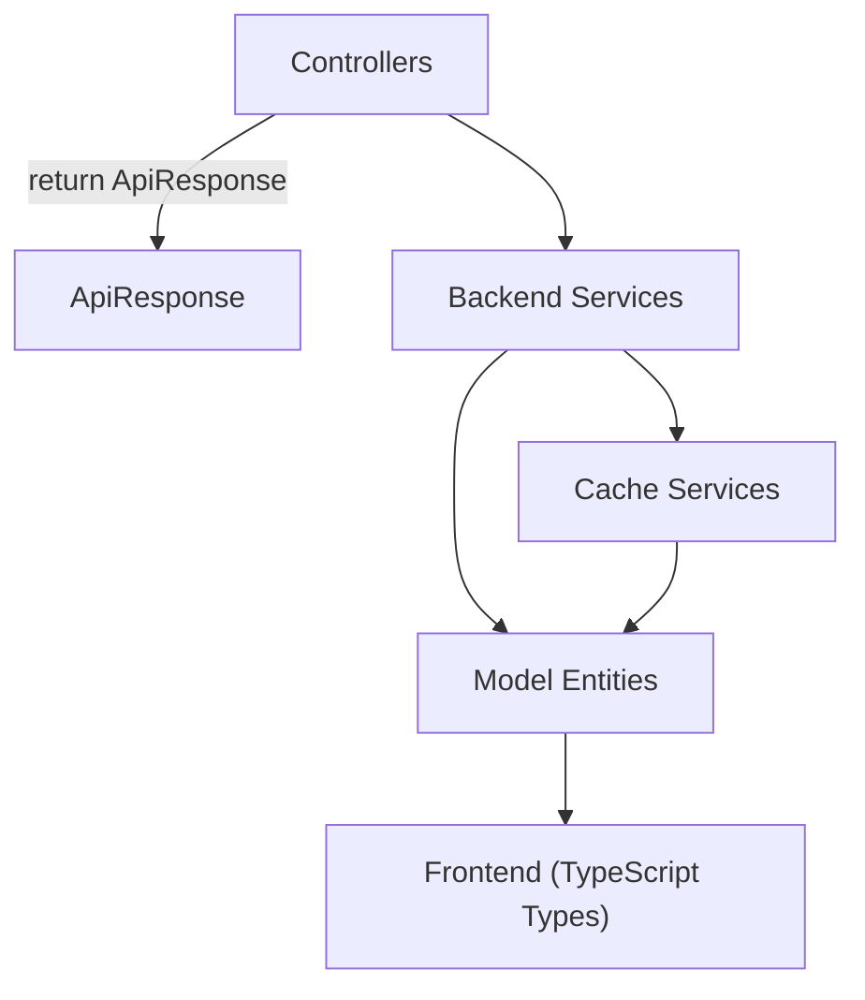
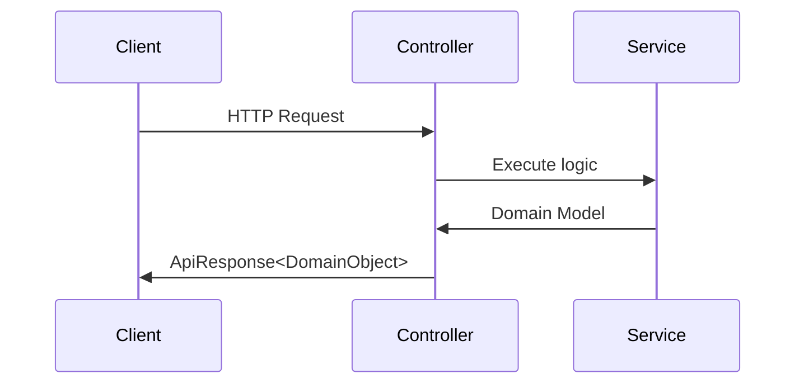
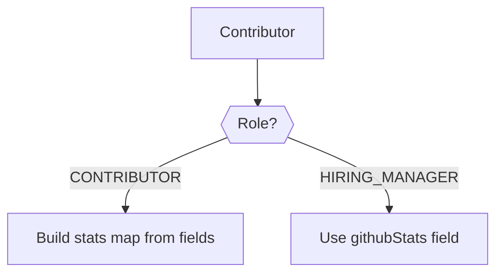
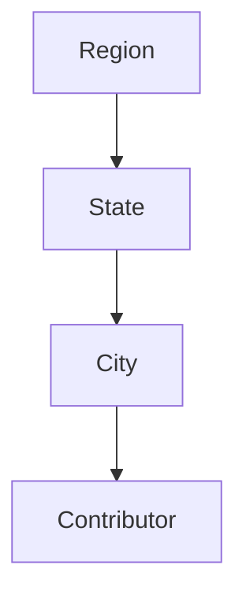
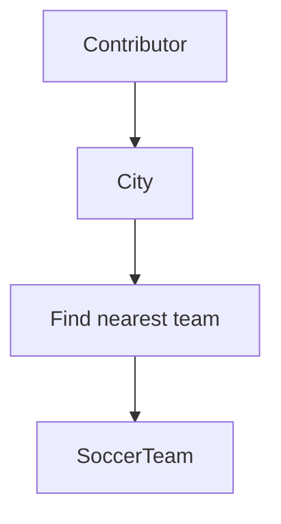
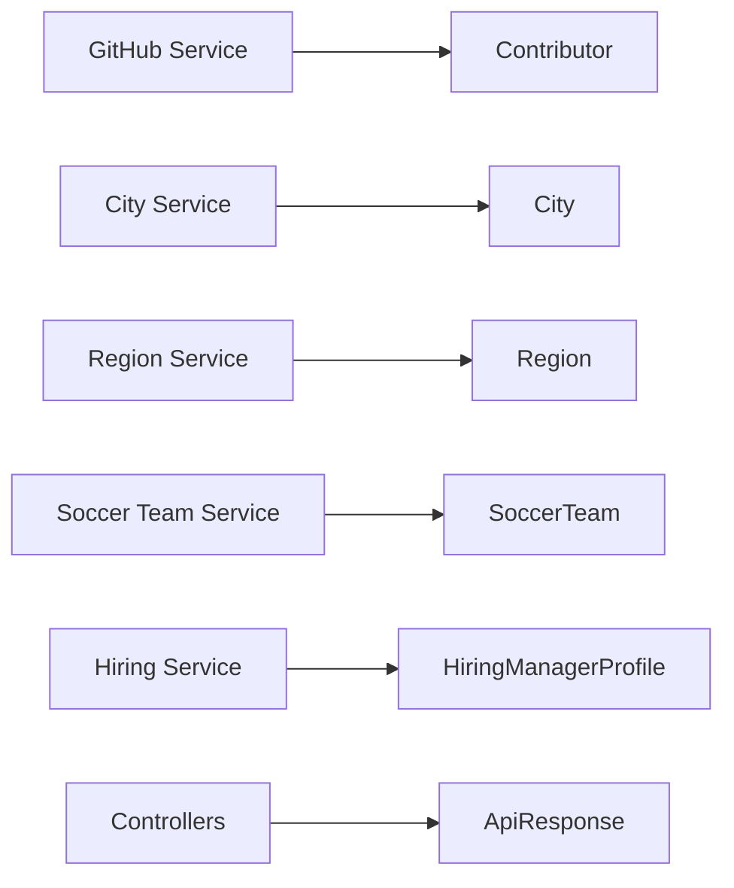

# Model Entities

The **Model Entities** module defines the core domain objects used by the Major League GitHub backend service. These entities represent contributors, geographic structures, hiring profiles, soccer teams, and standardized API responses.

This module acts as the **central data contract layer** between:

- Controllers (REST endpoints)
- Backend services (business logic)
- Cache services (Redis/Disk)
- Frontend API consumers

All higher-level modules depend on the data structures defined here.

---

## 1. Architectural Role

The Model Entities module provides:

- ✅ Domain models for contributors and hiring managers  
- ✅ Geographic hierarchy (Region → State → City)  
- ✅ Soccer team metadata for proximity-based ranking  
- ✅ Standardized API response wrapper  
- ✅ Shared objects reused across backend and frontend type systems  

### High-Level Architecture Context



The Model Entities module is a **pure data layer**:

- No persistence logic
- No HTTP logic
- No infrastructure logic
- Only structured, serializable domain objects

---

# 2. Core Entity Groups

The module can be logically divided into the following groups:

1. API Wrapper
2. Contributor & Hiring Domain
3. Geographic Hierarchy
4. Soccer Team Domain
5. Language Domain

---

# 3. API Wrapper

## ApiResponse

**Class:** `ApiResponse<T>`  

A generic response wrapper used by all REST endpoints.

### Structure

```java
public class ApiResponse<T> {
    private String status;
    private String message;
    private T data;
}
```

### Factory Methods

- `success(data)`
- `success(data, message)`
- `error(message)`

### Purpose

- Standardizes all API responses
- Simplifies frontend error handling
- Enforces consistent JSON shape

### Response Flow



---

# 4. Contributor & Hiring Domain

This domain models GitHub contributors and hiring managers.

## 4.1 Contributor

**Class:** `Contributor`

Represents either:

- A ranked GitHub contributor
- A hiring manager profile

### Key Design Feature

The `Role` enum differentiates between:

- `CONTRIBUTOR`
- `HIRING_MANAGER`

### Core Fields

Common fields:

- `login`
- `name`
- `avatarUrl`
- `role` (job title)
- `bio`
- `socialLinks`
- `cityId`
- `nearestTeamId`
- `lastActive`

Statistics:

- `score`
- `totalCommits`
- `starsReceived`
- `forksReceived`
- `starsGiven`
- `forksGiven`
- `javaRepos`

### Dynamic Stats Mapping

For contributors, `getGithubStats()` converts individual numeric fields into a map structure for uniform serialization.



This ensures frontend consumers always receive a consistent stats structure.

---

## 4.2 HiringManagerProfile

**Class:** `HiringManagerProfile`

A simplified representation of a hiring manager.

Contains:

- `name`
- `avatarUrl`
- `role`
- `bio`
- `socialLinks`
- `githubStats`
- `lastActive`

This object is optimized for hiring-specific views rather than leaderboard ranking.

---

## 4.3 JobOpening

**Class:** `JobOpening`

Represents a job listing attached to hiring profiles.

Fields:

- `id`
- `title`
- `location`
- `url`

This entity supports hiring-focused features in the application.

---

## 4.4 SocialLink

**Class:** `SocialLink`

Encapsulates external profile links.

Fields:

- `platform`
- `url`

Used by both Contributor and HiringManagerProfile.

---

# 5. Geographic Hierarchy

The application ranks contributors geographically and by proximity to MLS stadiums.

This module models a strict geographic hierarchy:



---

## 5.1 Region

**Class:** `Region`

Immutable (`@Value`) object representing a geographic region.

Fields:

- `id`
- `name` (internal slug)
- `displayName`
- `GeoCoordinates geo`
- `stateIds`

Reference objects:

- `Set<State> states`
- `Set<City> cities`

### GeoCoordinates (Nested Class)

```java
public static class GeoCoordinates {
    double latitude;
    double longitude;
}
```

Used for geographic center calculations and proximity logic.

---

## 5.2 State

**Class:** `State`

Represents a U.S. state.

Fields:

- `id`
- `name`
- `code`
- `displayName`
- `iconUrl`
- `regionIds`

Reference objects:

- `regions`
- `cities`

---

## 5.3 City

**Class:** `City`

Represents a city tied to contributor location.

Fields:

- `id`
- `name`
- `stateId`
- `population`
- `latitude`
- `longitude`
- `regionIds`
- `nearestTeamId`

Reference objects:

- `state`
- `regions`
- `nearestTeam`

Cities are central to proximity-based ranking logic.

---

# 6. Soccer Team Domain

## SoccerTeam

**Class:** `SoccerTeam`

Represents a professional soccer team used for geographic comparison.

Key fields:

- `id`
- `name`
- `city`
- `state`
- `latitude`
- `longitude`
- `stadium`
- `stadiumCapacity`
- `league`
- `headCoach`
- `teamUrl`
- `logoUrl`

### Proximity Flow



This supports MLS-style leaderboard segmentation.

---

# 7. Language Domain

## Language

**Class:** `Language`

Represents programming languages used for leaderboard filtering.

Fields:

- `id`
- `name`
- `displayName`
- `iconUrl`

Languages are used in:

- Contributor ranking filters
- Autocomplete features
- UI filtering

---

# 8. Cross-Module Interaction Summary

The Model Entities module integrates across the system as follows:



### Key Observations

- Services construct these entities
- Controllers wrap them in `ApiResponse`
- Cache services serialize and store them
- Frontend mirrors them with TypeScript types

---

# 9. Design Characteristics

### ✅ Immutability Where Needed

- `Region` uses `@Value`

### ✅ Builder Pattern

- Most models use `@Builder`
- Improves readability in service layer construction

### ✅ JSON Optimization

- `@JsonInclude(JsonInclude.Include.NON_NULL)` reduces payload size

### ✅ Reference Expansion Pattern

Entities include both:

- ID references (`stateId`, `regionIds`, `nearestTeamId`)
- Fully resolved reference objects (`state`, `regions`, `nearestTeam`)

This enables:

- Lightweight responses (IDs only)
- Fully hydrated responses (expanded objects)

---

# 10. Summary

The **Model Entities** module forms the backbone of the Major League GitHub domain model.

It provides:

- A unified contributor representation
- Geographic hierarchy modeling
- Soccer team metadata
- Hiring ecosystem structures
- Standardized API responses

Every service, controller, and frontend feature ultimately depends on these data structures. As such, this module defines the authoritative shape of the system’s data contracts.