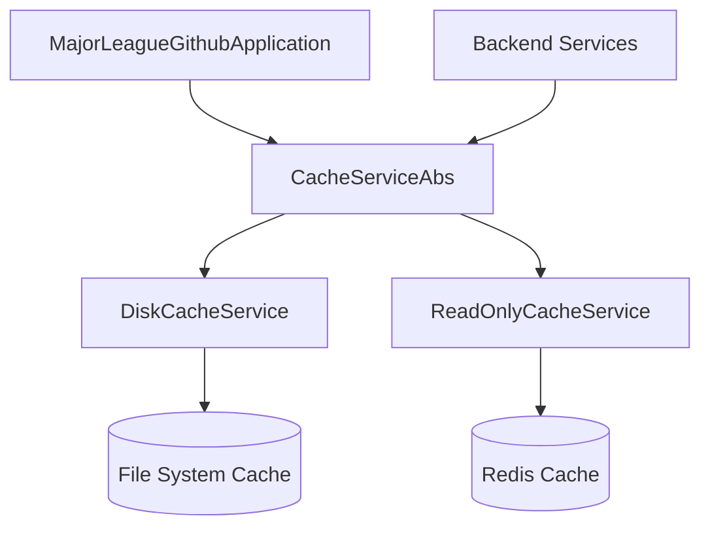
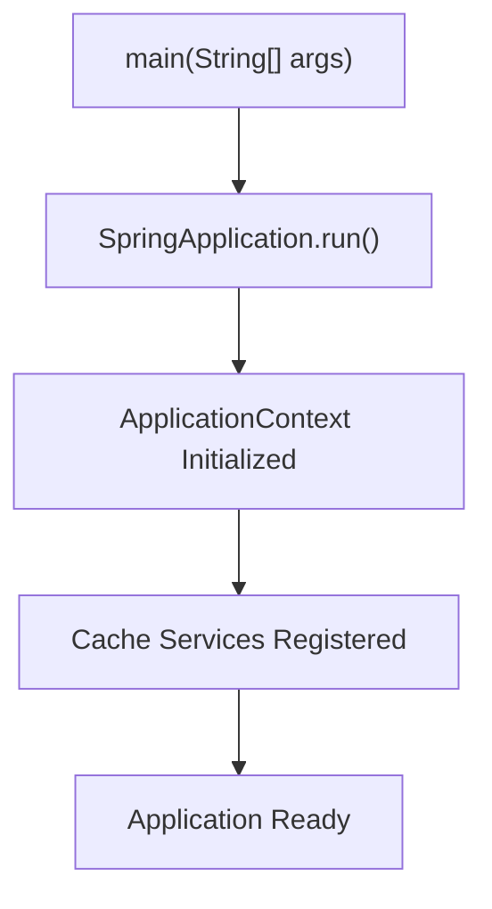
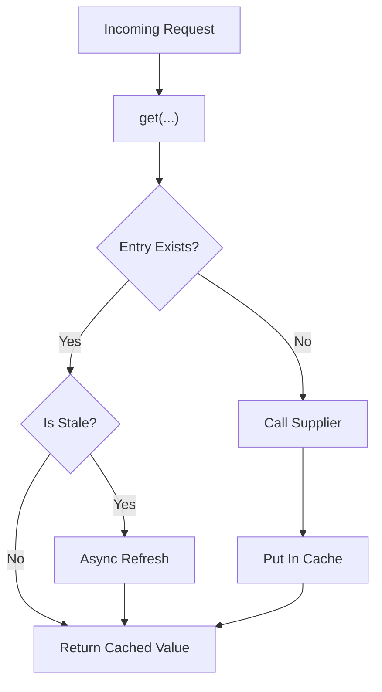
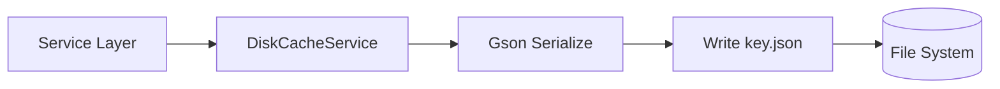
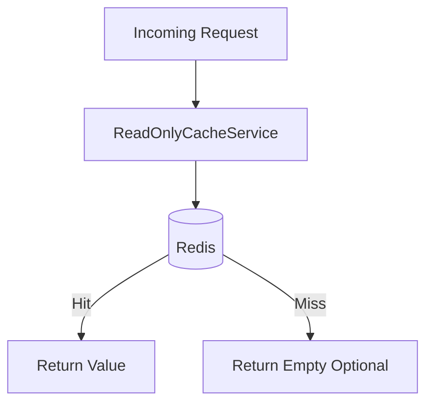

# Module 1

## Overview

Module 1 represents the **application bootstrap and core caching abstraction layer** of the Major League GitHub backend. It is responsible for:

- Bootstrapping the Spring Boot application
- Enabling caching and asynchronous execution
- Defining the abstract cache contract used across the system
- Providing concrete cache implementations for disk-based and read-only Redis modes

This module forms the foundation for data retrieval and performance optimization used by higher-level services (see sibling modules such as [Module 2](../module_2/module_2.md) and [Module 9](../module_9/module_9.md)).

---

## Architectural Role in the System

Module 1 sits at the bottom of the backend service stack. All services that fetch data from GitHub or process contributor queries rely on the caching layer defined here.

### Responsibilities by Layer

| Layer | Responsibility |
|--------|----------------|
| Application Bootstrap | Starts Spring Boot, enables caching and async |
| Cache Abstraction | Defines refresh, expiration, key strategy |
| Disk Cache | Local file-system persistence |
| Read-Only Cache | Redis-backed read-only access mode |

---

## 1. Application Bootstrap

### MajorLeagueGithubApplication

**Component:**  
`major-league-github.backend.src.main.java.cx.flamingo.analysis.MajorLeagueGithubApplication.MajorLeagueGithubApplication`

This is the Spring Boot entry point.

### Key Annotations

- `@SpringBootApplication` – Enables component scanning and auto-configuration
- `@EnableCaching` – Activates Spring caching infrastructure
- `@EnableAsync` – Enables asynchronous method execution

### Startup Flow

This ensures that cache services and async execution are available before any HTTP or GitHub requests are processed.

---

## 2. Cache Abstraction Layer

### CacheServiceAbs

**Component:**  
`major-league-github.backend.src.main.java.cx.flamingo.analysis.cache.CacheServiceAbs.CacheServiceAbs`

This abstract class defines the entire caching strategy used by the backend.

It centralizes:

- Cache key generation
- Refresh interval logic
- Stale entry detection
- Async refresh mechanism
- GitHub-specific and HTTP-specific cache patterns
- Cache readiness flags
- Cache mode switching (read/write vs force update)

### Core Concepts

#### 1. Cache Paths

Two logical cache namespaces:

- GitHub API cache
- HTTP response cache

Concrete implementations decide where these are stored.

#### 2. Refresh vs Expiration

- `githubRefreshIntervalMs`
- `httpRefreshIntervalMs`
- `cacheExpirationMs`

Stale entries are detected via insertion timestamp comparison.

#### 3. Async Refresh Pattern

When data is stale but present:

- Return existing cached data immediately
- Refresh in background using `@Async`
- Replace only when new data is available

This prevents request latency spikes.

#### 4. Cache Modes

Defined using `CacheMode` (see [Module 2](../module_2/module_2.md)):

- READ_WRITE
- FORCE_UPDATE

Force update bypasses cache reads entirely.

#### 5. Cache Readiness Flag

A special cache path stores whether the cache is fully prepared.

Used during preloading operations (see higher-level services).

---

## 3. Disk Cache Implementation

### DiskCacheService

**Component:**  
`major-league-github.backend.src.main.java.cx.flamingo.analysis.cache.impl.DiskCacheService.DiskCacheService`

A file-system based cache implementation.

### Storage Strategy

- Each cache entry stored as: `key.json`
- Organized under:
  - GitHub cache directory
  - HTTP cache directory
- Uses Gson for serialization/deserialization

### Behavior Highlights

- Deletes stale files automatically
- Validates JSON before writing
- Removes corrupted or empty cache files
- Creates directories at startup via `@PostConstruct`

### Stale Detection

Uses file `lastModifiedTime` to compute age.

---

## 4. Read-Only Cache Implementation

### ReadOnlyCacheService

**Component:**  
`major-league-github.backend.src.main.java.cx.flamingo.analysis.cache.impl.ReadOnlyCacheService.ReadOnlyCacheService`

Extends Redis-based caching (defined in [Module 2](../module_2/module_2.md)) but disables all write operations.

### Purpose

Used in environments where:

- Cache is pre-populated
- Application must not modify Redis
- Web-tier operates in strict read-only mode

### Behavior Differences

| Operation | Behavior |
|------------|----------|
| put() | Ignored |
| invalidate() | Ignored |
| get() | Returns value without refresh logic |
| stale check | Ignored |

### Key Characteristics

- Always reads directly from Redis
- Does not enforce refresh intervals
- Does not attempt background refresh
- Suitable for horizontally scaled read replicas

---

## 5. Key Generation Strategy

Module 1 standardizes cache key structure.

### HTTP Cache Key

Composed of:

- City ID
- Region ID
- State ID
- Team ID
- Language
- Max results

All separated by a delimiter defined per implementation.

### GitHub Cache Key

Composed of:

- City ID
- Language
- Page number

This guarantees deterministic and collision-free caching.

---

## 6. Integration With Other Modules

Module 1 provides infrastructure used by:

- [Module 2](../module_2/module_2.md) – Redis cache implementation and configuration
- [Module 9](../module_9/module_9.md) – Services that consume cached GitHub and contributor data

Higher-level modules do not need to know whether caching is:

- Disk-based
- Redis-based
- Read-only

They interact only with the abstract contract.

---

## 7. Design Patterns Used

### Template Method Pattern

`CacheServiceAbs` defines the algorithm:

1. Generate key
2. Attempt read
3. Check staleness
4. Optionally refresh
5. Write new value

Concrete subclasses override:

- `get()`
- `put()`
- `invalidate()`
- Path resolution

### Strategy Pattern

Cache implementation can be swapped via Spring profile or bean selection.

### Asynchronous Processing

`@Async` enables background refresh without blocking request threads.

---

## 8. Operational Considerations

### Performance

- Prevents repeated GitHub API calls
- Reduces rate-limit pressure
- Minimizes HTTP response latency

### Reliability

- Deletes corrupted cache entries
- Gracefully handles IO errors
- Falls back to supplier if cache fails

### Scalability

- Disk cache: good for local/dev environments
- Redis read-only mode: optimized for production web nodes

---

## Summary

Module 1 is the **core infrastructure layer** of the Major League GitHub backend.

It:

- Boots the Spring application
- Defines the caching contract
- Implements disk-based caching
- Provides a read-only Redis cache mode
- Enables async refresh and cache readiness tracking

All higher-level business logic depends on this abstraction to ensure consistent, performant, and scalable data retrieval.
