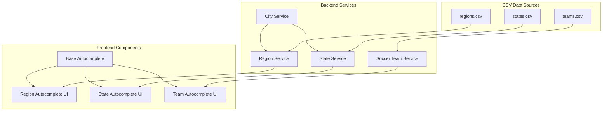
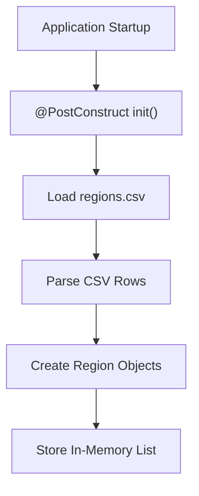
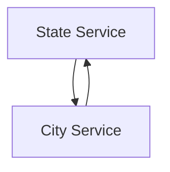
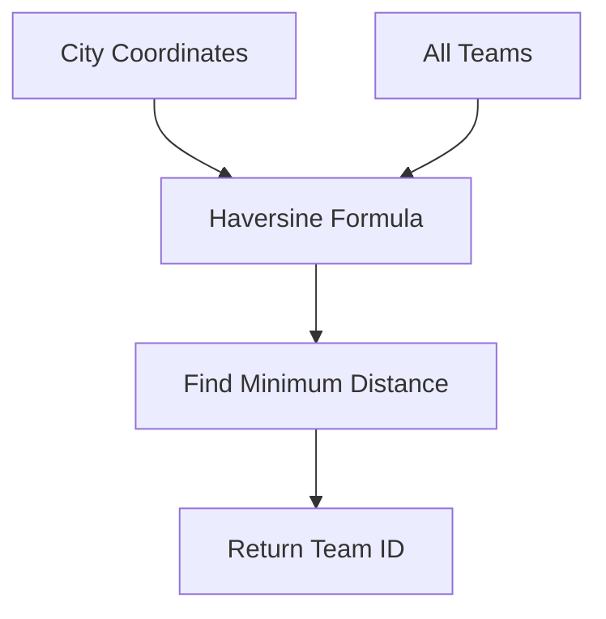
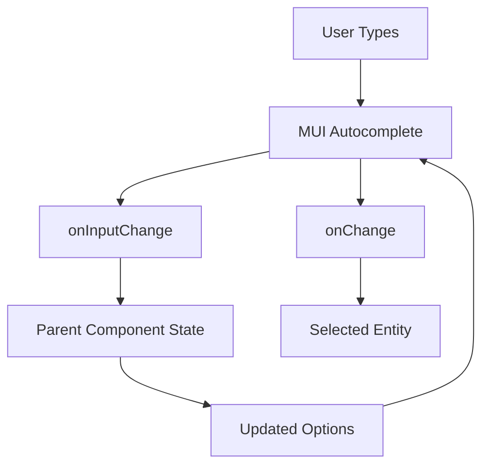
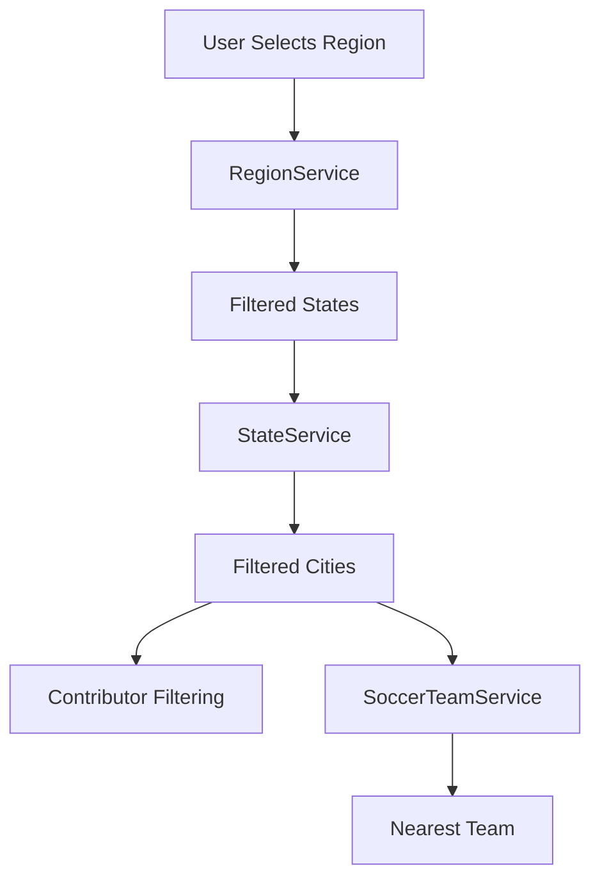

# Module 10

## Overview

Module 10 provides **geographic and team-based domain services** on the backend and a **generic autocomplete foundation** on the frontend. Together, these components power location-based filtering (regions, states, cities) and soccer team discovery in Major League GitHub.

On the backend, this module:
- Loads and manages **Regions**, **States**, and **Soccer Teams** from CSV resources.
- Performs population-aware sorting for geographic autocomplete.
- Calculates nearest soccer teams using geospatial distance.

On the frontend, this module:
- Defines a reusable, type-safe `BaseAutocomplete` component.
- Establishes a shared `BaseEntity` contract for all selectable entities.

This module is a key bridge between:
- Geographic models (Regions, States, Cities)
- Domain services (CityService and related services)
- UI filtering and search experience

---

## Architectural Context

Module 10 sits at the intersection of:
- Geographic data modeling
- Autocomplete search APIs
- UI-level selection components



---

# Backend Services

## 1. Region Service

**Core Component:**  
`major-league-github.backend.src.main.java.cx.flamingo.analysis.service.RegionService.RegionService`

### Responsibilities

- Load region metadata from `data/regions.csv`.
- Maintain an in-memory list of regions.
- Support population-weighted autocomplete.
- Filter regions by:
  - State
  - City
  - Query string

### Initialization Flow

At application startup:
- `@PostConstruct` triggers `loadRegions()`.
- Regions are parsed from CSV.
- Each region includes:
  - ID
  - Name
  - Display name
  - GeoCoordinates
  - Associated state IDs



### Population-Based Ranking

Region autocomplete sorts by **total population** of associated cities.

Population calculation:
- Fetch all cities from `CityService`.
- Filter by region membership.
- Sum city populations.


This ensures larger metropolitan areas appear first in autocomplete suggestions.

### Key Methods

- `autocompleteRegions(query, stateId, cityIds, maxResults)`
- `getRegionById(id)`
- `getRegionByName(name)`
- `getAllRegions()`
- `updateRegion(region)`

---

## 2. State Service

**Core Component:**  
`major-league-github.backend.src.main.java.cx.flamingo.analysis.service.StateService.StateService`

### Responsibilities

- Load states from `data/states.csv`.
- Maintain in-memory state list.
- Support filtered and population-weighted autocomplete.
- Integrate with `CityService` for population aggregation.

### Dependency Design

`StateService` uses constructor injection with `@Lazy` for `CityService` to avoid circular dependency issues.



Lazy injection ensures Spring resolves dependencies safely.

### Autocomplete Filtering

States can be filtered by:
- Region ID
- City IDs
- Query (name or code)

Sorting is based on:
- Total population of all cities in that state

### Key Methods

- `autocompleteStates(query, regionId, cityIds, maxResults)`
- `getStateById(id)`
- `getStateByCode(code)`
- `getAllStates()`

---

## 3. Soccer Team Service

**Core Component:**  
`major-league-github.backend.src.main.java.cx.flamingo.analysis.service.SoccerTeamService.SoccerTeamService`

### Responsibilities

- Load team data from `data/teams.csv`.
- Provide autocomplete by:
  - Team name
  - City
  - State
- Calculate nearest team to a city.

### Data Model

Each team includes:
- ID
- Name
- City
- State
- Coordinates
- League
- Stadium and capacity
- Coach
- External URLs (team site, Wikipedia, logo)

### Nearest Team Calculation

Distance is calculated using the **Haversine formula**.



Earth radius constant:
- `R = 6371` kilometers

This enables:
- Mapping contributors to nearest MLS-style team
- Stadium proximity ranking

### Autocomplete Strategy

If query is empty:
- Sort by stadium capacity (descending)

If query is provided:
- Filter by name, city, or state
- Sort by stadium capacity

### Key Methods

- `findNearestTeamId(city)`
- `autocompleteTeams(query, maxResults)`
- `getTeamById(id)`
- `getAllTeams()`

---

# Frontend Components

## Base Entity

**Core Component:**  
`major-league-github.frontend.src.components.BaseAutocomplete.BaseEntity`

Defines a shared minimal interface for all selectable entities:

```text
BaseEntity
  - id: string
  - name?: string
  - displayName?: string
  - iconUrl?: string
  - logoUrl?: string
```

This abstraction allows Region, State, Soccer Team, and other entities to be rendered generically.

---

## Base Autocomplete

**Core Component:**  
`major-league-github.frontend.src.components.BaseAutocomplete.BaseAutocompleteProps`

A generic, reusable wrapper around MUI `Autocomplete`.

### Design Goals

- Strong TypeScript generics (`T extends BaseEntity`)
- Free-text search support (`freeSolo`)
- Custom rendering hooks
- Icon rendering support
- Controlled component pattern

### Component Interaction Flow



### Key Props

- `value`
- `onChange`
- `inputValue`
- `onInputChange`
- `options`
- `getOptionLabel`
- `renderIcon`
- `renderOptionContent`
- `sx`

### Icon Rendering Logic

By default:

```text
renderIcon(option) = option.iconUrl || option.logoUrl
```

Icons are rendered inside a `startAdornment` when an entity is selected.

---

# End-to-End Geographic Filtering Flow

This module enables multi-level filtering:



### Flow Summary

1. Regions and states are loaded from CSV.
2. Autocomplete endpoints filter and rank results.
3. Frontend `BaseAutocomplete` renders options.
4. Selected city can map to nearest soccer team.
5. Filtering propagates through contributor ranking logic.

---

# Design Principles

### 1. In-Memory Domain Indexing

All geographic and team data is:
- Loaded once at startup
- Stored in memory
- Accessed via stream filtering

This avoids database overhead for static reference data.

### 2. Population-Weighted UX

Autocomplete results prioritize:
- Larger regions
- More populous states

This improves perceived relevance.

### 3. Geospatial Identity

Soccer teams are tied to real-world coordinates, enabling:
- Distance-based ranking
- Stadium proximity features
- MLS-style gamification

### 4. Frontend Reusability

`BaseAutocomplete` ensures:
- Uniform UX across entity types
- Reduced duplication
- Strong compile-time safety

---

# Summary

Module 10 delivers the **geographic intelligence layer** and the **generic autocomplete UI foundation** of Major League GitHub.

Backend capabilities:
- Region and state filtering
- Population-aware sorting
- Geospatial nearest-team detection

Frontend capabilities:
- Strongly typed autocomplete foundation
- Icon-aware rendering
- Customizable option display

Together, these components enable location-driven ranking, filtering, and MLS-style regional identity across the platform.