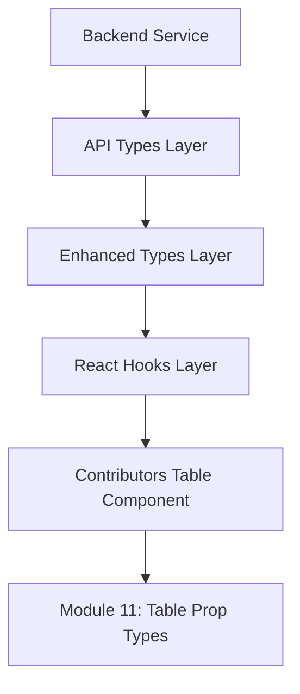
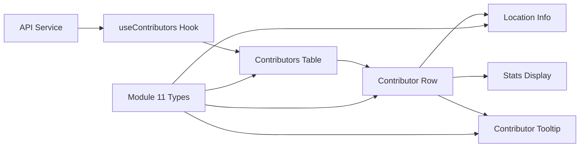
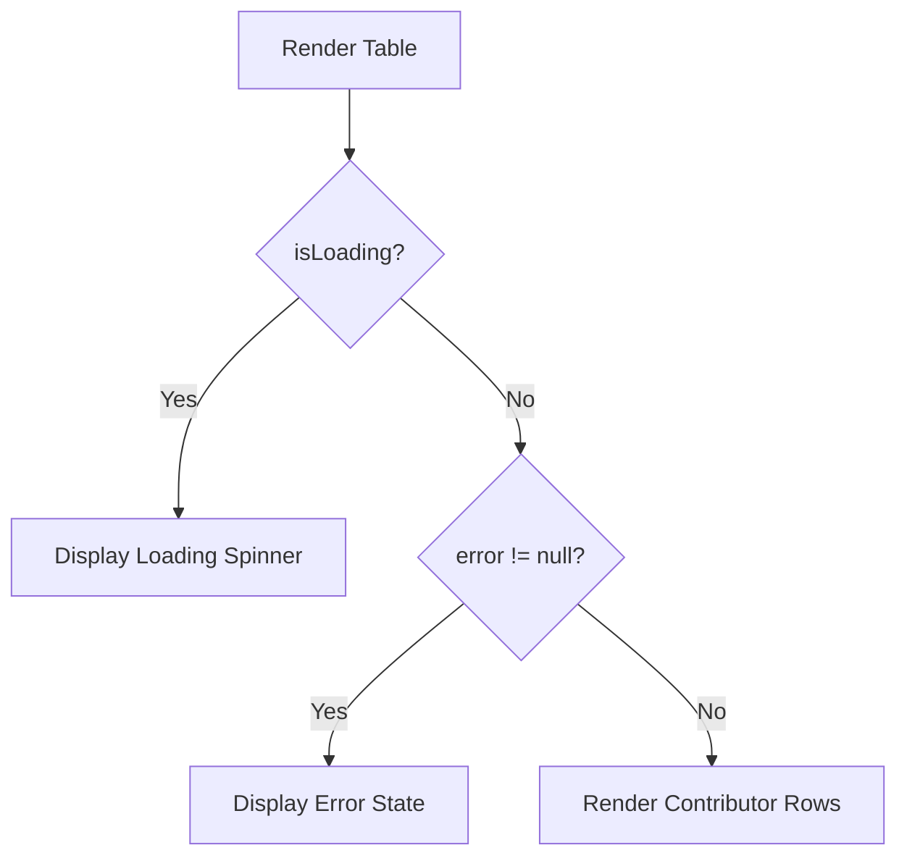
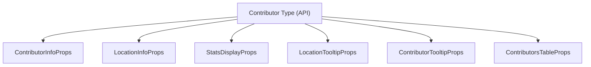

# Module 11

## Overview

Module 11 defines the **type contracts for the Contributors Table UI layer** in the frontend application. It contains TypeScript interfaces that formalize the structure of props passed into table components, tooltip components, and supporting UI elements related to contributor display.

Rather than implementing rendering logic, Module 11 establishes strict compile-time guarantees for:

- Contributor row rendering
- Location and tooltip displays
- Statistical data presentation
- Loading and error handling states

This module acts as a **presentation boundary layer** between API data models (see Module 14 and Module 15) and React UI components in the `ContributorsTable` feature.

---

## Core Responsibilities

Module 11 is responsible for:

1. Defining prop interfaces for contributor-related UI components
2. Encapsulating table-level state (loading, error, data)
3. Standardizing tooltip data contracts
4. Providing localized UI-level type extensions where needed

It does **not**:

- Fetch data (handled in API services and hooks)
- Transform data (handled in enhanced types and hooks)
- Define backend data models

---

## Core Type Definitions

The following interfaces are defined in this module:

- `ContributorInfoProps`
- `LocationInfoProps`
- `StatsDisplayProps`
- `LocationTooltipProps`
- `ContributorTooltipProps`
- `ContributorsTableProps`
- Local UI-level `SoccerTeam`
- Local UI-level `State`

All contributor-based props depend on the shared `Contributor` type imported from the frontend API type layer (see Module 14 and Module 15).

---

## Architectural Position

Module 11 sits in the **presentation typing layer** of the frontend architecture.



### Layer Explanation

- **API Types Layer** – Defines raw API response models.
- **Enhanced Types Layer** – Adds derived or computed fields.
- **Hooks Layer** – Manages state, filtering, and data fetching.
- **Contributors Table Component** – Renders tabular UI.
- **Module 11** – Ensures strict prop contracts between components.

---

## Contributors Table Props

### ContributorsTableProps

This is the root interface for the table component.

```typescript
export interface ContributorsTableProps {
    contributors: Contributor[];
    isLoading: boolean;
    error: Error | null;
}
```

### Responsibility Breakdown

| Property | Purpose |
|-----------|----------|
| contributors | Array of contributor domain objects |
| isLoading | Controls loading state rendering |
| error | Enables error UI state handling |

This interface centralizes all table-level state and enables predictable rendering flows.

---

## Row-Level Display Types

### ContributorInfoProps

```typescript
export interface ContributorInfoProps {
    contributor: Contributor;
    index: number;
}
```

Used for rendering primary contributor information such as:

- Rank
- Avatar
- Username
- Score

The `index` enables positional rendering logic (e.g., podium styling).

---

### StatsDisplayProps

```typescript
export interface StatsDisplayProps {
    contributor: Contributor;
}
```

Encapsulates statistical display rendering (e.g., commits, stars, contributions).

---

## Location Rendering Types

### LocationInfoProps

```typescript
export interface LocationInfoProps {
    contributor: Contributor;
}
```

Used for displaying:

- City
- State
- Region
- Proximity to stadium

---

### LocationTooltipProps

```typescript
export interface LocationTooltipProps {
    contributor: Contributor;
}
```

Used when rendering expanded geographic information inside tooltips.

---

## Contributor Tooltip

### ContributorTooltipProps

```typescript
export interface ContributorTooltipProps {
    contributor: Contributor;
}
```

Supports hover interactions for:

- Extended contributor metadata
- Social links
- Hiring signals
- League/team associations

---

## Local UI Models

Module 11 also defines localized UI versions of certain entities.

### SoccerTeam

```typescript
export interface SoccerTeam {
    id: string;
    name: string;
    city: string;
    state: string;
    latitude: number;
    longitude: number;
    league: string;
    stadium: string;
    stadiumCapacity: number;
    joinedYear: number;
    headCoach: string;
    teamUrl: string;
    wikipediaUrl: string;
    logoUrl: string;
}
```

### State

```typescript
export interface State {
    id: string;
    name: string;
    code: string;
    displayName: string;
    iconUrl: string;
    regionIds: string[];
}
```

These are **UI-scoped types** tailored for presentation needs and may differ from backend models.

---

## Component Interaction Flow

The following diagram shows how data flows from API to tooltip rendering.



Module 11 enforces type safety at every component boundary.

---

## Rendering State Flow



This predictable control flow is enabled by the `ContributorsTableProps` contract.

---

## Dependency Relationships



All UI components depend on a single canonical `Contributor` type, ensuring consistency across the table feature.

---

## Design Principles

Module 11 follows these architectural principles:

### 1. Single Source of Truth
All UI components rely on the shared `Contributor` API model.

### 2. Prop-Level Isolation
Each UI segment has its own dedicated prop interface.

### 3. Separation of Concerns
- Data fetching: handled elsewhere
- Data transformation: handled in enhanced types
- Rendering contracts: defined here

### 4. Compile-Time Safety
TypeScript ensures:
- Required props are enforced
- No implicit `any`
- Breaking changes surface during compilation

---

## Relationship to Other Modules

- **Module 14** – Provides API request/response types used by contributors.
- **Module 15** – Defines core API-level entity types including Contributor.
- **Module 16** – Adds enhanced geographic types used in location rendering.
- **Module 10** – Provides related UI prop types for autocomplete components.

Module 11 focuses strictly on **Contributors Table presentation contracts**.

---

## Summary

Module 11 is the **type-definition backbone of the Contributors Table feature**. It formalizes the interface between contributor data and UI components, ensuring predictable rendering, consistent tooltip behavior, and safe state handling.

By isolating prop contracts in a dedicated module, the frontend achieves:

- Strong type safety
- Clean component boundaries
- Reduced duplication
- Improved maintainability

In the overall architecture, Module 11 represents the final type enforcement layer before contributor data is rendered to the user interface.