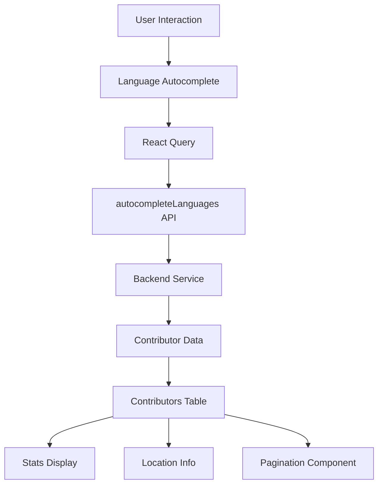
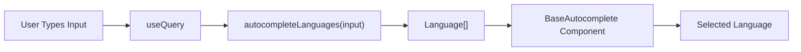
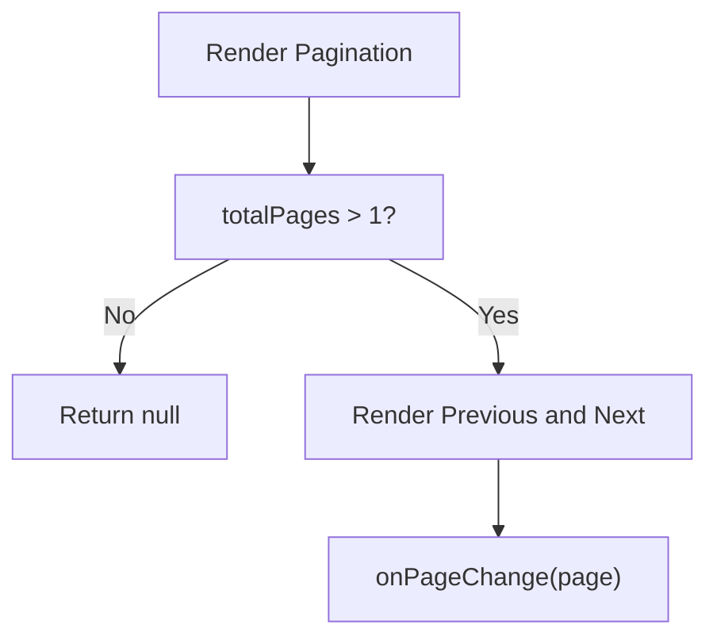
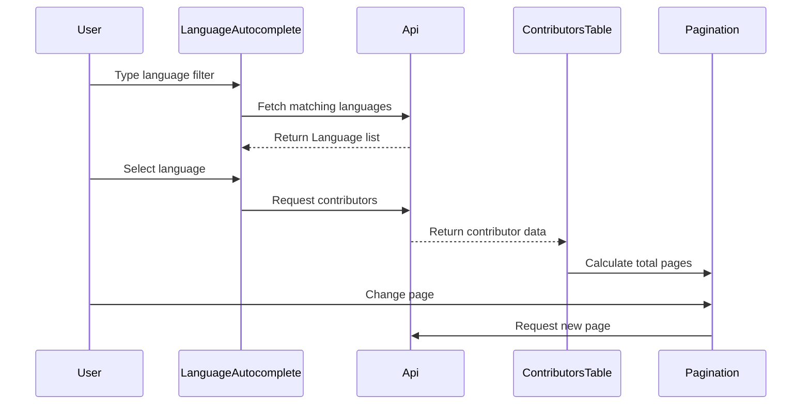

# Module 12

## Overview

Module 12 encapsulates key **frontend UI contracts and lightweight components** that support filtering, display, and navigation within the Major League GitHub React application. It defines:

- Strongly typed interfaces for contributors table display
- Soccer team and state view models used in UI rendering
- A language autocomplete component powered by React Query
- A minimal pagination component for simple result navigation

This module acts as a **presentation-layer bridge** between API data models and interactive UI components.

---

## Architectural Context

Module 12 operates entirely in the frontend layer. It consumes API types and services and feeds typed props into reusable UI components.



### Responsibilities Within the Frontend

Module 12 is responsible for:

1. Defining UI-facing data contracts
2. Encapsulating autocomplete behavior for programming languages
3. Providing simple pagination controls
4. Structuring contributor table-related presentation props

It does **not**:

- Perform complex data transformation
- Own global application state
- Implement backend communication logic beyond invoking services

---

## Core Components

### 1. Contributors Table Type Contracts

**Source File:** `frontend/src/components/ContributorsTable/types.ts`

This file defines UI-specific interfaces used by the Contributors Table and related display components.

#### SoccerTeam Interface

Represents a professional soccer team displayed in the leaderboard context.

```typescript
export interface SoccerTeam {
    id: string;
    name: string;
    city: string;
    state: string;
    latitude: number;
    longitude: number;
    league: string;
    stadium: string;
    stadiumCapacity: number;
    joinedYear: number;
    headCoach: string;
    teamUrl: string;
    wikipediaUrl: string;
    logoUrl: string;
}
```

**Purpose:**
- Drives UI rendering of team identity
- Enables geo-based proximity filtering
- Supplies metadata such as stadium and league context

This structure mirrors backend soccer team models while remaining tailored for frontend consumption.

---

#### State Interface

Represents a U.S. state with region mapping support.

```typescript
export interface State {
    id: string;
    name: string;
    code: string;
    displayName: string;
    iconUrl: string;
    regionIds: string[];
}
```

**Purpose:**
- Enables geographic filtering
- Maps states to regions
- Supports UI display (icons, labels)

---

#### StatsDisplayProps

```typescript
export interface StatsDisplayProps {
    contributor: Contributor;
}
```

Used by statistics display components to:

- Render ranking metrics
- Show contribution counts
- Present computed leaderboard values

The `Contributor` type is imported from shared API types, ensuring consistency with backend responses.

---

### 2. Language Autocomplete Component

**Source File:** `frontend/src/components/LanguageAutocomplete.tsx`

The `LanguageAutocomplete` component provides dynamic language search functionality.

```typescript
interface LanguageAutocompleteProps {
  value: Language | null;
  onChange: (language: Language | null) => void;
  inputValue: string;
  onInputChange: (value: string) => void;
  sx?: SxProps<Theme>;
}
```

### Behavior

- Uses `useQuery` from React Query
- Fetches suggestions via `autocompleteLanguages`
- Passes results into a reusable `BaseAutocomplete` component



### Key Design Decisions

- `staleTime: 0` ensures fresh suggestions per input change
- Uses React Query's built-in request cancellation via `signal`
- Delegates UI behavior to a shared generic autocomplete component
- Keeps the component fully controlled (value + inputValue)

This makes the component predictable and easy to integrate into URL-synced filters.

---

### 3. Pagination Component

**Source File:** `frontend/src/components/pagination.tsx`

A minimal pagination implementation designed specifically for Major League GitHub.

```typescript
interface PaginationProps {
  currentPage: number;
  totalPages: number;
  onPageChange?: (page: number) => void;
}
```

### Characteristics

- Stateless functional component
- Conditionally renders when `totalPages > 1`
- Emits page changes through optional callback
- Uses simple Previous / Next navigation



### Design Rationale

The application does not require complex server-driven or cursor-based pagination. This lightweight approach:

- Minimizes dependencies
- Reduces UI complexity
- Keeps navigation intuitive

---

## Data Flow Integration

Module 12 participates in the contributor discovery flow:



This illustrates how typed props and UI contracts from Module 12 integrate into the broader frontend system.

---

## Design Principles

Module 12 follows several important frontend engineering principles:

### 1. Strong Typing
All interfaces enforce strict TypeScript contracts to prevent runtime errors and ensure alignment with backend responses.

### 2. Separation of Concerns
- Types are isolated from rendering logic
- Autocomplete logic is isolated from generic UI implementation
- Pagination is independent of data-fetching logic

### 3. Controlled Components
Inputs are fully controlled via props, enabling:

- URL synchronization
- State lifting
- Predictable re-render behavior

### 4. Minimal Abstraction
Components are intentionally simple and domain-focused, avoiding over-engineering.

---

## Summary

Module 12 provides:

- Typed UI contracts for contributors, states, and soccer teams
- A React Query-powered language autocomplete component
- A lightweight pagination solution
- Clean separation between API data and presentation logic

It plays a crucial role in delivering a responsive, filterable leaderboard experience while maintaining strong type safety and modular design.