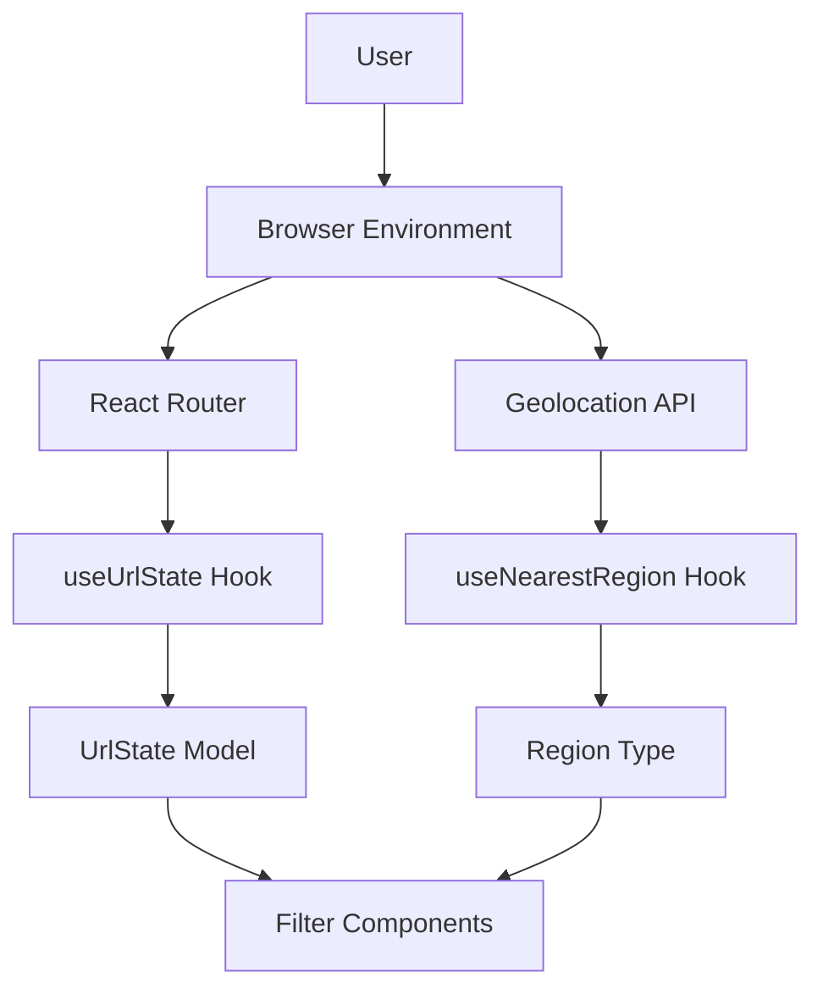
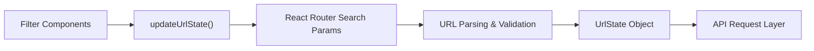
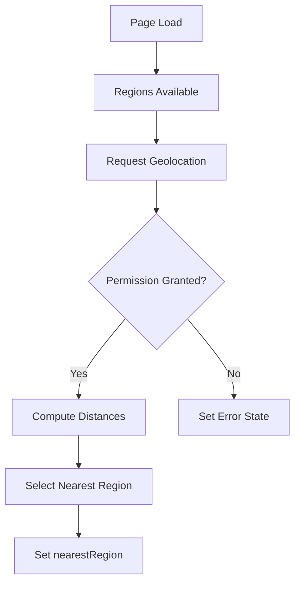

# Module 13

## Overview

**Module 13** contains reusable React hooks that manage:

- Geolocation-based region detection
- URL-driven application state with validation and debouncing

This module plays a critical role in synchronizing UI state with the browser URL and enhancing user experience through automatic region detection.

It primarily interacts with:

- API types defined in Module 14 and Module 15
- Routing infrastructure via React Router
- Region data retrieved from the backend

---

## Architectural Role

Module 13 sits in the frontend hooks layer and connects:

- Browser APIs (Geolocation)
- React Router URL state
- Domain models (Region, State, Language, Team)

### High-Level Architecture

---

## Sub-Modules

Module 13 is divided into two focused sub-modules:

### 1. useNearestRegion

Location-aware logic for detecting the closest region to the user using the Haversine distance formula.

See detailed documentation:

- [Use Nearest Region](module_13/use_nearest_region/use_nearest_region.md)

---

### 2. useUrlState

A robust URL state management hook that:

- Validates query parameters
- Applies transformations
- Supports debounced updates
- Tracks state changes
- Handles errors gracefully

See detailed documentation:

- [Use URL State](module_13/use_url_state/use_url_state.md)

---

## How Module 13 Fits Into the System

### URL-Driven Filtering Flow

1. A user selects filters (language, state, team, city, region).
2. `useUrlState` updates the URL query string.
3. URL parameters are validated and parsed.
4. The resulting `UrlState` object drives API calls.

This ensures:

- Deep linking support
- Shareable URLs
- Back/forward navigation consistency
- State persistence on refresh

---

### Geolocation-Based Region Detection Flow

1. Regions are loaded from the backend.
2. Browser geolocation is requested.
3. Distances are calculated using the Haversine formula.
4. The nearest region is selected and exposed to the UI.

---

## Key Design Principles

### 1. Deterministic URL State

All query parameters are:

- Explicitly configured
- Regex validated
- Defaulted when invalid

This prevents corrupted URLs from breaking application state.

### 2. Defensive Programming

- Graceful fallback when geolocation is unavailable
- Safe parsing with custom error handling
- Cleanup of debounce timers

### 3. Separation of Concerns

- Geolocation logic isolated from UI
- URL state logic isolated from routing components
- Validation logic centralized in configuration

---

## Integration With Other Modules

Module 13 integrates closely with:

- Module 14 for API parameter construction
- Module 15 for domain type definitions
- Module 10–12 for filter components

It does not directly perform API calls but shapes the state that drives them.

---

## Summary

**Module 13** provides foundational frontend infrastructure for:

- URL-synchronized filtering
- Shareable application state
- Intelligent region auto-selection

It enhances usability, improves state reliability, and ensures consistent navigation behavior across the application.