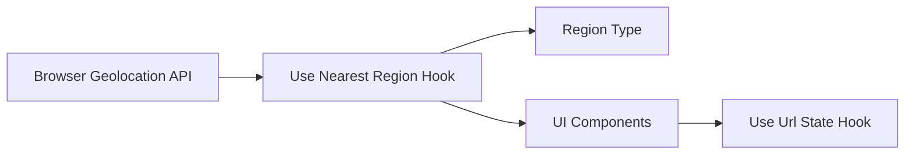
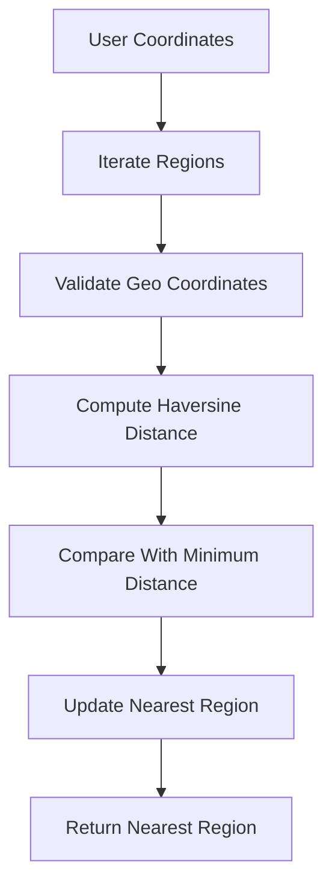
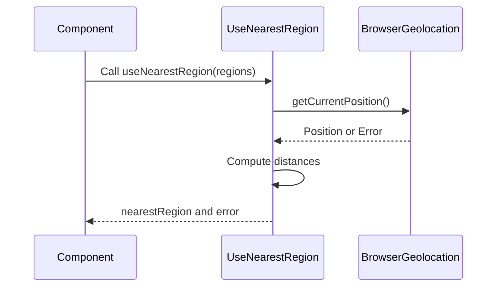
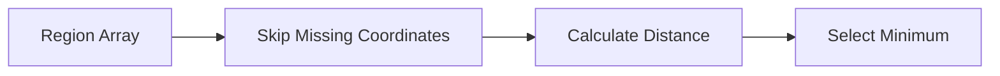

# Use Nearest Region

The **Use Nearest Region** module provides a lightweight geolocation-driven utility hook for the Major League GitHub frontend. It determines the closest geographic region to the current user using browser geolocation and the Haversine distance formula.

This hook enables location-aware UX features such as auto-selecting a default region filter, highlighting nearby MLS teams, or pre-filtering contributors based on geographic proximity.

---

## Purpose and Responsibilities

The Use Nearest Region module is responsible for:

- Accessing the browser Geolocation API
- Computing geographic distance using the Haversine formula
- Selecting the nearest `Region` from a provided list
- Handling geolocation errors gracefully
- Exposing a simple React hook interface

It is intentionally self-contained and UI-agnostic. It does not fetch regions itself; instead, it consumes a pre-fetched list of regions from API or application state.

---

## Core Component

### `useNearestRegion(regions: Region[])`

A React hook that:

1. Requests the user's current geographic coordinates
2. Iterates through available regions
3. Computes distance using spherical geometry
4. Returns the closest region and error state

### `Coordinates`

```typescript
interface Coordinates {
    latitude: number;
    longitude: number;
}
```

Used internally for distance calculation.

---

## Architectural Context

The Use Nearest Region module exists within the frontend hooks layer and collaborates with:

- API types (`Region`, including geo coordinates)
- UI filter state management
- URL state synchronization via [Use Url State](../use_url_state/use_url_state.md)

### High-Level Placement



---

## Internal Distance Calculation

The module uses the **Haversine formula** to compute the great-circle distance between two latitude/longitude points.

### Distance Flow



### Why Haversine?

- Accounts for Earth's curvature
- Accurate for medium and long distances
- Lightweight and efficient
- No external dependency required

---

## Runtime Execution Flow

The hook executes automatically when:

- The component mounts
- The `regions` dependency changes

### Sequence of Operations



---

## Error Handling Strategy

The hook gracefully handles the following scenarios:

| Scenario | Behavior |
|----------|----------|
| No regions provided | Returns null without error |
| Browser does not support geolocation | Sets error message |
| User denies permission | Sets error message |
| Regions lack coordinates | Sets error message |

Errors are exposed as a simple string, allowing consuming components to decide how to render fallback UI.

---

## Data Dependencies

The hook depends on the frontend `Region` type, which includes geographic metadata:

- `geo.latitude`
- `geo.longitude`

Regions without coordinates are skipped during distance computation.



---

## Integration Patterns

### 1. Auto-Selecting a Default Region

```typescript
const { nearestRegion } = useNearestRegion(regions);

useEffect(() => {
    if (nearestRegion) {
        setSelectedRegion(nearestRegion.id);
    }
}, [nearestRegion]);
```

### 2. Synchronizing With URL State

When combined with the [Use Url State](../use_url_state/use_url_state.md) module:

- Nearest region can initialize filter state
- Filter state can be persisted to the URL
- Deep links remain shareable

---

## Performance Characteristics

| Aspect | Complexity |
|--------|------------|
| Distance calculation | O(n) |
| Memory usage | O(1) |
| External dependencies | None |

The hook is efficient because:

- It performs a single pass over the region list
- It avoids sorting
- It only recalculates when `regions` changes

---

## Design Decisions

### Client-Side Calculation

Distance computation is performed in the browser rather than on the backend because:

- It avoids additional API calls
- It keeps location data client-side
- It improves responsiveness

### No Automatic Fallback Region

The hook does not automatically select a fallback region if geolocation fails. This ensures:

- Predictable behavior
- Explicit UX control by consuming components

---

## Security and Privacy Considerations

- Uses standard browser Geolocation API
- Requires explicit user permission
- Does not persist location data
- Does not transmit raw coordinates to backend services

All location handling is transient and confined to runtime memory.

---

## Relationship to Other Hooks

Within the hooks layer:

- **Use Nearest Region** provides geographic awareness
- **Use Url State** manages query parameter synchronization

Together they enable smart, shareable, location-aware filtering.

---

## Summary

The **Use Nearest Region** module is a focused, efficient geolocation utility that enhances user experience by intelligently selecting the closest geographic region. By combining browser geolocation, spherical distance mathematics, and React state management, it enables context-aware filtering without increasing backend complexity.

It plays a small but strategically important role in delivering a personalized, location-aware Major League GitHub experience.