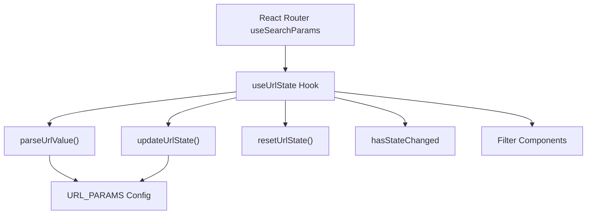
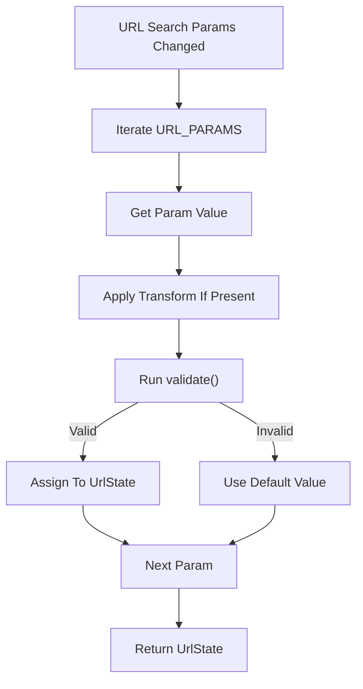
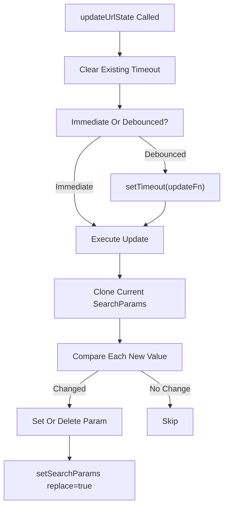
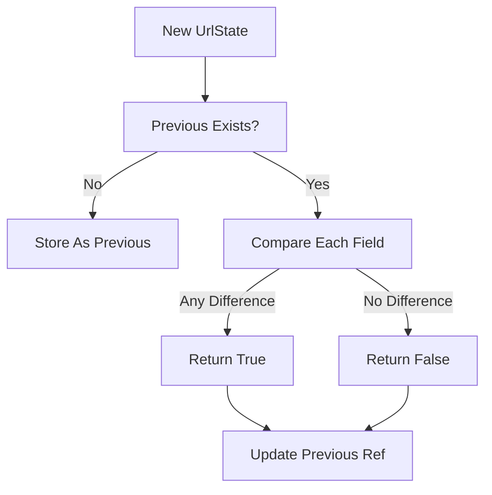
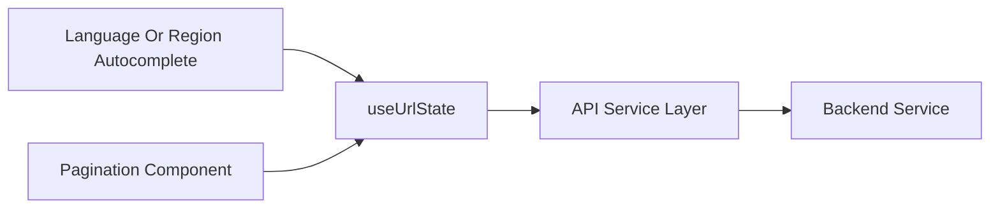

# Use Url State

The Use Url State module provides a centralized, validated, and debounced mechanism for synchronizing UI filter state with the browser URL query parameters. It enables deep linking, bookmarking, and consistent navigation behavior across the Major League GitHub frontend.

At its core, this module wraps React Router’s `useSearchParams` and adds:

- Strong typing via the `UrlState` interface
- Validation and transformation rules per parameter
- Graceful error handling
- Optional debouncing for performance
- Change detection utilities

This module is designed to be the single source of truth for URL-driven filter state in the application.

---

## 1. Purpose and Responsibilities

The Use Url State module is responsible for:

- Parsing query parameters into a strongly typed `UrlState` object
- Validating parameter values using configurable rules
- Updating URL parameters in a controlled and debounced way
- Resetting URL state to defaults
- Detecting whether URL-driven state has changed

It primarily manages filter-related parameters used by the Contributors view and related components.

### Managed URL Parameters

The module currently manages the following keys:

```text
Query Param   → UrlState Field
--------------------------------
cityId        → selectedCityId
regionId      → selectedRegionId
stateId       → stateId
languageId    → languageId
teamId        → teamId
```

Each parameter:
- Accepts only alphanumeric characters and dashes
- Defaults to `null` when missing or invalid
- Is removed from the URL when set to `null`

---

## 2. Core Types and Configuration

### 2.1 UrlState

```typescript
export interface UrlState {
    selectedCityId: string | null;
    selectedRegionId: string | null;
    stateId: string | null;
    languageId: string | null;
    teamId: string | null;
}
```

`UrlState` represents the normalized, validated state derived from the URL.

---

### 2.2 BaseParamConfig and ParamConfig

```typescript
interface BaseParamConfig<T> {
    key: string;
    validate?: (value: string) => boolean;
    transform?: (value: string) => string;
    defaultValue: T;
}

interface ParamConfig extends BaseParamConfig<string | null> {
    type: 'single';
}
```

These configuration types allow each parameter to define:

- The actual query key (e.g., `cityId`)
- Validation logic
- Optional transformation logic
- A default fallback value

---

### 2.3 URL_PARAMS Configuration

The `URL_PARAMS` constant maps each `UrlState` key to its configuration.

```typescript
const URL_PARAMS: Record<UrlStateKey, ParamConfig>
```

Each entry:

- Enforces `/^[a-zA-Z0-9-]+$/`
- Defaults to `null`
- Uses a `single` value strategy

This central configuration ensures that:

- All parsing rules are declarative
- Adding new URL-backed filters is straightforward
- Validation logic is consistent and reusable

---

## 3. Internal Architecture

The hook is built around three key responsibilities:

1. Parsing and validating URL → state
2. Updating state → URL (with debounce support)
3. Detecting changes

### 3.1 High-Level Architecture



The hook acts as a boundary layer between routing and UI components.

---

## 4. URL Parsing and Validation Flow

Parsing occurs inside a `useMemo`, ensuring recalculation only when `searchParams` change.

### 4.1 Parsing Flow



### 4.2 Error Handling

If validation fails:

- A `UrlStateError` may be thrown
- The error can be forwarded via the optional `onError` callback
- The parameter falls back to its `defaultValue`

This ensures that:

- The application never crashes due to malformed URLs
- Invalid query parameters are automatically sanitized

---

## 5. URL Update Strategy

The `updateUrlState` function supports:

- Partial updates
- Debouncing
- Immediate updates
- Intelligent no-op detection

### 5.1 Update Flow



### 5.2 Debounce Behavior

- If `debounceMs` is provided, updates are delayed.
- If `immediate` is true, update occurs instantly.
- If the change represents clearing an input, it updates immediately to avoid UI lag.

This design balances:

- Performance (avoiding excessive history mutations)
- Responsiveness (no typing delays)

---

## 6. Change Detection

The hook exposes `hasStateChanged`, computed by comparing the current `UrlState` with the previous one using a `useRef`.

### 6.1 Change Detection Logic



This is useful for:

- Triggering side effects
- Conditionally fetching data
- Optimizing re-renders

---

## 7. Public API

The hook returns:

```typescript
{
  urlState,
  updateUrlState,
  resetUrlState,
  hasStateChanged,
  isStateEmpty
}
```

### 7.1 urlState

A fully validated, normalized object derived from the URL.

### 7.2 updateUrlState

Updates one or more fields in the URL.

```typescript
updateUrlState(
  { languageId: "typescript" },
  { immediate: false }
)
```

### 7.3 resetUrlState

Clears all managed parameters:

```typescript
resetUrlState()
```

Internally calls:

```typescript
setSearchParams(new URLSearchParams(), { replace: true })
```

### 7.4 hasStateChanged

Boolean indicating whether URL state differs from the previous render.

### 7.5 isStateEmpty

Returns `true` if all fields are `null`.

---

## 8. Integration with the Frontend

The Use Url State module is typically used by filter components and contributor listing views.



Example flow:

1. User selects a language
2. `updateUrlState` updates `languageId`
3. URL changes
4. Data-fetch logic reacts to new `urlState`
5. Contributors list refreshes

---

## 9. Relationship to Other Hooks

The Use Url State module is closely related to geolocation-aware filtering via:

- [Use Nearest Region](../use_nearest_region/use_nearest_region.md)

While Use Url State manages query parameter synchronization, Use Nearest Region focuses on geographic proximity logic. Together they enable:

- Location-based filtering
- Deep linking to region-specific views
- Deterministic URL-driven UI state

---

## 10. Design Principles

### 10.1 Deterministic State

The URL is treated as a canonical representation of filter state.

### 10.2 Defensive Parsing

Invalid parameters:

- Do not break the UI
- Fall back to safe defaults
- Optionally trigger structured error handling

### 10.3 Declarative Configuration

All parameter behavior is defined in `URL_PARAMS`, enabling:

- Easy extension
- Centralized validation rules
- Reduced duplication

### 10.4 Performance Consciousness

- Debounced updates
- No-op detection
- Replace mode to avoid history pollution
- Memoized computations

---

## 11. Extending the Module

To add a new URL-backed filter:

1. Add a field to `UrlState`
2. Add a corresponding entry in `URL_PARAMS`
3. Provide validation and default behavior
4. Use `updateUrlState` from UI components

Because parsing and updates are configuration-driven, no core logic changes are typically required.

---

# Summary

The Use Url State module provides a robust, validated, and performant bridge between UI state and URL query parameters. By centralizing parsing, validation, debouncing, and change detection, it ensures:

- Clean deep-linkable URLs
- Safe and predictable state handling
- High-performance updates
- Strong typing across the application

It plays a foundational role in making Major League GitHub’s filter-driven experience shareable, reproducible, and resilient.