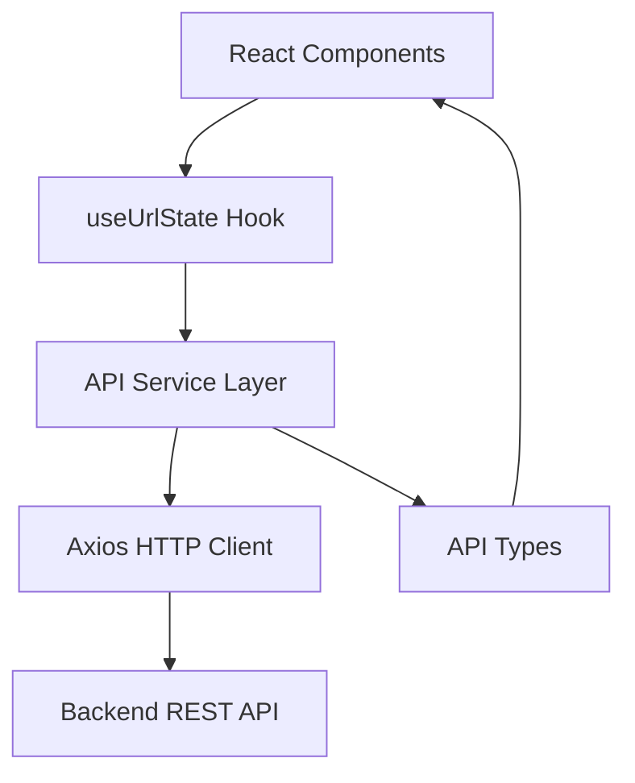
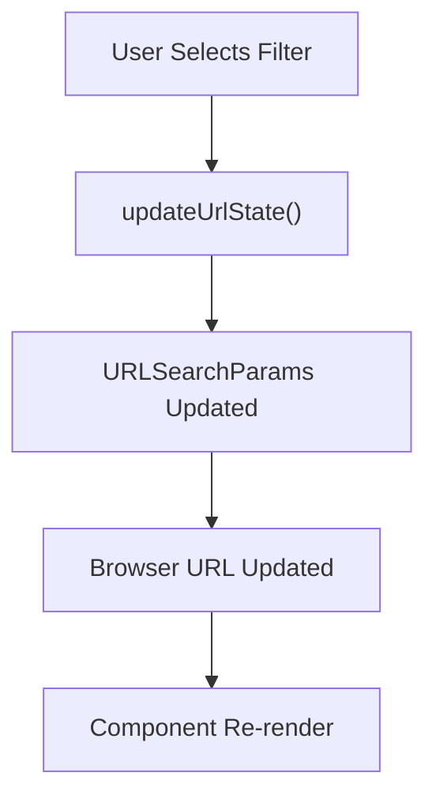
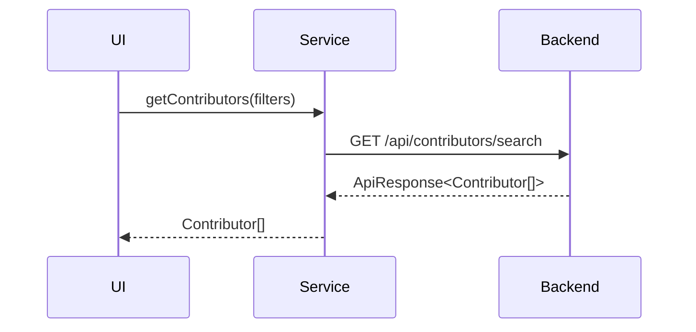
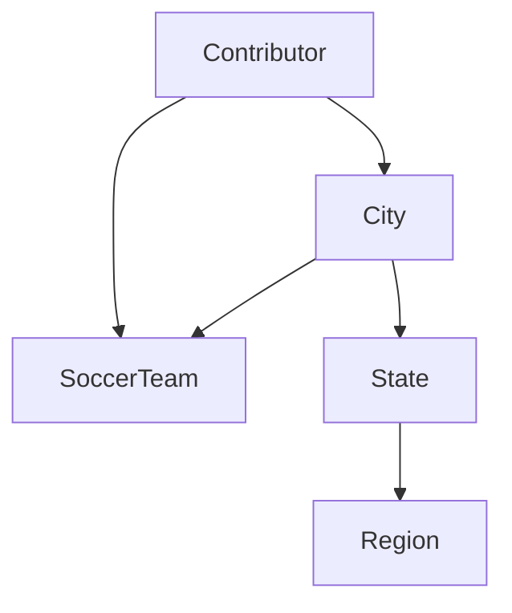
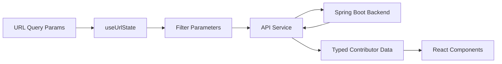

# Module 14

## Overview

Module 14 defines the **frontend API integration layer and core API data contracts** for Major League GitHub. It acts as the bridge between:

- The React UI layer (components and hooks)
- The backend REST API (Spring Boot services)
- Strongly typed frontend domain models

This module centralizes:

- URL-driven state handling
- HTTP communication via Axios
- Query parameter construction
- API response normalization
- Core API entity type definitions

It ensures that the frontend remains **type-safe, predictable, and aligned** with backend contracts.

---

## Architectural Role

Module 14 sits between the UI state layer and the backend service layer.



### Responsibilities

| Concern | Responsibility |
|----------|---------------|
| URL State | Synchronize filters with query parameters |
| API Calls | Fetch contributors, autocomplete data, entities |
| Data Export | Trigger CSV downloads |
| Typing | Define shared API response and entity contracts |
| Error Handling | Normalize API errors via `ApiResponse<T>` |

---

## Core Components

Module 14 contains three primary areas:

1. **URL State Management**
2. **API Service Layer**
3. **API Data Contracts (Types)**

---

# 1. URL State Management

**Component:**  
`major-league-github.frontend.src.hooks.useUrlState.index.UrlState`

### Purpose

The `useUrlState` hook synchronizes UI filter state with URL query parameters using `react-router-dom`.

This enables:

- Shareable filtered URLs
- Browser navigation compatibility
- Deep linking
- Stateless page reloads

### Managed Query Parameters

| Query Parameter | Description |
|-----------------|------------|
| `cityId` | Selected city filter |
| `regionId` | Selected region filter |
| `stateId` | Selected state filter |
| `teamId` | Selected MLS team filter |
| `languageId` | Selected programming language |

### Hook Structure

```typescript
export interface UrlState {
  selectedCityId: string | null;
  selectedRegionId: string | null;
  stateId: string | null;
  teamId: string | null;
  languageId: string | null;
}
```

### Update Mechanism

- Accepts `Partial<UrlState>`
- Deletes parameters when value is `null`
- Uses `URLSearchParams`
- Calls `setSearchParams()`

### Flow



### Integration

This hook complements the advanced URL management in [Module 13](../module_13/module_13.md), which provides deeper parameter configuration and parsing abstractions.

---

# 2. API Service Layer

**Component:**  
`major-league-github.frontend.src.services.api.GetContributorsParams`

This layer centralizes all HTTP communication with the backend.

## Axios Configuration

```typescript
const BACKEND_API_URL = process.env.BACKEND_API_URL || '/';
axios.defaults.baseURL = BACKEND_API_URL;
```

This allows:

- Environment-specific backend routing
- Local development overrides
- Production deployment flexibility

---

## Contributor Endpoints

### Get Contributors

```typescript
getContributors(params: GetContributorsParams): Promise<Contributor[]>
```

### Query Parameters

| Parameter | Optional | Description |
|------------|----------|------------|
| cityId | Yes | Filter by city |
| regionId | Yes | Filter by region |
| stateId | Yes | Filter by state |
| teamId | Yes | Filter by MLS team |
| languageId | Yes | Filter by language |
| maxResults | Yes | Limit result count |
| signal | Yes | Abort controller support |

### Request Flow



### CSV Export

`downloadContributors()` creates a hidden anchor element and triggers a file download:

- Builds identical query parameters
- Targets `/api/contributors/export`
- Downloads `contributors.csv`

This avoids additional libraries and leverages browser-native download behavior.

---

## Autocomplete Endpoints

Used by filter components and autocomplete UI widgets.

| Function | Endpoint |
|-----------|----------|
| autocompleteRegions | `/api/autocomplete/regions` |
| autocompleteStates | `/api/autocomplete/states` |
| autocompleteCities | `/api/autocomplete/cities` |
| autocompleteLanguages | `/api/autocomplete/languages` |
| autocompleteTeams | `/api/autocomplete/teams` |

### Special Handling

Axios `paramsSerializer` disables array index suffixes to ensure backend compatibility.

---

## Entity Lookup Endpoints

| Function | Endpoint |
|-----------|----------|
| getRegionById | `/api/entities/regions/{id}` |
| getStateById | `/api/entities/states/{id}` |
| getCityById | `/api/entities/cities/{id}` |
| getLanguageById | `/api/entities/languages/{id}` |
| getTeamById | `/api/entities/teams/{id}` |

These endpoints support:

- Lazy loading
- Detail page hydration
- URL-based reconstruction

---

## Hiring Endpoints

| Function | Endpoint |
|-----------|----------|
| getHiringManagerProfile | `/api/hiring/manager` |
| getJobOpenings | `/api/hiring/jobs` |

These support the hiring workflow and profile presentation.

---

# 3. API Data Contracts

**Components:**

- `ApiResponse<T>`
- `City`
- `Region`
- `State`
- `Language`
- `SoccerTeam`
- `Contributor`

---

## ApiResponse Wrapper

```typescript
export interface ApiResponse<T> {
    status: string;
    message: string;
    data: T;
}
```

### Contract Behavior

- `status` must equal `"success"`
- `message` contains backend error information
- `data` holds typed payload

The service layer throws errors if status is not successful.

---

## Core Entity Relationships



---

## Contributor Model

The `Contributor` type is the central domain object returned by search endpoints.

### Key Areas

- Identity: id, login, name
- Location: cityId, nearestTeamId
- Social: socialLinks
- Classification: type (CONTRIBUTOR or HIRING_MANAGER)
- GitHub Metrics:
  - score
  - commits
  - stars
  - forks
  - javaRepos
- Activity Tracking:
  - lastActive (Unix timestamp seconds)

This model directly feeds the Contributors Table and ranking components.

---

## Cross-Module Relationships

Module 14 interacts with:

- [Module 13](../module_13/module_13.md) for advanced URL parameter management
- [Module 15](../module_15/module_15.md) for additional frontend type definitions
- Backend service modules for data retrieval and caching

Module 14 focuses strictly on **transport-layer concerns and API contracts**, leaving UI rendering to component modules.

---

# Data Flow Summary



---

# Design Principles

### 1. Strong Typing
All API responses are strongly typed using TypeScript generics.

### 2. Centralized API Logic
All HTTP logic lives in one file, preventing duplication.

### 3. URL-Driven State
Filters are encoded in query parameters for reproducibility.

### 4. Abort Support
Contributor search supports `AbortSignal` to prevent race conditions.

### 5. Backend Contract Alignment
`ApiResponse<T>` ensures consistent backend integration.

---

# Conclusion

Module 14 forms the **typed integration boundary** between the frontend and backend systems. It guarantees:

- Consistent API interaction
- URL-synchronized filters
- Strict typing across the UI
- Predictable error handling

Without this module, the frontend would lack structure in how it communicates with backend services and how it maintains filter-driven state.

It is a foundational layer that supports the ranking, filtering, and hiring experiences throughout Major League GitHub.