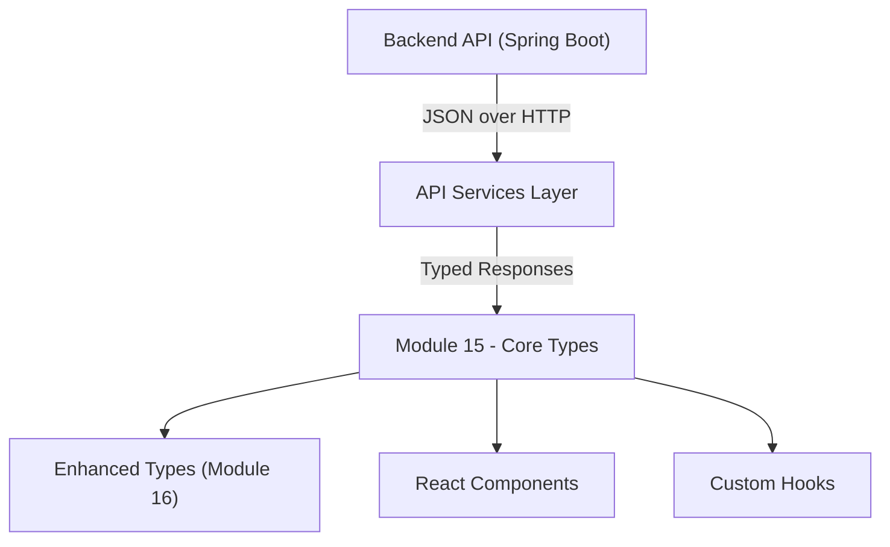
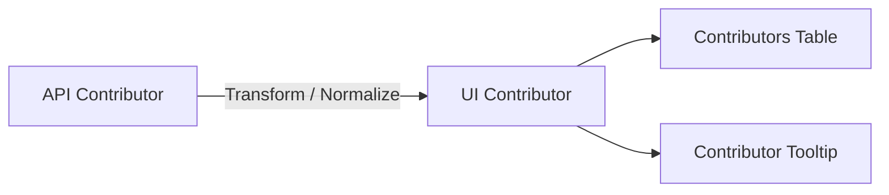
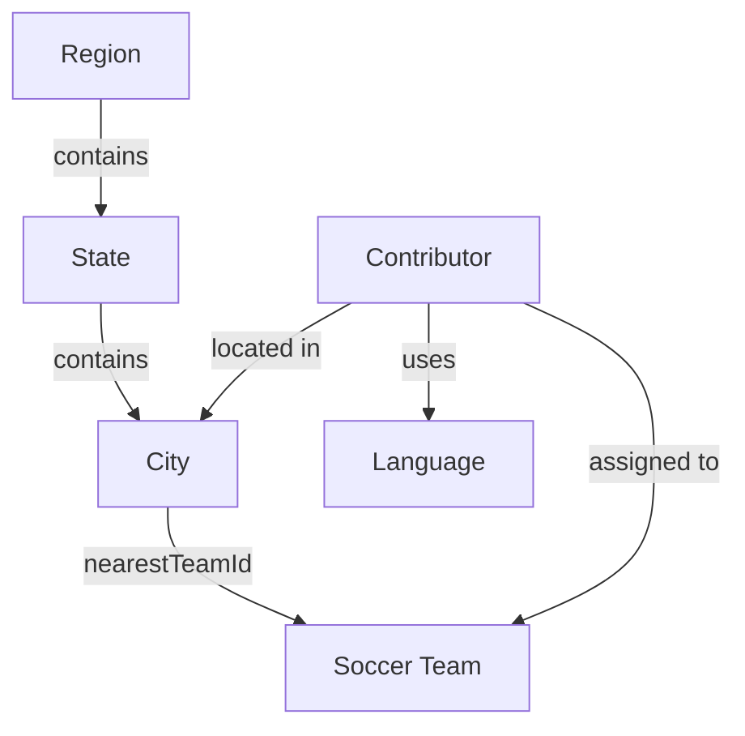
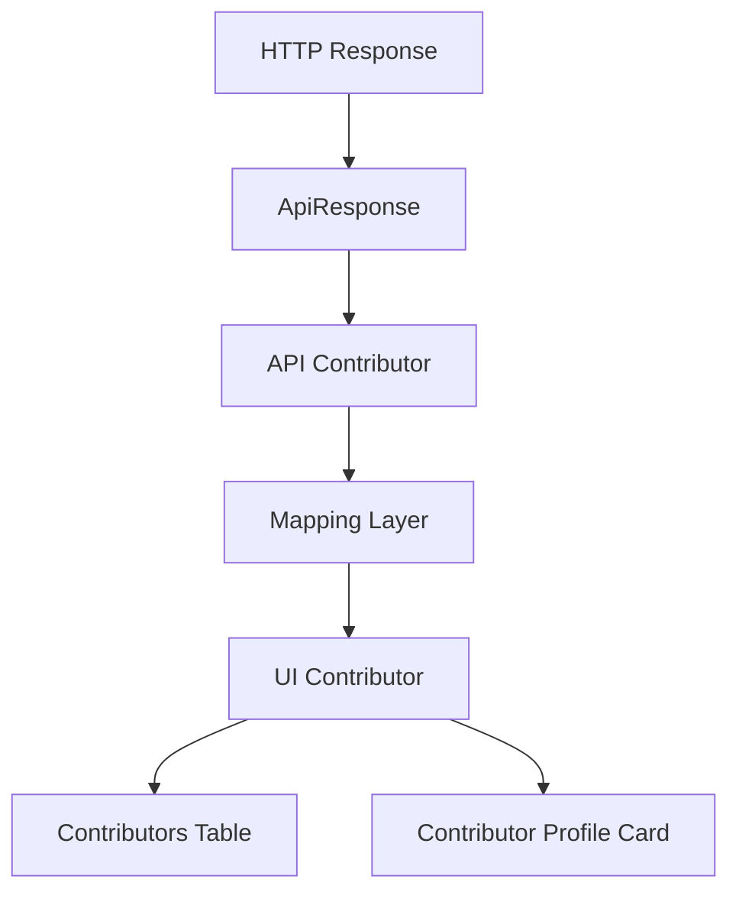

# Module 15

## Overview

Module 15 defines the **core frontend domain types** that model geographic entities, programming languages, soccer teams, and contributors within the Major League GitHub application.

This module acts as the **type contract layer** between:

- The backend API (Spring Boot services)
- The frontend data-fetching layer
- UI components and enhanced view models

It ensures strong typing and structural consistency across the React + TypeScript frontend.

The core components include:

- `Language`
- `Region`
- `State`
- `SoccerTeam`
- `Contributor` (API-level representation)
- `Contributor` (UI-optimized representation)

These interfaces provide the canonical shape of the application's primary domain objects.

---

## Architectural Role

Module 15 sits at the heart of the frontend type system.



### Responsibilities

1. Define normalized API data contracts
2. Model relationships between geographic and sports entities
3. Represent contributors and their GitHub statistics
4. Provide reusable types across UI components
5. Act as the base layer for enhanced and computed frontend models

---

## Core Type Definitions

### 1. Language

Represents a programming language used to filter and rank contributors.

```typescript
export interface Language {
    id: string;
    name: string;
    displayName: string;
    iconUrl: string;
}
```

**Key Concepts**:

- `id` – unique identifier used for filtering
- `displayName` – UI-friendly label
- `iconUrl` – branding in UI (autocomplete, filters)

Languages drive leaderboard segmentation.

---

### 2. State

Represents a U.S. state in the geographic model.

```typescript
export interface State {
    id: string;
    name: string;
    code: string;
    displayName: string;
    iconUrl: string;
    regionIds: string[];
}
```

**Design Characteristics**:

- Contains references to `regionIds`
- Used for geographic filtering
- Provides iconography for visual presentation

---

### 3. Region

Represents a higher-level geographic grouping (e.g., Pacific Northwest).

```typescript
export interface Region {
    id: string;
    name: string;
    displayName: string;
    geo: {
        latitude: number;
        longitude: number;
    };
    stateIds: string[];
    states?: State[];
}
```

**Notable Features**:

- Contains centroid coordinates (`geo`)
- Supports optional embedded `states`
- Enables distance-based filtering and nearest-region logic

This integrates directly with geolocation hooks such as those documented in Module 13.

---

### 4. SoccerTeam

Represents an MLS team used to gamify contributor rankings.

```typescript
export interface SoccerTeam {
    id: string;
    name: string;
    city: string;
    state: string;
    latitude: number;
    longitude: number;
    league: string;
    stadium: string;
    stadiumCapacity: number;
    joinedYear: number;
    headCoach: string;
    teamUrl: string;
    wikipediaUrl: string;
    logoUrl: string;
}
```

**Purpose in System**:

- Anchor contributor proximity calculations
- Provide team branding and stadium metadata
- Enable proximity-based leaderboard ranking

---

## Contributor Models

Module 15 defines **two Contributor interfaces** serving different layers.

---

### 5. Contributor (API Model)

Defined in `types/api.ts`.

This represents the **raw backend contract**.

```typescript
export interface Contributor {
    id: string;
    login: string;
    name: string | null;
    avatarUrl: string;
    url: string;
    email: string | null;
    role: string;
    bio: string;
    type: 'CONTRIBUTOR' | 'HIRING_MANAGER';
    socialLinks: SocialLink[];
    cityId: string;
    nearestTeamId: string;
    city: City;
    nearestTeam: SoccerTeam | null;
    githubStats: {
        score: number;
        totalCommits: number;
        starsGiven: number;
        starsReceived: number;
        forksReceived: number;
        forksGiven: number;
        javaRepos: number;
    };
    lastActive: number;
}
```

**Characteristics**:

- Mirrors backend DTOs
- Contains nested `githubStats`
- Includes relational objects (`city`, `nearestTeam`)
- Uses Unix timestamp (`lastActive`)

This model is tightly coupled to backend responses (see Module 14 for API service integration).

---

### 6. Contributor (UI Model)

Defined in `types/contributor.ts`.

This is a **flattened and UI-optimized version**.

```typescript
export interface Contributor {
    login: string;
    name: string | null;
    avatarUrl: string;
    url: string;
    totalCommits: number;
    starsReceived: number;
    starsGiven: number;
    forksReceived: number;
    forksGiven: number;
    javaRepos: number;
    latestCommitDate: string;
    score: number;
    city: City;
    nearestTeam: SoccerTeam | null;
    location: string | null;
    contributions: number;
}
```

### Transformation Pattern



**Why Two Models?**

| Concern | API Model | UI Model |
|----------|------------|------------|
| Backend alignment | Yes | No |
| Nested statistics | Yes | Flattened |
| Date format | Unix timestamp | ISO string |
| UI-specific fields | No | Yes (`location`, `contributions`) |

This separation prevents UI logic from depending directly on backend structure.

---

## Domain Relationship Model

The core entities in Module 15 form a relational structure.



This graph powers:

- Geographic filtering
- Proximity-based ranking
- Team-based leaderboard segmentation
- Location tooltips and badges

---

## Data Flow Through the Frontend



Module 15 ensures that every stage of this flow is strongly typed.

---

## Integration with Neighboring Modules

Module 15 works closely with:

- [Module 14](../module_14/module_14.md) – API response contracts and request parameter typing
- [Module 16](../module_16/module_16.md) – Enhanced and computed frontend models

Module 15 provides the **baseline data shape**, while Module 16 extends it with derived properties such as:

- Distance calculations
- Display formatting
- Aggregated metrics

---

## Design Principles

### 1. Strong Typing First
Every API contract is explicitly typed to eliminate runtime ambiguity.

### 2. Separation of Concerns
- API models remain backend-aligned.
- UI models remain presentation-aligned.

### 3. Relational Integrity
IDs and reference objects coexist to support both:
- Lightweight payloads
- Fully expanded relational graphs

### 4. Geographic-Centric Modeling
Latitude and longitude values are first-class citizens to support:
- Nearest-region detection
- Stadium proximity calculations
- MLS-themed ranking logic

---

## Summary

Module 15 is the **core type foundation of the frontend domain layer**.

It defines:

- Geographic entities (Region, State)
- Sports entities (SoccerTeam)
- Technology entities (Language)
- Contributor representations (API and UI)

By separating API contracts from UI-specific models and formalizing entity relationships, Module 15 enables:

- Predictable data transformation
- Type-safe UI development
- Scalable feature expansion
- Clean integration with backend services

In short, Module 15 provides the structural backbone that keeps the Major League GitHub frontend consistent, type-safe, and extensible.