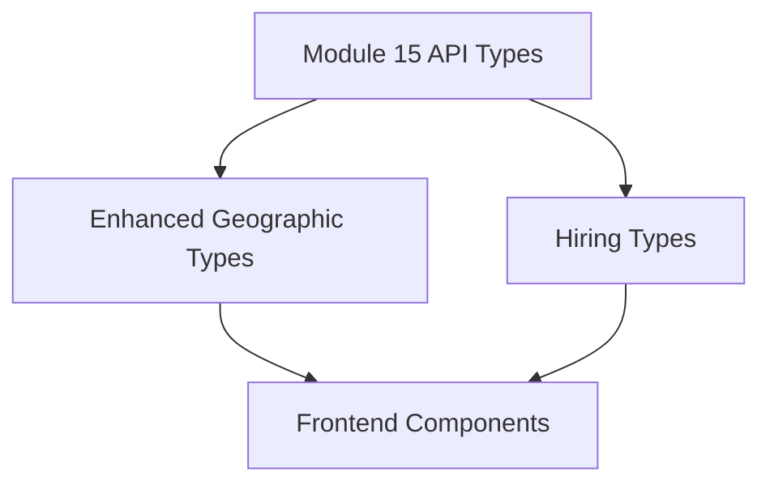
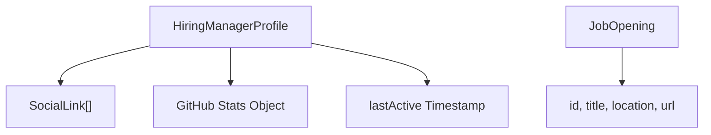
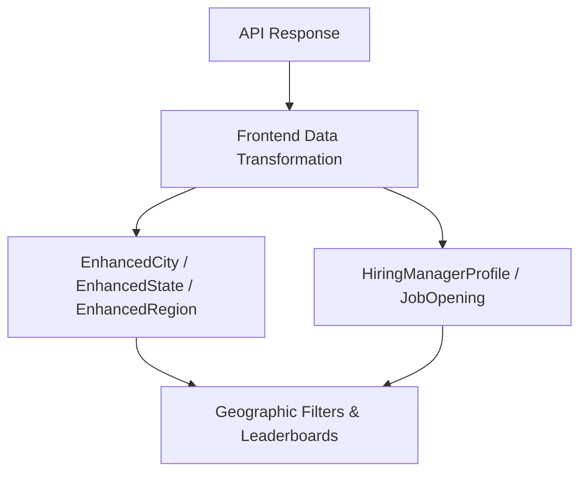

# Module 16

## Overview

**Module 16** defines enhanced and hiring-related TypeScript types for the Major League GitHub frontend. It extends the core API models with richer client-side relationships and provides structured data contracts for hiring manager profiles and job openings.

This module sits on top of the base API types defined in [Module 15](module_15.md) and complements the frontend hiring and contributor features.

At a high level, Module 16 is responsible for:

- Enriching geographic entities (City, State, Region) with resolved object references
- Modeling hiring manager profiles and job openings for UI display
- Providing strongly typed structures for advanced frontend features

---

## Architectural Context

Module 16 enhances raw API models with client-side computed relationships and UI-focused structures.



### Key Relationships

- **Module 15** provides base API contracts such as `City`, `Region`, `State`, and `SoccerTeam`.
- **Module 16** builds on these contracts with:
  - Object references instead of primitive IDs
  - Set-based collections for fast lookups
  - Rich profile models for hiring-related UI sections

---

## Enhanced Geographic Types

File: `frontend/src/types/enhanced.ts`

Core components:

- `EnhancedCity`
- `EnhancedRegion`
- `EnhancedState`

These interfaces extend or reshape API types to make them more convenient for frontend state management and rendering.

### 1. EnhancedCity

```typescript
export interface EnhancedCity extends Omit<City, 'state' | 'nearestTeam'> {
  state: State | null;
  nearestTeam: SoccerTeam | null;
}
```

#### Purpose

The API-level `City` typically references related entities (such as state or nearest team) using identifiers or simplified structures. `EnhancedCity` replaces those references with fully resolved objects.

#### Key Characteristics

- Uses `Omit` to remove `state` and `nearestTeam` from the base type
- Reintroduces them as fully typed objects
- Allows `null` to handle incomplete or partially resolved data

This structure simplifies UI rendering by avoiding repeated lookups in global maps or stores.

---

### 2. EnhancedRegion

```typescript
export interface EnhancedRegion extends Omit<Region, 'states'> {
  states: Set<State>;
  cities: Set<City>;
}
```

#### Purpose

`EnhancedRegion` transforms region-state relationships into efficient in-memory collections.

#### Key Characteristics

- Replaces `states` with a `Set<State>` for fast membership checks
- Adds a `cities` set for region-level aggregations
- Optimized for filtering, grouping, and leaderboard calculations

This design is particularly useful for:

- Regional filtering
- Computing totals across states
- Dynamic UI filters based on geography

---

### 3. EnhancedState

```typescript
export interface EnhancedState extends State {
  regionIds: string[];
  regions: Set<Region>;
  cities: Set<City>;
}
```

#### Purpose

`EnhancedState` adds bidirectional and multi-region awareness to state entities.

#### Key Characteristics

- Maintains raw `regionIds` from the API
- Adds resolved `regions` as a `Set<Region>`
- Includes `cities` for local aggregation

This allows:

- Quick traversal from state to region(s)
- Efficient UI grouping and filtering
- Geographic clustering logic in the frontend

---

## Hiring Types

File: `frontend/src/types/hiring.ts`

Core components:

- `HiringManagerProfile`
- `JobOpening`

These interfaces define the contract for the hiring section of the platform.



---

### 1. SocialLink

```typescript
export interface SocialLink {
  platform: 'linkedin' | 'twitter' | 'x' | 'github' | 'facebook' | 'instagram' | 'mastodon' | 'bluesky' | 'email' | 'website';
  url: string;
}
```

#### Purpose

Defines a strongly typed set of supported social platforms.

#### Design Considerations

- Uses a string union type to restrict valid platforms
- Ensures consistent icon mapping in UI components
- Prevents invalid or unsupported platforms at compile time

---

### 2. JobOpening

```typescript
export interface JobOpening {
  id: string;
  title: string;
  location: string;
  url: string;
}
```

#### Purpose

Represents an individual open role tied to a hiring manager or organization.

#### Responsibilities

- Provides a unique identifier (`id`)
- Stores display-ready metadata (`title`, `location`)
- Links externally via `url`

This structure is intentionally minimal to keep job cards lightweight and easy to render.

---

### 3. HiringManagerProfile

```typescript
export interface HiringManagerProfile {
  name: string;
  avatarUrl: string;
  role: string;
  bio: string;
  socialLinks: SocialLink[];
  githubStats: {
    score: number;
    totalCommits: number;
    starsGiven: number;
    starsReceived: number;
    forksReceived: number;
    forksGiven: number;
    javaRepos: number;
    totalPullRequests: number;
    totalIssues: number;
  };
  lastActive: number;
}
```

#### Purpose

Models a hiring manager’s public profile as displayed within the application.

#### Key Sections

1. **Identity**
   - `name`
   - `avatarUrl`
   - `role`
   - `bio`

2. **Social Presence**
   - `socialLinks: SocialLink[]`

3. **GitHub Performance Snapshot**
   - Aggregated metrics
   - Leaderboard-style scoring
   - Contribution signals

4. **Activity Tracking**
   - `lastActive` as a timestamp
   - Enables recency indicators in UI

---

## Data Flow and Usage Pattern

The enhanced and hiring types are typically used in this sequence:



### Step-by-Step

1. The frontend fetches raw API data (see [Module 15](module_15.md)).
2. A transformation layer resolves relationships and constructs enhanced models.
3. UI components consume enhanced and hiring types directly.
4. Rendering becomes simpler because relationships are precomputed.

---

## Design Principles

Module 16 follows several key architectural principles:

### 1. Separation of API and View Models

- API types remain close to backend contracts.
- Enhanced types represent view-ready structures.

### 2. Immutability-Friendly Structures

- Uses `Set<T>` for predictable membership logic.
- Encourages construction-time resolution of relationships.

### 3. Compile-Time Safety

- Strict unions for social platforms.
- Explicit nullable fields where relationships may not exist.

### 4. UI-Optimized Modeling

- Reduced lookup overhead in rendering.
- Aggregated GitHub metrics embedded in hiring profiles.

---

## How Module 16 Fits into the System

- **Module 15** provides foundational API type definitions.
- **Module 16** enhances and extends those definitions for advanced UI features.
- UI components and hooks consume these enriched models directly.

In short:

- Module 15 = Raw contracts
- Module 16 = Enriched, UI-ready models

Together, they form the type backbone of the frontend domain model for geography and hiring features.

---

## Summary

**Module 16** provides:

- Enhanced geographic models with resolved relationships
- Strongly typed hiring manager and job opening models
- UI-optimized data structures for leaderboard and hiring views

It plays a crucial role in bridging backend API contracts and high-performance, relationship-aware frontend rendering.