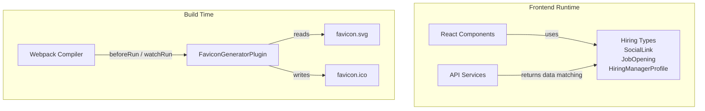
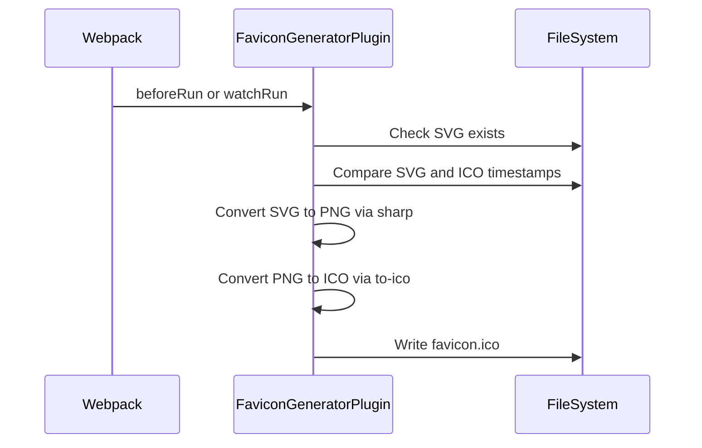

# Module 17

Module 17 defines the frontend hiring-related type contracts and a custom Webpack build plugin used to generate the application favicon. It sits at the intersection of:

- **Type modeling for hiring features** (used by React components and API services)
- **Build-time asset generation** (Webpack plugin for favicon creation)

This module ensures that hiring data structures are consistent across the frontend and that the application branding assets are automatically generated and kept up to date.

---

## 1. Responsibilities of Module 17

Module 17 has two primary responsibilities:

1. **Frontend Hiring Type Definitions**  
   - Social links for hiring managers  
   - Job opening metadata  
   - Hiring manager profile structures  

2. **Build-Time Favicon Generation**  
   - Converts an SVG favicon into a resized PNG  
   - Converts PNG into an ICO file  
   - Regenerates only when the SVG source changes  

These responsibilities serve different runtime phases:

- Type definitions → **Application runtime (browser + TypeScript compile-time)**
- Webpack plugin → **Build time (Node.js during bundling)**

---

## 2. High-Level Architecture



Module 17 contributes:

- **Strongly typed contracts** for hiring features
- **Automated branding asset generation** integrated with Webpack

---

## 3. Hiring Type Definitions

The hiring type definitions are located in:

- `frontend/src/types/hiring.ts`
- `frontend/src/types/hiring/index.ts`

These files define interfaces that shape hiring-related data used by components and API responses.

### 3.1 SocialLink

Two variations exist:

- A **full platform union** (in `hiring.ts`)
- A **restricted platform union** (in `hiring/index.ts`)

#### Extended Version

```typescript
export interface SocialLink {
  platform: 'linkedin' | 'twitter' | 'x' | 'github' | 'facebook' | 'instagram' | 'mastodon' | 'bluesky' | 'email' | 'website';
  url: string;
}
```

This version supports a broad set of platforms, allowing hiring manager profiles to display diverse contact channels.

#### Simplified Version (Index Export)

```typescript
export interface SocialLink {
  platform: 'linkedin' | 'twitter' | 'github';
  url: string;
}
```

The index version likely acts as a narrowed public contract for specific UI or API layers.

---

### 3.2 JobOpening

```typescript
export interface JobOpening {
  id: string;
  title: string;
  location: string;
  url: string;
}
```

Represents an open role posted by a hiring manager. Key properties:

- `id` → unique identifier
- `title` → role name (e.g., Senior Backend Engineer)
- `location` → geographic descriptor
- `url` → external application link

This structure integrates with hiring UI components and job listing displays.

---

### 3.3 HiringManagerProfile

#### Full Version (hiring.ts)

```typescript
export interface HiringManagerProfile {
  name: string;
  avatarUrl: string;
  role: string;
  bio: string;
  socialLinks: SocialLink[];
  githubStats: {
    score: number;
    totalCommits: number;
    starsGiven: number;
    starsReceived: number;
    forksReceived: number;
    forksGiven: number;
    javaRepos: number;
    totalPullRequests: number;
    totalIssues: number;
  };
  lastActive: number;
}
```

This enriched version combines:

- Profile metadata (name, role, bio)
- Social connectivity
- GitHub performance metrics
- Activity timestamp

It aligns closely with backend contributor and analytics models defined in earlier modules (for example, see Module 6 and Module 7 for related domain models).

#### Simplified Version (index.ts)

```typescript
export interface HiringManagerProfile {
  name: string;
  avatarUrl: string;
  role: string;
  bio: string;
  socialLinks: SocialLink[];
}
```

This version omits GitHub metrics and activity timestamps, suggesting:

- A lighter UI representation
- Or a public-facing contract abstraction

---

## 4. Relationship to Other Modules

Module 17 builds on and complements:

- [Module 16](../module_16.md) – enhanced hiring and geographic types
- [Module 15](../module_15.md) – shared API type contracts
- [Module 14](../module_14.md) – API response modeling

Data Flow Overview:


Module 17 refines or extends upstream API types for hiring-specific UI rendering.

---

## 5. FaviconGeneratorPlugin

Located at:

```
frontend/webpack-plugins/favicon-generator-plugin.js
```

### 5.1 Purpose

`FaviconGeneratorPlugin` is a custom Webpack plugin that:

1. Reads an SVG favicon source
2. Resizes it using `sharp`
3. Converts it to ICO format using `to-ico`
4. Writes the result to the configured output path

It avoids unnecessary regeneration by checking file modification times.

---

### 5.2 Plugin Lifecycle Integration



The plugin hooks into:

- `beforeRun`
- `watchRun`

This ensures favicon generation works both for:

- Standard builds
- Development watch mode

---

### 5.3 Smart Regeneration Logic

The plugin performs the following checks:

1. If SVG does not exist → logs a warning and exits
2. If ICO exists and is newer than SVG → skips regeneration
3. Otherwise → regenerates favicon

This minimizes build overhead and ensures deterministic output.

---

## 6. Design Considerations

### 6.1 Separation of Concerns

- **Type definitions** are pure TypeScript interfaces with no runtime overhead.
- **Favicon generation** is isolated to a build plugin and does not affect runtime bundles.

### 6.2 Scalability of Hiring Models

The presence of both simplified and enriched interfaces suggests:

- Multiple API response shapes
- Layered UI representations
- Potential future feature expansion (additional metrics or platforms)

### 6.3 Build Optimization

The plugin:

- Uses filesystem timestamp comparison
- Avoids unnecessary image processing
- Creates directories recursively if needed

This supports efficient CI/CD and local development workflows.

---

## 7. Summary

Module 17 serves two distinct but important roles in the Major League GitHub frontend:

1. **Defines hiring-focused TypeScript contracts** used to render hiring manager profiles and job openings.
2. **Automates favicon generation** through a custom Webpack plugin, ensuring branding assets are always synchronized with their SVG source.

By combining strong typing with build-time automation, Module 17 enhances both:

- Developer experience (type safety, maintainability)
- Build reliability (automated asset generation)

It plays a key role in delivering a polished hiring experience within the application while maintaining a clean and maintainable frontend architecture.